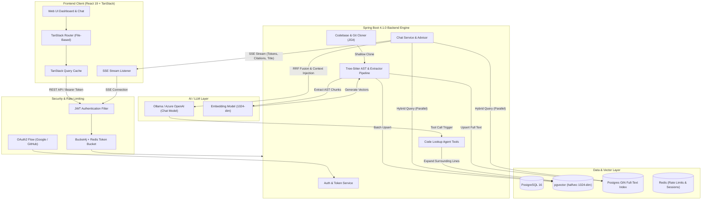
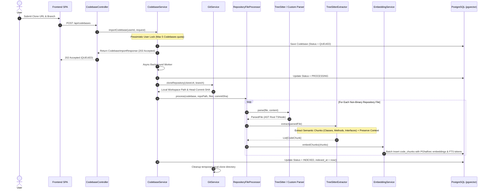
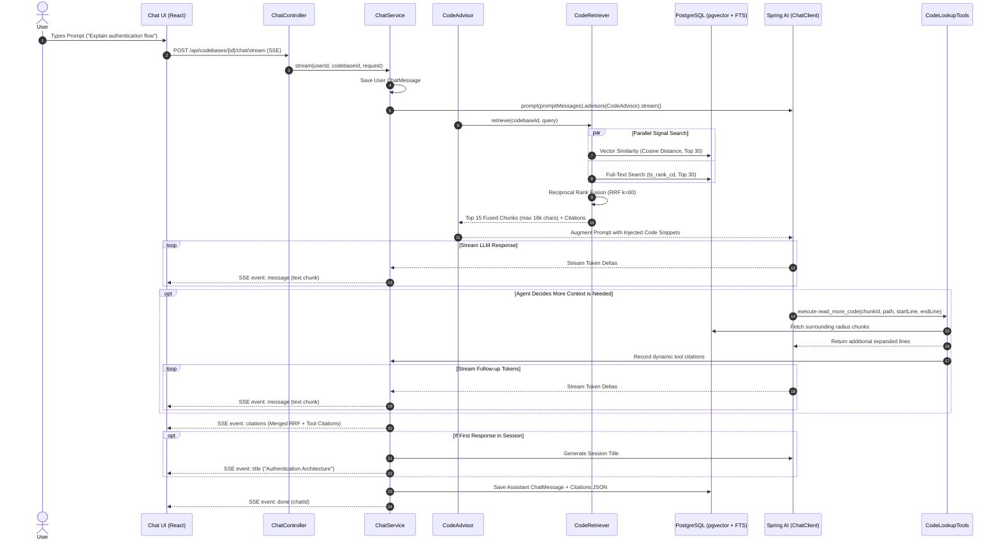
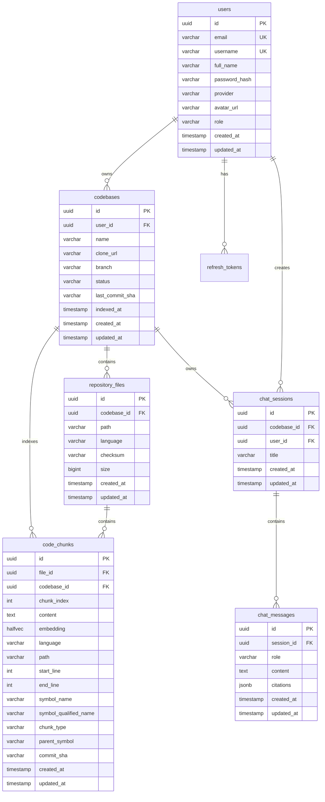

# 🧭 CodeCompass

> **AI-Native Codebase Intelligence, Semantic AST Indexing, and Agentic RAG Platform**

[](https://openjdk.org/)
[](https://spring.io/projects/spring-boot)
[](https://spring.io/projects/spring-ai)
[](https://react.dev/)
[](https://tanstack.com/)
[](https://github.com/pgvector/pgvector)
[](https://redis.io/)
[](https://tailwindcss.com/)

---

## 📖 Table of Contents

- [Overview](#-overview)
- [System Architecture](#-system-architecture)
  - [High-Level Architecture](#high-level-architecture)
  - [Codebase Ingestion & AST Indexing Pipeline](#codebase-ingestion--ast-indexing-pipeline)
  - [Hybrid Retrieval & Streaming Agentic Chat Flow](#hybrid-retrieval--streaming-agentic-chat-flow)
- [Key Features](#-key-features)
- [Repository Structure](#-repository-structure)
- [Technology Stack Matrix](#-technology-stack-matrix)
- [Prerequisites & Quickstart](#-prerequisites--quickstart)
  - [Prerequisites](#prerequisites)
  - [1. Clone Repository & Start Infrastructure](#1-clone-repository--start-infrastructure)
  - [2. Configure Server & Run](#2-configure-server--run)
  - [3. Configure Frontend & Run](#3-configure-frontend--run)
- [Environment Configuration](#-environment-configuration)
- [Database Schema & Migrations](#-database-schema--migrations)
- [Submodule Documentation](#-submodule-documentation)

---

## 🌟 Overview

**CodeCompass** is a high-performance, full-stack platform designed to transform complex source repositories into interactive, queryable AI workspaces. By combining **Tree-sitter Abstract Syntax Tree (AST)** semantic parsing across 16+ programming languages, **pgvector** high-dimensional vector embeddings, **PostgreSQL Full-Text Search (FTS)**, and **Reciprocal Rank Fusion (RRF)** reranking, CodeCompass delivers accurate, hallucination-resistant codebase understanding.

Developers can converse with their codebases via real-time **Server-Sent Events (SSE)**, inspect exact source citations, and allow the AI model to execute tool calls (`read_more_code` and `search_code`) to dynamically expand context windows during multi-turn investigations.

---

## 🏛 System Architecture

### High-Level Architecture



---

### Codebase Ingestion & AST Indexing Pipeline

When a user imports a public HTTPS Git repository:



---

### Hybrid Retrieval & Streaming Agentic Chat Flow



---

## ⚡ Key Features

| Feature | Description |
|---|---|
| **Tree-sitter AST Chunking** | Native AST chunking across 16+ languages (Java, Kotlin, Python, JS, TS, TSX, Go, Rust, C, C++, C#, PHP, Ruby, Swift, HTML, CSS) with fallback parsers for Markdown, JSON, and Text. Preserves parent class declarations and member signatures. |
| **Hybrid Search (Vector + FTS)** | Combines cosine vector similarity on 1024-dimensional half-precision embeddings (`halfvec`) with PostgreSQL GIN full-text index ranking (`ts_rank_cd`). |
| **Reciprocal Rank Fusion (RRF)** | Ranks and fuses multiple distinct scoring spaces using the standard RRF algorithm with smoothing parameter $k=60$. |
| **Agentic Tool Calling** | Equips the LLM with `@Tool` functions (`read_more_code` and `search_code`) to dynamically expand line ranges and search for missing references during generation. |
| **Real-Time Reactive Streaming** | Server-Sent Events (SSE) streaming pipeline powered by Spring WebFlux and Project Reactor, emitting typed events (`message`, `citations`, `title`, `done`, `error`). |
| **Enterprise Security & Rate Limiting** | Dual-layer authentication with JJWT access tokens and HTTP-only rotated refresh tokens, OAuth2 (Google & GitHub), plus distributed Redis-backed Bucket4j token bucket rate limiting. |
| **Interactive Citations Drawer** | Clickable, collapsible citation badges in the chat interface showing file paths, line ranges, language badges, relevance scores, and direct code snippet inspection. |
| **TanStack State & Router Architecture** | Fully type-safe file-based routing with TanStack Router, cursor-based message pagination with TanStack Query, and optimistic UI updates. |

---

## 📂 Repository Structure

```text
CodeCompass/
├── README.md                           # Platform-level master documentation (this file)
├── ER_Diagram.md                       # Comprehensive Entity-Relationship specification
├── CodeCompass_SRS_IEEE830_Draft.pdf   # Software Requirements Specification (SRS) document
│
├── server/                             # Spring Boot 4.1.0 (Java 25) Backend Engine
│   ├── README.md                       # Deep-dive server architecture & API documentation
│   ├── build.gradle                    # Gradle dependencies, Spring AI BOM & plugins
│   ├── Dockerfile                      # Multi-stage production container build (Eclipse Temurin 25)
│   ├── compose.yaml                    # Local container orchestration (PostgreSQL pgvector + Redis)
│   ├── specs/                          # Specification documents (auth.md, codebase.md, chat.md)
│   └── src/
│       ├── main/
│       │   ├── java/com/meet/server/
│       │   │   ├── ServerApplication.java
│       │   │   ├── common/             # Global filters, security, ratelimiting, exceptions, API envelopes
│       │   │   └── feature/
│       │   │       ├── advisor/        # Spring AI CodeAdvisor (Call & Stream interception)
│       │   │       ├── auth/           # Local Auth, OAuth2, Refresh Token Rotation, JWT
│       │   │       ├── chat/           # Chat controller, reactive SSE, sessions, history, tools
│       │   │       ├── codebase/       # Codebase CRUD, JGit clone service, status manager
│       │   │       ├── codechunk/      # CodeChunk entity, JDBC pgvector & FTS repository
│       │   │       ├── embedding/      # Spring AI EmbeddingService & vector batching
│       │   │       ├── indexing/       # Tree-sitter AST parsers & chunk extractors
│       │   │       ├── repositoryfile/ # Repository file scanner & processor
│       │   │       ├── retriver/       # Hybrid CodeRetriever & RRF reranker
│       │   │       └── user/           # User entities and repository
│       │   └── resources/
│       │       ├── application.yaml    # Application profiles and configuration properties
│       │       ├── prompt.md           # System prompt instructions for AI assistant
│       │       └── db/migration/       # Flyway database migrations (V1 to V9)
│       └── test/                       # Unit & integration tests with Testcontainers
│
└── frontend/                           # React 19 / TanStack Start / Vite Frontend SPA
    ├── README.md                       # Deep-dive frontend architecture & UI documentation
    ├── package.json                    # Dependencies, scripts, and package metadata
    ├── vite.config.ts                  # Vite 8 config with TanStack Start & Tailwind CSS v4
    ├── specs/                          # Frontend functional specifications (auth.md, codebase.md, chat.md)
    └── src/
        ├── env.ts                      # T3-Env type-safe client environment configuration
        ├── router.tsx                  # TanStack Router configuration & root provider
        ├── routeTree.gen.ts            # Auto-generated file-based route definitions
        ├── styles.css                  # Global Tailwind CSS v4 theme variables and base rules
        ├── components/ui/              # Reusable UI primitives (Button, Input, Select, Switch, Slider)
        ├── features/
        │   ├── auth/                   # Auth hooks (useAuth), API client, Zod schemas, types
        │   ├── codebase/               # Codebase cards, import/edit/delete modals, hooks
        │   └── chat/                   # useChatStream, useChatHistory, session sidebar, citations
        ├── integrations/               # TanStack Query devtools and root provider
        ├── lib/                        # Axios instance with 401 refresh interceptor, token manager
        ├── routes/                     # File-based routes (_app, _auth, oauth2, index)
        └── types/                      # Shared API envelopes and global TypeScript types
```

---

## 💻 Technology Stack Matrix

| Component | Technology | Version | Purpose |
|---|---|---|---|
| **Backend Runtime** | OpenJDK (Java) | `25` | High-performance modern Java runtime |
| **Backend Framework** | Spring Boot | `4.1.0` | Core inversion of control, MVC, and data framework |
| **AI Integration** | Spring AI | `2.0.0` | ChatClient, Advisors, Tool Calling, Embeddings |
| **AST Parser** | Tree-sitter (Java Bindings) | `0.26.3` | Native cross-language AST generation |
| **Git Operations** | Eclipse JGit | `7.6.0` | Git repository cloning and commit inspection |
| **Database** | PostgreSQL + pgvector | `16` | Relational storage + `halfvec` vector cosine search |
| **Database Migrations**| Flyway | `10.x` | Versioned database schema evolution |
| **Cache & Rate Limiting**| Redis + Bucket4j | `8.14.0` | Distributed token-bucket rate limiting |
| **Security & JWT** | Spring Security + JJWT | `0.13.0` | Stateless JWT auth, OAuth2 client, cookie rotation |
| **Frontend Framework** | React | `19.2.0` | Declarative component UI library |
| **Routing & Server** | TanStack Router / Start | Latest | Type-safe file-based routing and SSR/SPA |
| **Data Fetching** | TanStack Query (v5) | Latest | Server-state caching, cursor pagination, invalidation |
| **Styling** | Tailwind CSS | `v4.1.18` | Next-gen CSS-first utility styling |
| **Build Tooling** | Vite | `8.0.0` | Fast lightning-speed frontend bundler |
| **Package Manager** | Bun / pnpm | Latest | Fast dependency installation and runtime scripts |

---

## 🚀 Prerequisites & Quickstart

### Prerequisites

Ensure you have the following installed on your machine:
- [Docker Desktop](https://www.docker.com/) (or Docker Engine + Compose)
- [Java Development Kit (JDK) 25](https://adoptium.net/)
- [Bun](https://bun.sh/) (or Node.js v20+)
- [Ollama](https://ollama.ai/) (Optional if using Azure/OpenAI directly)

---

### 1. Clone Repository & Start Infrastructure

```bash
# Clone the repository
git clone https://github.com/Meet-08/CodeCompass.git
cd CodeCompass

# Start PostgreSQL (pgvector) and Redis using Docker Compose
cd server
docker compose up -d
```

Verify that the containers are healthy:
- **PostgreSQL**: `localhost:5432` (Database: `code_compass`, User: `meet`, Password: `1234`)
- **Redis**: `localhost:6379`

If using local **Ollama**, pull the required models:
```bash
ollama pull qwen2.5:3b
ollama pull qwen3-embedding:0.6b
```

---

### 2. Configure Server & Run

Create/verify `server/.env`:
```env
JWT_SECRET=your_super_secret_base64_or_long_random_string_here_32_bytes
POSTGRES_URL=jdbc:postgresql://localhost:5432/code_compass
POSTGRES_USER=meet
POSTGRES_PASSWORD=1234
REDIS_HOST=localhost
REDIS_PORT=6379
REDIS_PASSWORD=
ALLOWED_ORIGIN=http://localhost:3000

# Model Configurations
CHAT_MODEL=qwen2.5:3b
EMBEDDING_MODEL=qwen3-embedding:0.6b

# Optional OAuth2 (Google & GitHub)
GOOGLE_CLIENT_ID=
GOOGLE_CLIENT_SECRET=
GITHUB_CLIENT_ID=
GITHUB_CLIENT_SECRET=
OAUTH2_SUCCESS_REDIRECT_URI=http://localhost:3000/oauth2/callback
```

Run the Spring Boot application using Gradle:
```bash
# Windows
.\gradlew.bat bootRun

# Linux / macOS
./gradlew bootRun
```
The server will start on `http://localhost:8080` and automatically apply all Flyway migrations (V1 through V9).

---

### 3. Configure Frontend & Run

Navigate to the `frontend` directory:
```bash
cd ../frontend

# Install dependencies
bun install

# Verify/create .env
echo "VITE_API_BASE_URL=http://localhost:8080" > .env

# Start the Vite development server
bun --bun run dev
```

Open your browser and navigate to:
```text
http://localhost:3000
```

---

## ⚙️ Environment Configuration

### Server Environment Variables (`server/.env`)

| Variable | Required | Default | Description |
|---|---|---|---|
| `JWT_SECRET` | **Yes** | — | Cryptographic secret for signing JJWT access tokens |
| `POSTGRES_URL` | **Yes** | — | JDBC connection URL for PostgreSQL (with pgvector) |
| `POSTGRES_USER` | **Yes** | `meet` | Database username |
| `POSTGRES_PASSWORD` | **Yes** | `1234` | Database password |
| `REDIS_HOST` | **Yes** | `localhost` | Redis host for rate limiting |
| `REDIS_PORT` | **Yes** | `6379` | Redis port |
| `REDIS_PASSWORD` | No | — | Redis authentication password |
| `ALLOWED_ORIGIN` | **Yes** | `http://localhost:3000` | Allowed CORS origin for frontend requests |
| `CHAT_MODEL` | **Yes** | `qwen2.5:3b` | LLM model identifier for Spring AI |
| `EMBEDDING_MODEL` | **Yes** | `qwen3-embedding:0.6b` | 1024-dim embedding model name |
| `GOOGLE_CLIENT_ID` | No | — | Google OAuth2 client ID |
| `GOOGLE_CLIENT_SECRET` | No | — | Google OAuth2 client secret |
| `GITHUB_CLIENT_ID` | No | — | GitHub OAuth2 client ID |
| `GITHUB_CLIENT_SECRET` | No | — | GitHub OAuth2 client secret |
| `OAUTH2_SUCCESS_REDIRECT_URI` | No | `http://localhost:3000/oauth2/callback` | Redirect destination on OAuth2 login |
| `REFRESH_TOKEN_CLEANUP_CRON` | No | `0 0 * * * *` | Cron expression for expired token purge |

### Frontend Environment Variables (`frontend/.env`)

| Variable | Required | Default | Description |
|---|---|---|---|
| `VITE_API_BASE_URL` | **Yes** | `http://localhost:8080` | Backend API root URL |
| `VITE_APP_TITLE` | No | `CodeCompass` | Application display title |

---

## 🗄 Database Schema & Migrations

CodeCompass uses **Flyway** for immutable, deterministic database versioning:



### Migration History

| Version | Migration Script | Description |
|---|---|---|
| **V1** | `V1__initial_schema.sql` | Base `users` and `refresh_tokens` tables |
| **V2** | `V2__add_schema_for_codebase_and_user_schema_fix.sql` | `codebases` table and foreign key constraints |
| **V3** | `V3__create_repository_files_and_code_chunks.sql` | `repository_files` and `code_chunks` tables |
| **V4** | `V4__add_code_chunk_vector_index.sql` | Enables `vector` extension and creates `halfvec(1024)` HNSW index |
| **V5** | `V5__add_schema_for_chat_support.sql` | `chat_sessions` and `chat_messages` tables |
| **V6** | `V6__cascade_chat_messages_on_session_delete.sql` | Cascade delete foreign keys on chat sessions |
| **V7** | `V7__add_symbol_fields_to_code_chunks.sql` | Adds AST symbol metadata (`symbol_name`, `chunk_type`, etc.) |
| **V8** | `V8__add_full_text_search_index.sql` | Creates PostgreSQL GIN index on `to_tsvector('simple', content)` |
| **V9** | `V9__add_citations_to_chat_messages.sql` | Adds JSONB `citations` column to `chat_messages` |

---

## 📚 Submodule Documentation

For in-depth, code-level documentation on specific tiers, refer to:

- 🐘 **[Server Architecture & API Reference](server/README.md)**: Deep dive into Tree-sitter parsers, Spring AI Advisor chains, custom JDBC pgvector queries, and Bucket4j rate limiters.
- ⚛️ **[Frontend Architecture & Component Guide](frontend/README.md)**: Deep dive into SSE streaming hooks, TanStack Query caching, token rotation lifecycle, and citation UI components.

---

## 📄 License

This project is licensed under the MIT License. See the `LICENSE` file for details.
