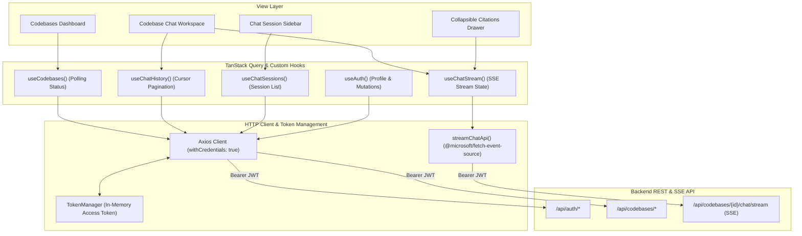
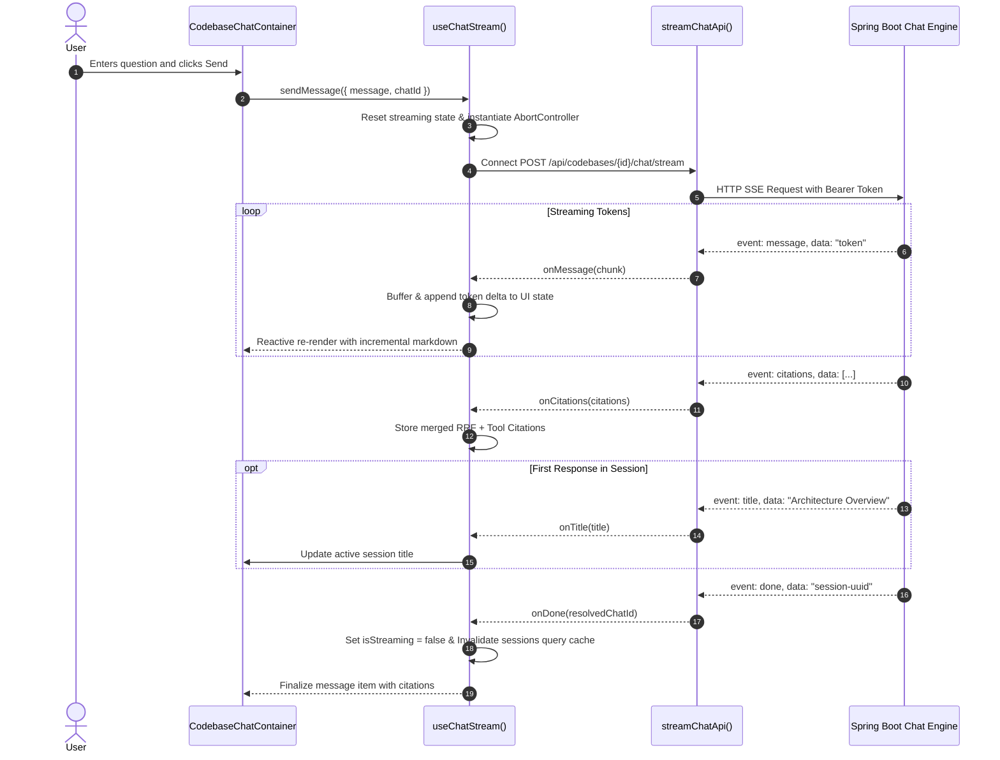

# ⚛️ CodeCompass Frontend Client

> **High-Performance React 19 Web Application powered by TanStack Start, TanStack Router (File-Based), TanStack Query v5, Tailwind CSS v4, Reactive SSE Streaming, and Interactive Citation Drawers.**

[](https://react.dev/)
[](https://www.typescriptlang.org/)
[](https://vitejs.dev/)
[](https://tanstack.com/)
[](https://tailwindcss.com/)
[](https://www.radix-ui.com/)

---

## 📖 Table of Contents

- [Overview](#-overview)
- [Architecture & Design System](#-architecture--design-system)
  - [Feature-Driven Folder Structure](#feature-driven-folder-structure)
  - [State Management & Data Flow Architecture](#state-management--data-flow-architecture)
  - [Reactive SSE Stream Consumption](#reactive-sse-stream-consumption)
- [Detailed Feature & Component Reference](#-detailed-feature--component-reference)
  - [1. Authentication Module (`features/auth`)](#1-authentication-module-featuresauth)
  - [2. Codebase Management Module (`features/codebase`)](#2-codebase-management-module-featurescodebase)
  - [3. Code Chat & Citations Engine (`features/chat`)](#3-code-chat--citations-engine-featureschat)
  - [4. Core Infrastructure & API Client (`lib`)](#4-core-infrastructure--api-client-lib)
  - [5. Application Routing & Layouts (`routes`)](#5-application-routing--layouts-routes)
- [TanStack Query Invalidation & Cache Strategy](#-tanstack-query-invalidation--cache-strategy)
- [Environment Configuration](#-environment-configuration)
- [Scripts, Build & Deployment](#-scripts-build--deployment)

---

## 🌟 Overview

The **CodeCompass Frontend** is an ultra-fast, responsive single-page web application engineered to give developers an intuitive interface for managing repositories, tracking indexing pipelines in real time, and engaging in multi-turn conversations with codebases.

Key capabilities include:
- **Type-Safe File-Based Routing**: Zero boilerplate routing with **TanStack Router** and automatic code-splitting.
- **Server State & Invalidation**: Instant UI updates and cursor-based infinite history pagination with **TanStack Query v5**.
- **Real-Time Token Streaming**: Resilient Server-Sent Events (SSE) processing with token delta parsing, dynamic title capture, and in-flight request cancellation.
- **Interactive Citation Inspection**: Visual citation badges linked directly to indexed source files with line-range highlighting and RRF relevance metrics.
- **Modern Glassmorphic Dark UI**: Built with **Tailwind CSS v4** and accessible **Radix UI** primitives.

---

## 🏛 Architecture & Design System

### Feature-Driven Folder Structure

The application is structured into domain-specific feature modules:

```text
src/
├── env.ts                          # Type-safe client environment configuration (T3-Env)
├── router.tsx                      # TanStack Router configuration & QueryClientProvider
├── routeTree.gen.ts                # Auto-generated route tree
├── styles.css                      # Global Tailwind CSS v4 theme and utility rules
│
├── components/                     # Shared Atomic UI Components
│   └── ui/                         # Radix UI primitives (Button, Input, Select, Switch, Slider)
│
├── features/                       # Domain-Driven Feature Modules
│   ├── auth/                       # Authentication (Login, Register, Session)
│   │   ├── api/auth.api.ts         # Axios auth API endpoints
│   │   ├── hooks/use-auth.ts       # TanStack Query auth hooks
│   │   ├── schemas/auth.schema.ts  # Zod validation schemas
│   │   └── types/auth.types.ts     # TypeScript models
│   │
│   ├── codebase/                   # Codebase Management & Workspace
│   │   ├── api/codebase.api.ts     # Codebase CRUD endpoints
│   │   ├── components/             # CodebaseCard, Modals, ChatContainer
│   │   ├── hooks/use-codebase.ts   # Codebase listing & mutation hooks
│   │   ├── schemas/codebase.schema.ts
│   │   └── types/codebase.types.ts
│   │
│   └── chat/                       # Conversational AI & SSE Streaming
│       ├── api/chat.api.ts         # SSE streaming client & Session APIs
│       ├── hooks/use-chat.ts       # useChatStream, useChatHistory, useChatSessions
│       ├── schemas/chat.schema.ts  # Zod chat schemas
│       └── types/chat.types.ts     # ChatMessage, CodeCitation, Stream callbacks
│
├── integrations/                   # Provider wrappers & React Query Devtools
├── lib/                            # Infrastructure (Axios client, TokenManager, cn helper)
└── routes/                         # TanStack Router File-Based Pages
    ├── __root.tsx                  # Root shell & HTML meta
    ├── index.tsx                   # Landing page redirect
    ├── _app/                       # Authenticated layout wrapper
    │   ├── route.tsx               # App navigation header & auth guard
    │   ├── codebases/index.tsx     # Codebase dashboard
    │   └── codebases/$codebaseId.chat.tsx # Dedicated repo chat workspace
    ├── _auth/                      # Public authentication routes (login, register)
    └── oauth2/callback.tsx         # OAuth2 redirect token handler
```

---

### State Management & Data Flow Architecture



---

### Reactive SSE Stream Consumption

The `useChatStream` hook manages the complete lifecycle of a code-aware AI chat response:



---

## 🔍 Detailed Feature & Component Reference

### 1. Authentication Module (`features/auth`)

| File / Function | Responsibility & Implementation Details |
|---|---|
| [`useAuth`](file:///e:/Works/temp/CodeCompass/frontend/src/features/auth/hooks/use-auth.ts) | React hook providing authentication state and mutations: <br>• `loginMutation`: Submits `LoginRequest`, updates `TokenManager`, and invalidates user query. <br>• `registerMutation`: Submits `RegisterRequest`, stores access token, and invalidates user query. <br>• `logoutMutation`: Calls `/api/auth/logout`, clears `TokenManager`, and resets query cache. <br>• `useCurrentUser`: Fetches profile via `/api/auth/me` with automatic retry on token refresh. |
| [`auth.api.ts`](file:///e:/Works/temp/CodeCompass/frontend/src/features/auth/api/auth.api.ts) | Axios methods for `loginApi`, `registerApi`, `refreshApi`, `logoutApi`, and `getMeApi`. |
| [`auth.schema.ts`](file:///e:/Works/temp/CodeCompass/frontend/src/features/auth/schemas/auth.schema.ts) | Zod validation schemas for login and registration forms. |
| [`oauth2/callback.tsx`](file:///e:/Works/temp/CodeCompass/frontend/src/routes/oauth2/callback.tsx) | Route component capturing `access_token` query parameter following successful Google/GitHub OAuth2 login, saving to `TokenManager`, and redirecting to dashboard. |

---

### 2. Codebase Management Module (`features/codebase`)

| Component / Hook | Responsibility & Implementation Details |
|---|---|
| [`useCodebases`](file:///e:/Works/temp/CodeCompass/frontend/src/features/codebase/hooks/use-codebase.ts) | Queries `/api/codebases` with dynamic polling (`refetchInterval: 3000ms`) whenever any codebase is in `QUEUED` or `PROCESSING` state. |
| [`useImportCodebase`](file:///e:/Works/temp/CodeCompass/frontend/src/features/codebase/hooks/use-codebase.ts) | Mutation hook for importing repositories (`POST /api/codebases`) with automatic invalidation of the codebases query list. |
| [`useUpdateCodebase` / `useDeleteCodebase` / `useReindexCodebase`](file:///e:/Works/temp/CodeCompass/frontend/src/features/codebase/hooks/use-codebase.ts) | Mutation hooks for editing repository display names/branches, deleting codebases, or triggering complete reindexing. |
| [`CodebaseCard`](file:///e:/Works/temp/CodeCompass/frontend/src/features/codebase/components/codebase-card.tsx) | Visual card component rendering: <br>• Real-time status badges (`INDEXED`, `QUEUED`, `PROCESSING`, `FAILED`). <br>• Repository metadata pills (branch name, file count, short commit SHA). <br>• Direct links to repository and action buttons (Edit, Reindex, Delete, Open Chat). |
| [`CodebaseImportDialog`](file:///e:/Works/temp/CodeCompass/frontend/src/features/codebase/components/codebase-import-dialog.tsx) | Modal dialog with form validation for importing HTTPS Git repositories and selecting branch. |

---

### 3. Code Chat & Citations Engine (`features/chat`)

| Component / Hook | Responsibility & Implementation Details |
|---|---|
| [`useChatStream`](file:///e:/Works/temp/CodeCompass/frontend/src/features/chat/hooks/use-chat.ts) | Core streaming hook managing SSE event emission. Supports cumulative vs delta token parsing, merges advisor and tool citations, tracks `isStreaming`, exposes `abort()` for user cancellation, and invalidates session lists upon completion. |
| [`useChatHistory` / `useInfiniteChatHistory`](file:///e:/Works/temp/CodeCompass/frontend/src/features/chat/hooks/use-chat.ts) | Fetches paginated chat history for an owned session using cursor-based pagination (`before` cursor). |
| [`useChatSessions`](file:///e:/Works/temp/CodeCompass/frontend/src/features/chat/hooks/use-chat.ts) | Manages codebase chat sessions, including listing, title updates, and deletion. |
| [`CodebaseChatContainer`](file:///e:/Works/temp/CodeCompass/frontend/src/features/codebase/components/codebase-chat-container.tsx) | Full-screen interactive chat interface. Coordinates message hydration from server history, real-time message bubbling during stream, keyboard shortcut handlers (Enter to send, Shift+Enter for newline), and session clearing. |
| [`ChatMessageItem`](file:///e:/Works/temp/CodeCompass/frontend/src/features/codebase/components/chat-message-item.tsx) | Renders user/assistant messages with markdown support, code syntax blocks, and collapsible citation badges. |
| [`CitationBadge`](file:///e:/Works/temp/CodeCompass/frontend/src/features/codebase/components/citation-badge.tsx) | Displays retrieved code citations with file path, line numbers, language tag, and RRF relevance score. Clicking opens an expandable source snippet view. |
| [`ChatSessionSidebar`](file:///e:/Works/temp/CodeCompass/frontend/src/features/codebase/components/chat-session-sidebar.tsx) | Sidebar listing all chat sessions for the current codebase, allowing creation of new sessions, inline session renaming, and session deletion. |

---

### 4. Core Infrastructure & API Client (`lib`)

| File | Responsibility & Implementation Details |
|---|---|
| [`api-client.ts`](file:///e:/Works/temp/CodeCompass/frontend/src/lib/api-client.ts) | Axios instance configured with `withCredentials: true` and interceptors: <br>• **Request Interceptor**: Injects `Authorization: Bearer <token>` from `TokenManager`. <br>• **Response Interceptor**: Intercepts `401 Unauthorized` responses, calls `/api/auth/refresh`, updates `TokenManager`, and transparently replays the original request. Prevents infinite refresh loops. |
| [`token-manager.ts`](file:///e:/Works/temp/CodeCompass/frontend/src/lib/token-manager.ts) | In-memory token store ensuring JWT access tokens are never persisted in insecure `localStorage` or `sessionStorage`. |
| [`utils.ts`](file:///e:/Works/temp/CodeCompass/frontend/src/lib/utils.ts) | `cn()` helper combining `clsx` and `tailwind-merge` for conflict-free dynamic class merging. |

---

### 5. Application Routing & Layouts (`routes`)

| Route File | Path | Protected | Description |
|---|---|---|---|
| `routes/__root.tsx` | `/` | No | Root layout with HTML headers, fonts, and Toast notifications (`Sonner`). |
| `routes/index.tsx` | `/` | No | Landing redirect: forwards authenticated users to `/codebases` or unauthenticated to `/login`. |
| `routes/_app/route.tsx` | `/_app` | **Yes** | Authenticated application shell with top navigation bar and user profile dropdown. |
| `routes/_app/codebases/index.tsx` | `/codebases` | **Yes** | Main dashboard displaying all indexed codebases, import dialog, and system metrics. |
| `routes/_app/codebases/$codebaseId.chat.tsx` | `/codebases/:codebaseId/chat` | **Yes** | Dedicated repository intelligence workspace with chat container and collapsible session sidebar. |
| `routes/_auth/login.tsx` | `/login` | Public | Local email/password login and Google/GitHub OAuth2 buttons. |
| `routes/_auth/register.tsx` | `/register` | Public | New user registration form. |
| `routes/oauth2/callback.tsx` | `/oauth2/callback` | Public | OAuth2 token exchange and redirect handler. |

---

## 🔄 TanStack Query Invalidation & Cache Strategy

The application enforces strict query key hierarchies for predictable cache invalidation:

```typescript
export const codebaseQueryKeys = {
  all: ['codebases'] as const,
  lists: () => [...codebaseQueryKeys.all, 'list'] as const,
  detail: (id: string) => [...codebaseQueryKeys.all, 'detail', id] as const,
}

export const chatQueryKeys = {
  all: ['chat'] as const,
  sessions: (codebaseId: string) =>
    [...chatQueryKeys.all, 'sessions-list', codebaseId] as const,
  session: (codebaseId: string, sessionId: string) =>
    [...chatQueryKeys.all, 'session-detail', codebaseId, sessionId] as const,
  messages: (codebaseId: string, sessionId: string) =>
    [...chatQueryKeys.session(codebaseId, sessionId), 'messages'] as const,
}
```

### Invalidation Rules

- **Import / Reindex / Delete Codebase**: Invalidates `codebaseQueryKeys.lists()`.
- **Complete Chat Stream (`done` event)**: Invalidates `chatQueryKeys.sessions(codebaseId)` so newly auto-generated session titles update instantly.
- **Rename / Delete Session**: Invalidates `chatQueryKeys.sessions(codebaseId)`.
- **Logout**: Clears all queries via `queryClient.clear()`.

---

## ⚙️ Environment Configuration

Environment variables are validated at build and runtime using **T3-Env**:

```env
# Root API Endpoint for Backend
VITE_API_BASE_URL=http://localhost:8080

# Optional Application Title
VITE_APP_TITLE=CodeCompass
```

---

## 🛠 Scripts, Build & Deployment

### Development

```bash
# Install dependencies
bun install

# Start Vite dev server on port 3000
bun --bun run dev
```

### Code Quality

```bash
# Run ESLint checks
bun --bun run lint

# Format code with Prettier and ESLint fix
bun --bun run format

# Verify formatting without writing
bun --bun run check
```

### Production Build & Nitro Server

```bash
# Build production bundle with TanStack Start & Nitro
bun --bun run build

# Preview production build locally
bun --bun run preview

# Run standalone Nitro production server
node dist/server/index.mjs
```
