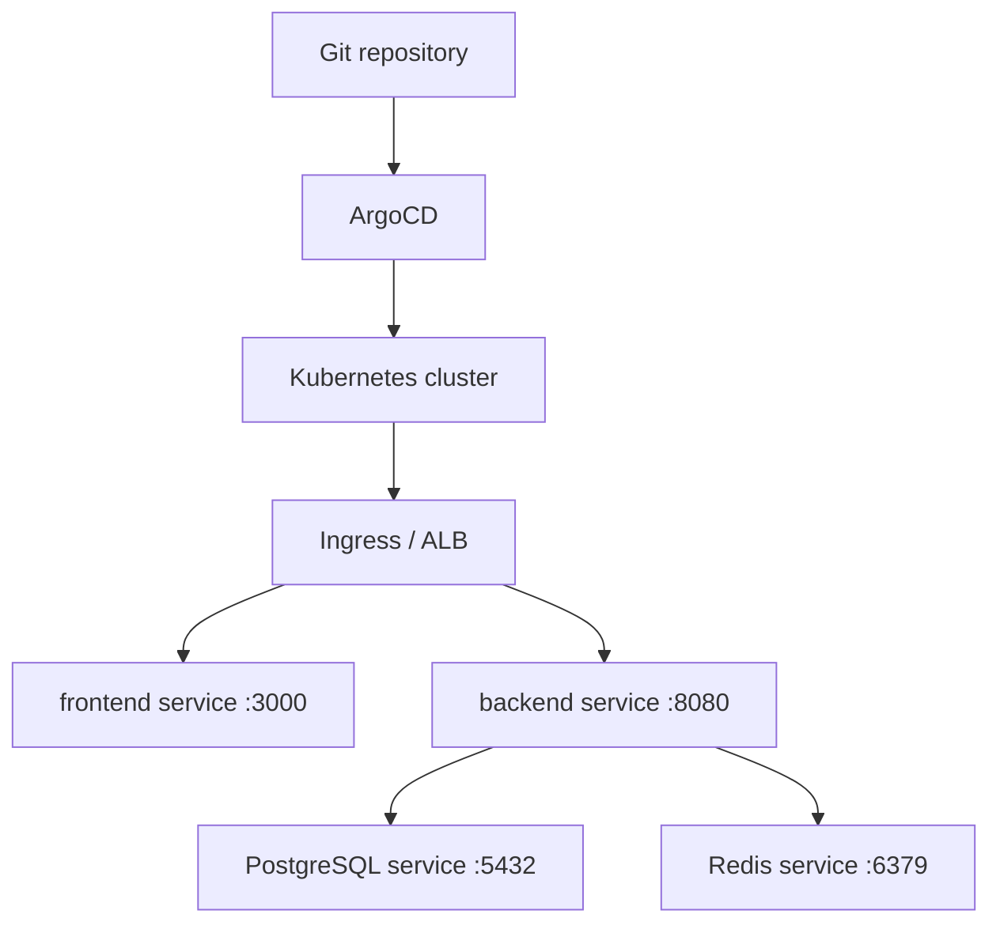
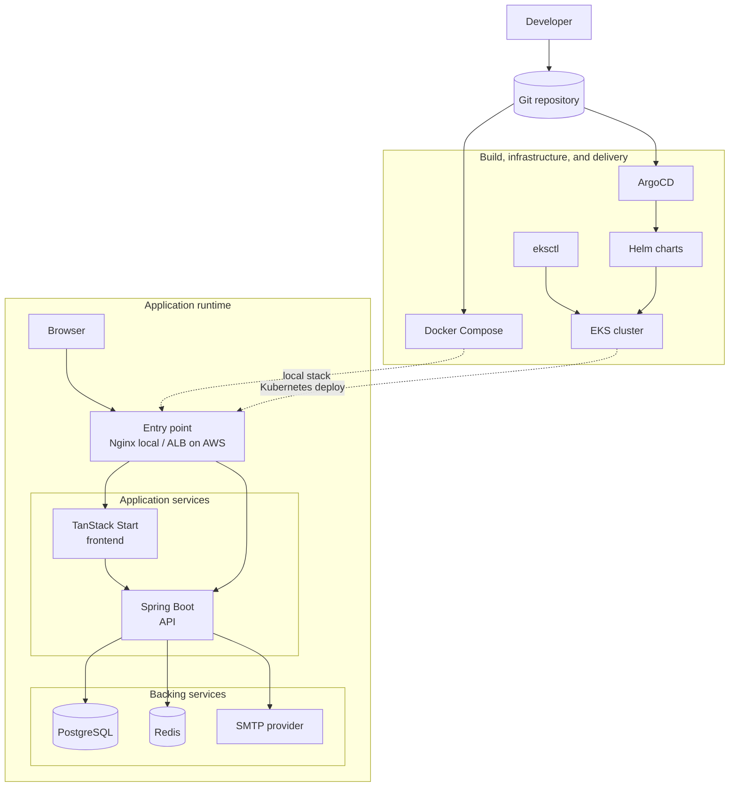

2026-08-02T00:19:18.905+05:30 INFO 12976 --- [server] [     codebase-1] c.m.s.f.r.RepositoryFileProcessor        :
Codebase 861f1f06-e27e-42dc-972d-c716db49580a file client/.cta.json chunk 0:
JSON path: $
{"projectName":"client","mode":"file-router","typescript":true,"packageManager":"npm","includeExamples":false,"tailwind":true,"addOnOptions":{},"envVarValues":{},"git":false,"install":true,"routerOnly":false,"version":1,"framework":"react","chosenAddOns":["biome","nitro","compiler","shadcn","tanstack-query"]} 2026-08-02T00:19:18.919+05:30  INFO 12976 --- [server] [     codebase-1] c.m.s.f.r.RepositoryFileProcessor        : Codebase 861f1f06-e27e-42dc-972d-c716db49580a file client/biome.json chunk 0:
JSON path: $
{"$schema":"https://biomejs.dev/schemas/2.2.4/schema.json","vcs":{"enabled":false,"clientKind":"git","useIgnoreFile":false},"files":{"ignoreUnknown":false,"includes":["**/src/**/*","**/.vscode/**/*","**/index.html","**/vite.config.ts","!**/src/routeTree.gen.ts","!**/src/styles.css"]},"formatter":{"enabled":true,"indentStyle":"tab"},"assist":{"actions":{"source":{"organizeImports":"off"}}},"linter":{"enabled":true,"rules":{"recommended":true}},"javascript":{"formatter":{"quoteStyle":"double"}}}
2026-08-02T00:19:18.929+05:30  INFO 12976 --- [server] [     codebase-1] c.m.s.f.r.RepositoryFileProcessor        : Codebase 861f1f06-e27e-42dc-972d-c716db49580a file client/components.json chunk 0:
JSON path: $
{"$schema":
"https://ui.shadcn.com/schema.json","style":"new-york","rsc":false,"tsx":true,"tailwind":{"config":"","css":"src/styles.css","baseColor":"zinc","cssVariables":true,"prefix":""},"aliases":{"components":"#/components","utils":"#/lib/utils","ui":"#/components/ui","lib":"#/lib","hooks":"#/hooks"},"iconLibrary":"lucide"}
2026-08-02T00:19:18.940+05:30 INFO 12976 --- [server] [     codebase-1] c.m.s.f.r.RepositoryFileProcessor        :
Codebase 861f1f06-e27e-42dc-972d-c716db49580a file client/Dockerfile chunk 0:

# Stage 1: Build & Package

FROM node:22-alpine AS builder

WORKDIR /app COPY package.json package-lock.json ./

RUN --mount=type=cache,target=/root/.npm \
npm ci --prefer-offline --no-audit

ARG VITE_API_BASE_URL=http://localhost:8080/api
ENV VITE_API_BASE_URL=${VITE_API_BASE_URL}

COPY . .

RUN npm run build

#Step 2: Runtime Environment FROM node:22-alpine AS runner ENV NODE_ENV=production ENV PORT=3000 ENV HOST=0.0.0.0

WORKDIR /app

COPY --from=builder /app/.output ./.output

RUN chown -R node:node /app

USER node

EXPOSE 3000

CMD ["node", ".output/server/index.mjs"]
WARNING: A restricted method in java.lang.System has been called WARNING: java.lang.System::load has been called by
org.treesitter.utils.NativeUtils in an unnamed module (file:/C:
/Users/Admin/.gradle/caches/modules-2/files-2.1/io.github.bonede/tree-sitter/0.26.3/58bc5a51a1b12ce77e6e26f6a05bf60e1d9a4a39/tree-sitter-0.26.3.jar)
WARNING: Use --enable-native-access=ALL-UNNAMED to avoid a warning for callers in this module WARNING: Restricted
methods will be blocked in a future release unless native access is enabled

Failed to move lib file: x86_64-windows-tree-sitter.dll551579608161209460 2026-08-02T00:19:18.988+05:30 INFO
12976 --- [server] [     codebase-1] c.m.s.f.r.RepositoryFileProcessor        : Codebase
861f1f06-e27e-42dc-972d-c716db49580a file client/index.d.ts chunk 0:
export interface ApiResponse<T = unknown> { success: boolean message: string data: T } 2026-08-02T00:19:18.988+05:30
INFO 12976 --- [server] [     codebase-1] c.m.s.f.r.RepositoryFileProcessor        : Codebase
861f1f06-e27e-42dc-972d-c716db49580a file client/index.d.ts chunk 1:
export interface User { id: number; email: string; name: string; roles: string[]; } 2026-08-02T00:19:18.989+05:30 INFO
12976 --- [server] [     codebase-1] c.m.s.f.r.RepositoryFileProcessor        : Codebase
861f1f06-e27e-42dc-972d-c716db49580a file client/index.d.ts chunk 2:
export interface PageResponse<T> { content: T[]; page: number; size: number; totalElements: number; totalPages: number;
last: boolean; } 2026-08-02T00:19:18.999+05:30 INFO 12976 --- [server] [     codebase-1]
c.m.s.f.r.RepositoryFileProcessor        : Codebase 861f1f06-e27e-42dc-972d-c716db49580a file client/package.json chunk
0:
JSON path: $
{"name":"client","private":true,"type":"module","imports":{"#/*":"./src/*"},"scripts":{"dev":"vite dev --port 3000","build":"vite build","preview":"vite preview","test":"vitest run","format":"biome format","lint":"biome lint","check":"biome check"},"dependencies":{"@hookform/resolvers":"^5.2.2","@tailwindcss/vite":"^4.1.18","@tanstack/react-devtools":"latest","@tanstack/react-query":"latest","@tanstack/react-query-devtools":"latest","@tanstack/react-router":"latest","@tanstack/react-router-devtools":"latest","@tanstack/react-router-ssr-query":"latest","@tanstack/react-start":"latest","@tanstack/router-plugin":"^1.132.0","axios":"^1.16.1","class-variance-authority":"^0.7.1","clsx":"^2.1.1","lucide-react":"^0.577.0","nitro":"npm:nitro-nightly@latest","radix-ui":"^1.4.3","react":"^19.2.0","react-dom":"^19.2.0","react-hook-form":"^7.76.0","react-syntax-highlighter":"^16.1.1","react-toastify":"^11.1.0","tailwind-merge":"^3.0.2","tailwindcss":"^4.1.18","tw-animate-css":"^1.3.6","zod":"^4.4.3"},"devDependencies":{"@biomejs/biome":"2.4.5","@rolldown/plugin-babel":"^0.2.3","@tailwindcss/typography":"^0.5.16","@tanstack/devtools-vite":"latest","@testing-library/dom":"^10.4.1","@testing-library/react":"^16.3.0","@types/node":"^22.10.2","@types/react":"^19.2.0","@types/react-dom":"^19.2.0","@vitejs/plugin-react":"^6.0.1","babel-plugin-react-compiler":"^1.0.0","jsdom":"^28.1.0","typescript":"^6.0.2","vite":"^8.0.0","vitest":"^4.1.5"},"pnpm":{"onlyBuiltDependencies":["esbuild","lightningcss"]}} 2026-08-02T00:19:19.008+05:30  INFO 12976 --- [server] [     codebase-1] c.m.s.f.r.RepositoryFileProcessor        : Codebase 861f1f06-e27e-42dc-972d-c716db49580a file client/public/manifest.json chunk 0:
JSON path: $
{"short_name":"TanStack App","name":"Create TanStack App
Sample","icons":[{"src":"favicon.ico","sizes":"64x64 32x32 24x24 16x16","type":"image/x-icon"},{"src":"logo192.png","type":"image/png","sizes":"192x192"},{"src":"logo512.png","type":"image/png","sizes":"512x512"}],"start_url":
".","display":"standalone","theme_color":"#000000","background_color":"#ffffff"} 2026-08-02T00:19:19.018+05:30 INFO
12976 --- [server] [     codebase-1] c.m.s.f.r.RepositoryFileProcessor        : Codebase
861f1f06-e27e-42dc-972d-c716db49580a file client/public/robots.txt chunk 0:

# https://www.robotstxt.org/robotstxt.html

User-agent: *
Disallow:
2026-08-02T00:19:19.027+05:30 INFO 12976 --- [server] [     codebase-1] c.m.s.f.r.RepositoryFileProcessor        :
Codebase 861f1f06-e27e-42dc-972d-c716db49580a file client/README.md chunk 0:

# Code Vault Client

The client is a TanStack Start application built with React 19, Vite 8, TanStack Router, React Query, Tailwind CSS 4,
and Biome. It provides the web UI for authentication, dashboards, snippets, collections, and admin workflows.
2026-08-02T00:19:19.027+05:30 INFO 12976 --- [server] [     codebase-1] c.m.s.f.r.RepositoryFileProcessor        :
Codebase 861f1f06-e27e-42dc-972d-c716db49580a file client/README.md chunk 1:

## Key Directories

```text
client/
├── src/
│   ├── api/          Axios client and auth refresh handling
│   ├── components/   Shared UI components
│   ├── features/     Feature modules for auth, snippets, collections, admin
│   ├── routes/       File-based TanStack Router routes
│   └── styles.css    Tailwind and global styles
├── Dockerfile
├── package.json
└── README.md
```

2026-08-02T00:19:19.027+05:30 INFO 12976 --- [server] [     codebase-1] c.m.s.f.r.RepositoryFileProcessor        :
Codebase 861f1f06-e27e-42dc-972d-c716db49580a file client/README.md chunk 2:

## Routing

Routes are generated from `src/routes/`.

```text
src/routes/
├── __root.tsx
├── index.tsx
├── _auth/
│   ├── route.tsx
│   ├── login.tsx
│   ├── register.tsx
│   ├── forgot-password.tsx
│   └── reset-password.tsx
└── _app/
    ├── route.tsx
    ├── dashboard.tsx
    ├── collections/
    ├── snippets/
    └── admin/
```

The `_auth` layout handles public authentication pages. The `_app` layout protects authenticated application pages, and
the admin route verifies administrative access. 2026-08-02T00:19:19.027+05:30 INFO 12976 --- [server] [     codebase-1]
c.m.s.f.r.RepositoryFileProcessor        : Codebase 861f1f06-e27e-42dc-972d-c716db49580a file client/README.md chunk 3:

## API Client

API calls are centralized in [src/api/axios.ts](src/api/axios.ts). The request interceptor attaches the in-memory access
token. The response interceptor handles `401` responses by sending a refresh request, queueing concurrent requests while
refresh is in progress, and replaying them once a new access token is issued.

For local Compose and Kubernetes deployments, the browser-facing API path is `/api`. The container also uses
`INTERNAL_API_URL=http://backend:8080/api` for server-side calls inside the Docker network. 2026-08-02T00:19:19.027+05:
30 INFO 12976 --- [server] [     codebase-1] c.m.s.f.r.RepositoryFileProcessor        : Codebase
861f1f06-e27e-42dc-972d-c716db49580a file client/README.md chunk 4:

## Scripts

| Command           | Purpose                                          |
|-------------------|--------------------------------------------------|
| `npm run dev`     | Start Vite dev server on `http://localhost:3000` |
| `npm run build`   | Build the production TanStack Start/Nitro app    |
| `npm run preview` | Preview the production build                     |
| `npm run test`    | Run Vitest tests                                 |
| `npm run format`  | Run Biome formatter                              |
| `npm run lint`    | Run Biome linter                                 |
| `npm run check`   | Run Biome checks                                 |

2026-08-02T00:19:19.028+05:30 INFO 12976 --- [server] [     codebase-1] c.m.s.f.r.RepositoryFileProcessor        :
Codebase 861f1f06-e27e-42dc-972d-c716db49580a file client/README.md chunk 5:

## Local Development

Start the backend dependencies and API first, then run:

```bash
npm install
npm run dev
```

The app expects the backend API to be reachable through `/api` when proxied, or through the configured API base URL in
the relevant environment. 2026-08-02T00:19:19.028+05:30 INFO 12976 --- [server] [     codebase-1]
c.m.s.f.r.RepositoryFileProcessor        : Codebase 861f1f06-e27e-42dc-972d-c716db49580a file client/README.md chunk 6:

## Production Build

```bash
npm run build
npm run preview
```

The Docker image is configured for deployment by the root Compose file and the Helm chart
in [../git-ops/charts/frontend](../git-ops/charts/frontend). 2026-08-02T00:19:19.040+05:30 INFO
12976 --- [server] [     codebase-1] c.m.s.f.r.RepositoryFileProcessor        : Codebase
861f1f06-e27e-42dc-972d-c716db49580a file client/src/api/axios.ts chunk 0:
const API_BASE_URL = import.meta.env.VITE_API_BASE_URL; 2026-08-02T00:19:19.040+05:30 INFO
12976 --- [server] [     codebase-1] c.m.s.f.r.RepositoryFileProcessor        : Codebase
861f1f06-e27e-42dc-972d-c716db49580a file client/src/api/axios.ts chunk 1:
export const api = axios.create ({ baseURL: API_BASE_URL, withCredentials: true, headers: {
"Content-Type": "application/json", }, }); 2026-08-02T00:19:19.041+05:30 INFO 12976 --- [server] [     codebase-1]
c.m.s.f.r.RepositoryFileProcessor        : Codebase 861f1f06-e27e-42dc-972d-c716db49580a file client/src/api/axios.ts
chunk 2:
let isRefreshing = false; 2026-08-02T00:19:19.041+05:30 INFO 12976 --- [server] [     codebase-1]
c.m.s.f.r.RepositoryFileProcessor        : Codebase 861f1f06-e27e-42dc-972d-c716db49580a file client/src/api/axios.ts
chunk 3:
let failedQueue: Array<{ resolve: (token: string) => void; reject: (err: unknown) => void; }> = []; 2026-08-02T00:19:
19.041+05:30 INFO 12976 --- [server] [     codebase-1] c.m.s.f.r.RepositoryFileProcessor        : Codebase
861f1f06-e27e-42dc-972d-c716db49580a file client/src/api/axios.ts chunk 4:
function processQueue (error: unknown, token: string | null) { failedQueue.forEach ((p) => { if (error || token ===
null) { p.reject (error); } else { p.resolve (token); } }); failedQueue = []; } 2026-08-02T00:19:19.041+05:30 INFO
12976 --- [server] [     codebase-1] c.m.s.f.r.RepositoryFileProcessor        : Codebase
861f1f06-e27e-42dc-972d-c716db49580a file client/src/api/axios.ts chunk 5:
api.interceptors.request.use ((config) => { const token = tokenStorage.getAccessToken (); if (token) {
config.headers.Authorization = `Bearer ${token}`; }

return config; }); 2026-08-02T00:19:19.041+05:30 INFO 12976 --- [server] [     codebase-1]
c.m.s.f.r.RepositoryFileProcessor        : Codebase 861f1f06-e27e-42dc-972d-c716db49580a file client/src/api/axios.ts
chunk 6:
api.interceptors.response.use (
(response) => response, async (error) => { const original = error.config;

    const isServer = typeof window === "undefined";

    if (isServer) {
      return Promise.reject(error);
    }

    const isAuthRoute =
      original?.url?.includes("/login") ||
      original?.url?.includes("/register") ||
      original?.url?.includes("/refresh");

    const isUnauthorized = error.response?.status === 401;

    if (!isUnauthorized || original?._retry || isAuthRoute) {
      return Promise.reject(error);
    }

    if (isRefreshing) {
      return new Promise<string>((resolve, reject) => {
        failedQueue.push({
          resolve,
          reject,
        });
      }).then((token) => {
        original.headers.Authorization = `Bearer ${token}`;
        return api(original);
      });
    }

    original._retry = true;
    isRefreshing = true;

    try {
      const { data } =
        await api.post<ApiResponse<AuthResponse>>("/auth/refresh");

      const authData = data.data;

      tokenStorage.setAccessToken(authData.accessToken);

      processQueue(null, authData.accessToken);

      original.headers.Authorization = `Bearer ${authData.accessToken}`;

      return api(original);
    } catch (err) {
      processQueue(err, null);

      tokenStorage.clear();

      if (typeof window !== "undefined") {
        window.dispatchEvent(new Event("auth:expired"));
      }

      return Promise.reject(err);
    } finally {
      isRefreshing = false;
    }

},
); 2026-08-02T00:19:19.050+05:30 INFO 12976 --- [server] [     codebase-1] c.m.s.f.r.RepositoryFileProcessor        :
Codebase 861f1f06-e27e-42dc-972d-c716db49580a file client/src/api/token-storage.ts chunk 0:
let accessToken: string | null = null; 2026-08-02T00:19:19.051+05:30 INFO 12976 --- [server] [     codebase-1]
c.m.s.f.r.RepositoryFileProcessor        : Codebase 861f1f06-e27e-42dc-972d-c716db49580a file
client/src/api/token-storage.ts chunk 1:
export const tokenStorage = { getAccessToken: () => accessToken,

	setAccessToken: (token: string | null) => {
		accessToken = token;
	},

	clear: () => {
		accessToken = null;
	},

}; 2026-08-02T00:19:19.081+05:30 INFO 12976 --- [server] [     codebase-1] c.m.s.f.r.RepositoryFileProcessor        :
Codebase 861f1f06-e27e-42dc-972d-c716db49580a file client/src/components/Navbar.tsx chunk 0:
const Navbar = () => { const { queryClient } = getContext (); const { data: user } = useCurrentUser (); const
logoutMutation = useLogout (queryClient); const matchRoute = useMatchRoute (); const navigate = useNavigate ();
const [mobileMenuOpen, setMobileMenuOpen] = useState (false); const [profileMenuOpen, setProfileMenuOpen] = useState
(false); const profileCloseTimer = useRef<ReturnType<typeof setTimeout> | null>(null);

	const activeItem = navigationItems.find((item) =>
		matchRoute({
			to: item.to,
			fuzzy: !item.exact,
		}),
	);

	const handleLogout = async () => {
		try {
			await toast.promise(logoutMutation.mutateAsync(), {
				pending: "Logging out...",
				success: "Logged out successfully",
				error: {
					render({ data }) {
						const error = data as AxiosError<ApiResponse>;
						return error.response?.data?.message || "Logout failed";
					},
				},
			});
		} finally {
			navigate({ to: "/login", replace: true });
		}
	};

	const openProfileMenu = () => {
		if (profileCloseTimer.current) {
			clearTimeout(profileCloseTimer.current);
			profileCloseTimer.current = null;
		}

		setProfileMenuOpen(true);
	};

	const closeProfileMenu = () => {
		if (profileCloseTimer.current) {
			clearTimeout(profileCloseTimer.current);
		}

		profileCloseTimer.current = setTimeout(() => {
			setProfileMenuOpen(false);
			profileCloseTimer.current = null;
		}, 120);
	};

	return (
		<header className="sticky top-0 z-200 w-full border-b border-border-base/80 bg-[linear-gradient(180deg,rgba(17,19,24,0.98),rgba(10,11,13,0.94))] shadow-[0_1px_0_rgba(255,255,255,0.03),0_12px_40px_rgba(0,0,0,0.16)] backdrop-blur-xl">
			<div className="absolute inset-x-0 top-0 h-px bg-[linear-gradient(90deg,transparent,rgba(74,158,255,0.85),transparent)]" />
			<div className="flex h-16 w-full items-center gap-3 px-3 sm:px-6">
				<div className="flex min-w-0 shrink-0 items-center gap-2 sm:gap-3">
					<Sheet open={mobileMenuOpen} onOpenChange={setMobileMenuOpen}>
						<SheetTrigger asChild>
							<Button
								variant="ghost"
								size="icon"
								className="shrink-0 rounded-full border border-border-base/80 bg-[radial-gradient(circle_at_top,rgba(43,135,245,0.14),rgba(30,34,43,0.95))] text-text-primary shadow-[0_10px_24px_rgba(0,0,0,0.22)] hover:border-border-strong hover:bg-bg-overlay hover:text-text-primary md:hidden"
								aria-label="Open navigation menu"
							>
								<Menu className="size-4" />
							</Button>
						</SheetTrigger>
						<SheetContent
							side="left"
							className="w-[min(84vw,18rem)] border-border-base bg-[linear-gradient(180deg,rgba(17,19,24,0.98),rgba(10,11,13,0.98))] p-0 text-text-primary shadow-[24px_0_80px_rgba(0,0,0,0.45)] sm:max-w-sm"
						>
							<SheetHeader className="border-b border-border-base/80 px-5 py-5 text-left">
								<div className="mb-3 inline-flex w-fit items-center gap-2 rounded-full border border-border-base bg-bg-subtle px-3 py-1 text-[11px] font-medium uppercase tracking-[0.24em] text-text-muted">
									
									Menu
								</div>
								<SheetTitle className="text-lg">Navigation</SheetTitle>
								<SheetDescription className="text-sm leading-relaxed text-text-secondary">
									Open snippets or collections from the menu.
								</SheetDescription>
							</SheetHeader>

							<div className="flex flex-col gap-2 px-3 py-4">
								{navigationItems.map((item) => (
									<Button
										key={item.to}
										asChild
										variant="ghost"
										className={`group h-auto justify-start rounded-2xl border px-4 py-4 text-left transition-all ${
											activeItem?.to === item.to
												? "border-accent-400/40 bg-[rgba(43,135,245,0.1)] shadow-[0_10px_28px_rgba(0,0,0,0.18)]"
												: "border-transparent hover:border-border-base hover:bg-bg-subtle hover:shadow-[0_10px_28px_rgba(0,0,0,0.18)]"
										}`}
									>

2026-08-02T00:19:19.081+05:30 INFO 12976 --- [server] [     codebase-1] c.m.s.f.r.RepositoryFileProcessor        :
Codebase 861f1f06-e27e-42dc-972d-c716db49580a file client/src/components/Navbar.tsx chunk 1:
<Link to={item.to} onClick={ () => setMobileMenuOpen (false)}>
<span className="flex min-w-0 flex-1 flex-col items-start gap-1">
<span className="flex items-center gap-2 text-sm font-medium text-text-primary">
{item.label} {activeItem?.to === item.to ? (
<span className="rounded-full border border-accent-400/30 bg-accent-400/10 px-2 py-0.5 text-[10px] font-semibold uppercase tracking-[0.24em] text-accent-300">
Current
</span>
) : null}
</span>
<span className="text-xs text-text-muted">
{item.description}
</span>
</span>
<MoveRight className="size-4 text-text-muted transition-transform group-hover:translate-x-0.5" />
</Link>
</Button>
))}
</div>
</SheetContent>
</Sheet>

					<Link
						to="/dashboard"
						className="flex min-w-0 items-center gap-2.5 sm:gap-3"
					>
						
						<span className="hidden min-w-0 flex-col leading-tight sm:flex">
							<span className="truncate text-[15px] font-semibold tracking-[-0.02em] text-text-primary">
								Code Vault
							</span>
						</span>
					</Link>
				</div>

				<nav className="hidden flex-1 items-center justify-center md:flex">
					<div className="inline-flex items-center gap-1 rounded-full border border-border-base/80 bg-bg-raised/80 p-1 shadow-[0_10px_30px_rgba(0,0,0,0.18)] backdrop-blur-sm">
						{navigationItems.map((item) => (
							<Button
								key={item.to}
								asChild
								variant="ghost"
								className={`rounded-full px-4 py-2 text-sm font-medium transition-colors ${
									activeItem?.to === item.to
										? "bg-[rgba(43,135,245,0.12)] text-text-primary shadow-[0_0_0_1px_rgba(74,158,255,0.28)]"
										: "text-text-secondary hover:bg-bg-subtle hover:text-text-primary"
								}`}
							>
								<Link to={item.to}>{item.label}</Link>
							</Button>
						))}
					</div>
				</nav>

				<div className="mt-1 ml-auto flex shrink-0 items-center">
					<Popover open={profileMenuOpen} onOpenChange={setProfileMenuOpen}>
						<PopoverTrigger asChild>
							<Button
								variant="ghost"
								size="icon"
								className="rounded-full border border-border-base/80 bg-bg-subtle/70 text-text-primary shadow-[0_10px_24px_rgba(0,0,0,0.18)] hover:border-border-strong hover:bg-bg-overlay hover:text-text-primary"
								aria-label="Open user menu"
								onMouseEnter={openProfileMenu}
								onMouseLeave={closeProfileMenu}
							>
								<CircleUserRound className="size-4" />
							</Button>
						</PopoverTrigger>
						<PopoverContent
							align="end"
							sideOffset={12}
							className="z-300 w-80 border-border-base bg-[linear-gradient(180deg,rgba(17,19,24,0.98),rgba(13,15,19,0.98))] p-4 text-text-primary shadow-[0_24px_60px_rgba(0,0,0,0.45)]"
							onMouseEnter={openProfileMenu}
							onMouseLeave={closeProfileMenu}
						>
							<div className="space-y-4">
								<div className="rounded-2xl border border-border-base bg-bg-subtle/60 p-4">
									<div className="text-[11px] uppercase tracking-[0.28em] text-text-muted">
										Signed in as
									</div>
									<div className="mt-3 flex items-center gap-3">
										<div className="flex size-10 items-center justify-center rounded-full border border-border-base bg-bg-raised text-sm font-semibold text-text-primary">
											{user?.name
												?.split(" ")
												.slice(0, 2)
												.map((part) => part.charAt(0))
												.join("")
												.toUpperCase() || "U"}
										</div>
										<div className="min-w-0">
											<div className="truncate text-sm font-medium text-text-primary">
												{user?.name || "Unknown user"}

2026-08-02T00:19:19.082+05:30 INFO 12976 --- [server] [     codebase-1] c.m.s.f.r.RepositoryFileProcessor        :
Codebase 861f1f06-e27e-42dc-972d-c716db49580a file client/src/components/Navbar.tsx chunk 2:
</div>
<div className="truncate text-sm text-text-secondary">
{user?.email || "No email available"}
</div>
</div>
</div>
</div>

								<Separator className="bg-border-base" />

								<Button
									variant="ghost"
									className="w-full justify-start rounded-xl px-3 text-text-primary hover:bg-danger-subtle hover:text-danger-text"
									onClick={handleLogout}
								>
									<LogOut className="size-4" />
									Logout
								</Button>
							</div>
						</PopoverContent>
					</Popover>
				</div>
			</div>
		</header>
	);

}; 2026-08-02T00:19:19.082+05:30 INFO 12976 --- [server] [     codebase-1] c.m.s.f.r.RepositoryFileProcessor        :
Codebase 861f1f06-e27e-42dc-972d-c716db49580a file client/src/components/Navbar.tsx chunk 3:
export default Navbar; 2026-08-02T00:19:19.096+05:30 INFO 12976 --- [server] [     codebase-1]
c.m.s.f.r.RepositoryFileProcessor        : Codebase 861f1f06-e27e-42dc-972d-c716db49580a file
client/src/components/ui/alert-dialog.tsx chunk 0:
function AlertDialog ({ ...props }: React.ComponentProps<typeof AlertDialogPrimitive.Root>) { return <
AlertDialogPrimitive.Root data-slot="alert-dialog" {...props} />; } 2026-08-02T00:19:19.096+05:30 INFO
12976 --- [server] [     codebase-1] c.m.s.f.r.RepositoryFileProcessor        : Codebase
861f1f06-e27e-42dc-972d-c716db49580a file client/src/components/ui/alert-dialog.tsx chunk 1:
function AlertDialogTrigger ({ ...props }: React.ComponentProps<typeof AlertDialogPrimitive.Trigger>) { return (
<AlertDialogPrimitive.Trigger data-slot="alert-dialog-trigger" {...props} />
); } 2026-08-02T00:19:19.096+05:30 INFO 12976 --- [server] [     codebase-1] c.m.s.f.r.RepositoryFileProcessor        :
Codebase 861f1f06-e27e-42dc-972d-c716db49580a file client/src/components/ui/alert-dialog.tsx chunk 2:
function AlertDialogPortal ({ ...props }: React.ComponentProps<typeof AlertDialogPrimitive.Portal>) { return (
<AlertDialogPrimitive.Portal data-slot="alert-dialog-portal" {...props} />
); } 2026-08-02T00:19:19.096+05:30 INFO 12976 --- [server] [     codebase-1] c.m.s.f.r.RepositoryFileProcessor        :
Codebase 861f1f06-e27e-42dc-972d-c716db49580a file client/src/components/ui/alert-dialog.tsx chunk 3:
function AlertDialogOverlay ({ className, ...props }: React.ComponentProps<typeof AlertDialogPrimitive.Overlay>) {
return (
<AlertDialogPrimitive.Overlay data-slot="alert-dialog-overlay"
className={cn (
"fixed inset-0 z-50 bg-black/50 data-[state=closed]:animate-out data-[state=closed]:fade-out-0 data-[state=open]:
animate-in data-[state=open]:fade-in-0", className,
)} {...props} />
); } 2026-08-02T00:19:19.096+05:30 INFO 12976 --- [server] [     codebase-1] c.m.s.f.r.RepositoryFileProcessor        :
Codebase 861f1f06-e27e-42dc-972d-c716db49580a file client/src/components/ui/alert-dialog.tsx chunk 4:
function AlertDialogContent ({ className, size = "default", ...props }:
React.ComponentProps<typeof AlertDialogPrimitive.Content> & { size?: "default" | "sm"; }) { return (
<AlertDialogPortal>
<AlertDialogOverlay />
<AlertDialogPrimitive.Content data-slot="alert-dialog-content"
data-size={size} className={cn (
"group/alert-dialog-content fixed top-[50%] left-[50%] z-50 grid w-full max-w-[calc (100%-2rem)] translate-x-[-50%]
translate-y-[-50%] gap-4 rounded-lg border bg-background p-6 shadow-lg duration-200 data-[size=sm]:max-w-xs
data-[state=closed]:animate-out data-[state=closed]:fade-out-0 data-[state=closed]:zoom-out-95 data-[state=open]:
animate-in data-[state=open]:fade-in-0 data-[state=open]:zoom-in-95 data-[size=default]:sm:max-w-lg", className,
)} {...props} />
</AlertDialogPortal>
); } 2026-08-02T00:19:19.096+05:30 INFO 12976 --- [server] [     codebase-1] c.m.s.f.r.RepositoryFileProcessor        :
Codebase 861f1f06-e27e-42dc-972d-c716db49580a file client/src/components/ui/alert-dialog.tsx chunk 5:
function AlertDialogHeader ({ className, ...props }: React.ComponentProps<"div">) { return (
<div
data-slot="alert-dialog-header"
className={cn(
"grid grid-rows-[auto_1fr] place-items-center gap-1.5 text-center has-data-[slot=alert-dialog-media]:grid-rows-[auto_auto_1fr] has-data-[slot=alert-dialog-media]:gap-x-6 sm:group-data-[size=default]/alert-dialog-content:place-items-start sm:group-data-[size=default]/alert-dialog-content:text-left sm:group-data-[size=default]/alert-dialog-content:has-data-[slot=alert-dialog-media]:grid-rows-[auto_1fr]",
className,
)}
{...props}
/>
);
}
2026-08-02T00:19:19.097+05:30  INFO 12976 --- [server] [     codebase-1] c.m.s.f.r.RepositoryFileProcessor        : Codebase 861f1f06-e27e-42dc-972d-c716db49580a file client/src/components/ui/alert-dialog.tsx chunk 6:
function AlertDialogFooter({
className,
...props
}: React.ComponentProps<"div">) {
return (
<div
data-slot="alert-dialog-footer"
className={cn(
"flex flex-col-reverse gap-2 group-data-[size=sm]/alert-dialog-content:grid group-data-[size=sm]/alert-dialog-content:grid-cols-2 sm:flex-row sm:justify-end",
className,
)}
{...props}
/>
);
}
2026-08-02T00:19:19.097+05:30  INFO 12976 --- [server] [     codebase-1] c.m.s.f.r.RepositoryFileProcessor        : Codebase 861f1f06-e27e-42dc-972d-c716db49580a file client/src/components/ui/alert-dialog.tsx chunk 7:
function AlertDialogTitle({
className,
...props
}: React.ComponentProps<typeof AlertDialogPrimitive.Title>) {
return (
<AlertDialogPrimitive.Title
data-slot="alert-dialog-title"
className={cn(
"text-lg font-semibold sm:group-data-[size=default]/alert-dialog-content:group-has-data-[slot=alert-dialog-media]/alert-dialog-content:col-start-2",
className,
)}
{...props}
/>
);
}
2026-08-02T00:19:19.097+05:30  INFO 12976 --- [server] [     codebase-1] c.m.s.f.r.RepositoryFileProcessor        : Codebase 861f1f06-e27e-42dc-972d-c716db49580a file client/src/components/ui/alert-dialog.tsx chunk 8:
function AlertDialogDescription({
className,
...props
}: React.ComponentProps<typeof AlertDialogPrimitive.Description>) {
return (
<AlertDialogPrimitive.Description
data-slot="alert-dialog-description"
className={cn("text-sm text-muted-foreground", className)}
{...props}
/>
);
}
2026-08-02T00:19:19.097+05:30  INFO 12976 --- [server] [     codebase-1] c.m.s.f.r.RepositoryFileProcessor        : Codebase 861f1f06-e27e-42dc-972d-c716db49580a file client/src/components/ui/alert-dialog.tsx chunk 9:
function AlertDialogMedia({
className,
...props
}: React.ComponentProps<"div">) {
return (
<div
data-slot="alert-dialog-media"
className={cn(
"mb-2 inline-flex size-16 items-center justify-center rounded-md bg-muted sm:group-data-[size=default]/alert-dialog-content:row-span-2 *:[svg:not([class*='size-'])]:size-8",
className,
)}
{...props}
/>
);
}
2026-08-02T00:19:19.097+05:30  INFO 12976 --- [server] [     codebase-1] c.m.s.f.r.RepositoryFileProcessor        : Codebase 861f1f06-e27e-42dc-972d-c716db49580a file client/src/components/ui/alert-dialog.tsx chunk 10:
function AlertDialogAction({
className,
variant = "default",
size = "default",
...props
}: React.ComponentProps<typeof AlertDialogPrimitive.Action> &
Pick<React.ComponentProps<typeof Button>, "variant" | "size">) {
return (
<Button variant={variant} size={size} asChild>
<AlertDialogPrimitive.Action
data-slot="alert-dialog-action"
className={cn(className)}
{...props}
/>
</Button>
);
}
2026-08-02T00:19:19.097+05:30  INFO 12976 --- [server] [     codebase-1] c.m.s.f.r.RepositoryFileProcessor        : Codebase 861f1f06-e27e-42dc-972d-c716db49580a file client/src/components/ui/alert-dialog.tsx chunk 11:
function AlertDialogCancel({
className,
variant = "outline",
size = "default",
...props
}: React.ComponentProps<typeof AlertDialogPrimitive.Cancel> &
Pick<React.ComponentProps<typeof Button>, "variant" | "size">) {
return (
<Button variant={variant} size={size} asChild>
<AlertDialogPrimitive.Cancel
data-slot="alert-dialog-cancel"
className={cn(className)}
{...props}
/>
</Button>
);
}
2026-08-02T00:19:19.097+05:30  INFO 12976 --- [server] [     codebase-1] c.m.s.f.r.RepositoryFileProcessor        : Codebase 861f1f06-e27e-42dc-972d-c716db49580a file client/src/components/ui/alert-dialog.tsx chunk 12:
export {
AlertDialog,
AlertDialogAction,
AlertDialogCancel,
AlertDialogContent,
AlertDialogDescription,
AlertDialogFooter,
AlertDialogHeader,
AlertDialogMedia,
AlertDialogOverlay,
AlertDialogPortal,
AlertDialogTitle,
AlertDialogTrigger,
};
2026-08-02T00:19:19.108+05:30  INFO 12976 --- [server] [     codebase-1] c.m.s.f.r.RepositoryFileProcessor        : Codebase 861f1f06-e27e-42dc-972d-c716db49580a file client/src/components/ui/button.tsx chunk 0:
const buttonVariants = cva(
"inline-flex shrink-0 items-center justify-center gap-2 rounded-md text-sm font-medium whitespace-nowrap transition-all outline-none focus-visible:border-ring focus-visible:ring-[3px] focus-visible:ring-ring/50 disabled:pointer-events-none disabled:opacity-50 aria-invalid:border-destructive aria-invalid:ring-destructive/20 dark:aria-invalid:ring-destructive/40 [&_svg]:pointer-events-none [&_svg]:shrink-0 [&_svg:not([class*='size-'])]:size-4",
{
variants: {
variant: {
default: "bg-primary text-primary-foreground hover:bg-primary/90",
destructive:
"bg-destructive text-white hover:bg-destructive/90 focus-visible:ring-destructive/20 dark:bg-destructive/60 dark:focus-visible:ring-destructive/40",
outline:
"border bg-background shadow-xs hover:bg-accent hover:text-accent-foreground dark:border-input dark:bg-input/30 dark:hover:bg-input/50",
secondary:
"bg-secondary text-secondary-foreground hover:bg-secondary/80",
ghost:
"hover:bg-accent hover:text-accent-foreground dark:hover:bg-accent/50",
link: "text-primary underline-offset-4 hover:underline",
},
size: {
default: "h-9 px-4 py-2 has-[>svg]:px-3",
xs: "h-6 gap-1 rounded-md px-2 text-xs has-[>svg]:px-1.5 [&_svg:not([class*='size-'])]:size-3",
sm: "h-8 gap-1.5 rounded-md px-3 has-[>svg]:px-2.5",
lg: "h-10 rounded-md px-6 has-[>svg]:px-4",
icon: "size-9",
"icon-xs": "size-6 rounded-md [&_svg:not([class*='size-'])]:size-3",
"icon-sm": "size-8",
"icon-lg": "size-10",
},
},
defaultVariants: {
variant: "default",
size: "default",
},
},
);
2026-08-02T00:19:19.108+05:30  INFO 12976 --- [server] [     codebase-1] c.m.s.f.r.RepositoryFileProcessor        : Codebase 861f1f06-e27e-42dc-972d-c716db49580a file client/src/components/ui/button.tsx chunk 1:
function Button({
className,
variant = "default",
size = "default",
asChild = false,
...props
}: React.ComponentProps<"button"> &
VariantProps<typeof buttonVariants> & {
asChild?: boolean;
}) {
const Comp = asChild ? Slot.Root : "button";

	return (
		<Comp
			data-slot="button"
			data-variant={variant}
			data-size={size}
			className={cn(buttonVariants({ variant, size, className }))}
			{...props}
		/>
	);

} 2026-08-02T00:19:19.108+05:30 INFO 12976 --- [server] [     codebase-1] c.m.s.f.r.RepositoryFileProcessor        :
Codebase 861f1f06-e27e-42dc-972d-c716db49580a file client/src/components/ui/button.tsx chunk 2:
export { Button, buttonVariants }; 2026-08-02T00:19:19.121+05:30 INFO 12976 --- [server] [     codebase-1]
c.m.s.f.r.RepositoryFileProcessor        : Codebase 861f1f06-e27e-42dc-972d-c716db49580a file
client/src/components/ui/card.tsx chunk 0:
function Card ({ className, ...props }: React.ComponentProps<"div">) { return (
<div
data-slot="card"
className={cn(
"flex flex-col gap-6 rounded-xl border bg-card py-6 text-card-foreground shadow-sm",
className,
)}
{...props}
/>
);
}
2026-08-02T00:19:19.121+05:30  INFO 12976 --- [server] [     codebase-1] c.m.s.f.r.RepositoryFileProcessor        : Codebase 861f1f06-e27e-42dc-972d-c716db49580a file client/src/components/ui/card.tsx chunk 1:
function CardHeader({ className, ...props }: React.ComponentProps<"div">) {
return (
<div
data-slot="card-header"
className={cn(
"@container/card-header grid auto-rows-min grid-rows-[auto_auto] items-start gap-2 px-6 has-data-[slot=card-action]:grid-cols-[1fr_auto] [.border-b]:pb-6",
className,
)}
{...props}
/>
);
}
2026-08-02T00:19:19.121+05:30  INFO 12976 --- [server] [     codebase-1] c.m.s.f.r.RepositoryFileProcessor        : Codebase 861f1f06-e27e-42dc-972d-c716db49580a file client/src/components/ui/card.tsx chunk 2:
function CardTitle({ className, ...props }: React.ComponentProps<"div">) {
return (
<div
data-slot="card-title"
className={cn("leading-none font-semibold", className)}
{...props}
/>
);
}
2026-08-02T00:19:19.122+05:30  INFO 12976 --- [server] [     codebase-1] c.m.s.f.r.RepositoryFileProcessor        : Codebase 861f1f06-e27e-42dc-972d-c716db49580a file client/src/components/ui/card.tsx chunk 3:
function CardDescription({ className, ...props }: React.ComponentProps<"div">) {
return (
<div
data-slot="card-description"
className={cn("text-sm text-muted-foreground", className)}
{...props}
/>
);
}
2026-08-02T00:19:19.122+05:30  INFO 12976 --- [server] [     codebase-1] c.m.s.f.r.RepositoryFileProcessor        : Codebase 861f1f06-e27e-42dc-972d-c716db49580a file client/src/components/ui/card.tsx chunk 4:
function CardAction({ className, ...props }: React.ComponentProps<"div">) {
return (
<div
data-slot="card-action"
className={cn(
"col-start-2 row-span-2 row-start-1 self-start justify-self-end",
className,
)}
{...props}
/>
);
}
2026-08-02T00:19:19.122+05:30  INFO 12976 --- [server] [     codebase-1] c.m.s.f.r.RepositoryFileProcessor        : Codebase 861f1f06-e27e-42dc-972d-c716db49580a file client/src/components/ui/card.tsx chunk 5:
function CardContent({ className, ...props }: React.ComponentProps<"div">) {
return (
<div
data-slot="card-content"
className={cn("px-6", className)}
{...props}
/>
);
}
2026-08-02T00:19:19.122+05:30  INFO 12976 --- [server] [     codebase-1] c.m.s.f.r.RepositoryFileProcessor        : Codebase 861f1f06-e27e-42dc-972d-c716db49580a file client/src/components/ui/card.tsx chunk 6:
function CardFooter({ className, ...props }: React.ComponentProps<"div">) {
return (
<div
data-slot="card-footer"
className={cn("flex items-center px-6 [.border-t]:pt-6", className)}
{...props}
/>
);
}
2026-08-02T00:19:19.122+05:30  INFO 12976 --- [server] [     codebase-1] c.m.s.f.r.RepositoryFileProcessor        : Codebase 861f1f06-e27e-42dc-972d-c716db49580a file client/src/components/ui/card.tsx chunk 7:
export {
Card,
CardAction,
CardContent,
CardDescription,
CardFooter,
CardHeader,
CardTitle,
};
2026-08-02T00:19:19.138+05:30  INFO 12976 --- [server] [     codebase-1] c.m.s.f.r.RepositoryFileProcessor        : Codebase 861f1f06-e27e-42dc-972d-c716db49580a file client/src/components/ui/form.tsx chunk 0:
"use client"
2026-08-02T00:19:19.139+05:30  INFO 12976 --- [server] [     codebase-1] c.m.s.f.r.RepositoryFileProcessor        : Codebase 861f1f06-e27e-42dc-972d-c716db49580a file client/src/components/ui/form.tsx chunk 1:
const Form = FormProvider
2026-08-02T00:19:19.139+05:30  INFO 12976 --- [server] [     codebase-1] c.m.s.f.r.RepositoryFileProcessor        : Codebase 861f1f06-e27e-42dc-972d-c716db49580a file client/src/components/ui/form.tsx chunk 2:
type FormFieldContextValue<
TFieldValues extends FieldValues = FieldValues,
TName extends FieldPath<TFieldValues> = FieldPath<TFieldValues>,
> = {
name: TName
}
2026-08-02T00:19:19.139+05:30  INFO 12976 --- [server] [     codebase-1] c.m.s.f.r.RepositoryFileProcessor        : Codebase 861f1f06-e27e-42dc-972d-c716db49580a file client/src/components/ui/form.tsx chunk 3:
const FormFieldContext = React.createContext<FormFieldContextValue>(
{} as FormFieldContextValue
)
2026-08-02T00:19:19.139+05:30  INFO 12976 --- [server] [     codebase-1] c.m.s.f.r.RepositoryFileProcessor        : Codebase 861f1f06-e27e-42dc-972d-c716db49580a file client/src/components/ui/form.tsx chunk 4:
const FormField = <
TFieldValues extends FieldValues = FieldValues,
TName extends FieldPath<TFieldValues> = FieldPath<TFieldValues>,
>({
...props
}: ControllerProps<TFieldValues, TName>) => {
return (
<FormFieldContext.Provider value={{ name: props.name }}>
<Controller {...props} />
</FormFieldContext.Provider>
)
}
2026-08-02T00:19:19.139+05:30  INFO 12976 --- [server] [     codebase-1] c.m.s.f.r.RepositoryFileProcessor        : Codebase 861f1f06-e27e-42dc-972d-c716db49580a file client/src/components/ui/form.tsx chunk 5:
const useFormField = () => {
const fieldContext = React.useContext(FormFieldContext)
const itemContext = React.useContext(FormItemContext)
const { getFieldState } = useFormContext()
const formState = useFormState({ name: fieldContext.name })
const fieldState = getFieldState(fieldContext.name, formState)

if (!fieldContext) { throw new Error ("useFormField should be used within <FormField>")
}

const { id } = itemContext

return { id, name: fieldContext.name, formItemId: `${id}-form-item`, formDescriptionId: `${id}-form-item-description`,
formMessageId: `${id}-form-item-message`, ...fieldState, } } 2026-08-02T00:19:19.139+05:30 INFO
12976 --- [server] [     codebase-1] c.m.s.f.r.RepositoryFileProcessor        : Codebase
861f1f06-e27e-42dc-972d-c716db49580a file client/src/components/ui/form.tsx chunk 6:
type FormItemContextValue = { id: string } 2026-08-02T00:19:19.140+05:30 INFO 12976 --- [server] [     codebase-1]
c.m.s.f.r.RepositoryFileProcessor        : Codebase 861f1f06-e27e-42dc-972d-c716db49580a file
client/src/components/ui/form.tsx chunk 7:
const FormItemContext = React.createContext<FormItemContextValue>({} as FormItemContextValue
)
2026-08-02T00:19:19.140+05:30 INFO 12976 --- [server] [     codebase-1] c.m.s.f.r.RepositoryFileProcessor        :
Codebase 861f1f06-e27e-42dc-972d-c716db49580a file client/src/components/ui/form.tsx chunk 8:
function FormItem ({ className, ...props }: React.ComponentProps<"div">) { const id = React.useId ()

return (
<FormItemContext.Provider value={{ id }}>
<div
data-slot="form-item"
className={cn("grid gap-2", className)}
{...props}
/>
</FormItemContext.Provider>
)
}
2026-08-02T00:19:19.140+05:30  INFO 12976 --- [server] [     codebase-1] c.m.s.f.r.RepositoryFileProcessor        : Codebase 861f1f06-e27e-42dc-972d-c716db49580a file client/src/components/ui/form.tsx chunk 9:
function FormLabel({
className,
...props
}: React.ComponentProps<typeof LabelPrimitive.Root>) {
const { error, formItemId } = useFormField()

return (
<Label data-slot="form-label"
data-error={!!error} className={cn ("data-[error=true]:text-destructive", className)} htmlFor={formItemId} {...props} />
)
} 2026-08-02T00:19:19.140+05:30 INFO 12976 --- [server] [     codebase-1] c.m.s.f.r.RepositoryFileProcessor        :
Codebase 861f1f06-e27e-42dc-972d-c716db49580a file client/src/components/ui/form.tsx chunk 10:
function FormControl ({ ...props }: React.ComponentProps<typeof Slot.Root>) { const { error, formItemId,
formDescriptionId, formMessageId } = useFormField ()

return (
<Slot.Root data-slot="form-control"
id={formItemId} aria-describedby={
!error ? `${formDescriptionId}`
: `${formDescriptionId} ${formMessageId}`
} aria-invalid={!!error} {...props} />
)
} 2026-08-02T00:19:19.140+05:30 INFO 12976 --- [server] [     codebase-1] c.m.s.f.r.RepositoryFileProcessor        :
Codebase 861f1f06-e27e-42dc-972d-c716db49580a file client/src/components/ui/form.tsx chunk 11:
function FormDescription ({ className, ...props }: React.ComponentProps<"p">) { const { formDescriptionId } =
useFormField ()

return (
<p
data-slot="form-description"
id={formDescriptionId}
className={cn("text-sm text-muted-foreground", className)}
{...props}
/>
)
}
2026-08-02T00:19:19.140+05:30  INFO 12976 --- [server] [     codebase-1] c.m.s.f.r.RepositoryFileProcessor        : Codebase 861f1f06-e27e-42dc-972d-c716db49580a file client/src/components/ui/form.tsx chunk 12:
function FormMessage({ className, ...props }: React.ComponentProps<"p">) {
const { error, formMessageId } = useFormField()
const body = error ? String(error?.message ?? "") : props.children

if (!body) { return null }

return (
<p
data-slot="form-message"
id={formMessageId}
className={cn("text-sm text-destructive", className)}
{...props}
>
{body}
</p>
)
}
2026-08-02T00:19:19.140+05:30  INFO 12976 --- [server] [     codebase-1] c.m.s.f.r.RepositoryFileProcessor        : Codebase 861f1f06-e27e-42dc-972d-c716db49580a file client/src/components/ui/form.tsx chunk 13:
export {
useFormField,
Form,
FormItem,
FormLabel,
FormControl,
FormDescription,
FormMessage,
FormField,
}
2026-08-02T00:19:19.151+05:30  INFO 12976 --- [server] [     codebase-1] c.m.s.f.r.RepositoryFileProcessor        : Codebase 861f1f06-e27e-42dc-972d-c716db49580a file client/src/components/ui/input.tsx chunk 0:
function Input({ className, type, ...props }: React.ComponentProps<"input">) {
return (
<input
type={type}
data-slot="input"
className={cn(
"h-9 w-full min-w-0 rounded-md border border-input bg-transparent px-3 py-1 text-base shadow-xs transition-[color,box-shadow] outline-none selection:bg-primary selection:text-primary-foreground file:inline-flex file:h-7 file:border-0 file:bg-transparent file:text-sm file:font-medium file:text-foreground placeholder:text-muted-foreground disabled:pointer-events-none disabled:cursor-not-allowed disabled:opacity-50 md:text-sm dark:bg-input/30",
"focus-visible:border-ring focus-visible:ring-[3px] focus-visible:ring-ring/50",
"aria-invalid:border-destructive aria-invalid:ring-destructive/20 dark:aria-invalid:ring-destructive/40",
className,
)}
{...props}
/>
);
}
2026-08-02T00:19:19.151+05:30  INFO 12976 --- [server] [     codebase-1] c.m.s.f.r.RepositoryFileProcessor        : Codebase 861f1f06-e27e-42dc-972d-c716db49580a file client/src/components/ui/input.tsx chunk 1:
export { Input };
2026-08-02T00:19:19.163+05:30  INFO 12976 --- [server] [     codebase-1] c.m.s.f.r.RepositoryFileProcessor        : Codebase 861f1f06-e27e-42dc-972d-c716db49580a file client/src/components/ui/label.tsx chunk 0:
function Label({
className,
...props
}: React.ComponentProps<typeof LabelPrimitive.Root>) {
return (
<LabelPrimitive.Root
data-slot="label"
className={cn(
"flex items-center gap-2 text-sm leading-none font-medium select-none group-data-[disabled=true]:pointer-events-none group-data-[disabled=true]:opacity-50 peer-disabled:cursor-not-allowed peer-disabled:opacity-50",
className,
)}
{...props}
/>
);
}
2026-08-02T00:19:19.164+05:30  INFO 12976 --- [server] [     codebase-1] c.m.s.f.r.RepositoryFileProcessor        : Codebase 861f1f06-e27e-42dc-972d-c716db49580a file client/src/components/ui/label.tsx chunk 1:
export { Label };
2026-08-02T00:19:19.174+05:30  INFO 12976 --- [server] [     codebase-1] c.m.s.f.r.RepositoryFileProcessor        : Codebase 861f1f06-e27e-42dc-972d-c716db49580a file client/src/components/ui/loader.tsx chunk 0:
type LoaderProps = {
className?: string;
title?: string;
description?: string;
};
2026-08-02T00:19:19.174+05:30  INFO 12976 --- [server] [     codebase-1] c.m.s.f.r.RepositoryFileProcessor        : Codebase 861f1f06-e27e-42dc-972d-c716db49580a file client/src/components/ui/loader.tsx chunk 1:
function Loader({
className,
title = "Loading your vault",
description = "Checking session state",
}: LoaderProps) {
return (
<output
aria-live="polite"
aria-busy="true"
className={cn("flex flex-col items-center gap-4 text-center", className)}
>
<div className="relative grid size-28 place-items-center">
<div className="absolute inset-0 rounded-full bg-[radial-gradient(circle_at_center,rgba(43,135,245,0.18),transparent_58%)] blur-xl" />
<div className="absolute inset-0 rounded-full border border-border-strong/80 bg-bg-raised/85 shadow-[0_0_50px_rgba(0,0,0,0.35)]" />
<div className="absolute inset-2 rounded-full border border-accent-400/25 border-dashed animate-spin [animation-duration:10s]" />
<div className="absolute inset-5 rounded-full border border-accent-300/20 animate-spin [animation-direction:reverse] [animation-duration:16s]" />
<div className="relative flex size-14 items-center justify-center rounded-2xl border border-border-strong bg-[linear-gradient(160deg,rgba(43,135,245,0.22),rgba(10,11,13,0.96))] text-accent-300 shadow-[inset_0_1px_0_rgba(255,255,255,0.06),0_0_30px_rgba(43,135,245,0.25)]">
<LockKeyhole className="size-6 animate-pulse" />
</div>
<span className="absolute left-1/2 top-4 size-2 -translate-x-1/2 rounded-full bg-accent-300 shadow-[0_0_18px_rgba(74,158,255,0.9)] animate-pulse" />
<span className="absolute bottom-4 right-5 size-1.5 rounded-full bg-accent-400/70 shadow-[0_0_12px_rgba(43,135,245,0.7)] animate-pulse [animation-delay:200ms]" />
<span className="absolute bottom-5 left-5 size-1.5 rounded-full bg-accent-300/70 shadow-[0_0_12px_rgba(74,158,255,0.7)] animate-pulse [animation-delay:400ms]" />
</div>

			<div className="space-y-1">
				<p className="text-sm font-medium text-text-primary">{title}</p>
				<p className="text-caption">{description}</p>
			</div>
		</output>
	);

} 2026-08-02T00:19:19.174+05:30 INFO 12976 --- [server] [     codebase-1] c.m.s.f.r.RepositoryFileProcessor        :
Codebase 861f1f06-e27e-42dc-972d-c716db49580a file client/src/components/ui/loader.tsx chunk 2:
export { Loader }; 2026-08-02T00:19:19.186+05:30 INFO 12976 --- [server] [     codebase-1]
c.m.s.f.r.RepositoryFileProcessor        : Codebase 861f1f06-e27e-42dc-972d-c716db49580a file
client/src/components/ui/popover.tsx chunk 0:
"use client"
2026-08-02T00:19:19.187+05:30 INFO 12976 --- [server] [     codebase-1] c.m.s.f.r.RepositoryFileProcessor        :
Codebase 861f1f06-e27e-42dc-972d-c716db49580a file client/src/components/ui/popover.tsx chunk 1:
function Popover ({ ...props }: React.ComponentProps<typeof PopoverPrimitive.Root>) { return <PopoverPrimitive.Root
data-slot="popover" {...props} />
} 2026-08-02T00:19:19.187+05:30 INFO 12976 --- [server] [     codebase-1] c.m.s.f.r.RepositoryFileProcessor        :
Codebase 861f1f06-e27e-42dc-972d-c716db49580a file client/src/components/ui/popover.tsx chunk 2:
function PopoverTrigger ({ ...props }: React.ComponentProps<typeof PopoverPrimitive.Trigger>) { return <
PopoverPrimitive.Trigger data-slot="popover-trigger" {...props} />
} 2026-08-02T00:19:19.187+05:30 INFO 12976 --- [server] [     codebase-1] c.m.s.f.r.RepositoryFileProcessor        :
Codebase 861f1f06-e27e-42dc-972d-c716db49580a file client/src/components/ui/popover.tsx chunk 3:
function PopoverContent ({ className, align = "center", sideOffset = 4, ...props }:
React.ComponentProps<typeof PopoverPrimitive.Content>) { return (
<PopoverPrimitive.Portal>
<PopoverPrimitive.Content data-slot="popover-content"
align={align} sideOffset={sideOffset} className={cn (
"z-50 w-72 origin- (--radix-popover-content-transform-origin) rounded-md border bg-popover p-4 text-popover-foreground
shadow-md outline-hidden data-[side=bottom]:slide-in-from-top-2 data-[side=left]:slide-in-from-right-2
data-[side=right]:slide-in-from-left-2 data-[side=top]:slide-in-from-bottom-2 data-[state=closed]:animate-out
data-[state=closed]:fade-out-0 data-[state=closed]:zoom-out-95 data-[state=open]:animate-in data-[state=open]:fade-in-0
data-[state=open]:zoom-in-95", className
)} {...props} />
</PopoverPrimitive.Portal>
)
} 2026-08-02T00:19:19.187+05:30 INFO 12976 --- [server] [     codebase-1] c.m.s.f.r.RepositoryFileProcessor        :
Codebase 861f1f06-e27e-42dc-972d-c716db49580a file client/src/components/ui/popover.tsx chunk 4:
function PopoverAnchor ({ ...props }: React.ComponentProps<typeof PopoverPrimitive.Anchor>) { return <
PopoverPrimitive.Anchor data-slot="popover-anchor" {...props} />
} 2026-08-02T00:19:19.187+05:30 INFO 12976 --- [server] [     codebase-1] c.m.s.f.r.RepositoryFileProcessor        :
Codebase 861f1f06-e27e-42dc-972d-c716db49580a file client/src/components/ui/popover.tsx chunk 5:
function PopoverHeader ({ className, ...props }: React.ComponentProps<"div">) { return (
<div
data-slot="popover-header"
className={cn("flex flex-col gap-1 text-sm", className)}
{...props}
/>
)
}
2026-08-02T00:19:19.188+05:30  INFO 12976 --- [server] [     codebase-1] c.m.s.f.r.RepositoryFileProcessor        : Codebase 861f1f06-e27e-42dc-972d-c716db49580a file client/src/components/ui/popover.tsx chunk 6:
function PopoverTitle({ className, ...props }: React.ComponentProps<"h2">) {
return (
<div
data-slot="popover-title"
className={cn("font-medium", className)}
{...props}
/>
)
}
2026-08-02T00:19:19.188+05:30  INFO 12976 --- [server] [     codebase-1] c.m.s.f.r.RepositoryFileProcessor        : Codebase 861f1f06-e27e-42dc-972d-c716db49580a file client/src/components/ui/popover.tsx chunk 7:
function PopoverDescription({
className,
...props
}: React.ComponentProps<"p">) {
return (
<p
data-slot="popover-description"
className={cn("text-muted-foreground", className)}
{...props}
/>
)
}
2026-08-02T00:19:19.188+05:30  INFO 12976 --- [server] [     codebase-1] c.m.s.f.r.RepositoryFileProcessor        : Codebase 861f1f06-e27e-42dc-972d-c716db49580a file client/src/components/ui/popover.tsx chunk 8:
export {
Popover,
PopoverTrigger,
PopoverContent,
PopoverAnchor,
PopoverHeader,
PopoverTitle,
PopoverDescription,
}
2026-08-02T00:19:19.206+05:30  INFO 12976 --- [server] [     codebase-1] c.m.s.f.r.RepositoryFileProcessor        : Codebase 861f1f06-e27e-42dc-972d-c716db49580a file client/src/components/ui/separator.tsx chunk 0:
function Separator({
className,
orientation = "horizontal",
decorative = true,
...props
}: React.ComponentProps<typeof SeparatorPrimitive.Root>) {
return (
<SeparatorPrimitive.Root
data-slot="separator"
decorative={decorative}
orientation={orientation}
className={cn(
"shrink-0 bg-border data-[orientation=horizontal]:h-px data-[orientation=horizontal]:w-full data-[orientation=vertical]:h-full data-[orientation=vertical]:w-px",
className
)}
{...props}
/>
)
}
2026-08-02T00:19:19.206+05:30  INFO 12976 --- [server] [     codebase-1] c.m.s.f.r.RepositoryFileProcessor        : Codebase 861f1f06-e27e-42dc-972d-c716db49580a file client/src/components/ui/separator.tsx chunk 1:
export { Separator }
2026-08-02T00:19:19.220+05:30  INFO 12976 --- [server] [     codebase-1] c.m.s.f.r.RepositoryFileProcessor        : Codebase 861f1f06-e27e-42dc-972d-c716db49580a file client/src/components/ui/sheet.tsx chunk 0:
function Sheet({ ...props }: React.ComponentProps<typeof SheetPrimitive.Root>) {
return <SheetPrimitive.Root data-slot="sheet" {...props} />;
}
2026-08-02T00:19:19.220+05:30  INFO 12976 --- [server] [     codebase-1] c.m.s.f.r.RepositoryFileProcessor        : Codebase 861f1f06-e27e-42dc-972d-c716db49580a file client/src/components/ui/sheet.tsx chunk 1:
function SheetTrigger({
...props
}: React.ComponentProps<typeof SheetPrimitive.Trigger>) {
return <SheetPrimitive.Trigger data-slot="sheet-trigger" {...props} />;
}
2026-08-02T00:19:19.220+05:30  INFO 12976 --- [server] [     codebase-1] c.m.s.f.r.RepositoryFileProcessor        : Codebase 861f1f06-e27e-42dc-972d-c716db49580a file client/src/components/ui/sheet.tsx chunk 2:
function SheetClose({
...props
}: React.ComponentProps<typeof SheetPrimitive.Close>) {
return <SheetPrimitive.Close data-slot="sheet-close" {...props} />;
}
2026-08-02T00:19:19.220+05:30  INFO 12976 --- [server] [     codebase-1] c.m.s.f.r.RepositoryFileProcessor        : Codebase 861f1f06-e27e-42dc-972d-c716db49580a file client/src/components/ui/sheet.tsx chunk 3:
function SheetPortal({
...props
}: React.ComponentProps<typeof SheetPrimitive.Portal>) {
return <SheetPrimitive.Portal data-slot="sheet-portal" {...props} />;
}
2026-08-02T00:19:19.220+05:30  INFO 12976 --- [server] [     codebase-1] c.m.s.f.r.RepositoryFileProcessor        : Codebase 861f1f06-e27e-42dc-972d-c716db49580a file client/src/components/ui/sheet.tsx chunk 4:
function SheetOverlay({
className,
...props
}: React.ComponentProps<typeof SheetPrimitive.Overlay>) {
return (
<SheetPrimitive.Overlay
data-slot="sheet-overlay"
className={cn(
"fixed inset-0 z-300 bg-black/55 backdrop-blur-[2px] data-[state=closed]:animate-out data-[state=closed]:fade-out-0 data-[state=open]:animate-in data-[state=open]:fade-in-0",
className,
)}
{...props}
/>
);
}
2026-08-02T00:19:19.221+05:30  INFO 12976 --- [server] [     codebase-1] c.m.s.f.r.RepositoryFileProcessor        : Codebase 861f1f06-e27e-42dc-972d-c716db49580a file client/src/components/ui/sheet.tsx chunk 5:
function SheetContent({
className,
children,
side = "right",
showCloseButton = true,
...props
}: React.ComponentProps<typeof SheetPrimitive.Content> & {
side?: "top" | "right" | "bottom" | "left";
showCloseButton?: boolean;
}) {
return (
<SheetPortal>
<SheetOverlay />
<SheetPrimitive.Content
data-slot="sheet-content"
className={cn(
"fixed z-300 flex flex-col gap-4 bg-background shadow-lg transition ease-in-out data-[state=closed]:animate-out data-[state=closed]:duration-300 data-[state=open]:animate-in data-[state=open]:duration-500",
side === "right" &&
"inset-y-0 right-0 h-full w-3/4 border-l data-[state=closed]:slide-out-to-right data-[state=open]:slide-in-from-right sm:max-w-sm",
side === "left" &&
"inset-y-0 left-0 h-full w-3/4 border-r data-[state=closed]:slide-out-to-left data-[state=open]:slide-in-from-left sm:max-w-sm",
side === "top" &&
"inset-x-0 top-0 h-auto border-b data-[state=closed]:slide-out-to-top data-[state=open]:slide-in-from-top",
side === "bottom" &&
"inset-x-0 bottom-0 h-auto border-t data-[state=closed]:slide-out-to-bottom data-[state=open]:slide-in-from-bottom",
className,
)}
{...props}
>
{children}
{showCloseButton && (
<SheetPrimitive.Close className="absolute top-4 right-4 rounded-xs opacity-70 ring-offset-background transition-opacity hover:opacity-100 focus:ring-2 focus:ring-ring focus:ring-offset-2 focus:outline-hidden disabled:pointer-events-none data-[state=open]:bg-secondary">
<XIcon className="size-4" />
<span className="sr-only">Close</span>
</SheetPrimitive.Close>
)}
</SheetPrimitive.Content>
</SheetPortal>
);
}
2026-08-02T00:19:19.221+05:30  INFO 12976 --- [server] [     codebase-1] c.m.s.f.r.RepositoryFileProcessor        : Codebase 861f1f06-e27e-42dc-972d-c716db49580a file client/src/components/ui/sheet.tsx chunk 6:
function SheetHeader({ className, ...props }: React.ComponentProps<"div">) {
return (
<div
data-slot="sheet-header"
className={cn("flex flex-col gap-1.5 p-4", className)}
{...props}
/>
);
}
2026-08-02T00:19:19.221+05:30  INFO 12976 --- [server] [     codebase-1] c.m.s.f.r.RepositoryFileProcessor        : Codebase 861f1f06-e27e-42dc-972d-c716db49580a file client/src/components/ui/sheet.tsx chunk 7:
function SheetFooter({ className, ...props }: React.ComponentProps<"div">) {
return (
<div
data-slot="sheet-footer"
className={cn("mt-auto flex flex-col gap-2 p-4", className)}
{...props}
/>
);
}
2026-08-02T00:19:19.221+05:30  INFO 12976 --- [server] [     codebase-1] c.m.s.f.r.RepositoryFileProcessor        : Codebase 861f1f06-e27e-42dc-972d-c716db49580a file client/src/components/ui/sheet.tsx chunk 8:
function SheetTitle({
className,
...props
}: React.ComponentProps<typeof SheetPrimitive.Title>) {
return (
<SheetPrimitive.Title
data-slot="sheet-title"
className={cn("font-semibold text-foreground", className)}
{...props}
/>
);
}
2026-08-02T00:19:19.221+05:30  INFO 12976 --- [server] [     codebase-1] c.m.s.f.r.RepositoryFileProcessor        : Codebase 861f1f06-e27e-42dc-972d-c716db49580a file client/src/components/ui/sheet.tsx chunk 9:
function SheetDescription({
className,
...props
}: React.ComponentProps<typeof SheetPrimitive.Description>) {
return (
<SheetPrimitive.Description
data-slot="sheet-description"
className={cn("text-sm text-muted-foreground", className)}
{...props}
/>
);
}
2026-08-02T00:19:19.221+05:30  INFO 12976 --- [server] [     codebase-1] c.m.s.f.r.RepositoryFileProcessor        : Codebase 861f1f06-e27e-42dc-972d-c716db49580a file client/src/components/ui/sheet.tsx chunk 10:
export {
Sheet,
SheetClose,
SheetContent,
SheetDescription,
SheetFooter,
SheetHeader,
SheetTitle,
SheetTrigger,
};
2026-08-02T00:19:19.232+05:30  INFO 12976 --- [server] [     codebase-1] c.m.s.f.r.RepositoryFileProcessor        : Codebase 861f1f06-e27e-42dc-972d-c716db49580a file client/src/features/admin/admin.api.ts chunk 0:
export const getDashboardStats = async () => {
const res = await api.get<ApiResponse<AdminDashboardStatsResponse>>(
"/admin/dashboard/stats",
);
return unwrap(res.data);
};
2026-08-02T00:19:19.232+05:30  INFO 12976 --- [server] [     codebase-1] c.m.s.f.r.RepositoryFileProcessor        : Codebase 861f1f06-e27e-42dc-972d-c716db49580a file client/src/features/admin/admin.api.ts chunk 1:
export const getUsers = async ({
q,
page,
size,
}: {
q?: string;
page: number;
size: number;
}) => {
const res = await api.get<ApiResponse<PageResponse<AdminUserListItem>>>(
"/admin/users",
{
params: {
q,
page,
size,
},
},
);
return unwrap(res.data);
};
2026-08-02T00:19:19.243+05:30  INFO 12976 --- [server] [     codebase-1] c.m.s.f.r.RepositoryFileProcessor        : Codebase 861f1f06-e27e-42dc-972d-c716db49580a file client/src/features/admin/admin.query.ts chunk 0:
export interface AdminUsersQueryParams {
q?: string;
page: number;
size: number;
}
2026-08-02T00:19:19.243+05:30  INFO 12976 --- [server] [     codebase-1] c.m.s.f.r.RepositoryFileProcessor        : Codebase 861f1f06-e27e-42dc-972d-c716db49580a file client/src/features/admin/admin.query.ts chunk 1:
export const useAdminDashboardQuery = () => {
return useQuery({
queryKey: [adminQueryKey.dashboard],
queryFn: getDashboardStats,
});
};
2026-08-02T00:19:19.243+05:30  INFO 12976 --- [server] [     codebase-1] c.m.s.f.r.RepositoryFileProcessor        : Codebase 861f1f06-e27e-42dc-972d-c716db49580a file client/src/features/admin/admin.query.ts chunk 2:
export const useAdminUsersQuery = (params: AdminUsersQueryParams) => {
return useQuery({
queryKey: [adminQueryKey.users, params],
queryFn: () =>
getUsers({
q: params.q,
page: Math.max(params.page - 1, 0),
size: params.size,
}),
placeholderData: keepPreviousData,
});
};
2026-08-02T00:19:19.255+05:30  INFO 12976 --- [server] [     codebase-1] c.m.s.f.r.RepositoryFileProcessor        : Codebase 861f1f06-e27e-42dc-972d-c716db49580a file client/src/features/admin/admin.schema.ts chunk 0:
export const adminUsersSearchSchema = z.object({
q: z.string().optional(),
page: z.coerce
.number()
.int()
.min(1, { message: "Page must be greater than 0" })
.default(1),
size: z.coerce
.number()
.int()
.min(1, { message: "Size must be greater than 0" })
.max(100, { message: "Size must be 100 or less" })
.default(10),
});
2026-08-02T00:19:19.264+05:30  INFO 12976 --- [server] [     codebase-1] c.m.s.f.r.RepositoryFileProcessor        : Codebase 861f1f06-e27e-42dc-972d-c716db49580a file client/src/features/admin/admin.type.ts chunk 0:
export interface AdminUserResponse {
id: number;
name: string;
email: string;
}
2026-08-02T00:19:19.265+05:30  INFO 12976 --- [server] [     codebase-1] c.m.s.f.r.RepositoryFileProcessor        : Codebase 861f1f06-e27e-42dc-972d-c716db49580a file client/src/features/admin/admin.type.ts chunk 1:
export interface AdminDashboardStatsResponse {
userCount: number;
snippetsCount: number;
collectionCount: number;
}
2026-08-02T00:19:19.265+05:30  INFO 12976 --- [server] [     codebase-1] c.m.s.f.r.RepositoryFileProcessor        : Codebase 861f1f06-e27e-42dc-972d-c716db49580a file client/src/features/admin/admin.type.ts chunk 2:
export type AdminUserListItem = AdminUserResponse;
2026-08-02T00:19:19.274+05:30  INFO 12976 --- [server] [     codebase-1] c.m.s.f.r.RepositoryFileProcessor        : Codebase 861f1f06-e27e-42dc-972d-c716db49580a file client/src/features/admin/constant.ts chunk 0:
export const adminQueryKey = {
dashboard: "admin-dashboard",
users: "admin-users",
} as const;
2026-08-02T00:19:19.285+05:30  INFO 12976 --- [server] [     codebase-1] c.m.s.f.r.RepositoryFileProcessor        : Codebase 861f1f06-e27e-42dc-972d-c716db49580a file client/src/features/auth/auth.api.ts chunk 0:
export const login = async (data: LoginRequest) => {
const res = await api.post<ApiResponse<AuthResponse>>("/auth/login", data);
return unwrap(res.data);
};
2026-08-02T00:19:19.285+05:30  INFO 12976 --- [server] [     codebase-1] c.m.s.f.r.RepositoryFileProcessor        : Codebase 861f1f06-e27e-42dc-972d-c716db49580a file client/src/features/auth/auth.api.ts chunk 1:
export const register = async (data: RegisterRequest) => {
const res = await api.post<ApiResponse<AuthResponse>>("/auth/register", data);
return unwrap(res.data);
};
2026-08-02T00:19:19.285+05:30  INFO 12976 --- [server] [     codebase-1] c.m.s.f.r.RepositoryFileProcessor        : Codebase 861f1f06-e27e-42dc-972d-c716db49580a file client/src/features/auth/auth.api.ts chunk 2:
export const refreshToken = async () => {
const res = await api.post<ApiResponse<AuthResponse>>("/auth/refresh");
return unwrap(res.data);
};
2026-08-02T00:19:19.285+05:30  INFO 12976 --- [server] [     codebase-1] c.m.s.f.r.RepositoryFileProcessor        : Codebase 861f1f06-e27e-42dc-972d-c716db49580a file client/src/features/auth/auth.api.ts chunk 3:
export const getCurrentUser = async () => {
const res = await api.get<ApiResponse<User>>("/users/me");
return unwrap(res.data);
};
2026-08-02T00:19:19.285+05:30  INFO 12976 --- [server] [     codebase-1] c.m.s.f.r.RepositoryFileProcessor        : Codebase 861f1f06-e27e-42dc-972d-c716db49580a file client/src/features/auth/auth.api.ts chunk 4:
export const logout = async () => {
await api.post("/auth/logout");
};
2026-08-02T00:19:19.285+05:30  INFO 12976 --- [server] [     codebase-1] c.m.s.f.r.RepositoryFileProcessor        : Codebase 861f1f06-e27e-42dc-972d-c716db49580a file client/src/features/auth/auth.api.ts chunk 5:
export const forgotPassword = async (data: ForgotPasswordRequest) => {
const res = await api.post<ApiResponse<void>>("/auth/forgot-password", data);
return unwrap(res.data);
};
2026-08-02T00:19:19.285+05:30  INFO 12976 --- [server] [     codebase-1] c.m.s.f.r.RepositoryFileProcessor        : Codebase 861f1f06-e27e-42dc-972d-c716db49580a file client/src/features/auth/auth.api.ts chunk 6:
export const resetPassword = async (data: ResetPasswordRequest) => {
const res = await api.post<ApiResponse<void>>("/auth/reset-password", data);
return unwrap(res.data);
};
2026-08-02T00:19:19.296+05:30  INFO 12976 --- [server] [     codebase-1] c.m.s.f.r.RepositoryFileProcessor        : Codebase 861f1f06-e27e-42dc-972d-c716db49580a file client/src/features/auth/auth.query.ts chunk 0:
export const useCurrentUser = () => {
return useQuery({
queryKey: authKeys.me,

		queryFn: async () => {
			const user = await getCurrentUser();

			return user;
		},
		retry: false,
		staleTime: 5 * 60 * 1000,
	});

}; 2026-08-02T00:19:19.296+05:30 INFO 12976 --- [server] [     codebase-1] c.m.s.f.r.RepositoryFileProcessor        :
Codebase 861f1f06-e27e-42dc-972d-c716db49580a file client/src/features/auth/auth.query.ts chunk 1:
export const useLogin = (queryClient: QueryClient) => { return useMutation ({ mutationFn: (data: LoginRequest) => login
(data),

		onSuccess: async (data) => {
			tokenStorage.setAccessToken(data.accessToken);

			await queryClient.invalidateQueries({
				queryKey: authKeys.me,
			});
		},
	});

}; 2026-08-02T00:19:19.296+05:30 INFO 12976 --- [server] [     codebase-1] c.m.s.f.r.RepositoryFileProcessor        :
Codebase 861f1f06-e27e-42dc-972d-c716db49580a file client/src/features/auth/auth.query.ts chunk 2:
export const useRegister = (queryClient: QueryClient) => { return useMutation ({ mutationFn: (data: RegisterRequest) =>
register (data),

		onSuccess: async (data) => {
			tokenStorage.setAccessToken(data.accessToken);

			await queryClient.invalidateQueries({
				queryKey: authKeys.me,
			});
		},
	});

}; 2026-08-02T00:19:19.297+05:30 INFO 12976 --- [server] [     codebase-1] c.m.s.f.r.RepositoryFileProcessor        :
Codebase 861f1f06-e27e-42dc-972d-c716db49580a file client/src/features/auth/auth.query.ts chunk 3:
export const useForgotPassword = () => { return useMutation ({ mutationFn: (data: ForgotPasswordRequest) =>
forgotPassword (data), }); }; 2026-08-02T00:19:19.297+05:30 INFO 12976 --- [server] [     codebase-1]
c.m.s.f.r.RepositoryFileProcessor        : Codebase 861f1f06-e27e-42dc-972d-c716db49580a file
client/src/features/auth/auth.query.ts chunk 4:
export const useResetPassword = () => { return useMutation ({ mutationFn: (data: ResetPasswordRequest) => resetPassword
(data), }); }; 2026-08-02T00:19:19.297+05:30 INFO 12976 --- [server] [     codebase-1]
c.m.s.f.r.RepositoryFileProcessor        : Codebase 861f1f06-e27e-42dc-972d-c716db49580a file
client/src/features/auth/auth.query.ts chunk 5:
export const useLogout = (queryClient: QueryClient) => { return useMutation ({ mutationFn: logout,

		onMutate: async () => {
			await queryClient.cancelQueries({
				queryKey: authKeys.me,
			});

			tokenStorage.clear();
			queryClient.setQueryData(authKeys.me, null);
		},

		onSettled: () => {
			tokenStorage.clear();
			queryClient.setQueryData(authKeys.me, null);
		},
	});

}; 2026-08-02T00:19:19.306+05:30 INFO 12976 --- [server] [     codebase-1] c.m.s.f.r.RepositoryFileProcessor        :
Codebase 861f1f06-e27e-42dc-972d-c716db49580a file client/src/features/auth/auth.schema.ts chunk 0:
export const loginSchema = z.object ({ email: z .email ("Please enter a valid email address.")
.min (1, "Email is required."), password: z .string ()
.min (6, "Password must be at least 6 characters long.")
.max (10, "Password must be at most 10 characters long."), }); 2026-08-02T00:19:19.306+05:30 INFO
12976 --- [server] [     codebase-1] c.m.s.f.r.RepositoryFileProcessor        : Codebase
861f1f06-e27e-42dc-972d-c716db49580a file client/src/features/auth/auth.schema.ts chunk 1:
export const registerSchema = z.object ({ name: z.string ().min (1, "Name is required."), email: z .email ("Please enter
a valid email address.")
.min (1, "Email is required."), password: z .string ()
.min (6, "Password must be at least 6 characters long.")
.max (10, "Password must be at most 10 characters long."), }); 2026-08-02T00:19:19.306+05:30 INFO
12976 --- [server] [     codebase-1] c.m.s.f.r.RepositoryFileProcessor        : Codebase
861f1f06-e27e-42dc-972d-c716db49580a file client/src/features/auth/auth.schema.ts chunk 2:
export const forgotPasswordSchema = z.object ({ email: z .email ("Please enter a valid email address.")
.min (1, "Email is required."), }); 2026-08-02T00:19:19.306+05:30 INFO 12976 --- [server] [     codebase-1]
c.m.s.f.r.RepositoryFileProcessor        : Codebase 861f1f06-e27e-42dc-972d-c716db49580a file
client/src/features/auth/auth.schema.ts chunk 3:
export const resetPasswordSchema = z.object ({ newPassword: z .string ()
.min (8, "Password must be at least 8 characters long."), }); 2026-08-02T00:19:19.306+05:30 INFO
12976 --- [server] [     codebase-1] c.m.s.f.r.RepositoryFileProcessor        : Codebase
861f1f06-e27e-42dc-972d-c716db49580a file client/src/features/auth/auth.schema.ts chunk 4:
export type LoginData = z.infer<typeof loginSchema>; 2026-08-02T00:19:19.306+05:30 INFO
12976 --- [server] [     codebase-1] c.m.s.f.r.RepositoryFileProcessor        : Codebase
861f1f06-e27e-42dc-972d-c716db49580a file client/src/features/auth/auth.schema.ts chunk 5:
export type RegisterData = z.infer<typeof registerSchema>; 2026-08-02T00:19:19.306+05:30 INFO
12976 --- [server] [     codebase-1] c.m.s.f.r.RepositoryFileProcessor        : Codebase
861f1f06-e27e-42dc-972d-c716db49580a file client/src/features/auth/auth.schema.ts chunk 6:
export type ForgotPasswordData = z.infer<typeof forgotPasswordSchema>; 2026-08-02T00:19:19.306+05:30 INFO
12976 --- [server] [     codebase-1] c.m.s.f.r.RepositoryFileProcessor        : Codebase
861f1f06-e27e-42dc-972d-c716db49580a file client/src/features/auth/auth.schema.ts chunk 7:
export type ResetPasswordData = z.infer<typeof resetPasswordSchema>; 2026-08-02T00:19:19.314+05:30 INFO
12976 --- [server] [     codebase-1] c.m.s.f.r.RepositoryFileProcessor        : Codebase
861f1f06-e27e-42dc-972d-c716db49580a file client/src/features/auth/auth.type.ts chunk 0:
export interface AuthResponse { accessToken: string; } 2026-08-02T00:19:19.314+05:30 INFO
12976 --- [server] [     codebase-1] c.m.s.f.r.RepositoryFileProcessor        : Codebase
861f1f06-e27e-42dc-972d-c716db49580a file client/src/features/auth/auth.type.ts chunk 1:
export interface LoginRequest { email: string; password: string; } 2026-08-02T00:19:19.315+05:30 INFO
12976 --- [server] [     codebase-1] c.m.s.f.r.RepositoryFileProcessor        : Codebase
861f1f06-e27e-42dc-972d-c716db49580a file client/src/features/auth/auth.type.ts chunk 2:
export interface RegisterRequest { name: string; email: string; password: string; } 2026-08-02T00:19:19.315+05:30 INFO
12976 --- [server] [     codebase-1] c.m.s.f.r.RepositoryFileProcessor        : Codebase
861f1f06-e27e-42dc-972d-c716db49580a file client/src/features/auth/auth.type.ts chunk 3:
export interface ForgotPasswordRequest { email: string; } 2026-08-02T00:19:19.315+05:30 INFO
12976 --- [server] [     codebase-1] c.m.s.f.r.RepositoryFileProcessor        : Codebase
861f1f06-e27e-42dc-972d-c716db49580a file client/src/features/auth/auth.type.ts chunk 4:
export interface ResetPasswordRequest { token: string; newPassword: string; } 2026-08-02T00:19:19.325+05:30 INFO
12976 --- [server] [     codebase-1] c.m.s.f.r.RepositoryFileProcessor        : Codebase
861f1f06-e27e-42dc-972d-c716db49580a file client/src/features/auth/components/auth-brand-mark.tsx chunk 0:
type AuthBrandMarkProps = React.HTMLAttributes<HTMLDivElement> & { size?: "sm" | "lg"; }; 2026-08-02T00:19:19.325+05:30
INFO 12976 --- [server] [     codebase-1] c.m.s.f.r.RepositoryFileProcessor        : Codebase
861f1f06-e27e-42dc-972d-c716db49580a file client/src/features/auth/components/auth-brand-mark.tsx chunk 1:
export function AuthBrandMark ({ className, size = "sm", ...props }: AuthBrandMarkProps) { const isLarge = size ===
"lg";

	return (
		<div
			role="img"
			aria-label="Code Vault"
			className={cn(
				"relative flex shrink-0 items-center justify-center overflow-hidden rounded-2xl border border-accent-300/30 bg-[radial-gradient(circle_at_top,rgba(74,158,255,0.32),rgba(43,135,245,0.12)_42%,rgba(30,34,43,0.92)_100%)] text-accent-300 shadow-[0_14px_36px_rgba(43,135,245,0.2)]",
				isLarge ? "size-40 rounded-[2rem]" : "size-11",
				className,
			)}
			{...props}
		>
			<Code2 className={isLarge ? "size-18" : "size-6"} strokeWidth={1.9} />
			<LockKeyhole
				className={cn(
					"absolute rounded-full bg-bg-raised text-text-primary",
					isLarge
						? "right-9 bottom-9 size-9 p-1.5"
						: "right-1.5 bottom-1.5 size-4 p-0.5",
				)}
				strokeWidth={2}
			/>
		</div>
	);

} 2026-08-02T00:19:19.334+05:30 INFO 12976 --- [server] [     codebase-1] c.m.s.f.r.RepositoryFileProcessor        :
Codebase 861f1f06-e27e-42dc-972d-c716db49580a file client/src/features/auth/components/password-input.tsx chunk 0:
type PasswordInputProps = Omit<React.ComponentProps<typeof Input>, "type">; 2026-08-02T00:19:19.335+05:30 INFO
12976 --- [server] [     codebase-1] c.m.s.f.r.RepositoryFileProcessor        : Codebase
861f1f06-e27e-42dc-972d-c716db49580a file client/src/features/auth/components/password-input.tsx chunk 1:
export function PasswordInput ({ className, ...props }: PasswordInputProps) { const [isVisible, setIsVisible] = useState
(false); const Icon = isVisible ? EyeOff : Eye;

	return (
		<div className="relative">
			<Input
				{...props}
				type={isVisible ? "text" : "password"}
				className={className}
			/>
			<Button
				type="button"
				variant="ghost"
				size="icon-sm"
				className="absolute top-1/2 right-1.5 -translate-y-1/2 text-text-muted hover:bg-bg-muted hover:text-text-primary"
				aria-label={isVisible ? "Hide password" : "Show password"}
				onClick={() => setIsVisible((value) => !value)}
			>
				<Icon className="size-4" />
			</Button>
		</div>
	);

} 2026-08-02T00:19:19.344+05:30 INFO 12976 --- [server] [     codebase-1] c.m.s.f.r.RepositoryFileProcessor        :
Codebase 861f1f06-e27e-42dc-972d-c716db49580a file client/src/features/auth/constant.ts chunk 0:
export const authKeys = { me: ["auth", "me"], }; 2026-08-02T00:19:19.356+05:30 INFO 12976 --- [server] [     codebase-1]
c.m.s.f.r.RepositoryFileProcessor        : Codebase 861f1f06-e27e-42dc-972d-c716db49580a file
client/src/features/collection/collection.api.ts chunk 0:
export const createCollection = async (data: CollectionCreate) => { const res = await api.post<
ApiResponse<CollectionList>>("/collections", data); return unwrap (res.data); }; 2026-08-02T00:19:19.356+05:30 INFO
12976 --- [server] [     codebase-1] c.m.s.f.r.RepositoryFileProcessor        : Codebase
861f1f06-e27e-42dc-972d-c716db49580a file client/src/features/collection/collection.api.ts chunk 1:
export const getCollections = async () => { const res = await api.get<ApiResponse<CollectionList[]>>("/collections");
return unwrap (res.data); }; 2026-08-02T00:19:19.356+05:30 INFO 12976 --- [server] [     codebase-1]
c.m.s.f.r.RepositoryFileProcessor        : Codebase 861f1f06-e27e-42dc-972d-c716db49580a file
client/src/features/collection/collection.api.ts chunk 2:
export const getCollection = async (id: number) => { const res = await api.get<ApiResponse<CollectionDetail>>(
`/collections/${id}`,
); return unwrap (res.data); }; 2026-08-02T00:19:19.356+05:30 INFO 12976 --- [server] [     codebase-1]
c.m.s.f.r.RepositoryFileProcessor        : Codebase 861f1f06-e27e-42dc-972d-c716db49580a file
client/src/features/collection/collection.api.ts chunk 3:
export const addSnippetToCollection = async (collectionId: number, snippetIds: number[],
) => { const res = await api.post<ApiResponse<void>>(
`/collections/${collectionId}/snippets`, { snippetIds, },
); return unwrap (res.data); }; 2026-08-02T00:19:19.356+05:30 INFO 12976 --- [server] [     codebase-1]
c.m.s.f.r.RepositoryFileProcessor        : Codebase 861f1f06-e27e-42dc-972d-c716db49580a file
client/src/features/collection/collection.api.ts chunk 4:
export const removeSnippetFromCollection = async (collectionId: number, snippetIds: number[],
) => { const res = await api.delete<ApiResponse<void>>(
`/collections/${collectionId}/snippets`, { data: { snippetIds, }, },
); return unwrap (res.data); }; 2026-08-02T00:19:19.369+05:30 INFO 12976 --- [server] [     codebase-1]
c.m.s.f.r.RepositoryFileProcessor        : Codebase 861f1f06-e27e-42dc-972d-c716db49580a file
client/src/features/collection/collection.query.ts chunk 0:
export const useCollectionQuery = (id: number, enabled = true) => { return useQuery ({
queryKey: [collectionKey.collection, id], queryFn: () => getCollection (id), enabled, }); }; 2026-08-02T00:19:19.369+05:
30 INFO 12976 --- [server] [     codebase-1] c.m.s.f.r.RepositoryFileProcessor        : Codebase
861f1f06-e27e-42dc-972d-c716db49580a file client/src/features/collection/collection.query.ts chunk 1:
export const useCollectionsQuery = () => { return useQuery ({ queryKey: [collectionKey.collection], queryFn: () =>
getCollections (), }); }; 2026-08-02T00:19:19.370+05:30 INFO 12976 --- [server] [     codebase-1]
c.m.s.f.r.RepositoryFileProcessor        : Codebase 861f1f06-e27e-42dc-972d-c716db49580a file
client/src/features/collection/collection.query.ts chunk 2:
export const useCreateCollection = (queryClient: QueryClient) => { return useMutation ({ mutationFn: (data:
CollectionCreate) => createCollection (data), onSuccess: () => { queryClient.invalidateQueries ({
queryKey: [collectionKey.collection] }); queryClient.invalidateQueries ({
queryKey: [dashboardKey.dashboard] }); }, }); }; 2026-08-02T00:19:19.370+05:30 INFO 12976 --- [server] [     codebase-1]
c.m.s.f.r.RepositoryFileProcessor        : Codebase 861f1f06-e27e-42dc-972d-c716db49580a file
client/src/features/collection/collection.query.ts chunk 3:
export const useAddSnippetToCollection = (queryClient: QueryClient) => { return useMutation ({ mutationFn: ({
collectionId, snippetIds, }: { collectionId: number; snippetIds: number[]; }) => addSnippetToCollection (collectionId,
snippetIds), onSuccess: () => { queryClient.invalidateQueries ({ queryKey: [collectionKey.collection] });
queryClient.invalidateQueries ({ queryKey: [dashboardKey.dashboard] }); }, }); }; 2026-08-02T00:19:19.370+05:30 INFO
12976 --- [server] [     codebase-1] c.m.s.f.r.RepositoryFileProcessor        : Codebase
861f1f06-e27e-42dc-972d-c716db49580a file client/src/features/collection/collection.query.ts chunk 4:
export const useRemoveSnippetFromCollection = (queryClient: QueryClient) => { return useMutation ({ mutationFn: ({
collectionId, snippetIds, }: { collectionId: number; snippetIds: number[]; }) => removeSnippetFromCollection
(collectionId, snippetIds), onSuccess: () => { queryClient.invalidateQueries ({ queryKey: [collectionKey.collection] });
queryClient.invalidateQueries ({ queryKey: [dashboardKey.dashboard] }); }, }); }; 2026-08-02T00:19:19.380+05:30 INFO
12976 --- [server] [     codebase-1] c.m.s.f.r.RepositoryFileProcessor        : Codebase
861f1f06-e27e-42dc-972d-c716db49580a file client/src/features/collection/collection.type.ts chunk 0:
export interface CollectionList { id: number; name: string; description: string; snippetCount: number; } 2026-08-02T00:
19:19.380+05:30 INFO 12976 --- [server] [     codebase-1] c.m.s.f.r.RepositoryFileProcessor        : Codebase
861f1f06-e27e-42dc-972d-c716db49580a file client/src/features/collection/collection.type.ts chunk 1:
export interface CollectionCreate { name: string; description: string; snippetsIds: number[]; } 2026-08-02T00:19:
19.380+05:30 INFO 12976 --- [server] [     codebase-1] c.m.s.f.r.RepositoryFileProcessor        : Codebase
861f1f06-e27e-42dc-972d-c716db49580a file client/src/features/collection/collection.type.ts chunk 2:
export interface CollectionDetail { id: number; name: string; description: string; snippets: SnippetList[]; }
2026-08-02T00:19:19.395+05:30 INFO 12976 --- [server] [     codebase-1] c.m.s.f.r.RepositoryFileProcessor        :
Codebase 861f1f06-e27e-42dc-972d-c716db49580a file
client/src/features/collection/component/add-snippet-to-collection.tsx chunk 0:
interface AddSnippetToCollectionProps { collectionId: number; collectionSnippets: SnippetList[]; } 2026-08-02T00:19:
19.395+05:30 INFO 12976 --- [server] [     codebase-1] c.m.s.f.r.RepositoryFileProcessor        : Codebase
861f1f06-e27e-42dc-972d-c716db49580a file client/src/features/collection/component/add-snippet-to-collection.tsx chunk
1:
function AddSnippetToCollection ({ collectionId, collectionSnippets, }: AddSnippetToCollectionProps) { const {
queryClient } = getContext (); const [search, setSearch] = useState ("");
const [selectedSnippetIds, setSelectedSnippetIds] = useState<number[]>([]); const addSnippetMutation =
useAddSnippetToCollection (queryClient); const collectionSnippetIds = useMemo (
() => new Set (collectionSnippets.map ((snippet) => snippet.id)),
[collectionSnippets],
); const snippetQuery = useSnippetQuery ({ q: search.trim () || undefined, page: 1, size: 20, }); const
availableSnippets = snippetQuery.data?.content.filter (
(snippet) => !collectionSnippetIds.has (snippet.id),
) ?? [];

	const toggleSnippet = (snippetId: number) => {
		setSelectedSnippetIds((current) =>
			current.includes(snippetId)
				? current.filter((id) => id !== snippetId)
				: [...current, snippetId],
		);
	};

	const addSelectedSnippets = () => {
		if (selectedSnippetIds.length === 0) {
			return;
		}

		addSnippetMutation.mutate(
			{
				collectionId,
				snippetIds: selectedSnippetIds,
			},
			{
				onSuccess: () => {
					toast.success(
						selectedSnippetIds.length === 1
							? "Snippet added to collection."
							: "Snippets added to collection.",
					);
					setSelectedSnippetIds([]);
					setSearch("");
				},
				onError(error) {
					const axiosError = error as AxiosError<{ message?: string }>;
					toast.error(
						axiosError.response?.data.message ||
							"Failed to add snippets to collection.",
					);
				},
			},
		);
	};

	return (
		<Card className="border-border-base/80 bg-bg-raised/70 p-0">
			<CardContent className="space-y-4 p-5">
				<div className="flex items-start justify-between gap-3">
					<div>
						<h2 className="flex items-center gap-2 text-sm font-semibold text-text-primary">
							<Plus className="size-4 text-accent-300" />
							Add snippets
						</h2>
						<p className="mt-1 text-xs leading-relaxed text-text-secondary">
							Search existing snippets and add them to this collection.
						</p>
					</div>

					{selectedSnippetIds.length > 0 ? (
						<Button
							type="button"
							variant="ghost"
							size="icon-sm"
							aria-label="Clear selected snippets"
							onClick={() => setSelectedSnippetIds([])}
						>
							<X className="size-4" />
						</Button>
					) : null}
				</div>

				<div className="relative">
					<Search className="pointer-events-none absolute top-1/2 left-3 size-4 -translate-y-1/2 text-text-muted" />
					<Input
						value={search}
						onChange={(event) => setSearch(event.target.value)}
						placeholder="Search snippets"
						className="h-10 rounded-xl border-border-base/80 bg-bg-subtle/90 pl-10 pr-4"
					/>
				</div>

				<div className="max-h-80 space-y-2 overflow-y-auto pr-1">
					{snippetQuery.isPending ? (
						<Loader
							title="Loading snippets"
							description="Finding snippets to add"
							className="py-4"
						/>
					) : snippetQuery.isError ? (
						<div className="rounded-xl border border-border-base/80 bg-bg-subtle/60 px-3 py-4 text-sm text-text-secondary">
							Unable to load snippets.
						</div>
					) : availableSnippets.length > 0 ? (
						availableSnippets.map((snippet) => {
							const isSelected = selectedSnippetIds.includes(snippet.id);

							return (
								<button
									key={snippet.id}
									type="button"
									aria-pressed={isSelected}
									onClick={() => toggleSnippet(snippet.id)}
									className="flex w-full items-start gap-3 rounded-xl border border-border-base/80 bg-bg-subtle/60 px-3 py-3 text-left transition hover:border-border-strong hover:bg-bg-subtle"
								>
									<span className="mt-0.5 flex size-5 shrink-0 items-center justify-center rounded-full border border-border-base bg-bg-raised text-text-muted">
										{isSelected ? (
											<Check className="size-3.5 text-accent-300" />
										) : null}
									</span>
									<span className="min-w-0 flex-1">

2026-08-02T00:19:19.395+05:30 INFO 12976 --- [server] [     codebase-1] c.m.s.f.r.RepositoryFileProcessor        :
Codebase 861f1f06-e27e-42dc-972d-c716db49580a file
client/src/features/collection/component/add-snippet-to-collection.tsx chunk 2:
<span className="block truncate text-sm font-medium text-text-primary">
{snippet.title}
</span>
<span className="mt-1 flex items-center gap-1 text-xs text-text-muted">
<Code2 className="size-3.5" />
{snippet.language}
</span>
</span>
</button>
); })
) : (
<div className="rounded-xl border border-dashed border-border-base/80 bg-bg-subtle/40 px-3 py-6 text-center text-sm text-text-secondary">
No available snippets found.
</div>
)}
</div>

				<Button
					type="button"
					className="w-full rounded-full"
					disabled={
						selectedSnippetIds.length === 0 || addSnippetMutation.isPending
					}
					onClick={addSelectedSnippets}
				>
					<Plus className="size-4" />
					{addSnippetMutation.isPending
						? "Adding..."
						: `Add selected${
								selectedSnippetIds.length > 0
									? ` (${selectedSnippetIds.length})`
									: ""
							}`}
				</Button>
			</CardContent>
		</Card>
	);

} 2026-08-02T00:19:19.395+05:30 INFO 12976 --- [server] [     codebase-1] c.m.s.f.r.RepositoryFileProcessor        :
Codebase 861f1f06-e27e-42dc-972d-c716db49580a file
client/src/features/collection/component/add-snippet-to-collection.tsx chunk 3:
export { AddSnippetToCollection }; 2026-08-02T00:19:19.409+05:30 INFO 12976 --- [server] [     codebase-1]
c.m.s.f.r.RepositoryFileProcessor        : Codebase 861f1f06-e27e-42dc-972d-c716db49580a file
client/src/features/collection/component/remove-snippets-from-collection.tsx chunk 0:
interface RemoveSnippetsFromCollectionProps { collectionId: number; collectionSnippets: SnippetList[]; } 2026-08-02T00:
19:19.409+05:30 INFO 12976 --- [server] [     codebase-1] c.m.s.f.r.RepositoryFileProcessor        : Codebase
861f1f06-e27e-42dc-972d-c716db49580a file client/src/features/collection/component/remove-snippets-from-collection.tsx
chunk 1:
function RemoveSnippetsFromCollection ({ collectionId, collectionSnippets, }: RemoveSnippetsFromCollectionProps) {
const { queryClient } = getContext (); const [selectedSnippetIds, setSelectedSnippetIds] = useState<number[]>([]); const
removeSnippetMutation = useRemoveSnippetFromCollection (queryClient);

	const toggleSnippet = (snippetId: number) => {
		setSelectedSnippetIds((current) =>
			current.includes(snippetId)
				? current.filter((id) => id !== snippetId)
				: [...current, snippetId],
		);
	};

	const removeSelectedSnippets = () => {
		if (selectedSnippetIds.length === 0) {
			return;
		}

		removeSnippetMutation.mutate(
			{
				collectionId,
				snippetIds: selectedSnippetIds,
			},
			{
				onSuccess: () => {
					toast.success(
						selectedSnippetIds.length === 1
							? "Snippet removed from collection."
							: "Snippets removed from collection.",
					);
					setSelectedSnippetIds([]);
				},
				onError(error) {
					const axiosError = error as AxiosError<{ message?: string }>;
					toast.error(
						axiosError.response?.data.message ||
							"Failed to remove snippets from collection.",
					);
				},
			},
		);
	};

	return (
		<Card className="border-border-base/80 bg-bg-raised/70 p-0">
			<CardContent className="space-y-4 p-5">
				<div className="flex items-start justify-between gap-3">
					<div>
						<h2 className="flex items-center gap-2 text-sm font-semibold text-text-primary">
							<Trash2 className="size-4 text-danger-text" />
							Remove snippets
						</h2>
						<p className="mt-1 text-xs leading-relaxed text-text-secondary">
							Select snippets to remove from this collection.
						</p>
					</div>

					{selectedSnippetIds.length > 0 ? (
						<Button
							type="button"
							variant="ghost"
							size="icon-sm"
							aria-label="Clear selected snippets"
							onClick={() => setSelectedSnippetIds([])}
						>
							<X className="size-4" />
						</Button>
					) : null}
				</div>

				<div className="max-h-80 space-y-2 overflow-y-auto pr-1">
					{collectionSnippets.length > 0 ? (
						collectionSnippets.map((snippet) => {
							const isSelected = selectedSnippetIds.includes(snippet.id);

							return (
								<button
									key={snippet.id}
									type="button"
									aria-pressed={isSelected}
									onClick={() => toggleSnippet(snippet.id)}
									className="flex w-full items-start gap-3 rounded-xl border border-border-base/80 bg-bg-subtle/60 px-3 py-3 text-left transition hover:border-border-strong hover:bg-bg-subtle"
								>
									<span className="mt-0.5 flex size-5 shrink-0 items-center justify-center rounded-full border border-border-base bg-bg-raised text-text-muted">
										{isSelected ? (
											<Check className="size-3.5 text-danger-text" />
										) : null}
									</span>
									<span className="min-w-0 flex-1">
										<span className="block truncate text-sm font-medium text-text-primary">
											{snippet.title}
										</span>
										<span className="mt-1 flex items-center gap-1 text-xs text-text-muted">
											<Code2 className="size-3.5" />
											{snippet.language}
										</span>
									</span>
								</button>
							);
						})
					) : (
						<div className="rounded-xl border border-dashed border-border-base/80 bg-bg-subtle/40 px-3 py-6 text-center text-sm text-text-secondary">
							No snippets to remove.
						</div>
					)}
				</div>

				<Button
					type="button"
					variant="destructive"
					className="w-full rounded-full"
					disabled={
						selectedSnippetIds.length === 0 || removeSnippetMutation.isPending
					}
					onClick={removeSelectedSnippets}
				>
					<Trash2 className="size-4" />
					{removeSnippetMutation.isPending
						? "Removing..."
						: `Remove selected${
								selectedSnippetIds.length > 0
									? ` (${selectedSnippetIds.length})`
									: ""
							}`}
				</Button>
			</CardContent>
		</Card>
	);

} 2026-08-02T00:19:19.410+05:30 INFO 12976 --- [server] [     codebase-1] c.m.s.f.r.RepositoryFileProcessor        :
Codebase 861f1f06-e27e-42dc-972d-c716db49580a file
client/src/features/collection/component/remove-snippets-from-collection.tsx chunk 2:
export { RemoveSnippetsFromCollection }; 2026-08-02T00:19:19.421+05:30 INFO 12976 --- [server] [     codebase-1]
c.m.s.f.r.RepositoryFileProcessor        : Codebase 861f1f06-e27e-42dc-972d-c716db49580a file
client/src/features/collection/component/stat-card.tsx chunk 0:
interface StatCardProps { icon: LucideIcon; label: string; value: string; } 2026-08-02T00:19:19.421+05:30 INFO
12976 --- [server] [     codebase-1] c.m.s.f.r.RepositoryFileProcessor        : Codebase
861f1f06-e27e-42dc-972d-c716db49580a file client/src/features/collection/component/stat-card.tsx chunk 1:
function StatCard ({ icon: Icon, label, value }: StatCardProps) { return (
<div className="rounded-2xl border border-border-base/80 bg-bg-subtle/55 p-4">
<div className="flex items-center justify-between gap-3">
<div className="text-xs font-medium uppercase tracking-[0.18em] text-text-muted">
{label}
</div>
<Icon className="size-4 text-accent-300" />
</div>
<div className="mt-3 text-2xl font-semibold leading-none text-text-primary">
{value}
</div>
</div>
);
}
2026-08-02T00:19:19.421+05:30  INFO 12976 --- [server] [     codebase-1] c.m.s.f.r.RepositoryFileProcessor        : Codebase 861f1f06-e27e-42dc-972d-c716db49580a file client/src/features/collection/component/stat-card.tsx chunk 2:
export default StatCard;
2026-08-02T00:19:19.430+05:30  INFO 12976 --- [server] [     codebase-1] c.m.s.f.r.RepositoryFileProcessor        : Codebase 861f1f06-e27e-42dc-972d-c716db49580a file client/src/features/collection/constant.ts chunk 0:
export const collectionKey = {
collection: "collection",
};
2026-08-02T00:19:19.439+05:30  INFO 12976 --- [server] [     codebase-1] c.m.s.f.r.RepositoryFileProcessor        : Codebase 861f1f06-e27e-42dc-972d-c716db49580a file client/src/features/dashboard/constant.ts chunk 0:
export const dashboardKey = {
dashboard: "dashboard",
} as const;
2026-08-02T00:19:19.449+05:30  INFO 12976 --- [server] [     codebase-1] c.m.s.f.r.RepositoryFileProcessor        : Codebase 861f1f06-e27e-42dc-972d-c716db49580a file client/src/features/dashboard/dashboard.api.ts chunk 0:
export const getDashboardData = async () => {
const res = await api.get<ApiResponse<DashboardResponse>>("/dashboard/stats");
return unwrap(res.data);
};
2026-08-02T00:19:19.460+05:30  INFO 12976 --- [server] [     codebase-1] c.m.s.f.r.RepositoryFileProcessor        : Codebase 861f1f06-e27e-42dc-972d-c716db49580a file client/src/features/dashboard/dashboard.query.ts chunk 0:
export const useDashboardQuery = () => {
return useQuery({
queryKey: [dashboardKey.dashboard],
queryFn: () => getDashboardData(),
});
};
2026-08-02T00:19:19.468+05:30  INFO 12976 --- [server] [     codebase-1] c.m.s.f.r.RepositoryFileProcessor        : Codebase 861f1f06-e27e-42dc-972d-c716db49580a file client/src/features/dashboard/dashboard.type.ts chunk 0:
export interface LanguageCount {
language: string;
count: number;
}
2026-08-02T00:19:19.468+05:30  INFO 12976 --- [server] [     codebase-1] c.m.s.f.r.RepositoryFileProcessor        : Codebase 861f1f06-e27e-42dc-972d-c716db49580a file client/src/features/dashboard/dashboard.type.ts chunk 1:
export interface DashboardResponse {
recentSnippets: SnippetList[];
totalSnippets: number;
favouriteCount: number;
totalCollections: number;
byLanguage: LanguageCount[];
}
2026-08-02T00:19:19.477+05:30  INFO 12976 --- [server] [     codebase-1] c.m.s.f.r.RepositoryFileProcessor        : Codebase 861f1f06-e27e-42dc-972d-c716db49580a file client/src/features/home/components/feature-card.tsx chunk 0:
export function FeatureCard({ icon: Icon, title, description }: FeatureItem) {
return (
<article className="rounded-2xl border border-border-base/80 bg-bg-raised/70 p-5 transition hover:border-border-strong hover:bg-bg-overlay/80">
<div className="flex size-11 items-center justify-center rounded-2xl border border-border-base bg-bg-subtle text-accent-300">
<Icon className="size-5" />
</div>
<h3 className="mt-5 text-lg font-semibold text-text-primary">{title}</h3>
<p className="mt-3 text-sm leading-7 text-text-secondary">
{description}
</p>
</article>
);
}
2026-08-02T00:19:19.487+05:30  INFO 12976 --- [server] [     codebase-1] c.m.s.f.r.RepositoryFileProcessor        : Codebase 861f1f06-e27e-42dc-972d-c716db49580a file client/src/features/home/components/features-section.tsx chunk 0:
export function FeaturesSection() {
return (
<section className="mx-auto w-full max-w-360 px-4 py-14 sm:px-6 sm:py-18">
<div className="max-w-3xl">
<p className="text-xs font-medium uppercase tracking-[0.28em] text-text-muted">
Features
</p>
<h2 className="mt-3 text-[clamp(2rem,3vw,3rem)] font-semibold leading-tight text-text-primary">
Everything implemented for a focused code vault.
</h2>
<p className="mt-4 text-base leading-8 text-text-secondary">
The application combines a protected React workspace with Spring Boot
services for snippets, collections, dashboard summaries, user
accounts, signed-in sessions, and password recovery.
</p>
</div>

			<div className="mt-10 grid gap-4 md:grid-cols-2 xl:grid-cols-3">
				{productFeatures.map((feature) => (
					<FeatureCard key={feature.title} {...feature} />
				))}
			</div>
		</section>
	);

} 2026-08-02T00:19:19.496+05:30 INFO 12976 --- [server] [     codebase-1] c.m.s.f.r.RepositoryFileProcessor        :
Codebase 861f1f06-e27e-42dc-972d-c716db49580a file client/src/features/home/components/hero-metric.tsx chunk 0:
interface HeroMetricProps { label: string; value: string; } 2026-08-02T00:19:19.496+05:30 INFO
12976 --- [server] [     codebase-1] c.m.s.f.r.RepositoryFileProcessor        : Codebase
861f1f06-e27e-42dc-972d-c716db49580a file client/src/features/home/components/hero-metric.tsx chunk 1:
export function HeroMetric ({ value, label }: HeroMetricProps) { return (
<div className="rounded-2xl border border-border-base/80 bg-bg-raised/70 p-4">
<div className="text-xl font-semibold text-text-primary">{value}</div>
<div className="mt-1 text-xs uppercase tracking-[0.18em] text-text-muted">
{label}
</div>
</div>
);
}
2026-08-02T00:19:19.506+05:30  INFO 12976 --- [server] [     codebase-1] c.m.s.f.r.RepositoryFileProcessor        : Codebase 861f1f06-e27e-42dc-972d-c716db49580a file client/src/features/home/components/home-header.tsx chunk 0:
interface HomeHeaderProps {
primaryLabel: string;
primaryTarget: "/dashboard" | "/register";
user?: unknown;
}
2026-08-02T00:19:19.506+05:30  INFO 12976 --- [server] [     codebase-1] c.m.s.f.r.RepositoryFileProcessor        : Codebase 861f1f06-e27e-42dc-972d-c716db49580a file client/src/features/home/components/home-header.tsx chunk 1:
export function HomeHeader({
primaryLabel,
primaryTarget,
user,
}: HomeHeaderProps) {
return (
<header className="border-b border-border-base/80 bg-[linear-gradient(180deg,rgba(17,19,24,0.98),rgba(10,11,13,0.94))]">
<nav
className="mx-auto flex h-16 w-full max-w-360 items-center justify-between gap-4 px-4 sm:px-6"
aria-label="Main navigation"
>
<Link to="/" className="flex min-w-0 items-center gap-3">

<span className="truncate text-base font-semibold text-text-primary">
Code Vault
</span>
</Link>

        <div className="flex shrink-0 items-center gap-2">
          <Button
            asChild
            variant="ghost"
            className="rounded-full px-4 text-text-secondary hover:text-text-primary"
          >
            {!user && <Link to="/login">Login</Link>}
          </Button>
          <Button asChild className="rounded-full px-4">
            <Link to={primaryTarget}>{primaryLabel}</Link>
          </Button>
        </div>
      </nav>
    </header>

); } 2026-08-02T00:19:19.514+05:30 INFO 12976 --- [server] [     codebase-1] c.m.s.f.r.RepositoryFileProcessor        :
Codebase 861f1f06-e27e-42dc-972d-c716db49580a file client/src/features/home/components/home-hero-section.tsx chunk 0:
interface HomeHeroSectionProps { isAuthenticated: boolean; primaryLabel: string; primaryTarget: "/dashboard" |
"/register"; } 2026-08-02T00:19:19.514+05:30 INFO 12976 --- [server] [     codebase-1]
c.m.s.f.r.RepositoryFileProcessor        : Codebase 861f1f06-e27e-42dc-972d-c716db49580a file
client/src/features/home/components/home-hero-section.tsx chunk 1:
export function HomeHeroSection ({ isAuthenticated, primaryLabel, primaryTarget, }: HomeHeroSectionProps) { return (
<section className="border-b border-border-base/80 bg-[linear-gradient(180deg,#0f1117_0%,#0a0b0d_100%)]">
<div className="mx-auto grid w-full max-w-360 gap-10 px-4 py-14 sm:px-6 sm:py-18 lg:grid-cols-[minmax(0,1.02fr)_minmax(22rem,0.98fr)] lg:items-center">
<div>
<h1 className="mt-6 max-w-4xl text-[clamp(2.5rem,5vw,5rem)] font-semibold leading-[1.02] tracking-tight text-text-primary">
Save code snippets, find them fast, and keep your workflow
organized.
</h1>

          <p className="mt-6 max-w-2xl text-base leading-8 text-text-secondary sm:text-lg">
            Code Vault is a secure snippet manager for developers who want a
            private, searchable library of reusable code, project notes,
            favorites, and curated collections.
          </p>

          <div className="mt-8 flex flex-col gap-3 sm:flex-row">
            <Button
              asChild
              size="lg"
              className="h-12 rounded-full px-6 shadow-[0_12px_30px_rgba(43,135,245,0.28)]"
            >
              <Link to={primaryTarget}>
                {primaryLabel}
                <CheckCircle2 className="size-4" />
              </Link>
            </Button>
						{!isAuthenticated ? (
							<Button
								asChild
								size="lg"
								variant="secondary"
								className="h-12 rounded-full border border-border-base/80 px-6"
							>
								<Link to="/login">
									<KeyRound className="size-4" />
									Sign in
								</Link>
							</Button>
						) : null}
					</div>

          <div className="mt-10 grid gap-3 text-sm text-text-secondary sm:grid-cols-3">
            <HeroMetric value="Manage" label="Snippet library" />
            <HeroMetric value="Tags" label="Language filters" />
            <HeroMetric value="Account" label="Private workspace" />
          </div>
        </div>

        <SnippetPreviewPanel />
      </div>
    </section>

); } 2026-08-02T00:19:19.523+05:30 INFO 12976 --- [server] [     codebase-1] c.m.s.f.r.RepositoryFileProcessor        :
Codebase 861f1f06-e27e-42dc-972d-c716db49580a file client/src/features/home/components/services-section.tsx chunk 0:
export function ServicesSection () { return (
<section className="border-y border-border-base/80 bg-bg-raised/45">
<div className="mx-auto grid w-full max-w-360 gap-8 px-4 py-14 sm:px-6 lg:grid-cols-[0.9fr_1.1fr] lg:items-start">
<div>
<div className="inline-flex items-center gap-2 rounded-full border border-border-strong bg-bg-subtle px-3 py-1 text-[11px] font-medium uppercase tracking-[0.24em] text-text-muted">
<LockKeyhole className="size-3.5 text-success-text" />
Services
</div>
<h2 className="mt-4 text-3xl font-semibold leading-tight text-text-primary">
Built around real app workflows.
</h2>
<p className="mt-4 text-base leading-8 text-text-secondary">
Use the vault as a personal developer library: capture the code,
attach context, organize it into collections, and return to the best
examples through search, tags, and favorites.
</p>
</div>

				<div className="grid gap-3 sm:grid-cols-2">
					{serviceHighlights.map((service) => (
						<div
							key={service}
							className="flex items-start gap-3 rounded-2xl border border-border-base/80 bg-bg-base/70 p-4"
						>
							<CheckCircle2 className="mt-0.5 size-4 shrink-0 text-success-text" />
							<span className="text-sm leading-6 text-text-secondary">
								{service}
							</span>
						</div>
					))}
				</div>
			</div>
		</section>
	);

} 2026-08-02T00:19:19.532+05:30 INFO 12976 --- [server] [     codebase-1] c.m.s.f.r.RepositoryFileProcessor        :
Codebase 861f1f06-e27e-42dc-972d-c716db49580a file client/src/features/home/components/snippet-preview-panel.tsx chunk
0:
export function SnippetPreviewPanel () { return (
<div className="rounded-3xl border border-border-base/80 bg-bg-raised/80 p-3 shadow-[0_24px_70px_rgba(0,0,0,0.35)]">
<div className="rounded-2xl border border-border-base/80 bg-bg-base">
<div className="flex items-center justify-between gap-3 border-b border-border-base/80 px-4 py-3">
<div className="flex items-center gap-2">
<span className="size-2.5 rounded-full bg-danger-text" />
<span className="size-2.5 rounded-full bg-[#facc15]" />
<span className="size-2.5 rounded-full bg-success-text" />
</div>
<div className="rounded-full border border-border-base bg-bg-subtle px-3 py-1 text-xs text-text-muted">
vault/snippets
</div>
</div>

				<div className="grid gap-3 p-4">
					{previewSnippets.map((snippet) => (
						<article
							key={snippet.title}
							className="rounded-2xl border border-border-base/80 bg-bg-raised p-4"
						>
							<div className="flex items-start justify-between gap-3">
								<div>
									<div className="text-sm font-semibold text-text-primary">
										{snippet.title}
									</div>
									<div className="mt-1 text-xs text-text-muted">
										Saved snippet
									</div>
								</div>
								<span className="rounded-full border border-accent-400/30 bg-accent-400/10 px-2.5 py-1 text-[11px] font-medium uppercase tracking-[0.18em] text-accent-300">
									{snippet.label}
								</span>
							</div>
							<pre className="mt-4 overflow-hidden rounded-xl border border-border-base bg-[#08090b] p-3 font-mono text-xs leading-6 text-text-secondary">
								{snippet.lines.join("\n")}
							</pre>
						</article>
					))}
				</div>
			</div>
		</div>
	);

} 2026-08-02T00:19:19.540+05:30 INFO 12976 --- [server] [     codebase-1] c.m.s.f.r.RepositoryFileProcessor        :
Codebase 861f1f06-e27e-42dc-972d-c716db49580a file client/src/features/home/components/workflow-item.tsx chunk 0:
interface WorkflowItemProps { icon: LucideIcon; label: string; text: string; } 2026-08-02T00:19:19.540+05:30 INFO
12976 --- [server] [     codebase-1] c.m.s.f.r.RepositoryFileProcessor        : Codebase
861f1f06-e27e-42dc-972d-c716db49580a file client/src/features/home/components/workflow-item.tsx chunk 1:
export function WorkflowItem ({ icon: Icon, label, text }: WorkflowItemProps) { return (
<div className="rounded-2xl border border-border-base/80 bg-bg-base/70 p-5">
<Icon className="size-5 text-accent-300" />
<div className="mt-4 text-base font-semibold text-text-primary">
{label}
</div>
<p className="mt-2 text-sm leading-6 text-text-secondary">{text}</p>
</div>
);
}
2026-08-02T00:19:19.550+05:30  INFO 12976 --- [server] [     codebase-1] c.m.s.f.r.RepositoryFileProcessor        : Codebase 861f1f06-e27e-42dc-972d-c716db49580a file client/src/features/home/components/workflow-section.tsx chunk 0:
interface WorkflowSectionProps {
isAuthenticated: boolean;
primaryLabel: string;
primaryTarget: "/dashboard" | "/register";
}
2026-08-02T00:19:19.550+05:30  INFO 12976 --- [server] [     codebase-1] c.m.s.f.r.RepositoryFileProcessor        : Codebase 861f1f06-e27e-42dc-972d-c716db49580a file client/src/features/home/components/workflow-section.tsx chunk 1:
export function WorkflowSection({
isAuthenticated,
primaryLabel,
primaryTarget,
}: WorkflowSectionProps) {
return (
<section className="mx-auto w-full max-w-360 px-4 py-14 sm:px-6 sm:py-18">
<div className="grid gap-8 lg:grid-cols-[1fr_1fr] lg:items-center">
<div className="rounded-3xl border border-border-base/80 bg-[linear-gradient(180deg,rgba(17,19,24,0.98),rgba(13,15,19,0.98))] p-6">
<div className="grid gap-4 sm:grid-cols-2">
<WorkflowItem
icon={BookOpen}
label="Capture"
text="Save code with useful context."
/>
<WorkflowItem
icon={Tags}
label="Classify"
text="Add language and tags."
/>
<WorkflowItem
icon={Search}
label="Retrieve"
text="Search and filter the library."
/>
<WorkflowItem
icon={FolderKanban}
label="Curate"
text="Group snippets into collections."
/>
</div>
</div>

				<div>
					<p className="text-xs font-medium uppercase tracking-[0.28em] text-text-muted">
						Start building your library
					</p>
					<h2 className="mt-3 text-3xl font-semibold leading-tight text-text-primary">
						Turn solved problems into reusable developer assets.
					</h2>
					<p className="mt-4 text-base leading-8 text-text-secondary">
						Instead of losing working examples in chat history, project folders,
						or scratch files, keep your best code in a structured vault with the
						metadata needed to find it again.
					</p>
					<div className="mt-7 flex flex-col gap-3 sm:flex-row">
						<Button asChild size="lg" className="h-12 rounded-full px-6">
							<Link to={primaryTarget}>{primaryLabel}</Link>
						</Button>
						{!isAuthenticated ? (
							<Button
								asChild
								size="lg"
								variant="secondary"
								className="h-12 rounded-full border border-border-base/80 px-6"
							>
								<Link to="/login">Login to existing vault</Link>
							</Button>
						) : null}
					</div>
				</div>
			</div>
		</section>
	);

} 2026-08-02T00:19:19.563+05:30 INFO 12976 --- [server] [     codebase-1] c.m.s.f.r.RepositoryFileProcessor        :
Codebase 861f1f06-e27e-42dc-972d-c716db49580a file client/src/features/snippet/components/delete-snippet-button.tsx
chunk 0:
interface DeleteSnippetButtonProps { id: string; } 2026-08-02T00:19:19.564+05:30 INFO
12976 --- [server] [     codebase-1] c.m.s.f.r.RepositoryFileProcessor        : Codebase
861f1f06-e27e-42dc-972d-c716db49580a file client/src/features/snippet/components/delete-snippet-button.tsx chunk 1:
function DeleteSnippetButton ({ id }: DeleteSnippetButtonProps) { const navigate = useNavigate (); const {
queryClient } = getContext (); const deleteSnippetMutation = useDeleteSnippet (queryClient, id);

	const onDeleteSnippet = async () => {
		await toast.promise(deleteSnippetMutation.mutateAsync(), {
			pending: "Deleting snippet...",
			success: "Snippet deleted.",
			error: {
				render({ data }) {
					const error = data as AxiosError<ApiResponse>;
					return error.response?.data.message || "Failed to delete snippet.";
				},
			},
		});

		await navigate({
			to: "/snippets",
			search: { page: 1, size: 10 },
		});
	};

	return (
		<AlertDialog>
			<AlertDialogTrigger asChild>
				<Button
					type="button"
					variant="destructive"
					size="sm"
					disabled={deleteSnippetMutation.isPending}
				>
					<Trash2 className="size-4" />
					{deleteSnippetMutation.isPending ? "Deleting" : "Delete"}
				</Button>
			</AlertDialogTrigger>
			<AlertDialogContent>
				<AlertDialogHeader>
					<AlertDialogTitle>Delete this snippet?</AlertDialogTitle>
					<AlertDialogDescription>
						This permanently deletes the snippet and removes it from any
						collections that include it.
					</AlertDialogDescription>
				</AlertDialogHeader>
				<AlertDialogFooter>
					<AlertDialogCancel disabled={deleteSnippetMutation.isPending}>
						Cancel
					</AlertDialogCancel>
					<AlertDialogAction
						variant="destructive"
						disabled={deleteSnippetMutation.isPending}
						onClick={() => {
							void onDeleteSnippet();
						}}
					>
						<Trash2 className="size-4" />
						Delete
					</AlertDialogAction>
				</AlertDialogFooter>
			</AlertDialogContent>
		</AlertDialog>
	);

} 2026-08-02T00:19:19.564+05:30 INFO 12976 --- [server] [     codebase-1] c.m.s.f.r.RepositoryFileProcessor        :
Codebase 861f1f06-e27e-42dc-972d-c716db49580a file client/src/features/snippet/components/delete-snippet-button.tsx
chunk 2:
export { DeleteSnippetButton }; 2026-08-02T00:19:19.577+05:30 INFO 12976 --- [server] [     codebase-1]
c.m.s.f.r.RepositoryFileProcessor        : Codebase 861f1f06-e27e-42dc-972d-c716db49580a file
client/src/features/snippet/components/snippet-card.tsx chunk 0:
interface SnippetCardProps { snippet: SnippetList; } 2026-08-02T00:19:19.578+05:30 INFO
12976 --- [server] [     codebase-1] c.m.s.f.r.RepositoryFileProcessor        : Codebase
861f1f06-e27e-42dc-972d-c716db49580a file client/src/features/snippet/components/snippet-card.tsx chunk 1:
function SnippetCard ({ snippet }: SnippetCardProps) { const { queryClient } = getContext (); const
toggleFavoriteMutation = useToggleFavorite (queryClient, snippet.id.toString (),
);

const onToggleFavorite = (event: MouseEvent<HTMLButtonElement>) => { event.preventDefault (); event.stopPropagation ();

    toggleFavoriteMutation.mutate(undefined, {
      onError(error) {
        const axiosError = error as AxiosError<ApiResponse>;
        toast.error(
          axiosError.response?.data.message || "Failed to update favourite.",
        );
      },
    });

};

return (
<Card className="group flex h-full w-full flex-col overflow-hidden border-border-base/80 bg-[linear-gradient(180deg,rgba(17,19,24,0.98),rgba(13,15,19,0.98))] shadow-[0_18px_50px_rgba(0,0,0,0.22)] transition-all duration-150 hover:-translate-y-1 hover:border-border-strong hover:shadow-[0_24px_64px_rgba(0,0,0,0.3)]">
<CardHeader className="border-b border-border-base/70 bg-[radial-gradient(circle_at_top_right,rgba(43,135,245,0.08),transparent_40%)] px-5 py-4">
<div className="flex items-start justify-between gap-4">
<div className="min-w-0 space-y-2">
<div className="inline-flex w-fit items-center gap-2 rounded-full border border-border-base bg-bg-subtle px-3 py-1 text-[11px] font-semibold uppercase tracking-[0.22em] text-text-muted">
<Code2 className="size-3.5" />
{snippet.language.toUpperCase()}
</div>
<div className="line-clamp-2 text-lg font-semibold tracking-tight text-text-primary">
{snippet.title}
</div>
</div>

          <Button
            type="button"
            variant="secondary"
            size="sm"
            aria-pressed={snippet.isFavourite}
            disabled={toggleFavoriteMutation.isPending}
            onClick={onToggleFavorite}
            className={cn(
              "h-8 shrink-0 rounded-full border-border-base bg-bg-subtle px-3 text-xs text-text-muted hover:border-accent-400/60 hover:text-accent-300",
              snippet.isFavourite &&
                "border-accent-400/50 bg-[rgb(43_135_245/0.12)] text-accent-300",
            )}
          >
            <Star
              className={cn(
                "size-4",
                snippet.isFavourite && "fill-current text-accent-300",
              )}
            />
            {snippet.isFavourite ? "Favourited" : "Favourite"}
          </Button>
        </div>
      </CardHeader>

      <CardContent className="flex flex-1 flex-col gap-4 px-5 py-4">
        <CardDescription className="line-clamp-3 text-sm leading-relaxed text-text-secondary">
          {snippet.description}
        </CardDescription>

        <div className="mt-auto flex flex-wrap gap-2">
          {snippet.tags.map((tag) => (
            <span
              key={tag}
              className="inline-flex items-center rounded-full border border-border-base bg-bg-subtle px-3 py-1 text-[11px] font-medium uppercase tracking-[0.18em] text-text-secondary"
            >
              {tag}
            </span>
          ))}
        </div>
      </CardContent>
    </Card>

); } 2026-08-02T00:19:19.578+05:30 INFO 12976 --- [server] [     codebase-1] c.m.s.f.r.RepositoryFileProcessor        :
Codebase 861f1f06-e27e-42dc-972d-c716db49580a file client/src/features/snippet/components/snippet-card.tsx chunk 2:
export { SnippetCard }; 2026-08-02T00:19:19.590+05:30 INFO 12976 --- [server] [     codebase-1]
c.m.s.f.r.RepositoryFileProcessor        : Codebase 861f1f06-e27e-42dc-972d-c716db49580a file
client/src/features/snippet/components/snippet-list.tsx chunk 0:
interface SnippetListProps { snippets: SnippetList[]; className?: string; } 2026-08-02T00:19:19.591+05:30 INFO
12976 --- [server] [     codebase-1] c.m.s.f.r.RepositoryFileProcessor        : Codebase
861f1f06-e27e-42dc-972d-c716db49580a file client/src/features/snippet/components/snippet-list.tsx chunk 1:
function SnippetListView ({ snippets, className }: SnippetListProps) { if (snippets.length === 0) { return (
<Card className="border-dashed border-border-base/80 bg-bg-raised/70 px-6 py-10 text-center text-text-secondary">
No snippets match these filters.
</Card>
); }

	return (
		<div className={cn("snippet-grid auto-rows-[1fr] items-stretch", className)}>
			{snippets.map((snippet) => (
				<Link
					key={snippet.id}
					to="/snippets/$id"
					params={{ id: snippet.id.toString() }}
					className="flex h-full"
				>
					<SnippetCard snippet={snippet} />
				</Link>
			))}
		</div>
	);

} 2026-08-02T00:19:19.591+05:30 INFO 12976 --- [server] [     codebase-1] c.m.s.f.r.RepositoryFileProcessor        :
Codebase 861f1f06-e27e-42dc-972d-c716db49580a file client/src/features/snippet/components/snippet-list.tsx chunk 2:
export { SnippetListView }; 2026-08-02T00:19:19.614+05:30 INFO 12976 --- [server] [     codebase-1]
c.m.s.f.r.RepositoryFileProcessor        : Codebase 861f1f06-e27e-42dc-972d-c716db49580a file
client/src/features/snippet/components/snippet-tag-filter.tsx chunk 0:
type SnippetTagFilterProps = { selectedTags: string[]; onToggleTag: (tag: string) => void; }; 2026-08-02T00:19:
19.615+05:30 INFO 12976 --- [server] [     codebase-1] c.m.s.f.r.RepositoryFileProcessor        : Codebase
861f1f06-e27e-42dc-972d-c716db49580a file client/src/features/snippet/components/snippet-tag-filter.tsx chunk 1:
function SnippetTagFilter ({ selectedTags, onToggleTag, }: SnippetTagFilterProps) { const [open, setOpen] = useState
(false); const [searchTerm, setSearchTerm] = useState (""); const tagsQuery = useUserTagsQuery (); const
normalizedSearch = searchTerm.trim ().toLowerCase (); const tags = tagsQuery.data ?? []; const filteredTags =
normalizedSearch ? tags.filter ((tag) => tag.toLowerCase ().includes (normalizedSearch))
: tags;

const closePopover = (nextOpen: boolean) => { setOpen (nextOpen);

    if (!nextOpen) {
      setSearchTerm("");
    }

};

return (
<div className="space-y-2">
<div className="text-sm font-medium text-text-primary">Tags</div>

      <Popover open={open} onOpenChange={closePopover}>
        <PopoverTrigger asChild>
          <Button
            type="button"
            variant="outline"
            className="h-11 w-full justify-between rounded-xl border-border-base/80 bg-bg-subtle/90 px-4 text-left font-normal"
          >
            <span className="flex min-w-0 items-center gap-2 text-text-primary">
              <Tag className="size-4 shrink-0 text-text-muted" />
              <span className="truncate">
                {selectedTags.length > 0 ?
                  `${selectedTags.length} selected`
                : "Browse tags"}
              </span>
            </span>
            <span className="flex items-center gap-2 text-xs text-text-muted">
              {tagsQuery.data ? `${tags.length} available` : "Loading"}
              <ChevronDown className="size-4" />
            </span>
          </Button>
        </PopoverTrigger>

        <PopoverContent
          align="start"
          className="w-[min(28rem,calc(100vw-2rem))] border-border-base/80 bg-bg-raised p-0 shadow-[0_20px_60px_rgba(0,0,0,0.35)]"
        >
          <div className="border-b border-border-base/70 px-4 py-4">
            <div className="flex items-center gap-2 text-sm font-semibold text-text-primary">
              <Tag className="size-4 text-accent-300" />
              Select tags
            </div>
            <p className="mt-1 text-xs leading-relaxed text-text-secondary">
              Search your saved tags and toggle as many as you need.
            </p>
          </div>

          <div className="space-y-3 p-4">
            <div className="relative">
              <Search className="pointer-events-none absolute top-1/2 left-3 size-4 -translate-y-1/2 text-text-muted" />
              <Input
                value={searchTerm}
                onChange={(event) => setSearchTerm(event.target.value)}
                placeholder="Search tags"
                className="h-10 rounded-xl border-border-base/80 bg-bg-subtle/90 pl-10 pr-4"
              />
            </div>

            {tagsQuery.isPending ?
              <Loader
                title="Loading tags"
                description="Fetching your saved tags"
                className="py-8"
              />
            : tagsQuery.isError ?
              <div className="rounded-xl border border-dashed border-border-base/80 px-4 py-8 text-center text-sm text-text-secondary">
                Unable to load tags right now.
              </div>
            : filteredTags.length === 0 ?
              <div className="rounded-xl border border-dashed border-border-base/80 px-4 py-8 text-center text-sm text-text-secondary">
                {normalizedSearch ?
                  "No tags match this search."
                : "No tags available yet."}
              </div>
            : <div className="max-h-72 space-y-2 overflow-y-auto pr-1">
                {filteredTags.map((tag) => {
                  const isSelected = selectedTags.includes(tag);

                  return (
                    <button
                      key={tag}
                      type="button"
                      aria-pressed={isSelected}
                      onClick={() => onToggleTag(tag)}
                      className={cn(

2026-08-02T00:19:19.616+05:30 INFO 12976 --- [server] [     codebase-1] c.m.s.f.r.RepositoryFileProcessor        :
Codebase 861f1f06-e27e-42dc-972d-c716db49580a file client/src/features/snippet/components/snippet-tag-filter.tsx chunk
2:
"flex w-full items-center justify-between gap-3 rounded-xl border px-3 py-2 text-left text-sm transition-colors",
isSelected ?
"border-accent-400/50 bg-[rgb (43_135_245/0.12)] text-text-primary"
: "border-border-base/80 bg-bg-subtle/70 text-text-secondary hover:border-accent-400/40 hover:bg-bg-subtle",
)}
>
<span className="min-w-0 truncate uppercase tracking-[0.18em]">
{tag}
</span>
{isSelected ?
<Check className="size-4 shrink-0 text-accent-300" />
: null}
</button>
);
})}
</div>
}
</div>
</PopoverContent>
</Popover>

      <div className="flex flex-wrap gap-2">
        {selectedTags.length > 0 ?
          selectedTags.map((tag) => (
            <Button
              key={tag}
              type="button"
              variant="secondary"
              size="xs"
              className="rounded-full pr-2 uppercase tracking-[0.16em]"
              onClick={() => onToggleTag(tag)}
            >
              <span className="truncate">{tag}</span>
              <X className="size-3" />
            </Button>
          ))
        : <div className="rounded-full border border-dashed border-border-base/80 px-3 py-1.5 text-sm text-text-muted">
            No tags selected yet.
          </div>
        }
      </div>
    </div>

); } 2026-08-02T00:19:19.616+05:30 INFO 12976 --- [server] [     codebase-1] c.m.s.f.r.RepositoryFileProcessor        :
Codebase 861f1f06-e27e-42dc-972d-c716db49580a file client/src/features/snippet/components/snippet-tag-filter.tsx chunk
3:
export { SnippetTagFilter }; 2026-08-02T00:19:19.630+05:30 INFO 12976 --- [server] [     codebase-1]
c.m.s.f.r.RepositoryFileProcessor        : Codebase 861f1f06-e27e-42dc-972d-c716db49580a file
client/src/features/snippet/constant.ts chunk 0:
export const snippetQueryKey = { snippets: "snippets" } as const; 2026-08-02T00:19:19.644+05:30 INFO
12976 --- [server] [     codebase-1] c.m.s.f.r.RepositoryFileProcessor        : Codebase
861f1f06-e27e-42dc-972d-c716db49580a file client/src/features/snippet/snippet.api.ts chunk 0:
export const createSnippet = async (data: SnippetCreate) => { const res = await api.post<ApiResponse<SnippetList>>(
"/snippets", data); return unwrap (res.data); }; 2026-08-02T00:19:19.644+05:30 INFO 12976 --- [server] [     codebase-1]
c.m.s.f.r.RepositoryFileProcessor        : Codebase 861f1f06-e27e-42dc-972d-c716db49580a file
client/src/features/snippet/snippet.api.ts chunk 1:
export const getSnippet = async (id: string) => { const res = await api.get<ApiResponse<SnippetDetail>>
(`/snippets/${id}`); return unwrap (res.data); }; 2026-08-02T00:19:19.644+05:30 INFO
12976 --- [server] [     codebase-1] c.m.s.f.r.RepositoryFileProcessor        : Codebase
861f1f06-e27e-42dc-972d-c716db49580a file client/src/features/snippet/snippet.api.ts chunk 2:
export const getSnippets = async (data: SnippetFilter) => { const params = { ...data, tags: data.tags?.length ?
data.tags.join (",") : undefined, }; const res = await api.get<ApiResponse<PageResponse<SnippetList>>>(
"/snippets", { params, },
); return unwrap (res.data); }; 2026-08-02T00:19:19.644+05:30 INFO 12976 --- [server] [     codebase-1]
c.m.s.f.r.RepositoryFileProcessor        : Codebase 861f1f06-e27e-42dc-972d-c716db49580a file
client/src/features/snippet/snippet.api.ts chunk 3:
export const updateSnippet = async (id: string, data: SnippetUpdate) => { const res = await api.patch<
ApiResponse<SnippetDetail>>(
`/snippets/${id}`, data,
); return unwrap (res.data); }; 2026-08-02T00:19:19.644+05:30 INFO 12976 --- [server] [     codebase-1]
c.m.s.f.r.RepositoryFileProcessor        : Codebase 861f1f06-e27e-42dc-972d-c716db49580a file
client/src/features/snippet/snippet.api.ts chunk 4:
export const toggleFavourite = async (id: string) => { const res = await api.patch<ApiResponse<SnippetToggleFavorite>>(
`/snippets/${id}/favourite`,
); return unwrap (res.data); }; 2026-08-02T00:19:19.644+05:30 INFO 12976 --- [server] [     codebase-1]
c.m.s.f.r.RepositoryFileProcessor        : Codebase 861f1f06-e27e-42dc-972d-c716db49580a file
client/src/features/snippet/snippet.api.ts chunk 5:
export const deleteSnippet = async (id: string) => { const res = await api.delete (`/snippets/${id}`); return unwrap
(res.data); }; 2026-08-02T00:19:19.667+05:30 INFO 12976 --- [server] [     codebase-1]
c.m.s.f.r.RepositoryFileProcessor        : Codebase 861f1f06-e27e-42dc-972d-c716db49580a file
client/src/features/snippet/snippet.query.ts chunk 0:
const updateSnippetFavourite = <T extends SnippetDetail | SnippetList>(snippet: T, id: number, isFavourite: boolean,
) => (snippet.id === id ? { ...snippet, isFavourite } : snippet); 2026-08-02T00:19:19.668+05:30 INFO
12976 --- [server] [     codebase-1] c.m.s.f.r.RepositoryFileProcessor        : Codebase
861f1f06-e27e-42dc-972d-c716db49580a file client/src/features/snippet/snippet.query.ts chunk 1:
const isSnippetPage = (data: PageResponse<SnippetList> | unknown,
): data is PageResponse<SnippetList> =>
Boolean (data && typeof data === "object" &&
"content" in data && Array.isArray (data.content),
); 2026-08-02T00:19:19.668+05:30 INFO 12976 --- [server] [     codebase-1] c.m.s.f.r.RepositoryFileProcessor        :
Codebase 861f1f06-e27e-42dc-972d-c716db49580a file client/src/features/snippet/snippet.query.ts chunk 2:
const isCollectionDetail = (data: unknown): data is CollectionDetail =>
Boolean (data && typeof data === "object" &&
"snippets" in data && Array.isArray (data.snippets),
); 2026-08-02T00:19:19.668+05:30 INFO 12976 --- [server] [     codebase-1] c.m.s.f.r.RepositoryFileProcessor        :
Codebase 861f1f06-e27e-42dc-972d-c716db49580a file client/src/features/snippet/snippet.query.ts chunk 3:
const getCachedFavouriteState = (id: number, snippetQueries: Array<[unknown, unknown]>, collectionQueries:
Array<[unknown, unknown]>,
) => { for (const [, data] of snippetQueries) { if (isSnippetPage (data)) { const snippet = data.content.find ((item) =>
item.id === id);

			if (snippet) {
				return snippet.isFavourite;
			}
		}
	}

	for (const [, data] of collectionQueries) {
		if (isCollectionDetail(data)) {
			const snippet = data.snippets.find((item) => item.id === id);

			if (snippet) {
				return snippet.isFavourite;
			}
		}
	}

	return false;

}; 2026-08-02T00:19:19.668+05:30 INFO 12976 --- [server] [     codebase-1] c.m.s.f.r.RepositoryFileProcessor        :
Codebase 861f1f06-e27e-42dc-972d-c716db49580a file client/src/features/snippet/snippet.query.ts chunk 4:
export const useSnippetByIdQuery = (id: string) => { return useQuery ({ queryKey: [snippetQueryKey.snippets, id],
queryFn: () => getSnippet (id), }); }; 2026-08-02T00:19:19.668+05:30 INFO 12976 --- [server] [     codebase-1]
c.m.s.f.r.RepositoryFileProcessor        : Codebase 861f1f06-e27e-42dc-972d-c716db49580a file
client/src/features/snippet/snippet.query.ts chunk 5:
export const useSnippetQuery = (filters: SnippetFilter) => { const apiFilters = { ...filters, page: Math.max (
(filters.page ?? 1) - 1, 0), };

	return useQuery({
		queryKey: [snippetQueryKey.snippets, filters],
		queryFn: () => getSnippets(apiFilters),
	});

}; 2026-08-02T00:19:19.668+05:30 INFO 12976 --- [server] [     codebase-1] c.m.s.f.r.RepositoryFileProcessor        :
Codebase 861f1f06-e27e-42dc-972d-c716db49580a file client/src/features/snippet/snippet.query.ts chunk 6:
export const useCreateSnippet = (queryClient: QueryClient) => { return useMutation ({ mutationFn: (data:
SnippetCreate) => createSnippet (data), onSuccess: () => { queryClient.invalidateQueries ({
queryKey: [snippetQueryKey.snippets], }); queryClient.invalidateQueries ({
queryKey: [dashboardKey.dashboard], }); }, }); }; 2026-08-02T00:19:19.668+05:30 INFO
12976 --- [server] [     codebase-1] c.m.s.f.r.RepositoryFileProcessor        : Codebase
861f1f06-e27e-42dc-972d-c716db49580a file client/src/features/snippet/snippet.query.ts chunk 7:
export const useUpdateSnippet = (queryClient: QueryClient, id: string) => { return useMutation ({ mutationFn: (data:
SnippetUpdate) => updateSnippet (id, data), onSuccess: () => { queryClient.invalidateQueries ({
queryKey: [snippetQueryKey.snippets], }); queryClient.invalidateQueries ({ queryKey: [collectionKey.collection], });
queryClient.invalidateQueries ({ queryKey: [dashboardKey.dashboard], }); queryClient.invalidateQueries ({
queryKey: [snippetQueryKey.snippets, id], exact: true, refetchType: "active", }); }, }); }; 2026-08-02T00:19:19.668+05:
30 INFO 12976 --- [server] [     codebase-1] c.m.s.f.r.RepositoryFileProcessor        : Codebase
861f1f06-e27e-42dc-972d-c716db49580a file client/src/features/snippet/snippet.query.ts chunk 8:
export const useDeleteSnippet = (queryClient: QueryClient, id: string) => { return useMutation ({ mutationFn: () =>
deleteSnippet (id), onSuccess: () => { queryClient.invalidateQueries ({ queryKey: [snippetQueryKey.snippets], });
queryClient.invalidateQueries ({ queryKey: [snippetQueryKey.snippets, id], exact: true, });
queryClient.invalidateQueries ({ queryKey: [dashboardKey.dashboard], }); }, }); }; 2026-08-02T00:19:19.668+05:30 INFO
12976 --- [server] [     codebase-1] c.m.s.f.r.RepositoryFileProcessor        : Codebase
861f1f06-e27e-42dc-972d-c716db49580a file client/src/features/snippet/snippet.query.ts chunk 9:
export const useToggleFavorite = (queryClient: QueryClient, id: string) => { return useMutation ({ mutationFn: () =>
toggleFavourite (id), onMutate: async () => { const snippetId = Number (id);

			await Promise.all([
				queryClient.cancelQueries({ queryKey: [snippetQueryKey.snippets] }),
				queryClient.cancelQueries({ queryKey: [collectionKey.collection] }),
			]);

			const previousSnippetQueries = queryClient.getQueriesData({
				queryKey: [snippetQueryKey.snippets],
			});
			const previousCollectionQueries = queryClient.getQueriesData({
				queryKey: [collectionKey.collection],
			});
			const currentSnippet = queryClient.getQueryData<SnippetDetail>([
				snippetQueryKey.snippets,
				id,
			]);
			const currentIsFavourite =
				currentSnippet?.isFavourite ??
				getCachedFavouriteState(
					snippetId,
					previousSnippetQueries,
					previousCollectionQueries,
				);
			const nextIsFavourite = !currentIsFavourite;

			queryClient.setQueriesData<PageResponse<SnippetList>>(
				{ queryKey: [snippetQueryKey.snippets] },
				(page) => {
					if (!isSnippetPage(page)) {
						return page;
					}

					return {
						...page,
						content: page.content.map((snippet) =>
							updateSnippetFavourite(snippet, snippetId, nextIsFavourite),
						),
					};
				},
			);

			queryClient.setQueryData<SnippetDetail>(
				[snippetQueryKey.snippets, id],
				(snippet) =>
					snippet
						? updateSnippetFavourite(snippet, snippetId, nextIsFavourite)
						: snippet,
			);

			queryClient.setQueriesData<CollectionDetail>(
				{ queryKey: [collectionKey.collection] },
				(collection) => {
					if (!isCollectionDetail(collection)) {
						return collection;
					}

					return {
						...collection,
						snippets: collection.snippets.map((snippet) =>
							updateSnippetFavourite(snippet, snippetId, nextIsFavourite),
						),
					};
				},
			);

			return {
				previousCollectionQueries,
				previousSnippetQueries,
			};
		},
		onError: (_error, _variables, context) => {
			for (const [queryKey, data] of context?.previousSnippetQueries ?? []) {
				queryClient.setQueryData(queryKey, data);
			}

			for (const [queryKey, data] of context?.previousCollectionQueries ?? []) {
				queryClient.setQueryData(queryKey, data);
			}
		},
		onSuccess: (data: SnippetToggleFavorite) => {
			queryClient.invalidateQueries({
				queryKey: [dashboardKey.dashboard],
			});

			queryClient.setQueriesData<PageResponse<SnippetList>>(
				{ queryKey: [snippetQueryKey.snippets] },
				(page) => {
					if (!isSnippetPage(page)) {
						return page;
					}

					return {
						...page,
						content: page.content.map((snippet) =>
							updateSnippetFavourite(snippet, data.id, data.isFavourite),
						),
					};
				},
			);

			queryClient.setQueryData<SnippetDetail>(
				[snippetQueryKey.snippets, id],
				(snippet) =>
					snippet ? { ...snippet, isFavourite: data.isFavourite } : snippet,
			);

			queryClient.setQueriesData<CollectionDetail>(
				{ queryKey: [collectionKey.collection] },
				(collection) => {
					if (!isCollectionDetail(collection)) {
						return collection;
					}

					return {
						...collection,
						snippets: collection.snippets.map((snippet) =>
							updateSnippetFavourite(snippet, data.id, data.isFavourite),
						),
					};
				},
			);
		},
	});

}; 2026-08-02T00:19:19.685+05:30 INFO 12976 --- [server] [     codebase-1] c.m.s.f.r.RepositoryFileProcessor        :
Codebase 861f1f06-e27e-42dc-972d-c716db49580a file client/src/features/snippet/snippet.schema.ts chunk 0:
export const snippetCreateSchema = z.object ({ title: z.string ().min (1, { message: "Title is required" }),
description: z .string ()
.min (10, { message: "Description must be at least 10 characters" }), language: z.string ().min (1, { message: "Language
is required" }).max (30, { message: "Language must be at most 30 characters", }), code: z.string ().min (5, { message:
"Code must be at least 5 characters" }), tags: z .array (z.string ())
.min (1, { message: "At least one tag is required" })
.max (10, { message: "At most 10 tags are allowed", }), }); 2026-08-02T00:19:19.685+05:30 INFO
12976 --- [server] [     codebase-1] c.m.s.f.r.RepositoryFileProcessor        : Codebase
861f1f06-e27e-42dc-972d-c716db49580a file client/src/features/snippet/snippet.schema.ts chunk 1:
export const snippetSearchSchema = z.object ({ q: z.string ().optional (), language: z.string ().optional (), tags:
z.array (z.string ()).optional (), isFavourite: z.boolean ().optional (),

page: z .number ()
.default (1)
.refine ((n) => n > 0, { message: "Page must be greater than 0" }),

size: z .number ()
.default (10)
.refine ((n) => n > 0 && n <= 100, { message: "Size must be between 1 and 100", }),

sort: z.string ().optional (), }); 2026-08-02T00:19:19.685+05:30 INFO 12976 --- [server] [     codebase-1]
c.m.s.f.r.RepositoryFileProcessor        : Codebase 861f1f06-e27e-42dc-972d-c716db49580a file
client/src/features/snippet/snippet.schema.ts chunk 2:
export type SnippetCreate = z.infer<typeof snippetCreateSchema>; 2026-08-02T00:19:19.685+05:30 INFO
12976 --- [server] [     codebase-1] c.m.s.f.r.RepositoryFileProcessor        : Codebase
861f1f06-e27e-42dc-972d-c716db49580a file client/src/features/snippet/snippet.schema.ts chunk 3:
export type SnippetSearch = z.infer<typeof snippetSearchSchema>; 2026-08-02T00:19:19.696+05:30 INFO
12976 --- [server] [     codebase-1] c.m.s.f.r.RepositoryFileProcessor        : Codebase
861f1f06-e27e-42dc-972d-c716db49580a file client/src/features/snippet/snippet.type.ts chunk 0:
export interface SnippetList { id: number; title: string; language: string; description: string; tags: string[];
isFavourite: boolean; createdAt: string; } 2026-08-02T00:19:19.696+05:30 INFO 12976 --- [server] [     codebase-1]
c.m.s.f.r.RepositoryFileProcessor        : Codebase 861f1f06-e27e-42dc-972d-c716db49580a file
client/src/features/snippet/snippet.type.ts chunk 1:
export interface SnippetDetail { id: number; title: string; language: string; description: string; code: string; tags:
string[]; isFavourite: boolean; createdAt: string; } 2026-08-02T00:19:19.697+05:30 INFO
12976 --- [server] [     codebase-1] c.m.s.f.r.RepositoryFileProcessor        : Codebase
861f1f06-e27e-42dc-972d-c716db49580a file client/src/features/snippet/snippet.type.ts chunk 2:
export interface SnippetCreate { title: string; description: string; language: string; code: string; tags: string[]; }
2026-08-02T00:19:19.697+05:30 INFO 12976 --- [server] [     codebase-1] c.m.s.f.r.RepositoryFileProcessor        :
Codebase 861f1f06-e27e-42dc-972d-c716db49580a file client/src/features/snippet/snippet.type.ts chunk 3:
export interface SnippetUpdate { title: string | null; description: string | null; language: string | null; code:
string | null; tags: string[] | null; } 2026-08-02T00:19:19.697+05:30 INFO 12976 --- [server] [     codebase-1]
c.m.s.f.r.RepositoryFileProcessor        : Codebase 861f1f06-e27e-42dc-972d-c716db49580a file
client/src/features/snippet/snippet.type.ts chunk 4:
export interface SnippetFilter { q?: string; language?: string; tags?: string[]; isFavourite?: boolean; page?: number;
size?: number; sort?: string; } 2026-08-02T00:19:19.697+05:30 INFO 12976 --- [server] [     codebase-1]
c.m.s.f.r.RepositoryFileProcessor        : Codebase 861f1f06-e27e-42dc-972d-c716db49580a file
client/src/features/snippet/snippet.type.ts chunk 5:
export interface SnippetToggleFavorite { id: number; isFavourite: boolean; } 2026-08-02T00:19:19.706+05:30 INFO
12976 --- [server] [     codebase-1] c.m.s.f.r.RepositoryFileProcessor        : Codebase
861f1f06-e27e-42dc-972d-c716db49580a file client/src/features/snippet/tags.api.ts chunk 0:
export const getUserTags = async () => { const res = await api.get<ApiResponse<string[]>>("/tags"); return unwrap
(res.data); }; 2026-08-02T00:19:19.714+05:30 INFO 12976 --- [server] [     codebase-1]
c.m.s.f.r.RepositoryFileProcessor        : Codebase 861f1f06-e27e-42dc-972d-c716db49580a file
client/src/features/snippet/tags.constant.ts chunk 0:
export const tagQueryKey = { tags: "tags" } as const; 2026-08-02T00:19:19.722+05:30 INFO
12976 --- [server] [     codebase-1] c.m.s.f.r.RepositoryFileProcessor        : Codebase
861f1f06-e27e-42dc-972d-c716db49580a file client/src/features/snippet/tags.query.ts chunk 0:
export const useUserTagsQuery = () => { return useQuery ({ queryKey: [tagQueryKey.tags], queryFn: getUserTags,
staleTime: 10 * 60 * 1000, }); }; 2026-08-02T00:19:19.737+05:30 INFO 12976 --- [server] [     codebase-1]
c.m.s.f.r.RepositoryFileProcessor        : Codebase 861f1f06-e27e-42dc-972d-c716db49580a file
client/src/integrations/tanstack-query/devtools.tsx chunk 0:
export default { name: 'Tanstack Query', render: <ReactQueryDevtoolsPanel />, } 2026-08-02T00:19:19.746+05:30 INFO
12976 --- [server] [     codebase-1] c.m.s.f.r.RepositoryFileProcessor        : Codebase
861f1f06-e27e-42dc-972d-c716db49580a file client/src/integrations/tanstack-query/root-provider.tsx chunk 0:
const queryClient = new QueryClient (); 2026-08-02T00:19:19.746+05:30 INFO 12976 --- [server] [     codebase-1]
c.m.s.f.r.RepositoryFileProcessor        : Codebase 861f1f06-e27e-42dc-972d-c716db49580a file
client/src/integrations/tanstack-query/root-provider.tsx chunk 1:
export function getContext () { return { queryClient, }; } 2026-08-02T00:19:19.746+05:30 INFO
12976 --- [server] [     codebase-1] c.m.s.f.r.RepositoryFileProcessor        : Codebase
861f1f06-e27e-42dc-972d-c716db49580a file client/src/integrations/tanstack-query/root-provider.tsx chunk 2:
export default function TanstackQueryProvider () {} 2026-08-02T00:19:19.755+05:30 INFO
12976 --- [server] [     codebase-1] c.m.s.f.r.RepositoryFileProcessor        : Codebase
861f1f06-e27e-42dc-972d-c716db49580a file client/src/lib/api-response.ts chunk 0:
export const unwrap = <T>(response: ApiResponse<T>): T => { if (!response.success) { throw new Error
(response.message); } return response.data; }; 2026-08-02T00:19:19.767+05:30 INFO 12976 --- [server] [     codebase-1]
c.m.s.f.r.RepositoryFileProcessor        : Codebase 861f1f06-e27e-42dc-972d-c716db49580a file client/src/lib/constant.ts
chunk 0:
export const navigationItems = [
{ label: "Dashboard", description: "View your dashboard and recent activity", to: "/dashboard", exact: true, }, { label: "Snippets", description: "Open your saved snippets", to: "/snippets", exact: true, }, { label: "Collection", description: "Browse your collections", to: "/collections", exact: true, },
]; 2026-08-02T00:19:19.767+05:30 INFO 12976 --- [server] [     codebase-1] c.m.s.f.r.RepositoryFileProcessor        :
Codebase 861f1f06-e27e-42dc-972d-c716db49580a file client/src/lib/constant.ts chunk 1:
export interface FeatureItem { icon: LucideIcon; title: string; description: string; } 2026-08-02T00:19:19.768+05:30
INFO 12976 --- [server] [     codebase-1] c.m.s.f.r.RepositoryFileProcessor        : Codebase
861f1f06-e27e-42dc-972d-c716db49580a file client/src/lib/constant.ts chunk 2:
export interface PreviewSnippet { label: string; title: string; lines: string[]; } 2026-08-02T00:19:19.768+05:30 INFO
12976 --- [server] [     codebase-1] c.m.s.f.r.RepositoryFileProcessor        : Codebase
861f1f06-e27e-42dc-972d-c716db49580a file client/src/lib/constant.ts chunk 3:
export const productFeatures = [
{ icon: Code2, title: "Snippet Library", description:
"Create, edit, and store reusable code snippets with titles, descriptions, languages, tags, and full code blocks.", }, { icon: Search, title: "Fast Retrieval", description:
"Find saved snippets by keyword, language, and tags so useful patterns are available when you need them.", }, { icon: Star, title: "Favorites", description:
"Mark high-value snippets as favorites and surface the references you return to most often.", }, { icon: FolderKanban, title: "Collections", description:
"Group related snippets into focused collections for projects, frameworks, workflows, or learning tracks.", }, { icon: BarChart3, title: "Workspace Dashboard", description:
"Review total snippets, favorites, collections, recent saves, and your language mix from a single dashboard.", }, { icon: ShieldCheck, title: "Private Workspace", description:
"Create a protected account with sign in, sign out, remembered sessions, and password recovery support.", },
] satisfies FeatureItem[]; 2026-08-02T00:19:19.768+05:30 INFO 12976 --- [server] [     codebase-1]
c.m.s.f.r.RepositoryFileProcessor        : Codebase 861f1f06-e27e-42dc-972d-c716db49580a file client/src/lib/constant.ts
chunk 4:
export const serviceHighlights = [
"Private user workspace",
"Snippet create, update, delete, and detail views",
"Full-text search-ready snippet filtering",
"Language and tag based organization",
"Collection creation and snippet assignment",
"Recent snippet and language analytics",
"Stay signed in between visits",
"Password recovery support",
]; 2026-08-02T00:19:19.768+05:30 INFO 12976 --- [server] [     codebase-1] c.m.s.f.r.RepositoryFileProcessor        :
Codebase 861f1f06-e27e-42dc-972d-c716db49580a file client/src/lib/constant.ts chunk 5:
export const previewSnippets = [
{ label: "React", title: "Reusable form hook", lines: [
"const form = useForm ({",
"  resolver: zodResolver (schema),",
"});",
], }, { label: "API", title: "Authenticated request", lines: [
"api.interceptors.request.use ((config) => {",
"  return config;",
"});",
], }, { label: "SQL", title: "Search-backed notes", lines: [
"CREATE INDEX idx_snippet_search",
"ON snippets USING gin",
"(search_vector);",
], },
] satisfies PreviewSnippet[]; 2026-08-02T00:19:19.777+05:30 INFO 12976 --- [server] [     codebase-1]
c.m.s.f.r.RepositoryFileProcessor        : Codebase 861f1f06-e27e-42dc-972d-c716db49580a file client/src/lib/utils.ts
chunk 0:
export function cn (...inputs: ClassValue[]) { return twMerge (clsx (inputs)); } 2026-08-02T00:19:19.777+05:30 INFO
12976 --- [server] [     codebase-1] c.m.s.f.r.RepositoryFileProcessor        : Codebase
861f1f06-e27e-42dc-972d-c716db49580a file client/src/lib/utils.ts chunk 1:
export function canAccessRoute (userRoles: string[], allowedRoles: string[]) { return userRoles.some ((role) =>
allowedRoles.includes (role)); } 2026-08-02T00:19:19.786+05:30 INFO 12976 --- [server] [     codebase-1]
c.m.s.f.r.RepositoryFileProcessor        : Codebase 861f1f06-e27e-42dc-972d-c716db49580a file client/src/router.tsx
chunk 0:
export function getRouter () { const context = getContext ();

	const router = createTanStackRouter({
		routeTree,
		context,
		scrollRestoration: true,
		defaultPreload: "intent",
		defaultPreloadStaleTime: 0,
	});

	setupRouterSsrQueryIntegration({ router, queryClient: context.queryClient });

	return router;

} 2026-08-02T00:19:19.787+05:30 INFO 12976 --- [server] [     codebase-1] c.m.s.f.r.RepositoryFileProcessor        :
Codebase 861f1f06-e27e-42dc-972d-c716db49580a file client/src/router.tsx chunk 1:
declare module "@tanstack/react-router" { interface Register { router: ReturnType<typeof getRouter>; } } 2026-08-02T00:
19:19.798+05:30 INFO 12976 --- [server] [     codebase-1] c.m.s.f.r.RepositoryFileProcessor        : Codebase
861f1f06-e27e-42dc-972d-c716db49580a file client/src/routes/index.tsx chunk 0:
export const Route = createFileRoute ("/")({ head: () => ({ meta: [
{ title: "Code Vault - Secure Code Snippet Manager for Developers", }, { name: "description", content:
"Code Vault helps developers save, search, favorite, and organize code snippets into collections with a private workspace and dashboard analytics.", }, { name: "keywords", content:
"code snippet manager, developer snippet organizer, code vault, save code snippets, searchable snippets, snippet collections", }, { property: "og:title", content: "Code Vault - Secure Code Snippet Manager", }, { property: "og:description", content:
"Store reusable code, filter by language and tags, build collections, and track your developer knowledge base from one focused workspace.", }, { property: "og:type", content: "website", }, { name: "twitter:card", content: "summary_large_image", },
], links: [
{ rel: "canonical", href: "/", },
], }), component: RouteComponent, }); 2026-08-02T00:19:19.798+05:30 INFO 12976 --- [server] [     codebase-1]
c.m.s.f.r.RepositoryFileProcessor        : Codebase 861f1f06-e27e-42dc-972d-c716db49580a file
client/src/routes/index.tsx chunk 1:
function RouteComponent () { const { data: user } = useCurrentUser (); const primaryTarget = user ? "/dashboard" :
"/register"; const primaryLabel = user ? "Open dashboard" : "Create free account";

return (
<main className="min-h-dvh bg-bg-base text-text-secondary">
<HomeHeader
primaryLabel={primaryLabel}
primaryTarget={primaryTarget}
user={user}
/>
<HomeHeroSection
isAuthenticated={Boolean(user)}
primaryLabel={primaryLabel}
primaryTarget={primaryTarget}
/>
<FeaturesSection />
<ServicesSection />
<WorkflowSection
isAuthenticated={Boolean(user)}
primaryLabel={primaryLabel}
primaryTarget={primaryTarget}
/>
</main>
);
}
2026-08-02T00:19:19.810+05:30  INFO 12976 --- [server] [     codebase-1] c.m.s.f.r.RepositoryFileProcessor        : Codebase 861f1f06-e27e-42dc-972d-c716db49580a file client/src/routes/_app/admin/dashboard.tsx chunk 0:
export const Route = createFileRoute("/_app/admin/dashboard")({
component: RouteComponent,
});
2026-08-02T00:19:19.810+05:30  INFO 12976 --- [server] [     codebase-1] c.m.s.f.r.RepositoryFileProcessor        : Codebase 861f1f06-e27e-42dc-972d-c716db49580a file client/src/routes/_app/admin/dashboard.tsx chunk 1:
function RouteComponent() {
const dashboardQuery = useAdminDashboardQuery();

if (dashboardQuery.isPending) { return (
<div className="page-wide">
<Card className="border-border-base/80 bg-bg-raised/70 px-6 py-16">
<Loader
title="Loading admin dashboard"
description="Fetching platform totals"
/>
</Card>
</div>
);
}

if (dashboardQuery.isError) { return (
<div className="page-wide">
<Card className="border-border-base/80 bg-bg-raised/70 px-6 py-12 text-center">
<div className="text-lg font-semibold text-text-primary">
Unable to load admin stats
</div>
<p className="mt-2 text-sm leading-relaxed text-text-secondary">
Check the admin stats endpoint and try again.
</p>
</Card>
</div>
);
}

const stats = dashboardQuery.data;

return (
<div className="page-wide space-y-6">
<section className="overflow-hidden rounded-3xl border border-border-base/80 bg-[linear-gradient(180deg,rgba(17,19,24,0.98),rgba(13,15,19,0.98))] shadow-[0_18px_50px_rgba(0,0,0,0.2)]">
<div className="flex flex-col gap-4 border-b border-border-base/70 px-6 py-6 sm:flex-row sm:items-start sm:justify-between">
<div>
<div className="mb-3 inline-flex w-fit items-center rounded-full border border-border-strong bg-bg-subtle px-3 py-1 text-[11px] font-medium uppercase tracking-[0.24em] text-text-muted">
<ChartColumnIncreasing className="mr-2 size-3.5" />
Admin
</div>
<h1 className="text-[clamp(1.75rem,2.4vw,2.4rem)] font-semibold leading-tight tracking-tight text-text-primary">
Admin dashboard
</h1>
<p className="mt-2 max-w-2xl text-sm leading-relaxed text-text-secondary">
Track users, snippets, and collections from one place.
</p>
</div>

          <Link
            to="/admin/users"
            className="inline-flex h-9 items-center justify-center gap-2 rounded-md border border-border-base/80 bg-bg-subtle px-4 text-sm font-medium text-text-primary transition-colors hover:bg-bg-overlay"
          >
            <Users className="size-4" />
            View users
            <ArrowRight className="size-4" />
          </Link>
        </div>

        <CardContent className="grid gap-4 px-6 py-6 sm:grid-cols-3">
          <AdminStatCard
            icon={Users}
            label="Users"
            value={stats.userCount}
            detail="Registered accounts"
          />
          <AdminStatCard
            icon={ChartColumnIncreasing}
            label="Snippets"
            value={stats.snippetsCount}
            detail="Saved code entries"
          />
          <AdminStatCard
            icon={FolderKanban}
            label="Collections"
            value={stats.collectionCount}
            detail="Curated groups"
          />
        </CardContent>
      </section>
    </div>

); } 2026-08-02T00:19:19.810+05:30 INFO 12976 --- [server] [     codebase-1] c.m.s.f.r.RepositoryFileProcessor        :
Codebase 861f1f06-e27e-42dc-972d-c716db49580a file client/src/routes/_app/admin/dashboard.tsx chunk 2:
interface AdminStatCardProps { icon: typeof Users; label: string; value: number; detail: string; } 2026-08-02T00:19:
19.810+05:30 INFO 12976 --- [server] [     codebase-1] c.m.s.f.r.RepositoryFileProcessor        : Codebase
861f1f06-e27e-42dc-972d-c716db49580a file client/src/routes/_app/admin/dashboard.tsx chunk 3:
function AdminStatCard ({ icon: Icon, label, value, detail, }: AdminStatCardProps) { return (
<div className="rounded-2xl border border-border-base/80 bg-bg-subtle/55 p-4">
<div className="flex items-center justify-between gap-3">
<div className="text-xs font-medium uppercase tracking-[0.18em] text-text-muted">
{label}
</div>
<Icon className="size-4 text-accent-300" />
</div>
<div className="mt-3 text-2xl font-semibold leading-none text-text-primary">
{value}
</div>
<div className="mt-2 text-xs text-text-muted">{detail}</div>
</div>
);
}
2026-08-02T00:19:19.820+05:30  INFO 12976 --- [server] [     codebase-1] c.m.s.f.r.RepositoryFileProcessor        : Codebase 861f1f06-e27e-42dc-972d-c716db49580a file client/src/routes/_app/admin/route.tsx chunk 0:
export const Route = createFileRoute("/_app/admin")({
component: RouteComponent,
});
2026-08-02T00:19:19.820+05:30  INFO 12976 --- [server] [     codebase-1] c.m.s.f.r.RepositoryFileProcessor        : Codebase 861f1f06-e27e-42dc-972d-c716db49580a file client/src/routes/_app/admin/route.tsx chunk 1:
function RouteComponent() {
const { data: user, isLoading } = useCurrentUser();

if (isLoading)
return (
<div className="auth-shell flex min-h-dvh items-center justify-center px-6">
<Loader />
</div>
);

if (!user) { return <Navigate to="/login" />; }

if (!canAccessRoute (user?.roles || [], ["ADMIN"])) { return <Navigate to="/" />; }

return <Outlet />; } 2026-08-02T00:19:19.838+05:30 INFO 12976 --- [server] [     codebase-1]
c.m.s.f.r.RepositoryFileProcessor        : Codebase 861f1f06-e27e-42dc-972d-c716db49580a file client/src/routes/_
app/admin/users.tsx chunk 0:
export const Route = createFileRoute ("/_app/admin/users")({ component: RouteComponent, validateSearch:
adminUsersSearchSchema, }); 2026-08-02T00:19:19.838+05:30 INFO 12976 --- [server] [     codebase-1]
c.m.s.f.r.RepositoryFileProcessor        : Codebase 861f1f06-e27e-42dc-972d-c716db49580a file client/src/routes/_
app/admin/users.tsx chunk 1:
function RouteComponent () { const navigate = useNavigate (); const search = Route.useSearch ();
const [queryInput, setQueryInput] = useState (search.q ?? ""); const usersQuery = useAdminUsersQuery ({ q: search.q,
page: search.page, size: search.size, });

	useEffect(() => {
		setQueryInput(search.q ?? "");
	}, [search.q]);

	useEffect(() => {
		const timeout = setTimeout(() => {
			const nextQuery = queryInput.trim() || undefined;

			if (nextQuery === search.q) {
				return;
			}

			navigate({
				to: "/admin/users",
				replace: true,
				resetScroll: false,
				search: (previous) => ({
					...previous,
					q: nextQuery,
					page: 1,
					size: previous.size ?? 10,
				}),
			});
		}, 400);

		return () => clearTimeout(timeout);
	}, [navigate, queryInput, search.q]);

	const usersPage = usersQuery.data;
	const users = usersPage?.content ?? [];
	const totalPages = usersPage?.totalPages ?? 1;
	const currentPage = search.page;
	const pageSize = search.size;
	const pageNumbers = useMemo(() => {
		const windowSize = 2;
		const start = Math.max(1, currentPage - windowSize);
		const end = Math.min(totalPages, currentPage + windowSize);
		const pages = [];

		for (let page = start; page <= end; page += 1) {
			pages.push(page);
		}

		return pages;
	}, [currentPage, totalPages]);

	const goToPage = (page: number) => {
		navigate({
			to: "/admin/users",
			replace: true,
			resetScroll: false,
			search: (previous) => ({
				...previous,
				page,
				size: previous.size ?? 10,
			}),
		});
	};

	const updatePageSize = (size: number) => {
		navigate({
			to: "/admin/users",
			replace: true,
			resetScroll: false,
			search: (previous) => ({
				...previous,
				page: 1,
				size,
			}),
		});
	};

	if (usersQuery.isPending) {
		return (
			<div className="page-wide">
				<Card className="border-border-base/80 bg-bg-raised/70 px-6 py-16">
					<Loader
						title="Loading admin users"
						description="Fetching the current page of users"
					/>
				</Card>
			</div>
		);
	}

	if (usersQuery.isError) {
		return (
			<div className="page-wide">
				<Card className="border-border-base/80 bg-bg-raised/70 px-6 py-12 text-center">
					<div className="text-lg font-semibold text-text-primary">
						Unable to load users
					</div>
					<p className="mt-2 text-sm leading-relaxed text-text-secondary">
						Check the admin users endpoint and try again.
					</p>
				</Card>
			</div>
		);
	}

	return (
		<div className="page-wide space-y-6">
			<section className="overflow-hidden rounded-3xl border border-border-base/80 bg-[linear-gradient(180deg,rgba(17,19,24,0.98),rgba(13,15,19,0.98))] shadow-[0_18px_50px_rgba(0,0,0,0.2)]">
				<div className="border-b border-border-base/70 px-6 py-6">
					<div className="flex flex-col gap-4 lg:flex-row lg:items-end lg:justify-between">
						<div>
							<div className="mb-3 inline-flex w-fit items-center rounded-full border border-border-strong bg-bg-subtle px-3 py-1 text-[11px] font-medium uppercase tracking-[0.24em] text-text-muted">
								<Users className="mr-2 size-3.5" />
								Admin users
							</div>
							<h1 className="text-[clamp(1.75rem,2.4vw,2.4rem)] font-semibold leading-tight tracking-tight text-text-primary">
								User directory
							</h1>
							<p className="mt-2 max-w-2xl text-sm leading-relaxed text-text-secondary">
								Search users and move through pages without leaving the URL.
							</p>
						</div>

						<div className="flex flex-col gap-3 sm:flex-row">
							<div className="flex flex-col gap-2">
								<label
									htmlFor="admin-user-query"
									className="text-sm font-medium text-text-primary"
								>
									Search
								</label>
								<div className="relative w-full sm:w-80">
									<Search className="pointer-events-none absolute top-1/2 left-3 size-4 -translate-y-1/2 text-text-muted" />
									<Input
										id="admin-user-query"
										value={queryInput}

2026-08-02T00:19:19.838+05:30 INFO 12976 --- [server] [     codebase-1] c.m.s.f.r.RepositoryFileProcessor        :
Codebase 861f1f06-e27e-42dc-972d-c716db49580a file client/src/routes/_app/admin/users.tsx chunk 2:
onChange={ (event) => setQueryInput (event.target.value)} placeholder="Search name or email"
className="h-11 rounded-xl border-border-base/80 bg-bg-subtle/90 pl-10 pr-4"
/>
</div>
</div>

							<div className="flex flex-col gap-2">
								<label
									htmlFor="admin-user-page-size"
									className="text-sm font-medium text-text-primary"
								>
									Page size
								</label>
								<select
									id="admin-user-page-size"
									value={pageSize}
									onChange={(event) =>
										updatePageSize(Number(event.target.value))
									}
									className="h-11 w-full rounded-xl border border-border-base/80 bg-bg-subtle/90 px-4 text-sm text-text-primary outline-none transition-colors focus:border-accent-400/60 sm:w-40"
								>
									{[10, 20, 50, 100].map((value) => (
										<option key={value} value={value}>
											{value} per page
										</option>
									))}
								</select>
							</div>
						</div>
					</div>
				</div>

				<CardContent className="space-y-6 px-6 py-6">
					<div className="flex items-center justify-between gap-3 text-sm text-text-muted">
						<div>
							Showing {users.length} user{users.length === 1 ? "" : "s"} on page{" "}
							{currentPage} of {totalPages}
						</div>
						<div>{usersPage?.totalElements ?? 0} total users</div>
					</div>

					<div className="overflow-hidden rounded-2xl border border-border-base/80 bg-bg-raised/70">
						<table className="min-w-full divide-y divide-border-base/70 text-left">
							<thead className="bg-bg-subtle/40 text-xs uppercase tracking-[0.18em] text-text-muted">
								<tr>
									<th className="px-4 py-3 font-medium">ID</th>
									<th className="px-4 py-3 font-medium">Name</th>
									<th className="px-4 py-3 font-medium">Email</th>
								</tr>
							</thead>
							<tbody className="divide-y divide-border-base/70">
								{users.length === 0 ? (
									<tr>
										<td
											colSpan={3}
											className="px-4 py-12 text-center text-sm text-text-secondary"
										>
											No users found for the current filters.
										</td>
									</tr>
								) : (
									users.map((user) => (
										<tr
											key={user.id}
											className="transition-colors hover:bg-bg-subtle/50"
										>
											<td className="px-4 py-4 text-sm text-text-muted">
												#{user.id}
											</td>
											<td className="px-4 py-4 text-sm font-medium text-text-primary">
												{user.name}
											</td>
											<td className="px-4 py-4 text-sm text-text-secondary">
												{user.email}
											</td>
										</tr>
									))
								)}
							</tbody>
						</table>
					</div>

					<div className="flex flex-col gap-3 border-t border-border-base/70 pt-4 sm:flex-row sm:items-center sm:justify-between">
						<div className="text-sm text-text-muted">
							URL state: q, page, and size stay in sync with the list.
						</div>
						<div className="flex flex-wrap items-center gap-2">
							<Button
								variant="outline"
								size="sm"
								onClick={() => goToPage(1)}
								disabled={currentPage <= 1}
							>
								<ChevronsLeft className="size-4" />
								First
							</Button>
							<Button
								variant="outline"
								size="sm"
								onClick={() => goToPage(Math.max(1, currentPage - 1))}
								disabled={currentPage <= 1}
							>
								<ChevronLeft className="size-4" />
								Previous
							</Button>

							<div className="flex items-center gap-1 rounded-xl border border-border-base/80 bg-bg-subtle/90 p-1">
								{pageNumbers.map((page) => (
									<Button
										key={page}
										variant={page === currentPage ? "default" : "ghost"}
										size="sm"
										className="min-w-10 rounded-lg px-3"
										onClick={() => goToPage(page)}
									>
										{page}
									</Button>
								))}
							</div>

							<Button
								variant="outline"
								size="sm"

2026-08-02T00:19:19.839+05:30 INFO 12976 --- [server] [     codebase-1] c.m.s.f.r.RepositoryFileProcessor        :
Codebase 861f1f06-e27e-42dc-972d-c716db49580a file client/src/routes/_app/admin/users.tsx chunk 3:
onClick={ () => goToPage (Math.min (totalPages, currentPage + 1))} disabled={currentPage >= totalPages}
>
Next
<ChevronRight className="size-4" />
</Button>
<Button variant="outline"
size="sm"
onClick={ () => goToPage (totalPages)} disabled={currentPage >= totalPages}
>
Last
<ChevronsRight className="size-4" />
</Button>
</div>
</div>
</CardContent>
</section>
</div>
);
}
2026-08-02T00:19:19.856+05:30  INFO 12976 --- [server] [     codebase-1] c.m.s.f.r.RepositoryFileProcessor        : Codebase 861f1f06-e27e-42dc-972d-c716db49580a file client/src/routes/_app/collections/$id.tsx chunk 0:
export const Route = createFileRoute("/_app/collections/$id")({
component: RouteComponent,
});
2026-08-02T00:19:19.857+05:30  INFO 12976 --- [server] [     codebase-1] c.m.s.f.r.RepositoryFileProcessor        : Codebase 861f1f06-e27e-42dc-972d-c716db49580a file client/src/routes/_app/collections/$id.tsx chunk 1:
function RouteComponent() {
const { id } = Route.useParams();
const collectionId = Number(id);
const isValidId = Number.isInteger(collectionId) && collectionId > 0;
const collectionQuery = useCollectionQuery(collectionId, isValidId);
const collection = collectionQuery.data;
const snippets = collection?.snippets ?? [];
const favouriteCount = snippets.filter(
(snippet) => snippet.isFavourite,
).length;
const tags = new Map<string, number>();

for (const snippet of snippets) { for (const tag of snippet.tags) { tags.set (tag, (tags.get (tag) ?? 0) + 1); } }

const tagEntries = Array.from (tags.entries ()).sort ((a, b) => b[1] - a[1]);

if (!isValidId) { return (
<main className="page">
<section className="rounded-lg border border-border-base bg-bg-raised p-6">
<div className="mb-5 flex items-center justify-between gap-4">
<div>
<p className="text-xs font-semibold uppercase tracking-[0.18em] text-danger-text">
Collection unavailable
</p>
<h1 className="mt-2 text-heading-2">Invalid collection id.</h1>
</div>

            <Button asChild variant="secondary">
              <Link to="/collections">
                <ArrowLeft className="size-4" />
                Back
              </Link>
            </Button>
          </div>

          <p className="max-w-2xl text-sm leading-relaxed text-text-secondary">
            The collection route needs a valid numeric id.
          </p>
        </section>
      </main>
    );

}

if (collectionQuery.isPending) { return (
<main className="page grid min-h-[calc(100dvh-4rem)] place-items-center">
<Loader
title="Loading collection"
description="Fetching collection details and snippets"
/>
</main>
);
}

if (collectionQuery.isError || !collection) { return (
<main className="page">
<section className="rounded-lg border border-border-base bg-bg-raised p-6">
<div className="mb-5 flex items-center justify-between gap-4">
<div>
<p className="text-xs font-semibold uppercase tracking-[0.18em] text-danger-text">
Collection unavailable
</p>
<h1 className="mt-2 text-heading-2">
Unable to load this collection.
</h1>
</div>

            <Button asChild variant="secondary">
              <Link to="/collections">
                <ArrowLeft className="size-4" />
                Back
              </Link>
            </Button>
          </div>

          <p className="max-w-2xl text-sm leading-relaxed text-text-secondary">
            The collection may have been removed, or the server could not return
            it right now.
          </p>
        </section>
      </main>
    );

}

return (
<main className="page-wide space-y-6 py-6">
<div className="flex flex-col gap-3 sm:flex-row sm:items-center sm:justify-between">
<Button asChild variant="ghost" className="w-fit rounded-full">
<Link to="/collections">
<ArrowLeft className="size-4" />
Back to collections
</Link>
</Button>

        <Button asChild variant="secondary" className="w-fit rounded-full px-4">
          <Link to="/snippets" search={{ page: 1, size: 10 }}>
            <BookOpen className="size-4" />
            Browse snippets
          </Link>
        </Button>
      </div>

      <section className="overflow-hidden rounded-3xl border border-border-base/80 bg-[linear-gradient(180deg,rgba(17,19,24,0.98),rgba(13,15,19,0.98))] shadow-[0_18px_50px_rgba(0,0,0,0.2)]">
        <header className="border-b border-border-base/70 px-6 py-6 sm:px-8">
          <div className="mb-4 inline-flex w-fit items-center rounded-full border border-border-strong bg-bg-subtle px-3 py-1 text-[11px] font-medium uppercase tracking-[0.24em] text-text-muted">

2026-08-02T00:19:19.858+05:30 INFO 12976 --- [server] [     codebase-1] c.m.s.f.r.RepositoryFileProcessor        :
Codebase 861f1f06-e27e-42dc-972d-c716db49580a file client/src/routes/_app/collections/$id.tsx chunk 2:
<Library className="mr-2 size-3.5" />
Collection
</div>

          <div className="flex flex-col gap-5 lg:flex-row lg:items-end lg:justify-between">
            <div className="max-w-3xl">
              <h1 className="text-[clamp(2rem,3vw,3rem)] font-semibold leading-tight tracking-tight text-text-primary">
                {collection.name}
              </h1>
              <p className="mt-3 text-sm leading-relaxed text-text-secondary sm:text-[15px]">
                {collection.description}
              </p>
            </div>

            <div className="grid grid-cols-2 gap-3 sm:grid-cols-3 lg:min-w-104">
              <StatCard
                icon={FolderOpen}
                label="Snippets"
                value={snippets.length.toString()}
              />
              <StatCard
                icon={Star}
                label="Favourites"
                value={favouriteCount.toString()}
              />
              <StatCard
                icon={Tags}
                label="Tags"
                value={tagEntries.length.toString()}
              />
            </div>
          </div>
        </header>

        <CardContent className="grid gap-6 px-6 py-6 xl:grid-cols-[minmax(0,1fr)_minmax(20rem,24rem)]">
          <section className="min-w-0 space-y-4">
            <div className="flex flex-col gap-2 sm:flex-row sm:items-end sm:justify-between">
              <div>
                <h2 className="text-lg font-semibold text-text-primary">
                  Collection snippets
                </h2>
                <p className="mt-1 text-sm text-text-secondary">
                  {snippets.length} snippet{snippets.length === 1 ? "" : "s"} in
                  this collection.
                </p>
              </div>
            </div>

            {snippets.length === 0 ?
              <Card className="border-dashed border-border-base/80 bg-bg-raised/70 px-6 py-10 text-center">
                <div className="mx-auto flex size-11 items-center justify-center rounded-full border border-border-base bg-bg-subtle text-text-secondary">
                  <FolderOpen className="size-5" />
                </div>
                <div className="mt-4 text-lg font-semibold text-text-primary">
                  No snippets in this collection
                </div>
                <p className="mt-2 text-sm leading-relaxed text-text-secondary">
                  Add snippets when creating a collection to see them here.
                </p>
              </Card>
            : <SnippetListView snippets={snippets} />}
          </section>

          <aside className="min-w-0 space-y-4 xl:pt-17">
            <AddSnippetToCollection
              collectionId={collectionId}
              collectionSnippets={snippets}
            />

            <RemoveSnippetsFromCollection
              collectionId={collectionId}
              collectionSnippets={snippets}
            />

            <Card className="border-border-base/80 bg-bg-raised/70 p-0">
              <CardContent className="p-5">
                <h2 className="flex items-center gap-2 text-sm font-semibold text-text-primary">
                  <Tags className="size-4 text-accent-300" />
                  Tags
                </h2>

                <div className="mt-4 space-y-2">
                  {tagEntries.length ?
                    tagEntries.map(([tag, count]) => (
                      <div
                        key={tag}
                        className="flex items-center justify-between gap-3 rounded-xl border border-border-base/80 bg-bg-subtle/60 px-3 py-2"
                      >
                        <span className="min-w-0 truncate text-sm text-text-secondary">
                          {tag}
                        </span>
                        <span className="inline-flex items-center gap-1 rounded-full border border-border-base bg-bg-raised px-2 py-0.5 text-xs text-text-muted">

2026-08-02T00:19:19.859+05:30 INFO 12976 --- [server] [     codebase-1] c.m.s.f.r.RepositoryFileProcessor        :
Codebase 861f1f06-e27e-42dc-972d-c716db49580a file client/src/routes/_app/collections/$id.tsx chunk 3:
<Hash className="size-3" />
{count}
</span>
</div>
))
: <p className="text-sm text-text-muted">No tags to show.</p>}
</div>
</CardContent>
</Card>
</aside>
</CardContent>
</section>
</main>
);
}
2026-08-02T00:19:19.881+05:30  INFO 12976 --- [server] [     codebase-1] c.m.s.f.r.RepositoryFileProcessor        : Codebase 861f1f06-e27e-42dc-972d-c716db49580a file client/src/routes/_app/collections/index.tsx chunk 0:
export const Route = createFileRoute("/_app/collections/")({
component: RouteComponent,
});
2026-08-02T00:19:19.881+05:30  INFO 12976 --- [server] [     codebase-1] c.m.s.f.r.RepositoryFileProcessor        : Codebase 861f1f06-e27e-42dc-972d-c716db49580a file client/src/routes/_app/collections/index.tsx chunk 1:
function RouteComponent() {
const location = useLocation();

	if (location.pathname !== "/collections") {
		return <Outlet />;
	}

	return <CollectionsIndexPage />;

} 2026-08-02T00:19:19.882+05:30 INFO 12976 --- [server] [     codebase-1] c.m.s.f.r.RepositoryFileProcessor        :
Codebase 861f1f06-e27e-42dc-972d-c716db49580a file client/src/routes/_app/collections/index.tsx chunk 2:
function CollectionsIndexPage () { const { queryClient } = getContext (); const collectionQuery = useCollectionsQuery
(); const snippetsQuery = useSnippetQuery ({ page: 1, size: 100 }); const createCollectionMutation = useCreateCollection
(queryClient); const [name, setName] = useState (""); const [description, setDescription] = useState ("");
const [snippetSearch, setSnippetSearch] = useState (""); const [selectedSnippetIds, setSelectedSnippetIds] = useState<
number[]>([]);

	const snippets = snippetsQuery.data?.content ?? [];
	const filteredSnippets = useMemo(() => {
		const query = snippetSearch.trim().toLowerCase();

		if (!query) {
			return snippets;
		}

		return snippets.filter((snippet) =>
			[snippet.title, snippet.description, snippet.language, ...snippet.tags]
				.join(" ")
				.toLowerCase()
				.includes(query),
		);
	}, [snippetSearch, snippets]);

	const collections = collectionQuery.data ?? [];
	const canCreate =
		name.trim().length > 0 &&
		description.trim().length > 0 &&
		selectedSnippetIds.length > 0 &&
		!createCollectionMutation.isPending;

	const toggleSnippet = (snippetId: number) => {
		setSelectedSnippetIds((current) =>
			current.includes(snippetId)
				? current.filter((id) => id !== snippetId)
				: [...current, snippetId],
		);
	};

	const resetForm = () => {
		setName("");
		setDescription("");
		setSnippetSearch("");
		setSelectedSnippetIds([]);
	};

	const onCreateCollection = async () => {
		if (!canCreate) {
			return;
		}

		await toast.promise(
			createCollectionMutation.mutateAsync({
				name: name.trim(),
				description: description.trim(),
				snippetsIds: selectedSnippetIds,
			}),
			{
				pending: "Creating collection...",
				success: "Collection created successfully.",
				error: {
					render({ data }) {
						const error = data as AxiosError<ApiResponse>;
						return (
							error.response?.data.message || "Failed to create collection."
						);
					},
				},
			},
		);

		resetForm();
	};

	return (
		<div className="page-wide space-y-6">
			<section className="overflow-hidden rounded-3xl border border-border-base/80 bg-[linear-gradient(180deg,rgba(17,19,24,0.98),rgba(13,15,19,0.98))] shadow-[0_18px_50px_rgba(0,0,0,0.2)]">
				<div className="flex flex-col gap-4 border-b border-border-base/70 px-6 py-6 sm:flex-row sm:items-start sm:justify-between">
					<div>
						<div className="mb-3 inline-flex w-fit items-center rounded-full border border-border-strong bg-bg-subtle px-3 py-1 text-[11px] font-medium uppercase tracking-[0.24em] text-text-muted">
							<Library className="mr-2 size-3.5" />
							Collections
						</div>
						<h1 className="text-[clamp(1.75rem,2.4vw,2.4rem)] font-semibold leading-tight tracking-tight text-text-primary">
							Organize snippets into collections
						</h1>
						<p className="mt-2 max-w-2xl text-sm leading-relaxed text-text-secondary">
							Create focused groups from existing snippets, then browse every
							collection from this page.
						</p>
					</div>

					<Button asChild variant="secondary" className="rounded-full px-4">
						<Link to="/snippets" search={{ page: 1, size: 10 }}>
							<BookOpen className="size-4" />
							Back to snippets
						</Link>
					</Button>
				</div>

				<CardContent className="grid gap-6 px-6 py-6 lg:grid-cols-[minmax(0,1.05fr)_minmax(320px,0.95fr)]">
					<form
						className="space-y-6 rounded-2xl border border-border-base/80 bg-bg-subtle/45 p-5"
						onSubmit={(event) => {
							event.preventDefault();
							void onCreateCollection();
						}}
					>
						<div className="flex items-center justify-between gap-3">
							<div>
								<div className="text-lg font-semibold text-text-primary">
									Create collection
								</div>
								<p className="mt-1 text-sm text-text-secondary">
									Select one or more snippets before saving.
								</p>
							</div>
							<div className="rounded-full border border-border-base bg-bg-raised px-3 py-1 text-xs text-text-muted">

2026-08-02T00:19:19.882+05:30 INFO 12976 --- [server] [     codebase-1] c.m.s.f.r.RepositoryFileProcessor        :
Codebase 861f1f06-e27e-42dc-972d-c716db49580a file client/src/routes/_app/collections/index.tsx chunk 3:
{selectedSnippetIds.length} selected
</div>
</div>

						<div className="grid gap-4 sm:grid-cols-2">
							<div className="space-y-2">
								<Label htmlFor="collection-name">Name</Label>
								<Input
									id="collection-name"
									value={name}
									onChange={(event) => setName(event.target.value)}
									placeholder="React patterns"
									className="h-11 rounded-xl border-border-base/80 bg-bg-subtle/90 px-4"
								/>
							</div>

							<div className="space-y-2">
								<Label htmlFor="snippet-search">Find snippets</Label>
								<div className="relative">
									<Search className="pointer-events-none absolute top-1/2 left-3 size-4 -translate-y-1/2 text-text-muted" />
									<Input
										id="snippet-search"
										value={snippetSearch}
										onChange={(event) => setSnippetSearch(event.target.value)}
										placeholder="Search title, tag, language"
										className="h-11 rounded-xl border-border-base/80 bg-bg-subtle/90 pl-10 pr-4"
									/>
								</div>
							</div>
						</div>

						<div className="space-y-2">
							<Label htmlFor="collection-description">Description</Label>
							<textarea
								id="collection-description"
								value={description}
								onChange={(event) => setDescription(event.target.value)}
								rows={3}
								placeholder="What belongs in this collection?"
								className="min-h-24 w-full rounded-xl border border-border-base/80 bg-bg-subtle/90 px-4 py-3 text-sm text-text-primary outline-none transition placeholder:text-text-muted focus:border-accent-400/60 focus:ring-2 focus:ring-accent-400/20"
							/>
						</div>

						<div className="space-y-3">
							<div className="flex items-center justify-between gap-3">
								<Label>Snippets</Label>
								<Button
									type="button"
									variant="ghost"
									size="sm"
									className="rounded-full text-text-secondary"
									onClick={() => setSelectedSnippetIds([])}
									disabled={selectedSnippetIds.length === 0}
								>
									Clear
								</Button>
							</div>

							{snippetsQuery.isPending ? (
								<Card className="border-border-base/80 bg-bg-raised/70 px-6 py-8">
									<Loader
										title="Loading snippets"
										description="Fetching snippets for selection"
									/>
								</Card>
							) : snippetsQuery.isError ? (
								<Card className="border-border-base/80 bg-bg-raised/70 px-6 py-8 text-center">
									<div className="font-semibold text-text-primary">
										Unable to load snippets
									</div>
									<p className="mt-2 text-sm text-text-secondary">
										Check the snippets API and try again.
									</p>
								</Card>
							) : filteredSnippets.length === 0 ? (
								<Card className="border-dashed border-border-base/80 bg-bg-raised/70 px-6 py-8 text-center text-text-secondary">
									No snippets match the current search.
								</Card>
							) : (
								<div className="grid max-h-120 gap-3 overflow-y-auto pr-1">
									{filteredSnippets.map((snippet) => {
										const isSelected = selectedSnippetIds.includes(snippet.id);

										return (
											<button
												key={snippet.id}
												type="button"
												aria-pressed={isSelected}
												onClick={() => toggleSnippet(snippet.id)}
												className={cn(
													"grid w-full grid-cols-[auto_1fr] gap-3 rounded-2xl border border-border-base/80 bg-bg-raised/70 p-4 text-left transition hover:border-border-strong hover:bg-bg-overlay/80",
													isSelected &&
														"border-accent-400/60 bg-[rgb(43_135_245/0.12)]",
												)}
											>
												<span
													className={cn(
														"mt-0.5 flex size-5 items-center justify-center rounded-md border border-border-base bg-bg-subtle text-transparent",
														isSelected &&
															"border-accent-400 bg-accent-400 text-white",
													)}
												>
													<Check className="size-3.5" />

2026-08-02T00:19:19.883+05:30 INFO 12976 --- [server] [     codebase-1] c.m.s.f.r.RepositoryFileProcessor        :
Codebase 861f1f06-e27e-42dc-972d-c716db49580a file client/src/routes/_app/collections/index.tsx chunk 4:
</span>
<span className="min-w-0">
<span className="flex flex-wrap items-center gap-2">
<span className="font-medium text-text-primary">
{snippet.title}
</span>
<span className="inline-flex items-center rounded-full border border-border-base bg-bg-subtle px-2 py-0.5 text-[11px] uppercase tracking-[0.18em] text-text-muted">
<Code2 className="mr-1 size-3" />
{snippet.language}
</span>
</span>
<span className="mt-1 line-clamp-2 block text-sm leading-relaxed text-text-secondary">
{snippet.description}
</span>
</span>
</button>
); })}
</div>
)}
</div>

						<Button
							type="submit"
							disabled={!canCreate}
							className="h-11 rounded-full px-5 shadow-[0_12px_30px_rgba(43,135,245,0.28)]"
						>
							<FolderPlus className="size-4" />
							Create collection
						</Button>
					</form>

					<section className="space-y-4">
						<div className="flex items-center justify-between gap-3">
							<div>
								<div className="text-lg font-semibold text-text-primary">
									Your collections
								</div>
								<p className="mt-1 text-sm text-text-secondary">
									{collections.length} saved collection
									{collections.length === 1 ? "" : "s"}.
								</p>
							</div>
						</div>

						{collectionQuery.isPending ? (
							<Card className="border-border-base/80 bg-bg-raised/70 px-6 py-12">
								<Loader
									title="Loading collections"
									description="Fetching your saved collections"
								/>
							</Card>
						) : collectionQuery.isError ? (
							<Card className="border-border-base/80 bg-bg-raised/70 px-6 py-10 text-center">
								<div className="text-lg font-semibold text-text-primary">
									Unable to load collections
								</div>
								<p className="mt-2 text-sm leading-relaxed text-text-secondary">
									Check the collections API and try again.
								</p>
							</Card>
						) : collections.length === 0 ? (
							<Card className="border-dashed border-border-base/80 bg-bg-raised/70 px-6 py-10 text-center">
								<div className="mx-auto flex size-11 items-center justify-center rounded-full border border-border-base bg-bg-subtle text-text-secondary">
									<Plus className="size-5" />
								</div>
								<div className="mt-4 text-lg font-semibold text-text-primary">
									No collections yet
								</div>
								<p className="mt-2 text-sm leading-relaxed text-text-secondary">
									Create the first collection by selecting snippets from the
									form.
								</p>
							</Card>
						) : (
							<div className="grid gap-3">
								{collections.map((collection) => (
									<Link
										key={collection.id}
										to="/collections/$id"
										params={{ id: collection.id.toString() }}
										className="block"
									>
										<Card className="border-border-base/80 bg-bg-raised/70 p-0 transition hover:border-border-strong hover:bg-bg-overlay/80">
											<CardContent className="p-5">
												<div className="flex items-start justify-between gap-4">
													<div className="min-w-0">
														<div className="text-base font-semibold text-text-primary">
															{collection.name}
														</div>
														<p className="mt-2 text-sm leading-relaxed text-text-secondary">
															{collection.description}
														</p>
													</div>
													<div className="shrink-0 rounded-full border border-border-base bg-bg-subtle px-3 py-1 text-xs font-medium text-text-secondary">
														{collection.snippetCount} snippet
														{collection.snippetCount === 1 ? "" : "s"}
													</div>
												</div>
											</CardContent>
										</Card>
									</Link>
								))}
							</div>
						)}
					</section>
				</CardContent>

2026-08-02T00:19:19.884+05:30 INFO 12976 --- [server] [     codebase-1] c.m.s.f.r.RepositoryFileProcessor        :
Codebase 861f1f06-e27e-42dc-972d-c716db49580a file client/src/routes/_app/collections/index.tsx chunk 5:
</section>
</div>
);
}
2026-08-02T00:19:19.903+05:30  INFO 12976 --- [server] [     codebase-1] c.m.s.f.r.RepositoryFileProcessor        : Codebase 861f1f06-e27e-42dc-972d-c716db49580a file client/src/routes/_app/dashboard.tsx chunk 0:
export const Route = createFileRoute("/_app/dashboard")({
component: RouteComponent,
});
2026-08-02T00:19:19.903+05:30  INFO 12976 --- [server] [     codebase-1] c.m.s.f.r.RepositoryFileProcessor        : Codebase 861f1f06-e27e-42dc-972d-c716db49580a file client/src/routes/_app/dashboard.tsx chunk 1:
function RouteComponent() {
const dashboardQuery = useDashboardQuery();

	if (dashboardQuery.isPending) {
		return (
			<div className="page-wide">
				<Card className="border-border-base/80 bg-bg-raised/70 px-6 py-16">
					<Loader
						title="Loading dashboard"
						description="Fetching your vault summary"
					/>
				</Card>
			</div>
		);
	}

	if (dashboardQuery.isError) {
		return (
			<div className="page-wide">
				<Card className="border-border-base/80 bg-bg-raised/70 px-6 py-12 text-center">
					<div className="text-lg font-semibold text-text-primary">
						Unable to load dashboard
					</div>
					<p className="mt-2 text-sm leading-relaxed text-text-secondary">
						Check the dashboard API and try again.
					</p>
				</Card>
			</div>
		);
	}

	const dashboard = dashboardQuery.data;
	const recentSnippets = dashboard.recentSnippets ?? [];
	const languageTotal = dashboard.byLanguage.reduce(
		(total, item) => total + item.count,
		0,
	);
	const topLanguage = dashboard.byLanguage[0];

	return (
		<div className="page-wide space-y-6">
			<section className="overflow-hidden rounded-3xl border border-border-base/80 bg-[linear-gradient(180deg,rgba(17,19,24,0.98),rgba(13,15,19,0.98))] shadow-[0_18px_50px_rgba(0,0,0,0.2)]">
				<div className="flex flex-col gap-4 border-b border-border-base/70 px-6 py-6 sm:flex-row sm:items-start sm:justify-between">
					<div>
						<div className="mb-3 inline-flex w-fit items-center rounded-full border border-border-strong bg-bg-subtle px-3 py-1 text-[11px] font-medium uppercase tracking-[0.24em] text-text-muted">
							<Library className="mr-2 size-3.5" />
							Dashboard
						</div>
						<h1 className="text-[clamp(1.75rem,2.4vw,2.4rem)] font-semibold leading-tight tracking-tight text-text-primary">
							Vault overview
						</h1>
						<p className="mt-2 max-w-2xl text-sm leading-relaxed text-text-secondary">
							A quick view of saved snippets, favourites, collections, and
							recent work.
						</p>
					</div>

					<div className="flex flex-col gap-2 sm:flex-row">
						<Button
							asChild
							variant="secondary"
							className="rounded-full border border-border-base/80 px-4"
						>
							<Link to="/collections">
								<FolderKanban className="size-4" />
								Collections
							</Link>
						</Button>

						<Button asChild className="rounded-full px-4">
							<Link to="/snippets/new">
								<Plus className="size-4" />
								Create snippet
							</Link>
						</Button>
					</div>
				</div>

				<div className="grid gap-4 px-6 py-6 sm:grid-cols-2 xl:grid-cols-4">
					<DashboardStat
						icon={BookOpen}
						label="Snippets"
						value={dashboard.totalSnippets}
					/>
					<DashboardStat
						icon={Star}
						label="Favourites"
						value={dashboard.favouriteCount}
					/>
					<DashboardStat
						icon={FolderKanban}
						label="Collections"
						value={dashboard.totalCollections}
					/>
					<DashboardStat
						icon={Code2}
						label="Top language"
						value={topLanguage?.language ?? "None"}
						detail={topLanguage ? `${topLanguage.count} snippets` : undefined}
					/>
				</div>
			</section>

			<div className="grid gap-6 xl:grid-cols-[minmax(0,1fr)_24rem]">
				<section className="space-y-4">
					<div className="flex flex-col gap-2 sm:flex-row sm:items-end sm:justify-between">
						<div>
							<div className="text-lg font-semibold text-text-primary">
								Recent snippets
							</div>
							<p className="mt-1 text-sm text-text-secondary">
								{recentSnippets.length} recently saved snippet
								{recentSnippets.length === 1 ? "" : "s"}.
							</p>
						</div>
						<Button
							asChild
							variant="ghost"
							size="sm"
							className="rounded-full text-text-secondary"
						>
							<Link to="/snippets" search={{ page: 1, size: 10 }}>
								View all
							</Link>
						</Button>
					</div>

					<SnippetListView snippets={recentSnippets} />
				</section>

				<section className="space-y-4">

2026-08-02T00:19:19.903+05:30 INFO 12976 --- [server] [     codebase-1] c.m.s.f.r.RepositoryFileProcessor        :
Codebase 861f1f06-e27e-42dc-972d-c716db49580a file client/src/routes/_app/dashboard.tsx chunk 2:
<div>
<div className="text-lg font-semibold text-text-primary">
Language mix
</div>
<p className="mt-1 text-sm text-text-secondary">
{dashboard.byLanguage.length} language
{dashboard.byLanguage.length === 1 ? "" : "s"} represented.
</p>
</div>

					<Card className="border-border-base/80 bg-bg-raised/70 p-5">
						{dashboard.byLanguage.length === 0 ? (
							<div className="py-8 text-center text-sm text-text-secondary">
								No language data available yet.
							</div>
						) : (
							<div className="space-y-4">
								{dashboard.byLanguage.map((item) => {
									const percentage =
										languageTotal > 0
											? Math.round((item.count / languageTotal) * 100)
											: 0;

									return (
										<div key={item.language} className="space-y-2">
											<div className="flex items-center justify-between gap-3 text-sm">
												<div className="font-medium text-text-primary">
													{item.language}
												</div>
												<div className="text-text-muted">
													{item.count} ({percentage}%)
												</div>
											</div>
											<div className="h-2 overflow-hidden rounded-full bg-bg-subtle">
												<div
													className="h-full rounded-full bg-accent-400"
													style={{ width: `${percentage}%` }}
												/>
											</div>
										</div>
									);
								})}
							</div>
						)}
					</Card>
				</section>
			</div>
		</div>
	);

} 2026-08-02T00:19:19.903+05:30 INFO 12976 --- [server] [     codebase-1] c.m.s.f.r.RepositoryFileProcessor        :
Codebase 861f1f06-e27e-42dc-972d-c716db49580a file client/src/routes/_app/dashboard.tsx chunk 3:
interface DashboardStatProps { icon: LucideIcon; label: string; value: number | string; detail?: string; }
2026-08-02T00:19:19.903+05:30 INFO 12976 --- [server] [     codebase-1] c.m.s.f.r.RepositoryFileProcessor        :
Codebase 861f1f06-e27e-42dc-972d-c716db49580a file client/src/routes/_app/dashboard.tsx chunk 4:
function DashboardStat ({ icon: Icon, label, value, detail, }: DashboardStatProps) { return (
<div className="rounded-2xl border border-border-base/80 bg-bg-subtle/55 p-4">
<div className="flex items-center justify-between gap-3">
<div className="text-xs font-medium uppercase tracking-[0.18em] text-text-muted">
{label}
</div>
<Icon className="size-4 text-accent-300" />
</div>
<div className="mt-3 truncate text-2xl font-semibold leading-none text-text-primary">
{value}
</div>
{detail ? (
<div className="mt-2 text-xs text-text-muted">{detail}</div>
) : null}
</div>
);
}
2026-08-02T00:19:19.912+05:30  INFO 12976 --- [server] [     codebase-1] c.m.s.f.r.RepositoryFileProcessor        : Codebase 861f1f06-e27e-42dc-972d-c716db49580a file client/src/routes/_app/route.tsx chunk 0:
export const Route = createFileRoute("/_app")({
component: RouteComponent,
});
2026-08-02T00:19:19.912+05:30  INFO 12976 --- [server] [     codebase-1] c.m.s.f.r.RepositoryFileProcessor        : Codebase 861f1f06-e27e-42dc-972d-c716db49580a file client/src/routes/_app/route.tsx chunk 1:
function RouteComponent() {
const { data: user, isLoading } = useCurrentUser();
const pathname = useLocation({ select: (l) => l.pathname });
const hideNavbar =
pathname.startsWith("/snippets/") || pathname.startsWith("/collections/");

	if (isLoading)
		return (
			<div className="auth-shell flex min-h-dvh items-center justify-center px-6">
				<Loader />
			</div>
		);

	if (!user) {
		return <Navigate to="/login" />;
	}

	if (!canAccessRoute(user?.roles || [], ["USER"])) {
		return <Navigate to="/" />;
	}

	return (
		<>
			{!hideNavbar && <Navbar />}
			<Outlet />
		</>
	);

} 2026-08-02T00:19:19.936+05:30 INFO 12976 --- [server] [     codebase-1] c.m.s.f.r.RepositoryFileProcessor        :
Codebase 861f1f06-e27e-42dc-972d-c716db49580a file client/src/routes/_app/snippets/$id.edit.tsx chunk 0:
export const Route = createFileRoute ("/_app/snippets/$id/edit")({ component: RouteComponent, }); 2026-08-02T00:19:
19.936+05:30 INFO 12976 --- [server] [     codebase-1] c.m.s.f.r.RepositoryFileProcessor        : Codebase
861f1f06-e27e-42dc-972d-c716db49580a file client/src/routes/_app/snippets/$id.edit.tsx chunk 1:
function RouteComponent () { const { id } = Route.useParams (); const navigate = useNavigate (); const { queryClient } =
getContext (); const snippetQuery = useSnippetByIdQuery (id); const updateSnippetMutation = useUpdateSnippet
(queryClient, id); const [customTag, setCustomTag] = useState ("");

	const form = useForm<SnippetCreate>({
		resolver: zodResolver(snippetCreateSchema),
		defaultValues: {
			title: "",
			description: "",
			language: "",
			code: "",
			tags: [],
		},
	});

	useEffect(() => {
		if (!snippetQuery.data) {
			return;
		}

		form.reset({
			title: snippetQuery.data.title,
			description: snippetQuery.data.description,
			language: snippetQuery.data.language,
			code: snippetQuery.data.code,
			tags: snippetQuery.data.tags,
		});
	}, [form, snippetQuery.data]);

	const selectedTags = form.watch("tags") as string[];

	const addCustomTag = () => {
		const nextTag = customTag.trim().toLowerCase();

		if (!nextTag || selectedTags.includes(nextTag)) {
			return;
		}

		form.setValue("tags", [...selectedTags, nextTag], {
			shouldDirty: true,
			shouldTouch: true,
		});
		setCustomTag("");
	};

	const removeTag = (tag: string) => {
		form.setValue(
			"tags",
			selectedTags.filter((item) => item !== tag),
			{
				shouldDirty: true,
				shouldTouch: true,
			},
		);
	};

	const onSubmit = async (data: SnippetCreate) => {
		await toast.promise(updateSnippetMutation.mutateAsync(data), {
			pending: "Updating snippet...",
			success: "Snippet updated successfully!",
			error: {
				render({ data }) {
					const error = data as AxiosError<ApiResponse>;
					return error.response?.data.message || "Failed to update snippet.";
				},
			},
		});

		navigate({
			to: "/snippets/$id",
			params: { id },
		});
	};

	if (snippetQuery.isPending) {
		return (
			<main className="page grid min-h-[calc(100dvh-4rem)] place-items-center">
				<Loader title="Loading snippet" description="Preparing edit form" />
			</main>
		);
	}

	if (snippetQuery.isError || !snippetQuery.data) {
		return (
			<main className="page">
				<section className="rounded-lg border border-border-base bg-bg-raised p-6">
					<h1 className="text-heading-2">Unable to load this snippet.</h1>
					<p className="mt-3 text-sm text-text-secondary">
						The snippet may have been removed, or the server could not return
						it.
					</p>
					<Button asChild variant="secondary" className="mt-5">
						<Link to="/snippets" search={{ page: 1, size: 10 }}>
							Back
						</Link>
					</Button>
				</section>
			</main>
		);
	}

	return (
		<div className="page-wide space-y-6 py-6">
			<section className="overflow-hidden rounded-3xl border border-border-base/80 bg-[linear-gradient(180deg,rgba(17,19,24,0.98),rgba(13,15,19,0.98))] shadow-[0_18px_50px_rgba(0,0,0,0.2)]">
				<div className="border-b border-border-base/70 px-6 py-6 sm:px-8">
					<div className="mb-4 inline-flex w-fit items-center rounded-full border border-border-strong bg-bg-subtle px-3 py-1 text-[11px] font-medium uppercase tracking-[0.24em] text-text-muted">
						<Plus className="mr-2 size-3.5" />
						Edit snippet
					</div>
					<div className="flex flex-col gap-4 lg:flex-row lg:items-end lg:justify-between">
						<div className="max-w-2xl space-y-3">
							<CardTitle className="text-[clamp(1.8rem,2.6vw,2.6rem)] leading-tight tracking-tight">
								Edit snippet
							</CardTitle>
							<CardDescription className="text-sm leading-relaxed text-text-secondary sm:text-[15px]">
								Update title, description, language, code, or tags for this
								snippet.
							</CardDescription>
						</div>

						<Button asChild variant="ghost" className="w-fit rounded-full">
							<Link to="/snippets/$id" params={{ id }}>
								<X className="size-4" />
								Back to snippet
							</Link>
						</Button>
					</div>
				</div>

				<CardContent className="px-6 py-6 sm:px-8 sm:py-8">
					<Form {...form}>
						<form className="space-y-8" onSubmit={form.handleSubmit(onSubmit)}>

2026-08-02T00:19:19.936+05:30 INFO 12976 --- [server] [     codebase-1] c.m.s.f.r.RepositoryFileProcessor        :
Codebase 861f1f06-e27e-42dc-972d-c716db49580a file client/src/routes/_app/snippets/$id.edit.tsx chunk 2:
<div className="grid gap-5 lg:grid-cols-2">
<FormField
control={form.control}
name="title"
render={({ field }) => (
<FormItem className="gap-2">
<FormLabel>Title</FormLabel>
<FormControl>
<Input
{...field}
placeholder="Build a nested modal with a portal"
className="h-11 rounded-xl border-border-base/80 bg-bg-subtle/90 px-4"
/>
</FormControl>
</FormItem>
)}
/>

								<FormField
									control={form.control}
									name="language"
									render={({ field }) => (
										<FormItem className="gap-2">
											<FormLabel>Language</FormLabel>
											<FormControl>
												<Input
													{...field}
													placeholder="Language used for this snippet"
													className="h-11 rounded-xl border-border-base/80 bg-bg-subtle/90 px-4"
												/>
											</FormControl>
										</FormItem>
									)}
								/>
							</div>

							<FormField
								control={form.control}
								name="description"
								render={({ field }) => (
									<FormItem className="gap-2">
										<FormLabel>Description</FormLabel>
										<FormControl>
											<textarea
												{...field}
												rows={4}
												placeholder="Explain when this snippet is useful and what it solves."
												className="min-h-28 rounded-xl border border-border-base/80 bg-bg-subtle/90 px-4 py-3 text-sm text-text-primary outline-none transition placeholder:text-text-muted focus:border-accent-400/60 focus:ring-2 focus:ring-accent-400/20"
											/>
										</FormControl>
										<FormDescription>
											A short summary helps you find the snippet later.
										</FormDescription>
									</FormItem>
								)}
							/>

							<FormField
								control={form.control}
								name="code"
								render={({ field }) => (
									<FormItem className="gap-2">
										<FormLabel>Code</FormLabel>
										<FormControl>
											<textarea
												{...field}
												rows={14}
												spellCheck={false}
												placeholder={`export function example() {
	const message = "hello";
	return message;
	}`}
												className="min-h-72 rounded-xl border border-border-base/80 bg-bg-subtle/90 px-4 py-3 font-mono text-sm leading-6 text-text-primary outline-none transition placeholder:text-text-muted focus:border-accent-400/60 focus:ring-2 focus:ring-accent-400/20"
											/>
										</FormControl>
										<FormDescription>
											Paste the full snippet body here. Formatting is up to you
											for now.
										</FormDescription>
									</FormItem>
								)}
							/>

							<FormField
								control={form.control}
								name="tags"
								render={() => (
									<FormItem className="gap-3">
										<div className="flex items-center justify-between gap-3">
											<FormLabel className="flex items-center gap-2">
												<Tag className="size-4" />
												Tags
											</FormLabel>
											<span className="text-xs uppercase tracking-[0.22em] text-text-muted">
												{selectedTags.length} selected
											</span>
										</div>

										<div className="space-y-4 rounded-2xl border border-border-base/80 bg-bg-subtle/50 p-4">
											<div className="flex flex-col gap-3 sm:flex-row">
												<Input
													value={customTag}
													onChange={(event) => setCustomTag(event.target.value)}
													onKeyDown={(event) => {
														if (event.key === "Enter" || event.key === ",") {
															event.preventDefault();
															addCustomTag();
														}
													}}
													placeholder="Add a custom tag"
													className="h-11 rounded-xl border-border-base/80 bg-bg-subtle/90 px-4"
												/>

												<Button
													type="button"
													className="h-11 rounded-xl"
													onClick={addCustomTag}
												>

2026-08-02T00:19:19.938+05:30 INFO 12976 --- [server] [     codebase-1] c.m.s.f.r.RepositoryFileProcessor        :
Codebase 861f1f06-e27e-42dc-972d-c716db49580a file client/src/routes/_app/snippets/$id.edit.tsx chunk 3:
<Plus className="size-4" />
Add tag
</Button>
</div>

											<div className="flex flex-wrap gap-2">
												{selectedTags.length ? (
													selectedTags.map((tag) => (
														<Button
															key={tag}
															type="button"
															variant="secondary"
															className="rounded-full pr-2"
															onClick={() => removeTag(tag)}
														>
															{tag}
															<Trash2 className="size-3.5" />
														</Button>
													))
												) : (
													<div className="rounded-full border border-dashed border-border-base/80 px-3 py-1.5 text-sm text-text-muted">
														No tags selected yet.
													</div>
												)}
											</div>
										</div>
									</FormItem>
								)}
							/>

							<div className="flex flex-col-reverse gap-3 sm:flex-row sm:items-center sm:justify-between">
								<Button
									type="submit"
									disabled={updateSnippetMutation.isPending}
									className="h-11 rounded-full px-5 shadow-[0_12px_30px_rgba(43,135,245,0.28)]"
								>
									<Save className="size-4" />
									Save changes
								</Button>
							</div>
						</form>
					</Form>
				</CardContent>
			</section>
		</div>
	);

} 2026-08-02T00:19:19.957+05:30 INFO 12976 --- [server] [     codebase-1] c.m.s.f.r.RepositoryFileProcessor        :
Codebase 861f1f06-e27e-42dc-972d-c716db49580a file client/src/routes/_app/snippets/$id.tsx chunk 0:
export const Route = createFileRoute ("/_app/snippets/$id")({ component: RouteComponent, }); 2026-08-02T00:19:19.957+05:
30 INFO 12976 --- [server] [     codebase-1] c.m.s.f.r.RepositoryFileProcessor        : Codebase
861f1f06-e27e-42dc-972d-c716db49580a file client/src/routes/_app/snippets/$id.tsx chunk 1:
function RouteComponent () { const { id } = Route.useParams (); const location = useLocation (); const { queryClient } =
getContext (); const snippetQuery = useSnippetByIdQuery (id); const toggleFavoriteMutation = useToggleFavorite
(queryClient, id); const snippet = snippetQuery.data; const [hasCopied, setHasCopied] = useState (false); const
isEditRoute = location.pathname.endsWith ("/edit");

	if (isEditRoute) {
		return <Outlet />;
	}

	if (snippetQuery.isPending) {
		return (
			<main className="page grid min-h-[calc(100dvh-4rem)] place-items-center">
				<Loader
					title="Loading snippet"
					description="Fetching the saved code block"
				/>
			</main>
		);
	}

	if (snippetQuery.isError || !snippet) {
		return (
			<main className="page">
				<section className="rounded-lg border border-border-base bg-bg-raised p-6">
					<div className="mb-5 flex items-center justify-between gap-4">
						<div>
							<p className="text-xs font-semibold uppercase tracking-[0.18em] text-danger-text">
								Snippet unavailable
							</p>
							<h1 className="mt-2 text-heading-2">
								Unable to load this snippet.
							</h1>
						</div>

						<Button asChild variant="secondary">
							<Link to="/snippets" search={{ page: 1, size: 10 }}>
								<ArrowLeft className="size-4" />
								Back
							</Link>
						</Button>
					</div>

					<p className="max-w-2xl text-sm leading-relaxed text-text-secondary">
						The snippet may have been removed, or the server could not return it
						right now.
					</p>
				</section>
			</main>
		);
	}

	const createdAt = new Intl.DateTimeFormat("en", {
		dateStyle: "medium",
		timeStyle: "short",
	}).format(new Date(snippet.createdAt));

	const copyCode = async () => {
		await navigator.clipboard.writeText(snippet.code);
		setHasCopied(true);
		window.setTimeout(() => setHasCopied(false), 1800);
	};

	const onToggleFavorite = () => {
		toast.promise(toggleFavoriteMutation.mutateAsync(), {
			pending: snippet.isFavourite
				? "Removing from favourites..."
				: "Adding to favourites...",
			success: snippet.isFavourite
				? "Snippet removed from favourites."
				: "Snippet added to favourites.",
			error: {
				render({ data }) {
					const error = data as AxiosError<ApiResponse>;
					return error.response?.data.message || "Failed to update favourite.";
				},
			},
		});
	};

	return (
		<main className="page-wide space-y-6 py-6">
			<div className="flex flex-col gap-3 sm:flex-row sm:items-center sm:justify-between">
				<Button asChild variant="ghost" className="w-fit">
					<Link to="/snippets" search={{ page: 1, size: 10 }}>
						<ArrowLeft className="size-4" />
						Back to snippets
					</Link>
				</Button>

				<div className="flex flex-wrap items-center gap-2">
					<Button asChild variant="secondary" size="sm">
						<Link to="/snippets/$id/edit" params={{ id }}>
							<Pencil className="size-4" />
							Edit
						</Link>
					</Button>
					<DeleteSnippetButton id={id} />
					<div className="flex items-center gap-2 text-xs uppercase tracking-[0.18em] text-text-muted">
						<CalendarDays className="size-4" />
						{createdAt}
					</div>
				</div>
			</div>

			<section className="grid gap-6 lg:grid-cols-[minmax(0,1fr)_300px]">
				<div className="min-w-0 overflow-hidden rounded-lg border border-border-base bg-bg-raised shadow-[0_18px_50px_rgba(0,0,0,0.22)]">
					<header className="border-b border-border-base bg-bg-subtle px-5 py-5 sm:px-6">
						<div className="mb-4 flex flex-wrap items-center gap-2">
							<span className="inline-flex items-center gap-2 rounded-md border border-border-strong bg-bg-overlay px-3 py-1.5 text-xs font-semibold uppercase tracking-[0.18em] text-accent-300">
								<Code2 className="size-3.5" />
								{snippet.language}
							</span>

							<button
								type="button"
								aria-pressed={snippet.isFavourite}
								disabled={toggleFavoriteMutation.isPending}
								onClick={onToggleFavorite}
								className={cn(

2026-08-02T00:19:19.957+05:30 INFO 12976 --- [server] [     codebase-1] c.m.s.f.r.RepositoryFileProcessor        :
Codebase 861f1f06-e27e-42dc-972d-c716db49580a file client/src/routes/_app/snippets/$id.tsx chunk 2:
"inline-flex items-center gap-2 rounded-md border px-3 py-1.5 text-xs font-medium transition-colors hover:
border-accent-400/60 hover:text-accent-300", snippet.isFavourite ? "border-accent-400/50 bg-[rgb (43_135_245/0.12)]
text-accent-300"
: "border-border-base bg-bg-overlay text-text-muted",
)}
>
<Star className={cn (
"size-3.5", snippet.isFavourite && "fill-current",
)} />
{snippet.isFavourite ? "Favourited" : "Favourite"}
</button>
</div>

						<h1 className="text-heading-1">{snippet.title}</h1>
						<p className="mt-3 max-w-3xl text-sm leading-relaxed text-text-secondary">
							{snippet.description}
						</p>
					</header>

					<div className="flex items-center justify-between gap-3 border-b border-border-base bg-[#0d1117] px-4 py-3">
						<div className="flex items-center gap-2 text-xs font-medium uppercase tracking-[0.18em] text-text-muted">
							<Code2 className="size-4" />
							Code
						</div>

						<Button
							type="button"
							variant="secondary"
							size="sm"
							className="border-border-base bg-bg-subtle"
							onClick={copyCode}
						>
							{hasCopied ? (
								<Check className="size-4 text-success-text" />
							) : (
								<Copy className="size-4" />
							)}
							{hasCopied ? "Copied" : "Copy"}
						</Button>
					</div>

					<div className="overflow-x-auto bg-[#0d1117]">
						<SyntaxHighlighter
							language={snippet.language.toLowerCase()}
							style={vscDarkPlus}
							showLineNumbers
							wrapLongLines
							customStyle={{
								margin: 0,
								minHeight: "28rem",
								padding: "1.25rem",
								background: "#0d1117",
								fontSize: "0.875rem",
								lineHeight: "1.75",
							}}
							codeTagProps={{
								className: "font-mono",
							}}
							lineNumberStyle={{
								color: "#5c6480",
								minWidth: "2.75em",
								paddingRight: "1.25em",
							}}
						>
							{snippet.code}
						</SyntaxHighlighter>
					</div>
				</div>

				<aside className="space-y-4">
					<section className="rounded-lg border border-border-base bg-bg-raised p-5">
						<h2 className="flex items-center gap-2 text-sm font-semibold text-text-primary">
							<Tags className="size-4 text-accent-300" />
							Tags
						</h2>

						<div className="mt-4 flex flex-wrap gap-2">
							{snippet.tags.length ? (
								snippet.tags.map((tag) => (
									<span
										key={tag}
										className="rounded-md border border-border-base bg-bg-subtle px-2.5 py-1 text-xs font-medium text-text-secondary"
									>
										{tag}
									</span>
								))
							) : (
								<p className="text-sm text-text-muted">No tags added.</p>
							)}
						</div>
					</section>

					<section className="rounded-lg border border-border-base bg-bg-raised p-5">
						<h2 className="text-sm font-semibold text-text-primary">Details</h2>
						<dl className="mt-4 space-y-3 text-sm">
							<div className="flex items-center justify-between gap-4">
								<dt className="text-text-muted">Language</dt>
								<dd className="text-text-primary">
									{snippet.language.toUpperCase()}
								</dd>
							</div>
							<div className="flex items-center justify-between gap-4">
								<dt className="text-text-muted">Created</dt>
								<dd className="text-right text-text-primary">{createdAt}</dd>
							</div>
						</dl>
					</section>
				</aside>
			</section>
		</main>
	);

} 2026-08-02T00:19:19.977+05:30 INFO 12976 --- [server] [     codebase-1] c.m.s.f.r.RepositoryFileProcessor        :
Codebase 861f1f06-e27e-42dc-972d-c716db49580a file client/src/routes/_app/snippets/index.tsx chunk 0:
export const Route = createFileRoute ("/_app/snippets/")({ component: RouteComponent, validateSearch:
snippetSearchSchema, }); 2026-08-02T00:19:19.977+05:30 INFO 12976 --- [server] [     codebase-1]
c.m.s.f.r.RepositoryFileProcessor        : Codebase 861f1f06-e27e-42dc-972d-c716db49580a file client/src/routes/_
app/snippets/index.tsx chunk 1:
function RouteComponent () { const location = useLocation ();

if (location.pathname !== "/snippets") { return <Outlet />; }

return <SnippetsIndexPage />; } 2026-08-02T00:19:19.977+05:30 INFO 12976 --- [server] [     codebase-1]
c.m.s.f.r.RepositoryFileProcessor        : Codebase 861f1f06-e27e-42dc-972d-c716db49580a file client/src/routes/_
app/snippets/index.tsx chunk 2:
function SnippetsIndexPage () { const navigate = useNavigate (); const search = Route.useSearch ();
const [searchInput, setSearchInput] = useState (search.q ?? ""); const [languageInput, setLanguageInput] = useState
(search.language ?? ""); const snippetQuery = useSnippetQuery ({ q: search.q, language: search.language, tags:
search.tags, isFavourite: search.isFavourite, page: search.page, size: search.size, sort: search.sort, });

useEffect (() => { setSearchInput (search.q ?? ""); }, [search.q]);

useEffect (() => { setLanguageInput (search.language ?? ""); }, [search.language]);

useEffect (() => { const timeout = setTimeout (() => { const nextQuery = searchInput.trim () || undefined; const
nextLanguage = languageInput.trim () || undefined;

      if (nextQuery === search.q && nextLanguage === search.language) {
        return;
      }

      navigate({
        to: "/snippets",
        replace: true,
        resetScroll: false,
        search: (previous) => ({
          ...previous,
          q: nextQuery,
          language: nextLanguage,
          page: 1,
          size: previous.size ?? 10,
        }),
      });
    }, 500);

    return () => clearTimeout(timeout);

}, [languageInput, navigate, search.language, search.q, searchInput]);

const hasActiveFilters = Boolean (search.q?.trim () || search.language || (search.tags?.length ?? 0) > 0 ||
search.isFavourite,
);

const clearFilters = () => { navigate ({ to: "/snippets", replace: true, resetScroll: false, search: (previous) => ({
...previous, q: undefined, language: undefined, tags: undefined, isFavourite: undefined, page: 1, size: previous.size ??
10, }), }); setSearchInput (""); setLanguageInput (""); };

const selectedTags = search.tags ?? [];

const toggleTag = (tag: string) => { const nextTags = selectedTags.includes (tag) ? selectedTags.filter ((item) =>
item !== tag)
: [...selectedTags, tag];

    navigate({
      to: "/snippets",
      replace: true,
      resetScroll: false,
      search: (previous) => ({
        ...previous,
        tags: nextTags.length > 0 ? nextTags : undefined,
        page: 1,
        size: previous.size ?? 10,
      }),
    });

};

const toggleFavouriteOnly = (checked: boolean) => { navigate ({ to: "/snippets", replace: true, resetScroll: false,
search: (previous) => ({ ...previous, isFavourite: checked ? true : undefined, page: 1, size: previous.size ??
10, }), }); };

const snippets = snippetQuery.data?.content ?? []; const totalSnippets = snippetQuery.data?.totalElements ??
snippets.length;

return (
<div className="page-wide space-y-6">
<section className="overflow-hidden rounded-3xl border border-border-base/80 bg-[linear-gradient(180deg,rgba(17,19,24,0.98),rgba(13,15,19,0.98))] shadow-[0_18px_50px_rgba(0,0,0,0.2)]">
<div className="flex flex-col gap-4 border-b border-border-base/70 px-6 py-6 sm:flex-row sm:items-start sm:justify-between">
<div>
<h1 className="text-[clamp(1.75rem,2.4vw,2.4rem)] font-semibold leading-tight tracking-tight text-text-primary">
Snippets
</h1>
<p className="mt-2 max-w-2xl text-sm leading-relaxed text-text-secondary">
Search with plain text fields and keep the page focused on the
list.
</p>
</div>

          <div className="flex flex-col gap-2 sm:flex-row">
            <Button
              asChild
              variant="secondary"
              className="rounded-full border border-border-base/80 px-4"
            >
              <Link to="/collections">
                <FolderPlus className="size-4" />
                Create collection
              </Link>
            </Button>

2026-08-02T00:19:19.977+05:30 INFO 12976 --- [server] [     codebase-1] c.m.s.f.r.RepositoryFileProcessor        :
Codebase 861f1f06-e27e-42dc-972d-c716db49580a file client/src/routes/_app/snippets/index.tsx chunk 3:
<Button asChild className="rounded-full px-4">
<Link to="/snippets/new">
<Plus className="size-4" />
Create snippet
</Link>
</Button>
</div>
</div>

        <CardContent className="space-y-6 px-6 py-6">
          <div className="grid gap-4 lg:grid-cols-4">
            <div className="space-y-2">
              <label
                htmlFor="snippets-search"
                className="text-sm font-medium text-text-primary"
              >
                Search
              </label>
              <div className="relative">
                <Search className="pointer-events-none absolute top-1/2 left-3 size-4 -translate-y-1/2 text-text-muted" />
                <Input
                  id="snippets-search"
                  value={searchInput}
                  onChange={(event) => setSearchInput(event.target.value)}
                  placeholder="Search snippets"
                  className="h-11 rounded-xl border-border-base/80 bg-bg-subtle/90 pl-10 pr-4"
                />
              </div>
            </div>

            <div className="space-y-2">
              <label
                htmlFor="snippets-language"
                className="text-sm font-medium text-text-primary"
              >
                Language
              </label>
              <Input
                id="snippets-language"
                value={languageInput}
                onChange={(event) => setLanguageInput(event.target.value)}
                placeholder="typescript"
                className="h-11 rounded-xl border-border-base/80 bg-bg-subtle/90 px-4"
              />
            </div>

            <SnippetTagFilter
              selectedTags={selectedTags}
              onToggleTag={toggleTag}
            />

            <div className="space-y-2">
              <div className="text-sm font-medium text-text-primary">
                Favourite filter
              </div>
              <label className="flex h-11 cursor-pointer items-center gap-3 rounded-xl border border-border-base/80 bg-bg-subtle/90 px-4 text-sm text-text-secondary transition-colors hover:bg-bg-subtle">
                <input
                  type="checkbox"
                  checked={Boolean(search.isFavourite)}
                  onChange={(event) =>
                    toggleFavouriteOnly(event.target.checked)
                  }
                  className="size-4 rounded border-border-base text-primary focus:ring-2 focus:ring-ring/40 focus:ring-offset-0"
                />
                <span>Show favourites only</span>
              </label>
            </div>
          </div>

          <div className="flex items-center justify-between gap-3 text-sm text-text-muted">
            <div>{totalSnippets} snippets match the current search state.</div>
            {hasActiveFilters ?
              <Button variant="ghost" size="sm" onClick={clearFilters}>
                <X className="size-4" />
                Clear filters
              </Button>
            : null}
          </div>
        </CardContent>
      </section>

      <section className="space-y-4">
        <div className="flex flex-col gap-2 sm:flex-row sm:items-end sm:justify-between">
          <div>
            <div className="text-lg font-semibold text-text-primary">
              Results
            </div>
          </div>
          <div className="text-sm text-text-muted">
            {searchInput ?
              `Searching for "${searchInput}"`
            : "Type to start filtering"}
          </div>
        </div>

        {snippetQuery.isPending ?
          <Card className="border-border-base/80 bg-bg-raised/70 px-6 py-12">
            <Loader
              title="Loading snippets"
              description="Fetching snippets for the current filters"
              className="py-6"
            />
          </Card>
        : snippetQuery.isError ?

2026-08-02T00:19:19.979+05:30 INFO 12976 --- [server] [     codebase-1] c.m.s.f.r.RepositoryFileProcessor        :
Codebase 861f1f06-e27e-42dc-972d-c716db49580a file client/src/routes/_app/snippets/index.tsx chunk 4:
<Card className="border-border-base/80 bg-bg-raised/70 px-6 py-10 text-center">
<div className="text-lg font-semibold text-text-primary">
Unable to load snippets
</div>
<p className="mt-2 text-sm leading-relaxed text-text-secondary">
Check the snippets API and try again.
</p>
</Card>
: <SnippetListView snippets={snippets} />}
</section>
</div>
);
}
2026-08-02T00:19:19.997+05:30  INFO 12976 --- [server] [     codebase-1] c.m.s.f.r.RepositoryFileProcessor        : Codebase 861f1f06-e27e-42dc-972d-c716db49580a file client/src/routes/_app/snippets/new.tsx chunk 0:
export const Route = createFileRoute("/_app/snippets/new")({
component: RouteComponent,
});
2026-08-02T00:19:19.997+05:30  INFO 12976 --- [server] [     codebase-1] c.m.s.f.r.RepositoryFileProcessor        : Codebase 861f1f06-e27e-42dc-972d-c716db49580a file client/src/routes/_app/snippets/new.tsx chunk 1:
function RouteComponent() {
const { queryClient } = getContext();
const navigate = useNavigate();
const createSnippetMutation = useCreateSnippet(queryClient);
const [customTag, setCustomTag] = useState("");
const form = useForm<SnippetCreate>({
resolver: zodResolver(snippetCreateSchema),
defaultValues: {
title: "",
description: "",
language: "",
code: "",
tags: [],
},
});

const selectedTags = form.watch ("tags") as string[];

const addCustomTag = () => { const nextTag = customTag.trim ().toLowerCase ();

    if (!nextTag || selectedTags.includes(nextTag)) {
      return;
    }

    form.setValue("tags", [...selectedTags, nextTag], {
      shouldDirty: true,
      shouldTouch: true,
    });
    setCustomTag("");

};

const removeTag = (tag: string) => { form.setValue (
"tags", selectedTags.filter ((item) => item !== tag), { shouldDirty: true, shouldTouch: true, },
); };

const onSubmit = async (data: SnippetCreate) => { const snippet = await toast.promise (createSnippetMutation.mutateAsync
(data), { pending: "Saving snippet...", success: "Snippet created successfully!", error: { render ({ data }) { const
error = data as AxiosError<ApiResponse>; return error.response?.data.message || "Failed to create snippet."; }, }, },
);

    navigate({ to: "/snippets/$id", params: { id: snippet.id.toString() } });

};

return (
<div className="page-wide space-y-6 py-6">
<section className="overflow-hidden rounded-3xl border border-border-base/80 bg-[linear-gradient(180deg,rgba(17,19,24,0.98),rgba(13,15,19,0.98))] shadow-[0_18px_50px_rgba(0,0,0,0.2)]">
<div className="border-b border-border-base/70 px-6 py-6 sm:px-8">
<div className="mb-4 inline-flex w-fit items-center rounded-full border border-border-strong bg-bg-subtle px-3 py-1 text-[11px] font-medium uppercase tracking-[0.24em] text-text-muted">
<Plus className="mr-2 size-3.5" />
New snippet
</div>
<div className="flex flex-col gap-4 lg:flex-row lg:items-end lg:justify-between">
<div className="max-w-2xl space-y-3">
<CardTitle className="text-[clamp(1.8rem,2.6vw,2.6rem)] leading-tight tracking-tight">
Create a snippet
</CardTitle>
<CardDescription className="text-sm leading-relaxed text-text-secondary sm:text-[15px]">
Capture a reusable code snippet with a title, short summary,
language, code block, and tags.
</CardDescription>
</div>

            <Button asChild variant="ghost" className="w-fit rounded-full">
              <Link to="/snippets" search={{ page: 1, size: 10 }}>
                <X className="size-4" />
                Back to snippets
              </Link>
            </Button>
          </div>
        </div>

        <CardContent className="px-6 py-6 sm:px-8 sm:py-8">
          <Form {...form}>
            <form className="space-y-8" onSubmit={form.handleSubmit(onSubmit)}>
              <div className="grid gap-5 lg:grid-cols-2">
                <FormField
                  control={form.control}
                  name="title"
                  render={({ field }) => (
                    <FormItem className="gap-2">
                      <FormLabel>Title</FormLabel>
                      <FormControl>
                        <Input
                          {...field}
                          placeholder="Build a nested modal with a portal"
                          className="h-11 rounded-xl border-border-base/80 bg-bg-subtle/90 px-4"
                        />
                      </FormControl>
                    </FormItem>
                  )}
                />

                <FormField
                  control={form.control}

2026-08-02T00:19:19.997+05:30 INFO 12976 --- [server] [     codebase-1] c.m.s.f.r.RepositoryFileProcessor        :
Codebase 861f1f06-e27e-42dc-972d-c716db49580a file client/src/routes/_app/snippets/new.tsx chunk 2:
name="language"
render={ ({ field }) => (
<FormItem className="gap-2">
<FormLabel>Language</FormLabel>
<FormControl>
<Input {...field} placeholder="Language used for this snippet"
className="h-11 rounded-xl border-border-base/80 bg-bg-subtle/90 px-4"
/>
</FormControl>
</FormItem>
)} />
</div>

              <FormField
                control={form.control}
                name="description"
                render={({ field }) => (
                  <FormItem className="gap-2">
                    <FormLabel>Description</FormLabel>
                    <FormControl>
                      <textarea
                        {...field}
                        rows={4}
                        placeholder="Explain when this snippet is useful and what it solves."
                        className="min-h-28 rounded-xl border border-border-base/80 bg-bg-subtle/90 px-4 py-3 text-sm text-text-primary outline-none transition placeholder:text-text-muted focus:border-accent-400/60 focus:ring-2 focus:ring-accent-400/20"
                      />
                    </FormControl>
                    <FormDescription>
                      A short summary helps you find the snippet later.
                    </FormDescription>
                  </FormItem>
                )}
              />

              <FormField
                control={form.control}
                name="code"
                render={({ field }) => (
                  <FormItem className="gap-2">
                    <FormLabel>Code</FormLabel>
                    <FormControl>
                      <textarea
                        {...field}
                        rows={14}
                        spellCheck={false}
                        placeholder={`export function example() {
	const message = "hello";
	return message;
	}`}
                        className="min-h-72 rounded-xl border border-border-base/80 bg-bg-subtle/90 px-4 py-3 font-mono text-sm leading-6 text-text-primary outline-none transition placeholder:text-text-muted focus:border-accent-400/60 focus:ring-2 focus:ring-accent-400/20"
                      />
                    </FormControl>
                    <FormDescription>
                      Paste the full snippet body here. Formatting is up to you
                      for now.
                    </FormDescription>
                  </FormItem>
                )}
              />

              <FormField
                control={form.control}
                name="tags"
                render={() => (
                  <FormItem className="gap-3">
                    <div className="flex items-center justify-between gap-3">
                      <FormLabel className="flex items-center gap-2">
                        <Tag className="size-4" />
                        Tags
                      </FormLabel>
                      <span className="text-xs uppercase tracking-[0.22em] text-text-muted">
                        {selectedTags.length} selected
                      </span>
                    </div>

                    <div className="space-y-4 rounded-2xl border border-border-base/80 bg-bg-subtle/50 p-4">
                      <div className="flex flex-col gap-3 sm:flex-row">
                        <Input
                          value={customTag}
                          onChange={(event) => setCustomTag(event.target.value)}
                          onKeyDown={(event) => {
                            if (event.key === "Enter" || event.key === ",") {
                              event.preventDefault();
                              addCustomTag();
                            }
                          }}

2026-08-02T00:19:19.999+05:30 INFO 12976 --- [server] [     codebase-1] c.m.s.f.r.RepositoryFileProcessor        :
Codebase 861f1f06-e27e-42dc-972d-c716db49580a file client/src/routes/_app/snippets/new.tsx chunk 3:
placeholder="Add a custom tag"
className="h-11 rounded-xl border-border-base/80 bg-bg-subtle/90 px-4"
/>

                        <Button
                          type="button"
                          className="h-11 rounded-xl"
                          onClick={addCustomTag}
                        >
                          <Plus className="size-4" />
                          Add tag
                        </Button>
                      </div>

                      <div className="flex flex-wrap gap-2">
                        {selectedTags.length ?
                          selectedTags.map((tag) => (
                            <Button
                              key={tag}
                              type="button"
                              variant="secondary"
                              className="rounded-full pr-2"
                              onClick={() => removeTag(tag)}
                            >
                              {tag}
                              <Trash2 className="size-3.5" />
                            </Button>
                          ))
                        : <div className="rounded-full border border-dashed border-border-base/80 px-3 py-1.5 text-sm text-text-muted">
                            No tags selected yet.
                          </div>
                        }
                      </div>
                    </div>

                    <FormDescription>
                      Use a few focused tags so snippets stay easy to scan.
                    </FormDescription>
                  </FormItem>
                )}
              />

              <div className="flex flex-col-reverse gap-3 sm:flex-row sm:items-center sm:justify-between">
                <Button
                  type="submit"
                  className="h-11 rounded-full px-5 shadow-[0_12px_30px_rgba(43,135,245,0.28)]"
                >
                  <Save className="size-4" />
                  Save snippet
                </Button>
              </div>
            </form>
          </Form>
        </CardContent>
      </section>
    </div>

); } 2026-08-02T00:19:20.017+05:30 INFO 12976 --- [server] [     codebase-1] c.m.s.f.r.RepositoryFileProcessor        :
Codebase 861f1f06-e27e-42dc-972d-c716db49580a file client/src/routes/_auth/forgot-password.tsx chunk 0:
export const Route = createFileRoute ("/_auth/forgot-password")({ component: RouteComponent, }); 2026-08-02T00:19:
20.017+05:30 INFO 12976 --- [server] [     codebase-1] c.m.s.f.r.RepositoryFileProcessor        : Codebase
861f1f06-e27e-42dc-972d-c716db49580a file client/src/routes/_auth/forgot-password.tsx chunk 1:
function RouteComponent () { const forgotPasswordMutation = useForgotPassword (); const form =
useForm<ForgotPasswordData>({ resolver: zodResolver (forgotPasswordSchema), defaultValues: { email: "", }, });

	const onSubmit = async (data: ForgotPasswordData) => {
		await toast.promise(forgotPasswordMutation.mutateAsync(data), {
			pending: "Sending reset link...",
			success: "Reset link sent. Check your inbox.",
			error: {
				render({ data }) {
					const error = data as AxiosError<ApiResponse>;

					return error.response?.data?.message || "Could not send reset link";
				},
			},
		});
	};

	return (
		<Card className="overflow-hidden border-border-base/80 bg-[linear-gradient(180deg,rgba(17,19,24,0.98),rgba(14,16,20,0.98))] shadow-[0_24px_70px_rgba(0,0,0,0.35)]">
			<CardHeader>
				<div className="mb-3 flex items-center gap-3">
					<AuthBrandMark />
					<div>
						<p className="text-xs font-medium uppercase tracking-[0.24em] text-text-muted">
							Code Vault
						</p>
						<p className="text-sm text-text-secondary">Account recovery</p>
					</div>
				</div>
				<CardTitle className="text-[clamp(1.75rem,2.4vw,2.25rem)] leading-tight">
					Forgot password
				</CardTitle>
				<CardDescription className="max-w-sm text-sm leading-relaxed text-text-secondary">
					Enter your account email and we will send a password reset link.
				</CardDescription>
			</CardHeader>

			<CardContent className="pt-2">
				<Form {...form}>
					<form
						className="auth-field-grid"
						onSubmit={form.handleSubmit(onSubmit)}
					>
						<FormField
							control={form.control}
							name="email"
							render={({ field }) => (
								<FormItem className="gap-2">
									<FormLabel>Email</FormLabel>
									<FormControl>
										<Input
											{...field}
											type="email"
											placeholder="you@example.com"
											className="h-11 rounded-xl border-border-base/80 bg-bg-subtle/90 px-4"
										/>
									</FormControl>
									<FormMessage />
								</FormItem>
							)}
						/>

						<Button
							type="submit"
							disabled={forgotPasswordMutation.isPending}
							className="mt-3 h-11 w-full rounded-xl text-sm shadow-[0_12px_30px_rgba(43,135,245,0.28)]"
						>
							<Mail className="size-4" />
							Send reset link
						</Button>
					</form>
				</Form>
			</CardContent>

			<CardFooter className="justify-center border-t border-border-base/80 bg-bg-subtle/40 py-5 text-sm text-text-secondary">
				<Link to="/login" className="auth-text-link">
					Back to login
				</Link>
			</CardFooter>
		</Card>
	);

} 2026-08-02T00:19:20.031+05:30 INFO 12976 --- [server] [     codebase-1] c.m.s.f.r.RepositoryFileProcessor        :
Codebase 861f1f06-e27e-42dc-972d-c716db49580a file client/src/routes/_auth/login.tsx chunk 0:
export const Route = createFileRoute ("/_auth/login")({ component: RouteComponent, }); 2026-08-02T00:19:20.031+05:30
INFO 12976 --- [server] [     codebase-1] c.m.s.f.r.RepositoryFileProcessor        : Codebase
861f1f06-e27e-42dc-972d-c716db49580a file client/src/routes/_auth/login.tsx chunk 1:
function RouteComponent () { const { queryClient } = getContext (); const navigate = useNavigate (); const
loginMutation = useLogin (queryClient); const form = useForm<LoginData>({ resolver: zodResolver (loginSchema),
defaultValues: { email: "", password: "", }, });

	const onSubmit = async (data: LoginData) => {
		await toast.promise(loginMutation.mutateAsync(data), {
			pending: "Logging in...",
			success: "Welcome back",
			error: {
				render({ data }) {
					const error = data as AxiosError<ApiResponse>;

					return error.response?.data?.message || "Login failed";
				},
			},
		});

		navigate({ to: "/dashboard" });
	};

	return (
		<Card className="overflow-hidden border-border-base/80 bg-[linear-gradient(180deg,rgba(17,19,24,0.98),rgba(14,16,20,0.98))] shadow-[0_24px_70px_rgba(0,0,0,0.35)]">
			<CardHeader>
				<div className="mb-3 flex items-center gap-3">
					<AuthBrandMark />
					<div>
						<p className="text-xs font-medium uppercase tracking-[0.24em] text-text-muted">
							Code Vault
						</p>
						<p className="text-sm text-text-secondary">Secure snippet access</p>
					</div>
				</div>
				<CardTitle className="text-[clamp(1.75rem,2.4vw,2.25rem)] leading-tight">
					Welcome back
				</CardTitle>
				<CardDescription className="max-w-sm text-sm leading-relaxed text-text-secondary">
					Enter your email and password to continue.
				</CardDescription>
			</CardHeader>

			<CardContent className="pt-2">
				<Form {...form}>
					<form
						className="auth-field-grid"
						onSubmit={form.handleSubmit(onSubmit)}
					>
						<FormField
							control={form.control}
							name="email"
							render={({ field }) => (
								<FormItem className="gap-2">
									<FormLabel>Email</FormLabel>
									<FormControl>
										<Input
											{...field}
											type="email"
											placeholder="you@example.com"
											className="h-11 rounded-xl border-border-base/80 bg-bg-subtle/90 px-4"
										/>
									</FormControl>
									<FormMessage />
								</FormItem>
							)}
						/>

						<FormField
							control={form.control}
							name="password"
							render={({ field }) => (
								<FormItem className="gap-2">
									<div className="flex items-center justify-between gap-3">
										<FormLabel>Password</FormLabel>
										<Link
											to="/forgot-password"
											className="auth-text-link text-xs"
										>
											Forgot password?
										</Link>
									</div>
									<FormControl>
										<PasswordInput
											{...field}
											placeholder="Enter your password"
											className="h-11 rounded-xl border-border-base/80 bg-bg-subtle/90 px-4 pr-11"
										/>
									</FormControl>
									<FormMessage />
								</FormItem>
							)}
						/>

						<Button
							type="submit"
							className="mt-3 h-11 w-full rounded-xl text-sm shadow-[0_12px_30px_rgba(43,135,245,0.28)]"
						>
							Login
						</Button>
					</form>
				</Form>
			</CardContent>

			<CardFooter className="justify-center border-t border-border-base/80 bg-bg-subtle/40 py-5 text-sm text-text-secondary">
				<div>
					Don&apos;t have an account?{" "}
					<Link to="/register" className="auth-text-link">
						Register
					</Link>
				</div>
			</CardFooter>
		</Card>
	);

} 2026-08-02T00:19:20.047+05:30 INFO 12976 --- [server] [     codebase-1] c.m.s.f.r.RepositoryFileProcessor        :
Codebase 861f1f06-e27e-42dc-972d-c716db49580a file client/src/routes/_auth/register.tsx chunk 0:
export const Route = createFileRoute ("/_auth/register")({ component: RouteComponent, }); 2026-08-02T00:19:20.047+05:30
INFO 12976 --- [server] [     codebase-1] c.m.s.f.r.RepositoryFileProcessor        : Codebase
861f1f06-e27e-42dc-972d-c716db49580a file client/src/routes/_auth/register.tsx chunk 1:
function RouteComponent () { const { queryClient } = getContext (); const navigate = useNavigate (); const
registerMutation = useRegister (queryClient); const form = useForm<RegisterData>({ resolver: zodResolver
(registerSchema), defaultValues: { name: "", email: "", password: "", }, });

	const onSubmit = async (data: RegisterData) => {
		await toast.promise(registerMutation.mutateAsync(data), {
			pending: "Creating your account...",
			success: "Account created successfully",
			error: {
				render({ data }) {
					const error = data as AxiosError<ApiResponse>;

					return error.response?.data?.message || "Registration failed";
				},
			},
		});
		navigate({ to: "/dashboard" });
	};

	return (
		<Card className="overflow-hidden border-border-base/80 bg-[linear-gradient(180deg,rgba(17,19,24,0.98),rgba(14,16,20,0.98))] shadow-[0_24px_70px_rgba(0,0,0,0.35)]">
			<CardHeader>
				<div className="mb-3 flex items-center gap-3">
					<AuthBrandMark />
					<div>
						<p className="text-xs font-medium uppercase tracking-[0.24em] text-text-muted">
							Code Vault
						</p>
						<p className="text-sm text-text-secondary">Personal code library</p>
					</div>
				</div>
				<CardTitle className="text-[clamp(1.75rem,2.4vw,2.25rem)] leading-tight">
					Create account
				</CardTitle>
				<CardDescription className="max-w-sm text-sm leading-relaxed text-text-secondary">
					Create your account with your name, email, and password.
				</CardDescription>
			</CardHeader>

			<CardContent className="pt-2">
				<Form {...form}>
					<form
						className="auth-field-grid"
						onSubmit={form.handleSubmit(onSubmit)}
					>
						<FormField
							control={form.control}
							name="name"
							render={({ field }) => (
								<FormItem className="gap-2">
									<FormLabel>Name</FormLabel>
									<FormControl>
										<Input
											{...field}
											type="text"
											placeholder="Your name"
											className="h-11 rounded-xl border-border-base/80 bg-bg-subtle/90 px-4"
										/>
									</FormControl>
									<FormMessage />
								</FormItem>
							)}
						/>

						<FormField
							control={form.control}
							name="email"
							render={({ field }) => (
								<FormItem className="gap-2">
									<FormLabel>Email</FormLabel>
									<FormControl>
										<Input
											{...field}
											type="email"
											placeholder="you@example.com"
											className="h-11 rounded-xl border-border-base/80 bg-bg-subtle/90 px-4"
										/>
									</FormControl>
									<FormMessage />
								</FormItem>
							)}
						/>

						<FormField
							control={form.control}
							name="password"
							render={({ field }) => (
								<FormItem className="gap-2">
									<FormLabel>Password</FormLabel>
									<FormControl>
										<PasswordInput
											{...field}
											placeholder="Create a password"
											className="h-11 rounded-xl border-border-base/80 bg-bg-subtle/90 px-4 pr-11"
										/>
									</FormControl>
									<FormMessage />
								</FormItem>
							)}
						/>

						<Button
							type="submit"
							className="mt-3 h-11 w-full rounded-xl text-sm shadow-[0_12px_30px_rgba(43,135,245,0.28)]"
						>
							Create account
						</Button>
					</form>
				</Form>
			</CardContent>

			<CardFooter className="justify-center border-t border-border-base/80 bg-bg-subtle/40 py-5 text-sm text-text-secondary">
				<div>
					Already have an account?{" "}
					<Link to="/login" className="auth-text-link">
						Login
					</Link>
				</div>
			</CardFooter>
		</Card>
	);

} 2026-08-02T00:19:20.060+05:30 INFO 12976 --- [server] [     codebase-1] c.m.s.f.r.RepositoryFileProcessor        :
Codebase 861f1f06-e27e-42dc-972d-c716db49580a file client/src/routes/_auth/reset-password.tsx chunk 0:
export const Route = createFileRoute ("/_auth/reset-password")({ validateSearch: (search) => ({ token: typeof
search.token === "string" ? search.token : "", }), component: RouteComponent, }); 2026-08-02T00:19:20.060+05:30 INFO
12976 --- [server] [     codebase-1] c.m.s.f.r.RepositoryFileProcessor        : Codebase
861f1f06-e27e-42dc-972d-c716db49580a file client/src/routes/_auth/reset-password.tsx chunk 1:
function RouteComponent () { const { token } = Route.useSearch (); const navigate = useNavigate (); const
resetPasswordMutation = useResetPassword (); const form = useForm<ResetPasswordData>({ resolver: zodResolver
(resetPasswordSchema), defaultValues: { newPassword: "", }, });

	const onSubmit = async (data: ResetPasswordData) => {
		if (!token) {
			toast.error("Password reset token is missing.");
			return;
		}

		await toast.promise(
			resetPasswordMutation.mutateAsync({
				token,
				newPassword: data.newPassword,
			}),
			{
				pending: "Resetting password...",
				success: "Password reset successfully. Please log in.",
				error: {
					render({ data }) {
						const error = data as AxiosError<ApiResponse>;

						return error.response?.data?.message || "Password reset failed";
					},
				},
			},
		);

		navigate({ to: "/login" });
	};

	return (
		<Card className="overflow-hidden border-border-base/80 bg-[linear-gradient(180deg,rgba(17,19,24,0.98),rgba(14,16,20,0.98))] shadow-[0_24px_70px_rgba(0,0,0,0.35)]">
			<CardHeader>
				<div className="mb-3 flex items-center gap-3">
					<AuthBrandMark />
					<div>
						<p className="text-xs font-medium uppercase tracking-[0.24em] text-text-muted">
							Code Vault
						</p>
						<p className="text-sm text-text-secondary">New password setup</p>
					</div>
				</div>
				<CardTitle className="text-[clamp(1.75rem,2.4vw,2.25rem)] leading-tight">
					Reset password
				</CardTitle>
				<CardDescription className="max-w-sm text-sm leading-relaxed text-text-secondary">
					Choose a new password for your Code Vault account.
				</CardDescription>
			</CardHeader>

			<CardContent className="pt-2">
				{!token ? (
					<div className="mb-4 rounded-xl border border-danger-base/50 bg-danger-subtle px-4 py-3 text-sm text-danger-text">
						This reset link is missing a token. Request a new password reset
						link to continue.
					</div>
				) : null}

				<Form {...form}>
					<form
						className="auth-field-grid"
						onSubmit={form.handleSubmit(onSubmit)}
					>
						<FormField
							control={form.control}
							name="newPassword"
							render={({ field }) => (
								<FormItem className="gap-2">
									<FormLabel>New password</FormLabel>
									<FormControl>
										<PasswordInput
											{...field}
											placeholder="Create a new password"
											className="h-11 rounded-xl border-border-base/80 bg-bg-subtle/90 px-4 pr-11"
										/>
									</FormControl>
									<FormMessage />
								</FormItem>
							)}
						/>

						<Button
							type="submit"
							disabled={resetPasswordMutation.isPending || !token}
							className="mt-3 h-11 w-full rounded-xl text-sm shadow-[0_12px_30px_rgba(43,135,245,0.28)]"
						>
							<KeyRound className="size-4" />
							Reset password
						</Button>
					</form>
				</Form>
			</CardContent>

			<CardFooter className="justify-center border-t border-border-base/80 bg-bg-subtle/40 py-5 text-sm text-text-secondary">
				<div>
					Remembered your password?{" "}
					<Link to="/login" className="auth-text-link">
						Login
					</Link>
				</div>
			</CardFooter>
		</Card>
	);

} 2026-08-02T00:19:20.074+05:30 INFO 12976 --- [server] [     codebase-1] c.m.s.f.r.RepositoryFileProcessor        :
Codebase 861f1f06-e27e-42dc-972d-c716db49580a file client/src/routes/_auth/route.tsx chunk 0:
export const Route = createFileRoute ("/_auth")({ component: RouteComponent, }); 2026-08-02T00:19:20.074+05:30 INFO
12976 --- [server] [     codebase-1] c.m.s.f.r.RepositoryFileProcessor        : Codebase
861f1f06-e27e-42dc-972d-c716db49580a file client/src/routes/_auth/route.tsx chunk 1:
function RouteComponent () { const { data: user, isLoading } = useCurrentUser (); const pathName = useLocation ({
select: (l) => l.pathname }); const isRegister = pathName === "/register" || pathName === "/reset-password"; const
sidePanelCopy = getSidePanelCopy (pathName);

if (isLoading) { return (
<div className="auth-shell flex min-h-dvh items-center justify-center px-6">
<Loader />
</div>
);
}

if (user) { return <Navigate to="/" />; }

return (
<div className="auth-shell">
<div
className={`flex min-h-dvh flex-col lg:flex-row ${isRegister ? "lg:flex-row-reverse" : ""}`}
>
<section className="auth-panel hidden lg:flex lg:w-[46%]">
<div className="auth-visual-card auth-page-enter">
<div className="mx-auto flex w-full max-w-90 flex-col items-center text-center">

<div className="mt-8 space-y-4">
<p className="text-xs uppercase tracking-[0.34em] text-text-muted">
Code Vault
</p>
<h2 className="text-4xl font-semibold leading-tight text-text-primary">
{sidePanelCopy.title}
</h2>
<p className="text-base leading-relaxed text-text-secondary">
{sidePanelCopy.description}
</p>
</div>
</div>
</div>
</section>

        <section className="auth-panel w-full lg:w-[54%]">
          <div key={pathName} className="auth-panel-surface auth-page-enter">
            <Outlet />
          </div>
        </section>
      </div>
    </div>

); } 2026-08-02T00:19:20.074+05:30 INFO 12976 --- [server] [     codebase-1] c.m.s.f.r.RepositoryFileProcessor        :
Codebase 861f1f06-e27e-42dc-972d-c716db49580a file client/src/routes/_auth/route.tsx chunk 2:
function getSidePanelCopy (pathName: string) { if (pathName === "/register") { return { title: "Build your next
workspace.", description:
"Create your account and keep every project in one focused place.", }; }

if (pathName === "/forgot-password" || pathName === "/reset-password") { return { title: "Recover access quickly.",
description:
"Reset your password and return to your saved snippets without losing your flow.", }; }

return { title: "Welcome back to the vault.", description: "Pick up where you left off and move back into your
workflow.", }; } 2026-08-02T00:19:20.085+05:30 INFO 12976 --- [server] [     codebase-1]
c.m.s.f.r.RepositoryFileProcessor        : Codebase 861f1f06-e27e-42dc-972d-c716db49580a file client/src/routes/__
root.tsx chunk 0:
interface MyRouterContext { queryClient: QueryClient; } 2026-08-02T00:19:20.085+05:30 INFO
12976 --- [server] [     codebase-1] c.m.s.f.r.RepositoryFileProcessor        : Codebase
861f1f06-e27e-42dc-972d-c716db49580a file client/src/routes/__root.tsx chunk 1:
export const Route = createRootRouteWithContext<MyRouterContext>()({ head: () => ({ meta: [
{ charSet: "utf-8", }, { name: "viewport", content: "width=device-width, initial-scale=1", }, { title: "TanStack Start Starter", },
], links: [
{ rel: "stylesheet", href: appCss, },
], }), notFoundComponent: () => <div>Page not found</div>, shellComponent: RootDocument, }); 2026-08-02T00:19:20.085+05:
30 INFO 12976 --- [server] [     codebase-1] c.m.s.f.r.RepositoryFileProcessor        : Codebase
861f1f06-e27e-42dc-972d-c716db49580a file client/src/routes/__root.tsx chunk 2:
function RootDocument ({ children }: { children: React.ReactNode }) { return (
<html lang="en">
<head>
<HeadContent />
</head>
<body>
{children}
<TanStackDevtools
config={{
position: "bottom-right",
}}
plugins={[
{
name: "Tanstack Router",
render: <TanStackRouterDevtoolsPanel />,
},
TanStackQueryDevtools,
]}
/>
<ToastContainer />
<Scripts />
</body>
</html>
);
}
2026-08-02T00:19:20.108+05:30  INFO 12976 --- [server] [     codebase-1] c.m.s.f.r.RepositoryFileProcessor        : Codebase 861f1f06-e27e-42dc-972d-c716db49580a file client/src/routeTree.gen.ts chunk 0:
const AuthRouteRoute = AuthRouteRouteImport.update({
id: '/_auth',
getParentRoute: () => rootRouteImport,
} as any)
2026-08-02T00:19:20.108+05:30  INFO 12976 --- [server] [     codebase-1] c.m.s.f.r.RepositoryFileProcessor        : Codebase 861f1f06-e27e-42dc-972d-c716db49580a file client/src/routeTree.gen.ts chunk 1:
const AppRouteRoute = AppRouteRouteImport.update({
id: '/_app',
getParentRoute: () => rootRouteImport,
} as any)
2026-08-02T00:19:20.108+05:30  INFO 12976 --- [server] [     codebase-1] c.m.s.f.r.RepositoryFileProcessor        : Codebase 861f1f06-e27e-42dc-972d-c716db49580a file client/src/routeTree.gen.ts chunk 2:
const IndexRoute = IndexRouteImport.update({
id: '/',
path: '/',
getParentRoute: () => rootRouteImport,
} as any)
2026-08-02T00:19:20.108+05:30  INFO 12976 --- [server] [     codebase-1] c.m.s.f.r.RepositoryFileProcessor        : Codebase 861f1f06-e27e-42dc-972d-c716db49580a file client/src/routeTree.gen.ts chunk 3:
const AuthResetPasswordRoute = AuthResetPasswordRouteImport.update({
id: '/reset-password',
path: '/reset-password',
getParentRoute: () => AuthRouteRoute,
} as any)
2026-08-02T00:19:20.108+05:30  INFO 12976 --- [server] [     codebase-1] c.m.s.f.r.RepositoryFileProcessor        : Codebase 861f1f06-e27e-42dc-972d-c716db49580a file client/src/routeTree.gen.ts chunk 4:
const AuthRegisterRoute = AuthRegisterRouteImport.update({
id: '/register',
path: '/register',
getParentRoute: () => AuthRouteRoute,
} as any)
2026-08-02T00:19:20.108+05:30  INFO 12976 --- [server] [     codebase-1] c.m.s.f.r.RepositoryFileProcessor        : Codebase 861f1f06-e27e-42dc-972d-c716db49580a file client/src/routeTree.gen.ts chunk 5:
const AuthLoginRoute = AuthLoginRouteImport.update({
id: '/login',
path: '/login',
getParentRoute: () => AuthRouteRoute,
} as any)
2026-08-02T00:19:20.108+05:30  INFO 12976 --- [server] [     codebase-1] c.m.s.f.r.RepositoryFileProcessor        : Codebase 861f1f06-e27e-42dc-972d-c716db49580a file client/src/routeTree.gen.ts chunk 6:
const AuthForgotPasswordRoute = AuthForgotPasswordRouteImport.update({
id: '/forgot-password',
path: '/forgot-password',
getParentRoute: () => AuthRouteRoute,
} as any)
2026-08-02T00:19:20.108+05:30  INFO 12976 --- [server] [     codebase-1] c.m.s.f.r.RepositoryFileProcessor        : Codebase 861f1f06-e27e-42dc-972d-c716db49580a file client/src/routeTree.gen.ts chunk 7:
const AppDashboardRoute = AppDashboardRouteImport.update({
id: '/dashboard',
path: '/dashboard',
getParentRoute: () => AppRouteRoute,
} as any)
2026-08-02T00:19:20.108+05:30  INFO 12976 --- [server] [     codebase-1] c.m.s.f.r.RepositoryFileProcessor        : Codebase 861f1f06-e27e-42dc-972d-c716db49580a file client/src/routeTree.gen.ts chunk 8:
const AppAdminRouteRoute = AppAdminRouteRouteImport.update({
id: '/admin',
path: '/admin',
getParentRoute: () => AppRouteRoute,
} as any)
2026-08-02T00:19:20.108+05:30  INFO 12976 --- [server] [     codebase-1] c.m.s.f.r.RepositoryFileProcessor        : Codebase 861f1f06-e27e-42dc-972d-c716db49580a file client/src/routeTree.gen.ts chunk 9:
const AppSnippetsIndexRoute = AppSnippetsIndexRouteImport.update({
id: '/snippets/',
path: '/snippets/',
getParentRoute: () => AppRouteRoute,
} as any)
2026-08-02T00:19:20.108+05:30  INFO 12976 --- [server] [     codebase-1] c.m.s.f.r.RepositoryFileProcessor        : Codebase 861f1f06-e27e-42dc-972d-c716db49580a file client/src/routeTree.gen.ts chunk 10:
const AppCollectionsIndexRoute = AppCollectionsIndexRouteImport.update({
id: '/collections/',
path: '/collections/',
getParentRoute: () => AppRouteRoute,
} as any)
2026-08-02T00:19:20.108+05:30  INFO 12976 --- [server] [     codebase-1] c.m.s.f.r.RepositoryFileProcessor        : Codebase 861f1f06-e27e-42dc-972d-c716db49580a file client/src/routeTree.gen.ts chunk 11:
const AppSnippetsNewRoute = AppSnippetsNewRouteImport.update({
id: '/snippets/new',
path: '/snippets/new',
getParentRoute: () => AppRouteRoute,
} as any)
2026-08-02T00:19:20.108+05:30  INFO 12976 --- [server] [     codebase-1] c.m.s.f.r.RepositoryFileProcessor        : Codebase 861f1f06-e27e-42dc-972d-c716db49580a file client/src/routeTree.gen.ts chunk 12:
const AppSnippetsIdRoute = AppSnippetsIdRouteImport.update({
id: '/snippets/$id',
path: '/snippets/$id',
getParentRoute: () => AppRouteRoute,
} as any)
2026-08-02T00:19:20.108+05:30  INFO 12976 --- [server] [     codebase-1] c.m.s.f.r.RepositoryFileProcessor        : Codebase 861f1f06-e27e-42dc-972d-c716db49580a file client/src/routeTree.gen.ts chunk 13:
const AppCollectionsIdRoute = AppCollectionsIdRouteImport.update({
id: '/collections/$id',
path: '/collections/$id',
getParentRoute: () => AppRouteRoute,
} as any)
2026-08-02T00:19:20.108+05:30  INFO 12976 --- [server] [     codebase-1] c.m.s.f.r.RepositoryFileProcessor        : Codebase 861f1f06-e27e-42dc-972d-c716db49580a file client/src/routeTree.gen.ts chunk 14:
const AppAdminUsersRoute = AppAdminUsersRouteImport.update({
id: '/users',
path: '/users',
getParentRoute: () => AppAdminRouteRoute,
} as any)
2026-08-02T00:19:20.108+05:30  INFO 12976 --- [server] [     codebase-1] c.m.s.f.r.RepositoryFileProcessor        : Codebase 861f1f06-e27e-42dc-972d-c716db49580a file client/src/routeTree.gen.ts chunk 15:
const AppAdminDashboardRoute = AppAdminDashboardRouteImport.update({
id: '/dashboard',
path: '/dashboard',
getParentRoute: () => AppAdminRouteRoute,
} as any)
2026-08-02T00:19:20.108+05:30  INFO 12976 --- [server] [     codebase-1] c.m.s.f.r.RepositoryFileProcessor        : Codebase 861f1f06-e27e-42dc-972d-c716db49580a file client/src/routeTree.gen.ts chunk 16:
const AppSnippetsIdEditRoute = AppSnippetsIdEditRouteImport.update({
id: '/edit',
path: '/edit',
getParentRoute: () => AppSnippetsIdRoute,
} as any)
2026-08-02T00:19:20.108+05:30  INFO 12976 --- [server] [     codebase-1] c.m.s.f.r.RepositoryFileProcessor        : Codebase 861f1f06-e27e-42dc-972d-c716db49580a file client/src/routeTree.gen.ts chunk 17:
export interface FileRoutesByFullPath {
'/': typeof IndexRoute
'/admin': typeof AppAdminRouteRouteWithChildren
'/dashboard': typeof AppDashboardRoute
'/forgot-password': typeof AuthForgotPasswordRoute
'/login': typeof AuthLoginRoute
'/register': typeof AuthRegisterRoute
'/reset-password': typeof AuthResetPasswordRoute
'/admin/dashboard': typeof AppAdminDashboardRoute
'/admin/users': typeof AppAdminUsersRoute
'/collections/$id': typeof AppCollectionsIdRoute
'/snippets/$id': typeof AppSnippetsIdRouteWithChildren
'/snippets/new': typeof AppSnippetsNewRoute
'/collections/': typeof AppCollectionsIndexRoute
'/snippets/': typeof AppSnippetsIndexRoute
'/snippets/$id/edit': typeof AppSnippetsIdEditRoute
}
2026-08-02T00:19:20.109+05:30  INFO 12976 --- [server] [     codebase-1] c.m.s.f.r.RepositoryFileProcessor        : Codebase 861f1f06-e27e-42dc-972d-c716db49580a file client/src/routeTree.gen.ts chunk 18:
export interface FileRoutesByTo {
'/': typeof IndexRoute
'/admin': typeof AppAdminRouteRouteWithChildren
'/dashboard': typeof AppDashboardRoute
'/forgot-password': typeof AuthForgotPasswordRoute
'/login': typeof AuthLoginRoute
'/register': typeof AuthRegisterRoute
'/reset-password': typeof AuthResetPasswordRoute
'/admin/dashboard': typeof AppAdminDashboardRoute
'/admin/users': typeof AppAdminUsersRoute
'/collections/$id': typeof AppCollectionsIdRoute
'/snippets/$id': typeof AppSnippetsIdRouteWithChildren
'/snippets/new': typeof AppSnippetsNewRoute
'/collections': typeof AppCollectionsIndexRoute
'/snippets': typeof AppSnippetsIndexRoute
'/snippets/$id/edit': typeof AppSnippetsIdEditRoute
}
2026-08-02T00:19:20.110+05:30  INFO 12976 --- [server] [     codebase-1] c.m.s.f.r.RepositoryFileProcessor        : Codebase 861f1f06-e27e-42dc-972d-c716db49580a file client/src/routeTree.gen.ts chunk 19:
export interface FileRoutesById {
__root__: typeof rootRouteImport
'/': typeof IndexRoute
'/_app': typeof AppRouteRouteWithChildren
'/_auth': typeof AuthRouteRouteWithChildren
'/_app/admin': typeof AppAdminRouteRouteWithChildren
'/_app/dashboard': typeof AppDashboardRoute
'/_auth/forgot-password': typeof AuthForgotPasswordRoute
'/_auth/login': typeof AuthLoginRoute
'/_auth/register': typeof AuthRegisterRoute
'/_auth/reset-password': typeof AuthResetPasswordRoute
'/_app/admin/dashboard': typeof AppAdminDashboardRoute
'/_app/admin/users': typeof AppAdminUsersRoute
'/_app/collections/$id': typeof AppCollectionsIdRoute
'/_app/snippets/$id': typeof AppSnippetsIdRouteWithChildren
'/_app/snippets/new': typeof AppSnippetsNewRoute
'/_app/collections/': typeof AppCollectionsIndexRoute
'/_app/snippets/': typeof AppSnippetsIndexRoute
'/_app/snippets/$id/edit': typeof AppSnippetsIdEditRoute
}
2026-08-02T00:19:20.111+05:30  INFO 12976 --- [server] [     codebase-1] c.m.s.f.r.RepositoryFileProcessor        : Codebase 861f1f06-e27e-42dc-972d-c716db49580a file client/src/routeTree.gen.ts chunk 20:
export interface FileRouteTypes {
fileRoutesByFullPath: FileRoutesByFullPath
fullPaths:
| '/'
| '/admin'
| '/dashboard'
| '/forgot-password'
| '/login'
| '/register'
| '/reset-password'
| '/admin/dashboard'
| '/admin/users'
| '/collections/$id'
| '/snippets/$id'
| '/snippets/new'
| '/collections/'
| '/snippets/'
| '/snippets/$id/edit'
fileRoutesByTo: FileRoutesByTo
to:
| '/'
| '/admin'
| '/dashboard'
| '/forgot-password'
| '/login'
| '/register'
| '/reset-password'
| '/admin/dashboard'
| '/admin/users'
| '/collections/$id'
| '/snippets/$id'
| '/snippets/new'
| '/collections'
| '/snippets'
| '/snippets/$id/edit'
id:
| '__root__'
| '/'
| '/_app'
| '/_auth'
| '/_app/admin'
| '/_app/dashboard'
| '/_auth/forgot-password'
| '/_auth/login'
| '/_auth/register'
| '/_auth/reset-password'
| '/_app/admin/dashboard'
| '/_app/admin/users'
| '/_app/collections/$id'
| '/_app/snippets/$id'
| '/_app/snippets/new'
| '/_app/collections/'
| '/_app/snippets/'
| '/_app/snippets/$id/edit'
fileRoutesById: FileRoutesById
}
2026-08-02T00:19:20.111+05:30  INFO 12976 --- [server] [     codebase-1] c.m.s.f.r.RepositoryFileProcessor        : Codebase 861f1f06-e27e-42dc-972d-c716db49580a file client/src/routeTree.gen.ts chunk 21:
export interface RootRouteChildren {
IndexRoute: typeof IndexRoute
AppRouteRoute: typeof AppRouteRouteWithChildren
AuthRouteRoute: typeof AuthRouteRouteWithChildren
}
2026-08-02T00:19:20.111+05:30  INFO 12976 --- [server] [     codebase-1] c.m.s.f.r.RepositoryFileProcessor        : Codebase 861f1f06-e27e-42dc-972d-c716db49580a file client/src/routeTree.gen.ts chunk 22:
declare module '@tanstack/react-router' {
interface FileRoutesByPath {
'/_auth': {
id: '/_auth'
path: ''
fullPath: '/'
preLoaderRoute: typeof AuthRouteRouteImport
parentRoute: typeof rootRouteImport
}
'/_app': {
id: '/_app'
path: ''
fullPath: '/'
preLoaderRoute: typeof AppRouteRouteImport
parentRoute: typeof rootRouteImport
}
'/': {
id: '/'
path: '/'
fullPath: '/'
preLoaderRoute: typeof IndexRouteImport
parentRoute: typeof rootRouteImport
}
'/_auth/reset-password': {
id: '/_auth/reset-password'
path: '/reset-password'
fullPath: '/reset-password'
preLoaderRoute: typeof AuthResetPasswordRouteImport
parentRoute: typeof AuthRouteRoute
}
'/_auth/register': {
id: '/_auth/register'
path: '/register'
fullPath: '/register'
preLoaderRoute: typeof AuthRegisterRouteImport
parentRoute: typeof AuthRouteRoute
}
'/_auth/login': {
id: '/_auth/login'
path: '/login'
fullPath: '/login'
preLoaderRoute: typeof AuthLoginRouteImport
parentRoute: typeof AuthRouteRoute
}
'/_auth/forgot-password': {
id: '/_auth/forgot-password'
path: '/forgot-password'
fullPath: '/forgot-password'
preLoaderRoute: typeof AuthForgotPasswordRouteImport
parentRoute: typeof AuthRouteRoute
}
'/_app/dashboard': {
id: '/_app/dashboard'
path: '/dashboard'
fullPath: '/dashboard'
preLoaderRoute: typeof AppDashboardRouteImport
parentRoute: typeof AppRouteRoute
}
'/_app/admin': {
id: '/_app/admin'
path: '/admin'
fullPath: '/admin'
preLoaderRoute: typeof AppAdminRouteRouteImport
parentRoute: typeof AppRouteRoute
}
'/_app/snippets/': {
id: '/_app/snippets/'
path: '/snippets'
fullPath: '/snippets/'
preLoaderRoute: typeof AppSnippetsIndexRouteImport
parentRoute: typeof AppRouteRoute
}
'/_app/collections/': {
id: '/_app/collections/'
path: '/collections'
fullPath: '/collections/'
preLoaderRoute: typeof AppCollectionsIndexRouteImport
parentRoute: typeof AppRouteRoute
}
'/_app/snippets/new': {
id: '/_app/snippets/new'
path: '/snippets/new'
fullPath: '/snippets/new'
preLoaderRoute: typeof AppSnippetsNewRouteImport
parentRoute: typeof AppRouteRoute
}
'/_app/snippets/$id': {
id: '/_app/snippets/$id'
path: '/snippets/$id'
fullPath: '/snippets/$id'
preLoaderRoute: typeof AppSnippetsIdRouteImport
parentRoute: typeof AppRouteRoute
}
'/_app/collections/$id': {
id: '/_app/collections/$id'
path: '/collections/$id'
fullPath: '/collections/$id'
preLoaderRoute: typeof AppCollectionsIdRouteImport
parentRoute: typeof AppRouteRoute
}
'/_app/admin/users': {
id: '/_app/admin/users'
path: '/users'
fullPath: '/admin/users'
preLoaderRoute: typeof AppAdminUsersRouteImport
parentRoute: typeof AppAdminRouteRoute
}
'/_app/admin/dashboard': {
id: '/_app/admin/dashboard'
path: '/dashboard'
fullPath: '/admin/dashboard'
preLoaderRoute: typeof AppAdminDashboardRouteImport
parentRoute: typeof AppAdminRouteRoute
}
'/_app/snippets/$id/edit': {
id: '/_app/snippets/$id/edit'
path: '/edit'
fullPath: '/snippets/$id/edit'
preLoaderRoute: typeof AppSnippetsIdEditRouteImport
parentRoute: typeof AppSnippetsIdRoute
}
}
}
2026-08-02T00:19:20.111+05:30  INFO 12976 --- [server] [     codebase-1] c.m.s.f.r.RepositoryFileProcessor        : Codebase 861f1f06-e27e-42dc-972d-c716db49580a file client/src/routeTree.gen.ts chunk 23:
interface AppAdminRouteRouteChildren {
AppAdminDashboardRoute: typeof AppAdminDashboardRoute
AppAdminUsersRoute: typeof AppAdminUsersRoute
}
2026-08-02T00:19:20.112+05:30  INFO 12976 --- [server] [     codebase-1] c.m.s.f.r.RepositoryFileProcessor        : Codebase 861f1f06-e27e-42dc-972d-c716db49580a file client/src/routeTree.gen.ts chunk 24:
const AppAdminRouteRouteChildren: AppAdminRouteRouteChildren = {
AppAdminDashboardRoute: AppAdminDashboardRoute,
AppAdminUsersRoute: AppAdminUsersRoute,
}
2026-08-02T00:19:20.112+05:30  INFO 12976 --- [server] [     codebase-1] c.m.s.f.r.RepositoryFileProcessor        : Codebase 861f1f06-e27e-42dc-972d-c716db49580a file client/src/routeTree.gen.ts chunk 25:
const AppAdminRouteRouteWithChildren = AppAdminRouteRoute._addFileChildren(
AppAdminRouteRouteChildren,
)
2026-08-02T00:19:20.112+05:30  INFO 12976 --- [server] [     codebase-1] c.m.s.f.r.RepositoryFileProcessor        : Codebase 861f1f06-e27e-42dc-972d-c716db49580a file client/src/routeTree.gen.ts chunk 26:
interface AppSnippetsIdRouteChildren {
AppSnippetsIdEditRoute: typeof AppSnippetsIdEditRoute
}
2026-08-02T00:19:20.112+05:30  INFO 12976 --- [server] [     codebase-1] c.m.s.f.r.RepositoryFileProcessor        : Codebase 861f1f06-e27e-42dc-972d-c716db49580a file client/src/routeTree.gen.ts chunk 27:
const AppSnippetsIdRouteChildren: AppSnippetsIdRouteChildren = {
AppSnippetsIdEditRoute: AppSnippetsIdEditRoute,
}
2026-08-02T00:19:20.112+05:30  INFO 12976 --- [server] [     codebase-1] c.m.s.f.r.RepositoryFileProcessor        : Codebase 861f1f06-e27e-42dc-972d-c716db49580a file client/src/routeTree.gen.ts chunk 28:
const AppSnippetsIdRouteWithChildren = AppSnippetsIdRoute._addFileChildren(
AppSnippetsIdRouteChildren,
)
2026-08-02T00:19:20.112+05:30  INFO 12976 --- [server] [     codebase-1] c.m.s.f.r.RepositoryFileProcessor        : Codebase 861f1f06-e27e-42dc-972d-c716db49580a file client/src/routeTree.gen.ts chunk 29:
interface AppRouteRouteChildren {
AppAdminRouteRoute: typeof AppAdminRouteRouteWithChildren
AppDashboardRoute: typeof AppDashboardRoute
AppCollectionsIdRoute: typeof AppCollectionsIdRoute
AppSnippetsIdRoute: typeof AppSnippetsIdRouteWithChildren
AppSnippetsNewRoute: typeof AppSnippetsNewRoute
AppCollectionsIndexRoute: typeof AppCollectionsIndexRoute
AppSnippetsIndexRoute: typeof AppSnippetsIndexRoute
}
2026-08-02T00:19:20.112+05:30  INFO 12976 --- [server] [     codebase-1] c.m.s.f.r.RepositoryFileProcessor        : Codebase 861f1f06-e27e-42dc-972d-c716db49580a file client/src/routeTree.gen.ts chunk 30:
const AppRouteRouteChildren: AppRouteRouteChildren = {
AppAdminRouteRoute: AppAdminRouteRouteWithChildren,
AppDashboardRoute: AppDashboardRoute,
AppCollectionsIdRoute: AppCollectionsIdRoute,
AppSnippetsIdRoute: AppSnippetsIdRouteWithChildren,
AppSnippetsNewRoute: AppSnippetsNewRoute,
AppCollectionsIndexRoute: AppCollectionsIndexRoute,
AppSnippetsIndexRoute: AppSnippetsIndexRoute,
}
2026-08-02T00:19:20.112+05:30  INFO 12976 --- [server] [     codebase-1] c.m.s.f.r.RepositoryFileProcessor        : Codebase 861f1f06-e27e-42dc-972d-c716db49580a file client/src/routeTree.gen.ts chunk 31:
const AppRouteRouteWithChildren = AppRouteRoute._addFileChildren(
AppRouteRouteChildren,
)
2026-08-02T00:19:20.113+05:30  INFO 12976 --- [server] [     codebase-1] c.m.s.f.r.RepositoryFileProcessor        : Codebase 861f1f06-e27e-42dc-972d-c716db49580a file client/src/routeTree.gen.ts chunk 32:
interface AuthRouteRouteChildren {
AuthForgotPasswordRoute: typeof AuthForgotPasswordRoute
AuthLoginRoute: typeof AuthLoginRoute
AuthRegisterRoute: typeof AuthRegisterRoute
AuthResetPasswordRoute: typeof AuthResetPasswordRoute
}
2026-08-02T00:19:20.113+05:30  INFO 12976 --- [server] [     codebase-1] c.m.s.f.r.RepositoryFileProcessor        : Codebase 861f1f06-e27e-42dc-972d-c716db49580a file client/src/routeTree.gen.ts chunk 33:
const AuthRouteRouteChildren: AuthRouteRouteChildren = {
AuthForgotPasswordRoute: AuthForgotPasswordRoute,
AuthLoginRoute: AuthLoginRoute,
AuthRegisterRoute: AuthRegisterRoute,
AuthResetPasswordRoute: AuthResetPasswordRoute,
}
2026-08-02T00:19:20.113+05:30  INFO 12976 --- [server] [     codebase-1] c.m.s.f.r.RepositoryFileProcessor        : Codebase 861f1f06-e27e-42dc-972d-c716db49580a file client/src/routeTree.gen.ts chunk 34:
const AuthRouteRouteWithChildren = AuthRouteRoute._addFileChildren(
AuthRouteRouteChildren,
)
2026-08-02T00:19:20.113+05:30  INFO 12976 --- [server] [     codebase-1] c.m.s.f.r.RepositoryFileProcessor        : Codebase 861f1f06-e27e-42dc-972d-c716db49580a file client/src/routeTree.gen.ts chunk 35:
const rootRouteChildren: RootRouteChildren = {
IndexRoute: IndexRoute,
AppRouteRoute: AppRouteRouteWithChildren,
AuthRouteRoute: AuthRouteRouteWithChildren,
}
2026-08-02T00:19:20.113+05:30  INFO 12976 --- [server] [     codebase-1] c.m.s.f.r.RepositoryFileProcessor        : Codebase 861f1f06-e27e-42dc-972d-c716db49580a file client/src/routeTree.gen.ts chunk 36:
export const routeTree = rootRouteImport
._addFileChildren(rootRouteChildren)
._addFileTypes<FileRouteTypes>()
2026-08-02T00:19:20.113+05:30  INFO 12976 --- [server] [     codebase-1] c.m.s.f.r.RepositoryFileProcessor        : Codebase 861f1f06-e27e-42dc-972d-c716db49580a file client/src/routeTree.gen.ts chunk 37:
declare module '@tanstack/react-start' {
interface Register {
ssr: true
router: Awaited<ReturnType<typeof getRouter>>
}
}
2026-08-02T00:19:20.150+05:30  INFO 12976 --- [server] [     codebase-1] c.m.s.f.r.RepositoryFileProcessor        : Codebase 861f1f06-e27e-42dc-972d-c716db49580a file client/src/styles.css chunk 0:
@import url("https://fonts.googleapis.com/css2?family=JetBrains+Mono:wght@300;400;500;600&family=Geist:wght@300;400;500;600;700&display=swap");
2026-08-02T00:19:20.150+05:30  INFO 12976 --- [server] [     codebase-1] c.m.s.f.r.RepositoryFileProcessor        : Codebase 861f1f06-e27e-42dc-972d-c716db49580a file client/src/styles.css chunk 1:
@import "tailwindcss";
2026-08-02T00:19:20.150+05:30  INFO 12976 --- [server] [     codebase-1] c.m.s.f.r.RepositoryFileProcessor        : Codebase 861f1f06-e27e-42dc-972d-c716db49580a file client/src/styles.css chunk 2:
@theme {
--font-sans: "Geist", ui-sans-serif, system-ui, sans-serif;
--font-mono: "JetBrains Mono", ui-monospace, monospace;

--color-background: #0a0b0d; --color-foreground: #e8eaf0; --color-card: #111318; --color-card-foreground: #e8eaf0;
--color-popover: #111318; --color-popover-foreground: #e8eaf0; --color-primary: #2b87f5; --color-primary-foreground:
#ffffff; --color-secondary: #1e222b; --color-secondary-foreground: #e8eaf0; --color-muted: #252a35;
--color-muted-foreground: #9aa0b4; --color-accent: #1e222b; --color-accent-foreground: #e8eaf0; --color-destructive:
#ef4444; --color-destructive-foreground: #ffffff; --color-border: #2a2f3d; --color-input: #2a2f3d; --color-ring:
#2b87f5;

--color-bg-base: #0a0b0d; --color-bg-raised: #111318; --color-bg-overlay: #181b22; --color-bg-subtle: #1e222b;
--color-bg-muted: #252a35;

--color-border-base: #2a2f3d; --color-border-strong: #3a4055;

--color-text-primary: #e8eaf0; --color-text-secondary: #9aa0b4; --color-text-muted: #5c6480; --color-text-disabled:
#3a3f52;

--color-accent-300: #4a9eff; --color-accent-400: #2b87f5; --color-accent-500: #1a6fd4; --color-accent-700: #0a3d80;

--color-success-subtle: #0d2a1a; --color-success-base: #22c55e; --color-success-text: #4ade80;

--color-danger-subtle: #2a0a0a; --color-danger-base: #ef4444; --color-danger-text: #f87171;

--shadow-glow-sm: 0 0 8px 0 rgb (43 135 245 / 0.3);

--ease-default: cubic-bezier (0.4, 0, 0.2, 1); --ease-spring: cubic-bezier (0.34, 1.56, 0.64, 1);

--duration-fast: 100ms; --duration-normal: 150ms;

--z-sticky: 200; --z-overlay: 300; } 2026-08-02T00:19:20.150+05:30 INFO 12976 --- [server] [     codebase-1]
c.m.s.f.r.RepositoryFileProcessor        : Codebase 861f1f06-e27e-42dc-972d-c716db49580a file client/src/styles.css
chunk 3:
@layer base {

* { box-sizing: border-box; }

html { scroll-behavior: smooth; -webkit-font-smoothing: antialiased; text-rendering: optimizeLegibility; }

body { @apply min-h-dvh bg-bg-base font-sans text-sm leading-normal text-text-secondary; }

::selection { background-color: rgb (43 135 245 / 0.25); color: var (--color-text-primary); }

:focus-visible { outline: 2px solid var (--color-accent-400); outline-offset: 2px; } } 2026-08-02T00:19:20.150+05:30
INFO 12976 --- [server] [     codebase-1] c.m.s.f.r.RepositoryFileProcessor        : Codebase
861f1f06-e27e-42dc-972d-c716db49580a file client/src/styles.css chunk 4:
@utility text-display { @apply text-4xl font-bold leading-tight tracking-tight text-text-primary; } 2026-08-02T00:19:
20.150+05:30 INFO 12976 --- [server] [     codebase-1] c.m.s.f.r.RepositoryFileProcessor        : Codebase
861f1f06-e27e-42dc-972d-c716db49580a file client/src/styles.css chunk 5:
@utility text-heading-1 { @apply text-3xl font-semibold leading-tight tracking-tight text-text-primary; } 2026-08-02T00:
19:20.150+05:30 INFO 12976 --- [server] [     codebase-1] c.m.s.f.r.RepositoryFileProcessor        : Codebase
861f1f06-e27e-42dc-972d-c716db49580a file client/src/styles.css chunk 6:
@utility text-heading-2 { @apply text-2xl font-semibold leading-snug tracking-tight text-text-primary; } 2026-08-02T00:
19:20.150+05:30 INFO 12976 --- [server] [     codebase-1] c.m.s.f.r.RepositoryFileProcessor        : Codebase
861f1f06-e27e-42dc-972d-c716db49580a file client/src/styles.css chunk 7:
@utility text-heading-3 { @apply text-xl font-medium leading-snug text-text-primary; } 2026-08-02T00:19:20.150+05:30
INFO 12976 --- [server] [     codebase-1] c.m.s.f.r.RepositoryFileProcessor        : Codebase
861f1f06-e27e-42dc-972d-c716db49580a file client/src/styles.css chunk 8:
@utility text-body-lg { @apply text-base leading-relaxed; } 2026-08-02T00:19:20.150+05:30 INFO
12976 --- [server] [     codebase-1] c.m.s.f.r.RepositoryFileProcessor        : Codebase
861f1f06-e27e-42dc-972d-c716db49580a file client/src/styles.css chunk 9:
@utility text-caption { @apply text-xs text-text-muted; } 2026-08-02T00:19:20.150+05:30 INFO
12976 --- [server] [     codebase-1] c.m.s.f.r.RepositoryFileProcessor        : Codebase
861f1f06-e27e-42dc-972d-c716db49580a file client/src/styles.css chunk 10:
@utility text-mono { @apply font-mono text-sm tracking-[-0.01em]; } 2026-08-02T00:19:20.150+05:30 INFO
12976 --- [server] [     codebase-1] c.m.s.f.r.RepositoryFileProcessor        : Codebase
861f1f06-e27e-42dc-972d-c716db49580a file client/src/styles.css chunk 11:
@utility app-shell { @apply grid min-h-dvh grid-cols-1 md:grid-cols-[240px_1fr] grid-rows-[auto_1fr]; } 2026-08-02T00:
19:20.150+05:30 INFO 12976 --- [server] [     codebase-1] c.m.s.f.r.RepositoryFileProcessor        : Codebase
861f1f06-e27e-42dc-972d-c716db49580a file client/src/styles.css chunk 12:
@utility page { @apply mx-auto max-w-300 px-6 py-8; } 2026-08-02T00:19:20.150+05:30 INFO
12976 --- [server] [     codebase-1] c.m.s.f.r.RepositoryFileProcessor        : Codebase
861f1f06-e27e-42dc-972d-c716db49580a file client/src/styles.css chunk 13:
@utility page-wide { @apply mx-auto max-w-360 px-6 py-8; } 2026-08-02T00:19:20.150+05:30 INFO
12976 --- [server] [     codebase-1] c.m.s.f.r.RepositoryFileProcessor        : Codebase
861f1f06-e27e-42dc-972d-c716db49580a file client/src/styles.css chunk 14:
@utility layout-sidebar { @apply grid grid-cols-1 items-start gap-6 lg:grid-cols-[280px_1fr]; } 2026-08-02T00:19:
20.150+05:30 INFO 12976 --- [server] [     codebase-1] c.m.s.f.r.RepositoryFileProcessor        : Codebase
861f1f06-e27e-42dc-972d-c716db49580a file client/src/styles.css chunk 15:
@utility auth-shell { @apply relative min-h-dvh overflow-hidden
bg-[radial-gradient (circle_at_top_left,rgba (43,135,245,0.2),transparent_34%),radial-gradient (circle_at_bottom_right,rgba (74,158,255,0.14),transparent_28%),linear-gradient (180deg,#0a0b0d_0%,#08090b_100%)]; }
2026-08-02T00:19:20.150+05:30 INFO 12976 --- [server] [     codebase-1] c.m.s.f.r.RepositoryFileProcessor        :
Codebase 861f1f06-e27e-42dc-972d-c716db49580a file client/src/styles.css chunk 16:
@utility auth-panel { @apply relative flex min-h-dvh items-center justify-center px-6 py-10 lg:w-1/2 lg:px-10; }
2026-08-02T00:19:20.150+05:30 INFO 12976 --- [server] [     codebase-1] c.m.s.f.r.RepositoryFileProcessor        :
Codebase 861f1f06-e27e-42dc-972d-c716db49580a file client/src/styles.css chunk 17:
@utility auth-panel-surface { @apply relative w-full max-w-130; } 2026-08-02T00:19:20.150+05:30 INFO
12976 --- [server] [     codebase-1] c.m.s.f.r.RepositoryFileProcessor        : Codebase
861f1f06-e27e-42dc-972d-c716db49580a file client/src/styles.css chunk 18:
@utility auth-card { @apply rounded-2xl border border-border-base bg-bg-raised/90 p-6 shadow-xl backdrop-blur md:p-8; }
2026-08-02T00:19:20.150+05:30 INFO 12976 --- [server] [     codebase-1] c.m.s.f.r.RepositoryFileProcessor        :
Codebase 861f1f06-e27e-42dc-972d-c716db49580a file client/src/styles.css chunk 19:
@utility auth-visual-card { @apply flex h-full w-full max-w-140 items-center justify-center overflow-hidden rounded-4xl
border border-border-base
bg-[radial-gradient (circle_at_top,rgba (43,135,245,0.16),transparent_35%),linear-gradient (160deg,rgba (17,19,24,0.98),rgba (10,11,13,0.92))]
p-8 shadow-[0_30px_80px_rgba (0,0,0,0.45)] lg:p-10; } 2026-08-02T00:19:20.153+05:30 INFO
12976 --- [server] [     codebase-1] c.m.s.f.r.RepositoryFileProcessor        : Codebase
861f1f06-e27e-42dc-972d-c716db49580a file client/src/styles.css chunk 20:
@utility auth-field-grid { @apply grid gap-4; } 2026-08-02T00:19:20.153+05:30 INFO 12976 --- [server] [     codebase-1]
c.m.s.f.r.RepositoryFileProcessor        : Codebase 861f1f06-e27e-42dc-972d-c716db49580a file client/src/styles.css
chunk 21:
@utility auth-text-link { @apply font-medium text-accent-300 transition-colors hover:text-accent-400; } 2026-08-02T00:
19:20.153+05:30 INFO 12976 --- [server] [     codebase-1] c.m.s.f.r.RepositoryFileProcessor        : Codebase
861f1f06-e27e-42dc-972d-c716db49580a file client/src/styles.css chunk 22:
@utility auth-page-enter { animation: authPageEnter 280ms var (--ease-default) both; } 2026-08-02T00:19:20.153+05:30
INFO 12976 --- [server] [     codebase-1] c.m.s.f.r.RepositoryFileProcessor        : Codebase
861f1f06-e27e-42dc-972d-c716db49580a file client/src/styles.css chunk 23:
@utility snippet-grid { display: grid; grid-template-columns: repeat (auto-fit, minmax (min (100%, 22rem), 1fr)); gap:
1rem; } 2026-08-02T00:19:20.153+05:30 INFO 12976 --- [server] [     codebase-1]
c.m.s.f.r.RepositoryFileProcessor        : Codebase 861f1f06-e27e-42dc-972d-c716db49580a file client/src/styles.css
chunk 24:
@utility card { @apply rounded-md border border-border-base bg-bg-raised p-5 shadow-sm
transition-[border-color,box-shadow] duration-150; } 2026-08-02T00:19:20.153+05:30 INFO
12976 --- [server] [     codebase-1] c.m.s.f.r.RepositoryFileProcessor        : Codebase
861f1f06-e27e-42dc-972d-c716db49580a file client/src/styles.css chunk 25:
@utility card-hover { @apply hover:border-border-strong hover:shadow-md; } 2026-08-02T00:19:20.153+05:30 INFO
12976 --- [server] [     codebase-1] c.m.s.f.r.RepositoryFileProcessor        : Codebase
861f1f06-e27e-42dc-972d-c716db49580a file client/src/styles.css chunk 26:
@utility snippet-card { @apply flex cursor-pointer flex-col overflow-hidden rounded-md border border-border-base
bg-bg-raised shadow-sm transition-all duration-150 hover:-translate-y-px hover:border-border-strong hover:shadow-lg
active:translate-y-0; } 2026-08-02T00:19:20.153+05:30 INFO 12976 --- [server] [     codebase-1]
c.m.s.f.r.RepositoryFileProcessor        : Codebase 861f1f06-e27e-42dc-972d-c716db49580a file client/src/styles.css
chunk 27:
@utility snippet-card-header { @apply flex items-center justify-between border-b border-border-base bg-bg-subtle px-4
py-3; } 2026-08-02T00:19:20.153+05:30 INFO 12976 --- [server] [     codebase-1]
c.m.s.f.r.RepositoryFileProcessor        : Codebase 861f1f06-e27e-42dc-972d-c716db49580a file client/src/styles.css
chunk 28:
@utility snippet-card-body { @apply flex-1 p-4; } 2026-08-02T00:19:20.153+05:30 INFO
12976 --- [server] [     codebase-1] c.m.s.f.r.RepositoryFileProcessor        : Codebase
861f1f06-e27e-42dc-972d-c716db49580a file client/src/styles.css chunk 29:
@utility snippet-card-footer { @apply flex flex-wrap items-center gap-2 border-t border-border-base px-4 py-2.5; }
2026-08-02T00:19:20.153+05:30 INFO 12976 --- [server] [     codebase-1] c.m.s.f.r.RepositoryFileProcessor        :
Codebase 861f1f06-e27e-42dc-972d-c716db49580a file client/src/styles.css chunk 30:
@utility btn { @apply inline-flex items-center justify-center gap-2 rounded-sm border border-transparent px-4 py-2
text-sm font-medium transition-all duration-100 active:scale-[0.97] disabled:pointer-events-none disabled:opacity-45; }
2026-08-02T00:19:20.154+05:30 INFO 12976 --- [server] [     codebase-1] c.m.s.f.r.RepositoryFileProcessor        :
Codebase 861f1f06-e27e-42dc-972d-c716db49580a file client/src/styles.css chunk 31:
@utility btn-primary { @apply border-accent-400 bg-accent-400 text-white hover:border-accent-500 hover:bg-accent-500;
box-shadow: var (--shadow-glow-sm); } 2026-08-02T00:19:20.154+05:30 INFO 12976 --- [server] [     codebase-1]
c.m.s.f.r.RepositoryFileProcessor        : Codebase 861f1f06-e27e-42dc-972d-c716db49580a file client/src/styles.css
chunk 32:
@utility btn-secondary { @apply border-border-base bg-bg-subtle text-text-secondary hover:border-border-strong hover:
bg-bg-muted hover:text-text-primary; } 2026-08-02T00:19:20.154+05:30 INFO 12976 --- [server] [     codebase-1]
c.m.s.f.r.RepositoryFileProcessor        : Codebase 861f1f06-e27e-42dc-972d-c716db49580a file client/src/styles.css
chunk 33:
@utility btn-danger { @apply border-danger-base bg-danger-subtle text-danger-text hover:bg-danger-base hover:
text-white; } 2026-08-02T00:19:20.154+05:30 INFO 12976 --- [server] [     codebase-1]
c.m.s.f.r.RepositoryFileProcessor        : Codebase 861f1f06-e27e-42dc-972d-c716db49580a file client/src/styles.css
chunk 34:
@utility input { @apply w-full rounded-sm border border-border-base bg-bg-subtle px-3 py-2.5 text-text-primary
outline-none transition-all duration-100 placeholder:text-text-disabled hover:border-border-strong hover:bg-bg-overlay
focus:border-accent-400 focus:bg-bg-overlay; box-shadow: 0 0 0 3px rgb (43 135 245 / 0.15); } 2026-08-02T00:19:
20.154+05:30 INFO 12976 --- [server] [     codebase-1] c.m.s.f.r.RepositoryFileProcessor        : Codebase
861f1f06-e27e-42dc-972d-c716db49580a file client/src/styles.css chunk 35:
@utility textarea-code { @apply min-h-60 font-mono text-sm leading-[1.7] tracking-[-0.01em]; } 2026-08-02T00:19:
20.154+05:30 INFO 12976 --- [server] [     codebase-1] c.m.s.f.r.RepositoryFileProcessor        : Codebase
861f1f06-e27e-42dc-972d-c716db49580a file client/src/styles.css chunk 36:
@utility topbar { @apply sticky top-0 z-200 flex h-13 items-center justify-between border-b border-border-base
bg-bg-raised px-6 backdrop-blur-sm; } 2026-08-02T00:19:20.154+05:30 INFO 12976 --- [server] [     codebase-1]
c.m.s.f.r.RepositoryFileProcessor        : Codebase 861f1f06-e27e-42dc-972d-c716db49580a file client/src/styles.css
chunk 37:
@utility sidebar { @apply sticky top-0 hidden h-dvh w-60 flex-col overflow-y-auto border-r border-border-base
bg-bg-raised md:flex; } 2026-08-02T00:19:20.154+05:30 INFO 12976 --- [server] [     codebase-1]
c.m.s.f.r.RepositoryFileProcessor        : Codebase 861f1f06-e27e-42dc-972d-c716db49580a file client/src/styles.css
chunk 38:
@utility nav-item { @apply flex items-center gap-2.5 rounded-sm px-3 py-2 text-sm text-text-muted transition-colors
duration-100 hover:bg-bg-subtle hover:text-text-secondary; } 2026-08-02T00:19:20.154+05:30 INFO
12976 --- [server] [     codebase-1] c.m.s.f.r.RepositoryFileProcessor        : Codebase
861f1f06-e27e-42dc-972d-c716db49580a file client/src/styles.css chunk 39:
@utility nav-item-active { @apply bg-[rgb (43_135_245/0.1)] font-medium text-accent-300; } 2026-08-02T00:19:20.154+05:30
INFO 12976 --- [server] [     codebase-1] c.m.s.f.r.RepositoryFileProcessor        : Codebase
861f1f06-e27e-42dc-972d-c716db49580a file client/src/styles.css chunk 40:
@utility modal-overlay { @apply fixed inset-0 z-300 flex items-center justify-center bg-black/70 p-4 backdrop-blur-xs; }
2026-08-02T00:19:20.155+05:30 INFO 12976 --- [server] [     codebase-1] c.m.s.f.r.RepositoryFileProcessor        :
Codebase 861f1f06-e27e-42dc-972d-c716db49580a file client/src/styles.css chunk 41:
@utility modal { @apply max-h-[90dvh] w-full max-w-140 overflow-y-auto rounded-lg border border-border-strong
bg-bg-overlay shadow-xl; } 2026-08-02T00:19:20.155+05:30 INFO 12976 --- [server] [     codebase-1]
c.m.s.f.r.RepositoryFileProcessor        : Codebase 861f1f06-e27e-42dc-972d-c716db49580a file client/src/styles.css
chunk 42:
@utility toast { @apply flex min-w-70 items-center gap-3 rounded-md border border-border-strong bg-bg-overlay px-4 py-3
text-sm text-text-primary shadow-lg; } 2026-08-02T00:19:20.155+05:30 INFO 12976 --- [server] [     codebase-1]
c.m.s.f.r.RepositoryFileProcessor        : Codebase 861f1f06-e27e-42dc-972d-c716db49580a file client/src/styles.css
chunk 43:
@utility toast-success { border-left: 3px solid var (--color-success-base); } 2026-08-02T00:19:20.155+05:30 INFO
12976 --- [server] [     codebase-1] c.m.s.f.r.RepositoryFileProcessor        : Codebase
861f1f06-e27e-42dc-972d-c716db49580a file client/src/styles.css chunk 44:
@utility divider { @apply my-5 border-t border-border-base; } 2026-08-02T00:19:20.155+05:30 INFO
12976 --- [server] [     codebase-1] c.m.s.f.r.RepositoryFileProcessor        : Codebase
861f1f06-e27e-42dc-972d-c716db49580a file client/src/styles.css chunk 45:
@utility sr-only { position: absolute; width: 1px; height: 1px; overflow: hidden; clip: rect (0,0,0,0); white-space:
nowrap; } 2026-08-02T00:19:20.155+05:30 INFO 12976 --- [server] [     codebase-1]
c.m.s.f.r.RepositoryFileProcessor        : Codebase 861f1f06-e27e-42dc-972d-c716db49580a file client/src/styles.css
chunk 46:
@keyframes fadeIn { from { opacity: 0; } to { opacity: 1; } } 2026-08-02T00:19:20.155+05:30 INFO
12976 --- [server] [     codebase-1] c.m.s.f.r.RepositoryFileProcessor        : Codebase
861f1f06-e27e-42dc-972d-c716db49580a file client/src/styles.css chunk 47:
@keyframes spin { to { transform: rotate (360deg); } } 2026-08-02T00:19:20.155+05:30 INFO
12976 --- [server] [     codebase-1] c.m.s.f.r.RepositoryFileProcessor        : Codebase
861f1f06-e27e-42dc-972d-c716db49580a file client/src/styles.css chunk 48:
@keyframes authPageEnter { from { opacity: 0; transform: translateY (10px); filter: blur (4px); }

to { opacity: 1; transform: translateY (0); filter: blur (0); } } 2026-08-02T00:19:20.170+05:30 INFO
12976 --- [server] [     codebase-1] c.m.s.f.r.RepositoryFileProcessor        : Codebase
861f1f06-e27e-42dc-972d-c716db49580a file client/src/types/react-syntax-highlighter.d.ts chunk 0:
declare module "react-syntax-highlighter" { import type { CSSProperties, ReactNode } from "react";

	type SyntaxHighlighterProps = {
		children: string | string[];
		language?: string;
		style?: Record<string, CSSProperties>;
		showLineNumbers?: boolean;
		wrapLongLines?: boolean;
		customStyle?: CSSProperties;
		codeTagProps?: { className?: string; style?: CSSProperties };
		lineNumberStyle?: CSSProperties;
		PreTag?: keyof JSX.IntrinsicElements;
	};

	export function Prism(props: SyntaxHighlighterProps): ReactNode;
	export default function SyntaxHighlighter(
		props: SyntaxHighlighterProps,
	): ReactNode;

} 2026-08-02T00:19:20.170+05:30 INFO 12976 --- [server] [     codebase-1] c.m.s.f.r.RepositoryFileProcessor        :
Codebase 861f1f06-e27e-42dc-972d-c716db49580a file client/src/types/react-syntax-highlighter.d.ts chunk 1:
declare module "react-syntax-highlighter/dist/esm/styles/prism" { import type { CSSProperties } from "react";

	export const oneDark: Record<string, CSSProperties>;
	export const vscDarkPlus: Record<string, CSSProperties>;

} 2026-08-02T00:19:20.190+05:30 WARN 12976 --- [server] [     codebase-1] c.m.s.f.indexing.parser.JsonParser       :
Unable to parse JSON file client/tsconfig.json; using text extraction 2026-08-02T00:19:20.191+05:30 INFO
12976 --- [server] [     codebase-1] c.m.s.f.r.RepositoryFileProcessor        : Codebase
861f1f06-e27e-42dc-972d-c716db49580a file client/tsconfig.json chunk 0:
{
"include": ["**/*.ts", "**/*.tsx"],
"compilerOptions": {
"target": "ES2022",
"jsx": "react-jsx",
"module": "ESNext",
"paths": {
"#/ *": ["./src/*"],
"@/*": ["./src/*"]
},
"lib": ["ES2022", "DOM", "DOM.Iterable"],
"types": ["vite/client"],

    /* Bundler mode */
    "moduleResolution": "bundler",
    "allowImportingTsExtensions": true,
    "verbatimModuleSyntax": true,
    "noEmit": true,

    /* Linting */
    "skipLibCheck": true,
    "strict": true,
    "noUnusedLocals": true,
    "noUnusedParameters": true,
    "noFallthroughCasesInSwitch": true,
    "noUncheckedSideEffectImports": true

} } 2026-08-02T00:19:20.206+05:30 INFO 12976 --- [server] [     codebase-1] c.m.s.f.r.RepositoryFileProcessor        :
Codebase 861f1f06-e27e-42dc-972d-c716db49580a file client/vite.config.ts chunk 0:
const config = defineConfig ({ resolve: { tsconfigPaths: true }, plugins: [
devtools (), nitro ({ rollupConfig: { external: [/^@sentry\//] } }), tailwindcss (), tanstackStart (), viteReact (),
babel ({ presets: [reactCompilerPreset ()] }),
], })
2026-08-02T00:19:20.206+05:30 INFO 12976 --- [server] [     codebase-1] c.m.s.f.r.RepositoryFileProcessor        :
Codebase 861f1f06-e27e-42dc-972d-c716db49580a file client/vite.config.ts chunk 1:
export default config 2026-08-02T00:19:20.218+05:30 INFO 12976 --- [server] [     codebase-1]
c.m.s.f.r.RepositoryFileProcessor        : Codebase 861f1f06-e27e-42dc-972d-c716db49580a file docker-compose.yml chunk
0:
services:

nginx:
image: nginx:alpine ports:

- '80:80' volumes:
- ./nginx.conf:/etc/nginx/nginx.conf:ro depends_on:
- frontend
- backend networks:
- code-vault-net

frontend:
pull_policy: always image: meetjbhuva/code-vault-client:latest build:
context: ./client args:

- VITE_API_BASE_URL=/api environment:
- INTERNAL_API_URL=http://backend:8080/api
  ports:
- '3000:3000' networks:
- code-vault-net

backend:
pull_policy: always image: meetjbhuva/code-vault-server:latest build:
context: ./server env_file:

- ./server/.env ports:
- '8080:8080' networks:
- code-vault-net

postgres:
image: 'postgres:latest' environment:

- 'POSTGRES_DB=code-vault'
- 'POSTGRES_PASSWORD=1234'
- 'POSTGRES_USER=meet' ports:
- '5432:5432' volumes:
- postgres_data:/var/lib/postgresql networks:
- code-vault-net

redis:
image: 'redis:latest' ports:

- '6379:6379' volumes:
- redis_data:/data networks:
- code-vault-net

volumes:
postgres_data:
redis_data:

networks:
code-vault-net:
driver: bridge 2026-08-02T00:19:20.234+05:30 INFO 12976 --- [server] [     codebase-1]
c.m.s.f.r.RepositoryFileProcessor        : Codebase 861f1f06-e27e-42dc-972d-c716db49580a file
git-ops/applications/backend.yml chunk 0:
apiVersion: argoproj.io/v1alpha1 kind: Application metadata:
name: backend namespace: argocd

spec:
project: default

source:
repoURL: https://github.com/Meet-08/code_vault.git
targetRevision: HEAD path: git-ops/charts/backend

destination:
server: https://kubernetes.default.svc
namespace: code-vault

syncPolicy:
automated:
prune: true selfHeal: true 2026-08-02T00:19:20.249+05:30 INFO 12976 --- [server] [     codebase-1]
c.m.s.f.r.RepositoryFileProcessor        : Codebase 861f1f06-e27e-42dc-972d-c716db49580a file
git-ops/applications/frontend.yml chunk 0:
apiVersion: argoproj.io/v1alpha1 kind: Application metadata:
name: frontend namespace: argocd

spec:
project: default

source:
repoURL: https://github.com/Meet-08/code_vault.git
targetRevision: HEAD path: git-ops/charts/frontend

destination:
server: https://kubernetes.default.svc
namespace: code-vault

syncPolicy:
automated:
prune: true selfHeal: true 2026-08-02T00:19:20.266+05:30 INFO 12976 --- [server] [     codebase-1]
c.m.s.f.r.RepositoryFileProcessor        : Codebase 861f1f06-e27e-42dc-972d-c716db49580a file
git-ops/applications/postgres.yml chunk 0:
apiVersion: argoproj.io/v1alpha1 kind: Application metadata:
name: postgres namespace: argocd

spec:
project: default

sources:

- repoURL: https://charts.bitnami.com/bitnami
  chart: postgresql targetRevision: 18.6.5

      helm:
        valueFiles:
          - $values/git-ops/charts/postgres/values.yml

    - repoURL: https://github.com/Meet-08/code_vault.git
      targetRevision: HEAD ref: values

destination:
server: https://kubernetes.default.svc
namespace: code-vault

syncPolicy:
automated:
prune: true selfHeal: true 2026-08-02T00:19:20.274+05:30 INFO 12976 --- [server] [     codebase-1]
c.m.s.f.r.RepositoryFileProcessor        : Codebase 861f1f06-e27e-42dc-972d-c716db49580a file
git-ops/applications/redis.yml chunk 0:
apiVersion: argoproj.io/v1alpha1 kind: Application metadata:
name: redis namespace: argocd

spec:
project: default

sources:

- repoURL: https://charts.bitnami.com/bitnami
  chart: redis targetRevision: 25.5.3

      helm:
        valueFiles:
          - $values/git-ops/charts/redis/values.yml

    - repoURL: https://github.com/Meet-08/code_vault.git
      targetRevision: HEAD ref: values

destination:
server: https://kubernetes.default.svc
namespace: code-vault

syncPolicy:
automated:
prune: true selfHeal: true 2026-08-02T00:19:20.293+05:30 INFO 12976 --- [server] [     codebase-1]
c.m.s.f.r.RepositoryFileProcessor        : Codebase 861f1f06-e27e-42dc-972d-c716db49580a file git-ops/argocd-ingress.yml
chunk 0:
apiVersion: networking.k8s.io/v1 kind: Ingress

metadata:
name: argocd-ingress namespace: argocd

annotations:
alb.ingress.kubernetes.io/scheme: internet-facing alb.ingress.kubernetes.io/target-type: ip

    alb.ingress.kubernetes.io/certificate-arn: arn:aws:acm:ap-south-1:329992224201:certificate/454ab76f-160f-49e3-bffb-eac23c15b370
    alb.ingress.kubernetes.io/listen-ports: '[{"HTTP":80},{"HTTPS":443}]'
    alb.ingress.kubernetes.io/ssl-redirect: "443"

spec:
ingressClassName: alb

rules:

- host: argocd.meet-08.me http:
  paths:
- path: / pathType: Prefix backend:
  service:
  name: argocd-server port:
  number: 80 2026-08-02T00:19:20.311+05:30 INFO 12976 --- [server] [     codebase-1]
  c.m.s.f.r.RepositoryFileProcessor        : Codebase 861f1f06-e27e-42dc-972d-c716db49580a file
  git-ops/charts/backend/.helmignore chunk 0:

# Patterns to ignore when building packages.

# This supports shell glob matching, relative path matching, and

# negation (prefixed with !). Only one pattern per line.

.DS_Store

# Common VCS dirs

.git/ .gitignore .bzr/ .bzrignore .hg/ .hgignore .svn/

# Common backup files

*.swp
*.bak
*.tmp
*.orig
*~

# Various IDEs

.project .idea/
*.tmproj .vscode/ 2026-08-02T00:19:20.328+05:30 INFO 12976 --- [server] [     codebase-1]
c.m.s.f.r.RepositoryFileProcessor        : Codebase 861f1f06-e27e-42dc-972d-c716db49580a file
git-ops/charts/backend/Chart.yaml chunk 0:
apiVersion: v2 name: backend description: A Helm chart for Kubernetes

# A chart can be either an 'application' or a 'library' chart.

#

# Application charts are a collection of templates that can be packaged into versioned archives

# to be deployed.

#

# Library charts provide useful utilities or functions for the chart developer. They're included as

# a dependency of application charts to inject those utilities and functions into the rendering

# pipeline. Library charts do not define any templates and therefore cannot be deployed.

type: application

# This is the chart version. This version number should be incremented each time you make changes

# to the chart and its templates, including the app version.

# Versions are expected to follow Semantic Versioning (https://semver.org/)

version: 0.1.0

# This is the version number of the application being deployed. This version number should be

# incremented each time you make changes to the application. Versions are not expected to

# follow Semantic Versioning. They should reflect the version the application is using.

# It is recommended to use it with quotes.

appVersion: "1.16.0"
2026-08-02T00:19:20.341+05:30 INFO 12976 --- [server] [     codebase-1] c.m.s.f.r.RepositoryFileProcessor        :
Codebase 861f1f06-e27e-42dc-972d-c716db49580a file git-ops/charts/backend/templates/deployment.yml chunk 0:
apiVersion: apps/v1 kind: Deployment metadata:
name: {{ include "backend.fullname" . }} labels:
{{- include "backend.labels" . | nindent 4 }} spec:
replicas: {{ .Values.replicaCount }} selector:
matchLabels:
{{- include "backend.selectorLabels" . | nindent 6 }} template:
metadata:
{{- with .Values.podAnnotations }} annotations:
{{- toYaml . | nindent 8 }} {{- end }} labels:
{{- include "backend.labels" . | nindent 8 }} {{- with .Values.podLabels }} {{- toYaml . | nindent 8 }} {{- end }} spec:
{{- with .Values.imagePullSecrets }} imagePullSecrets:
{{- toYaml . | nindent 8 }} {{- end }} {{- with .Values.podSecurityContext }} securityContext:
{{- toYaml . | nindent 8 }} {{- end }} containers:

- name: {{ .Chart.Name }} {{- with .Values.securityContext }} securityContext:
  {{- toYaml . | nindent 12 }} {{- end }} image: "{{ .Values.image.repository }}:{{ .Values.image.tag | default
  .Chart.AppVersion }}"
  imagePullPolicy: {{ .Values.image.pullPolicy }} envFrom:
- secretRef:
  name: backend-secret ports:
- name: http containerPort: {{ .Values.service.port }} protocol: TCP {{- with .Values.livenessProbe }} livenessProbe:
  {{- toYaml . | nindent 12 }} {{- end }} {{- with .Values.readinessProbe }} readinessProbe:
  {{- toYaml . | nindent 12 }} {{- end }} {{- with .Values.resources }} resources:
  {{- toYaml . | nindent 12 }} {{- end }} {{- with .Values.volumeMounts }} volumeMounts:
  {{- toYaml . | nindent 12 }} {{- end }} {{- with .Values.volumes }} volumes:
  {{- toYaml . | nindent 8 }} {{- end }} {{- with .Values.nodeSelector }} nodeSelector:
  {{- toYaml . | nindent 8 }} {{- end }} {{- with .Values.affinity }} affinity:
  {{- toYaml . | nindent 8 }} {{- end }} {{- with .Values.tolerations }} tolerations:
  {{- toYaml . | nindent 8 }} {{- end }} 2026-08-02T00:19:20.357+05:30 INFO 12976 --- [server] [     codebase-1]
  c.m.s.f.r.RepositoryFileProcessor        : Codebase 861f1f06-e27e-42dc-972d-c716db49580a file
  git-ops/charts/backend/templates/service.yml chunk 0:
  apiVersion: v1 kind: Service metadata:
  name: {{ include "backend.fullname" . }} labels:
  {{- include "backend.labels" . | nindent 4 }} spec:
  type: {{ .Values.service.type }} ports:
- port: {{ .Values.service.port }} targetPort: http protocol: TCP name: http selector:
  {{- include "backend.selectorLabels" . | nindent 4 }} 2026-08-02T00:19:20.371+05:30 INFO
  12976 --- [server] [     codebase-1] c.m.s.f.r.RepositoryFileProcessor        : Codebase
  861f1f06-e27e-42dc-972d-c716db49580a file git-ops/charts/backend/templates/_helpers.tpl chunk 0:
  {{/*
  Expand the name of the chart.
  */}} {{- define "backend.name" -}} {{- default .Chart.Name .Values.nameOverride | trunc 63 | trimSuffix "-" }} {{-
  end }}

{{/*
Create a default fully qualified app name. We truncate at 63 chars because some Kubernetes name fields are limited to
this (by the DNS naming spec). If release name contains chart name it will be used as a full name.
*/}} {{- define "backend.fullname" -}} {{- if .Values.fullnameOverride }} {{- .Values.fullnameOverride | trunc 63 |
trimSuffix "-" }} {{- else }} {{- $name := default .Chart.Name .Values.nameOverride }} {{- if contains $name
.Release.Name }} {{- .Release.Name | trunc 63 | trimSuffix "-" }} {{- else }} {{- printf "%s-%s" .Release.Name $name |
trunc 63 | trimSuffix "-" }} {{- end }} {{- end }} {{- end }}

{{/*
Create chart name and version as used by the chart label.
*/}} {{- define "backend.chart" -}} {{- printf "%s-%s" .Chart.Name .Chart.Version | replace "+" "_" | trunc 63 |
trimSuffix "-" }} {{- end }}

{{/*
Common labels
*/}} {{- define "backend.labels" -}} helm.sh/chart: {{ include "backend.chart" . }} {{ include
"backend.selectorLabels" . }} {{- if .Chart.AppVersion }} app.kubernetes.io/version: {{ .Chart.AppVersion | quote }} {{-
end }} app.kubernetes.io/managed-by: {{ .Release.Service }} {{- end }}

{{/*
Selector labels
*/}} {{- define "backend.selectorLabels" -}} app.kubernetes.io/name: {{ include "backend.name" . }}
app.kubernetes.io/instance: {{ .Release.Name }} {{- end }}

{{/*
Create the name of the service account to use
*/}} {{- define "backend.serviceAccountName" -}} {{- if .Values.serviceAccount.create }} {{- default (include
"backend.fullname" .) .Values.serviceAccount.name }} {{- else }} {{- default "default"
.Values.serviceAccount.name }} {{- end }} {{- end }} 2026-08-02T00:19:20.389+05:30 INFO
12976 --- [server] [     codebase-1] c.m.s.f.r.RepositoryFileProcessor        : Codebase
861f1f06-e27e-42dc-972d-c716db49580a file git-ops/charts/backend/values.yaml chunk 0:

# Default values for backend.

# This is a YAML-formatted file.

# Declare variables to be passed into your templates.

# This will set the replicaset count more information can be found here: https://kubernetes.io/docs/concepts/workloads/controllers/replicaset/

replicaCount: 2

# This sets the container image more information can be found here: https://kubernetes.io/docs/concepts/containers/images/

image:
repository: meetjbhuva/code-vault-server

# This sets the pull policy for images.

pullPolicy: Always

# Overrides the image tag whose default is the chart appVersion.

tag: "latest"

# This is for the secrets for pulling an image from a private repository more information can be found here: https://kubernetes.io/docs/tasks/configure-pod-container/pull-image-private-registry/

imagePullSecrets: []

# This is to override the chart name.

nameOverride: ""
fullnameOverride: ""

# This section builds out the service account more information can be found here: https://kubernetes.io/docs/concepts/security/service-accounts/

serviceAccount:

# Specifies whether a service account should be created.

create: false

# Automatically mount a ServiceAccount's API credentials?

automount: false

# Annotations to add to the service account.

annotations: {}

# The name of the service account to use.

# If not set and create is true, a name is generated using the fullname template.

name: ""

# This is for setting Kubernetes Annotations to a Pod.

# For more information checkout: https://kubernetes.io/docs/concepts/overview/working-with-objects/annotations/

podAnnotations: {}

# This is for setting Kubernetes Labels to a Pod.

# For more information checkout: https://kubernetes.io/docs/concepts/overview/working-with-objects/labels/

podLabels: {}

podSecurityContext: {}

# fsGroup: 2000

securityContext: {}

# capabilities:

# drop:

# - ALL

# readOnlyRootFilesystem: true

# runAsNonRoot: true

# runAsUser: 1000

# This is for setting up a service more information can be found here: https://kubernetes.io/docs/concepts/services-networking/service/

service:

# This sets the service type more information can be found here: https://kubernetes.io/docs/concepts/services-networking/service/#publishing-services-service-types

type: ClusterIP

# This sets the ports more information can be found here: https://kubernetes.io/docs/concepts/services-networking/service/#field-spec-ports

port: 8080

# This block is for setting up the ingress for more information can be found here: https://kubernetes.io/docs/concepts/services-networking/ingress/

ingress:
enabled: false className: ""
annotations: {}

# kubernetes.io/ingress.class: nginx

# kubernetes.io/tls-acme: "true"

hosts:

- host: chart-example.local paths:
- path: / pathType: ImplementationSpecific tls: []

# - secretName: chart-example-tls

# hosts:

# - chart-example.local

# -- Expose the service via gateway-api HTTPRoute

# Requires Gateway API resources and suitable controller installed within the cluster

# (see: https://gateway-api.sigs.k8s.io/guides/)

httpRoute:

# HTTPRoute enabled.

enabled: false

# HTTPRoute annotations.

annotations: {}

# Which Gateways this Route is attached to.

parentRefs:

- name: gateway sectionName: http

# namespace: default

# Hostnames matching HTTP header.

hostnames:

- chart-example.local

# List of rules and filters applied.

rules:

- matches:
- path:
  type: PathPrefix value: /headers

# filters:

# - type: RequestHeaderModifier

# requestHeaderModifier:

# set:

# - name: My-Overwrite-Header

# value: this-is-the-only-value

# remove:

# - User-Agent

# - matches:

# - path:

# type: PathPrefix

# value: /echo

# headers:

# - name: version

# value: v2

resources: {}

# We usually recommend not to specify default resources and to leave this as a conscious

# choice for the user. This also increases chances charts run on environments with little

# resources, such as Minikube. If you do want to specify resources, uncomment the following

# lines, adjust them as necessary, and remove the curly braces after 'resources:'.

# limits:

# cpu: 100m

2026-08-02T00:19:20.389+05:30 INFO 12976 --- [server] [     codebase-1] c.m.s.f.r.RepositoryFileProcessor        :
Codebase 861f1f06-e27e-42dc-972d-c716db49580a file git-ops/charts/backend/values.yaml chunk 1:

# memory: 128Mi

# requests:

# cpu: 100m

# memory: 128Mi

# This section is for setting up autoscaling more information can be found here: https://kubernetes.io/docs/concepts/workloads/autoscaling/

autoscaling:
enabled: false minReplicas: 1 maxReplicas: 100 targetCPUUtilizationPercentage: 80

# targetMemoryUtilizationPercentage: 80

# Additional volumes on the output Deployment definition.

volumes: []

# - name: foo

# secret:

# secretName: mysecret

# optional: false

# Additional volumeMounts on the output Deployment definition.

volumeMounts: []

# - name: foo

# mountPath: "/etc/foo"

# readOnly: true

nodeSelector: {}

tolerations: []

affinity: {} 2026-08-02T00:19:20.399+05:30 INFO 12976 --- [server] [     codebase-1]
c.m.s.f.r.RepositoryFileProcessor        : Codebase 861f1f06-e27e-42dc-972d-c716db49580a file
git-ops/charts/frontend/.helmignore chunk 0:

# Patterns to ignore when building packages.

# This supports shell glob matching, relative path matching, and

# negation (prefixed with !). Only one pattern per line.

.DS_Store

# Common VCS dirs

.git/ .gitignore .bzr/ .bzrignore .hg/ .hgignore .svn/

# Common backup files

*.swp
*.bak
*.tmp
*.orig
*~

# Various IDEs

.project .idea/
*.tmproj .vscode/ 2026-08-02T00:19:20.420+05:30 INFO 12976 --- [server] [     codebase-1]
c.m.s.f.r.RepositoryFileProcessor        : Codebase 861f1f06-e27e-42dc-972d-c716db49580a file
git-ops/charts/frontend/Chart.yaml chunk 0:
apiVersion: v2 name: frontend description: A Helm chart for Kubernetes

# A chart can be either an 'application' or a 'library' chart.

#

# Application charts are a collection of templates that can be packaged into versioned archives

# to be deployed.

#

# Library charts provide useful utilities or functions for the chart developer. They're included as

# a dependency of application charts to inject those utilities and functions into the rendering

# pipeline. Library charts do not define any templates and therefore cannot be deployed.

type: application

# This is the chart version. This version number should be incremented each time you make changes

# to the chart and its templates, including the app version.

# Versions are expected to follow Semantic Versioning (https://semver.org/)

version: 0.1.0

# This is the version number of the application being deployed. This version number should be

# incremented each time you make changes to the application. Versions are not expected to

# follow Semantic Versioning. They should reflect the version the application is using.

# It is recommended to use it with quotes.

appVersion: "1.16.0"
2026-08-02T00:19:20.430+05:30 INFO 12976 --- [server] [     codebase-1] c.m.s.f.r.RepositoryFileProcessor        :
Codebase 861f1f06-e27e-42dc-972d-c716db49580a file git-ops/charts/frontend/ingress.yml chunk 0:
apiVersion: networking.k8s.io/v1 kind: Ingress metadata:
name: code-vault namespace: code-vault

annotations:
alb.ingress.kubernetes.io/scheme: internet-facing alb.ingress.kubernetes.io/target-type: ip

    alb.ingress.kubernetes.io/certificate-arn: arn:aws:acm:ap-south-1:329992224201:certificate/454ab76f-160f-49e3-bffb-eac23c15b370
    alb.ingress.kubernetes.io/listen-ports: '[{"HTTP":80},{"HTTPS":443}]'
    alb.ingress.kubernetes.io/ssl-redirect: "443"

spec:
ingressClassName: alb

rules:

- host: codevault.meet-08.me

      http:
        paths:
          - path: /
            pathType: Prefix

            backend:
              service:
                name: frontend
                port:
                  number: 3000

          - path: /api
            pathType: Prefix

            backend:
              service:
                name: backend
                port:
                  number: 8080

2026-08-02T00:19:20.445+05:30 INFO 12976 --- [server] [     codebase-1] c.m.s.f.r.RepositoryFileProcessor        :
Codebase 861f1f06-e27e-42dc-972d-c716db49580a file git-ops/charts/frontend/templates/deployment.yaml chunk 0:
apiVersion: apps/v1 kind: Deployment metadata:
name: {{ include "frontend.fullname" . }} labels:
{{- include "frontend.labels" . | nindent 4 }} spec:
{{- if not .Values.autoscaling.enabled }} replicas: {{ .Values.replicaCount }} {{- end }} selector:
matchLabels:
{{- include "frontend.selectorLabels" . | nindent 6 }} template:
metadata:
{{- with .Values.podAnnotations }} annotations:
{{- toYaml . | nindent 8 }} {{- end }} labels:
{{- include "frontend.labels" . | nindent 8 }} {{- with .Values.podLabels }} {{- toYaml . | nindent 8 }} {{- end }}
spec:
{{- with .Values.imagePullSecrets }} imagePullSecrets:
{{- toYaml . | nindent 8 }} {{- end }} serviceAccountName: {{ include "frontend.serviceAccountName" . }} {{- with
.Values.podSecurityContext }} securityContext:
{{- toYaml . | nindent 8 }} {{- end }} containers:

- name: {{ .Chart.Name }} {{- with .Values.securityContext }} securityContext:
  {{- toYaml . | nindent 12 }} {{- end }} image: "{{ .Values.image.repository }}:{{ .Values.image.tag | default
  .Chart.AppVersion }}"
  imagePullPolicy: {{ .Values.image.pullPolicy }} ports:
- name: http containerPort: {{ .Values.service.port }} protocol: TCP {{- with .Values.livenessProbe }} livenessProbe:
  {{- toYaml . | nindent 12 }} {{- end }} {{- with .Values.readinessProbe }} readinessProbe:
  {{- toYaml . | nindent 12 }} {{- end }} {{- with .Values.resources }} resources:
  {{- toYaml . | nindent 12 }} {{- end }} {{- with .Values.volumeMounts }} volumeMounts:
  {{- toYaml . | nindent 12 }} {{- end }} {{- with .Values.volumes }} volumes:
  {{- toYaml . | nindent 8 }} {{- end }} {{- with .Values.nodeSelector }} nodeSelector:
  {{- toYaml . | nindent 8 }} {{- end }} {{- with .Values.affinity }} affinity:
  {{- toYaml . | nindent 8 }} {{- end }} {{- with .Values.tolerations }} tolerations:
  {{- toYaml . | nindent 8 }} {{- end }} 2026-08-02T00:19:20.469+05:30 INFO 12976 --- [server] [     codebase-1]
  c.m.s.f.r.RepositoryFileProcessor        : Codebase 861f1f06-e27e-42dc-972d-c716db49580a file
  git-ops/charts/frontend/templates/service.yaml chunk 0:
  apiVersion: v1 kind: Service metadata:
  name: {{ include "frontend.fullname" . }} labels:
  {{- include "frontend.labels" . | nindent 4 }} spec:
  type: {{ .Values.service.type }} ports:
- port: {{ .Values.service.port }} targetPort: http protocol: TCP name: http selector:
  {{- include "frontend.selectorLabels" . | nindent 4 }} 2026-08-02T00:19:20.483+05:30 INFO
  12976 --- [server] [     codebase-1] c.m.s.f.r.RepositoryFileProcessor        : Codebase
  861f1f06-e27e-42dc-972d-c716db49580a file git-ops/charts/frontend/templates/_helpers.tpl chunk 0:
  {{/*
  Expand the name of the chart.
  */}} {{- define "frontend.name" -}} {{- default .Chart.Name .Values.nameOverride | trunc 63 | trimSuffix "-" }} {{-
  end }}

{{/*
Create a default fully qualified app name. We truncate at 63 chars because some Kubernetes name fields are limited to
this (by the DNS naming spec). If release name contains chart name it will be used as a full name.
*/}} {{- define "frontend.fullname" -}} {{- if .Values.fullnameOverride }} {{- .Values.fullnameOverride | trunc 63 |
trimSuffix "-" }} {{- else }} {{- $name := default .Chart.Name .Values.nameOverride }} {{- if contains $name
.Release.Name }} {{- .Release.Name | trunc 63 | trimSuffix "-" }} {{- else }} {{- printf "%s-%s" .Release.Name $name |
trunc 63 | trimSuffix "-" }} {{- end }} {{- end }} {{- end }}

{{/*
Create chart name and version as used by the chart label.
*/}} {{- define "frontend.chart" -}} {{- printf "%s-%s" .Chart.Name .Chart.Version | replace "+" "_" | trunc 63 |
trimSuffix "-" }} {{- end }}

{{/*
Common labels
*/}} {{- define "frontend.labels" -}} helm.sh/chart: {{ include "frontend.chart" . }} {{ include
"frontend.selectorLabels" . }} {{- if .Chart.AppVersion }} app.kubernetes.io/version: {{ .Chart.AppVersion |
quote }} {{- end }} app.kubernetes.io/managed-by: {{ .Release.Service }} {{- end }}

{{/*
Selector labels
*/}} {{- define "frontend.selectorLabels" -}} app.kubernetes.io/name: {{ include "frontend.name" . }}
app.kubernetes.io/instance: {{ .Release.Name }} {{- end }}

{{/*
Create the name of the service account to use
*/}} {{- define "frontend.serviceAccountName" -}} {{- if .Values.serviceAccount.create }} {{- default (include
"frontend.fullname" .) .Values.serviceAccount.name }} {{- else }} {{- default "default"
.Values.serviceAccount.name }} {{- end }} {{- end }} 2026-08-02T00:19:20.492+05:30 INFO
12976 --- [server] [     codebase-1] c.m.s.f.r.RepositoryFileProcessor        : Codebase
861f1f06-e27e-42dc-972d-c716db49580a file git-ops/charts/frontend/values.yaml chunk 0:

# Default values for frontend.

# This is a YAML-formatted file.

# Declare variables to be passed into your templates.

# This will set the replicaset count more information can be found here: https://kubernetes.io/docs/concepts/workloads/controllers/replicaset/

replicaCount: 1

# This sets the container image more information can be found here: https://kubernetes.io/docs/concepts/containers/images/

image:
repository: meetjbhuva/code-vault-client

# This sets the pull policy for images.

pullPolicy: Always

# Overrides the image tag whose default is the chart appVersion.

tag: "latest"

# This is for the secrets for pulling an image from a private repository more information can be found here: https://kubernetes.io/docs/tasks/configure-pod-container/pull-image-private-registry/

imagePullSecrets: []

# This is to override the chart name.

nameOverride: ""
fullnameOverride: ""

# This section builds out the service account more information can be found here: https://kubernetes.io/docs/concepts/security/service-accounts/

serviceAccount:

# Specifies whether a service account should be created.

create: false

# Automatically mount a ServiceAccount's API credentials?

automount: false

# Annotations to add to the service account.

annotations: {}

# The name of the service account to use.

# If not set and create is true, a name is generated using the fullname template.

name: ""

# This is for setting Kubernetes Annotations to a Pod.

# For more information checkout: https://kubernetes.io/docs/concepts/overview/working-with-objects/annotations/

podAnnotations: {}

# This is for setting Kubernetes Labels to a Pod.

# For more information checkout: https://kubernetes.io/docs/concepts/overview/working-with-objects/labels/

podLabels: {}

podSecurityContext: {}

# fsGroup: 2000

securityContext: {}

# capabilities:

# drop:

# - ALL

# readOnlyRootFilesystem: true

# runAsNonRoot: true

# runAsUser: 1000

# This is for setting up a service more information can be found here: https://kubernetes.io/docs/concepts/services-networking/service/

service:

# This sets the service type more information can be found here: https://kubernetes.io/docs/concepts/services-networking/service/#publishing-services-service-types

type: ClusterIP

# This sets the ports more information can be found here: https://kubernetes.io/docs/concepts/services-networking/service/#field-spec-ports

port: 3000

# This block is for setting up the ingress for more information can be found here: https://kubernetes.io/docs/concepts/services-networking/ingress/

ingress:
enabled: false className: ""
annotations: {}

# kubernetes.io/ingress.class: nginx

# kubernetes.io/tls-acme: "true"

hosts:

- host: chart-example.local paths:
- path: / pathType: ImplementationSpecific tls: []

# - secretName: chart-example-tls

# hosts:

# - chart-example.local

# -- Expose the service via gateway-api HTTPRoute

# Requires Gateway API resources and suitable controller installed within the cluster

# (see: https://gateway-api.sigs.k8s.io/guides/)

httpRoute:

# HTTPRoute enabled.

enabled: false

# HTTPRoute annotations.

annotations: {}

# Which Gateways this Route is attached to.

parentRefs:

- name: gateway sectionName: http

# namespace: default

# Hostnames matching HTTP header.

hostnames:

- chart-example.local

# List of rules and filters applied.

rules:

- matches:
- path:
  type: PathPrefix value: /headers

# filters:

# - type: RequestHeaderModifier

# requestHeaderModifier:

# set:

# - name: My-Overwrite-Header

# value: this-is-the-only-value

# remove:

# - User-Agent

# - matches:

# - path:

# type: PathPrefix

# value: /echo

# headers:

# - name: version

# value: v2

resources: {}

# We usually recommend not to specify default resources and to leave this as a conscious

# choice for the user. This also increases chances charts run on environments with little

# resources, such as Minikube. If you do want to specify resources, uncomment the following

# lines, adjust them as necessary, and remove the curly braces after 'resources:'.

# limits:

# cpu: 100m

2026-08-02T00:19:20.492+05:30 INFO 12976 --- [server] [     codebase-1] c.m.s.f.r.RepositoryFileProcessor        :
Codebase 861f1f06-e27e-42dc-972d-c716db49580a file git-ops/charts/frontend/values.yaml chunk 1:

# memory: 128Mi

# requests:

# cpu: 100m

# memory: 128Mi

# This is to setup the liveness and readiness probes more information can be found here: https://kubernetes.io/docs/tasks/configure-pod-container/configure-liveness-readiness-startup-probes/

livenessProbe:
httpGet:
path: / port: http readinessProbe:
httpGet:
path: / port: http

# This section is for setting up autoscaling more information can be found here: https://kubernetes.io/docs/concepts/workloads/autoscaling/

autoscaling:
enabled: false minReplicas: 1 maxReplicas: 100 targetCPUUtilizationPercentage: 80

# targetMemoryUtilizationPercentage: 80

# Additional volumes on the output Deployment definition.

volumes: []

# - name: foo

# secret:

# secretName: mysecret

# optional: false

# Additional volumeMounts on the output Deployment definition.

volumeMounts: []

# - name: foo

# mountPath: "/etc/foo"

# readOnly: true

nodeSelector: {}

tolerations: []

affinity: {} 2026-08-02T00:19:20.510+05:30 INFO 12976 --- [server] [     codebase-1]
c.m.s.f.r.RepositoryFileProcessor        : Codebase 861f1f06-e27e-42dc-972d-c716db49580a file
git-ops/charts/postgres/storage-class.yml chunk 0:
apiVersion: storage.k8s.io/v1 kind: StorageClass metadata:
name: gp3 annotations:
storageclass.kubernetes.io/is-default-class: "true"
provisioner: ebs.csi.aws.com volumeBindingMode: WaitForFirstConsumer parameters:
type: gp3 2026-08-02T00:19:20.517+05:30 INFO 12976 --- [server] [     codebase-1]
c.m.s.f.r.RepositoryFileProcessor        : Codebase 861f1f06-e27e-42dc-972d-c716db49580a file
git-ops/charts/postgres/values.yml chunk 0:
auth:
username: MeetBhuva database: code-vault

existingSecret: postgres-secret

secretKeys:
adminPasswordKey: postgres-password userPasswordKey: password

primary:
persistence:
enabled: true size: 5Gi

resources:
requests:
cpu: 200m memory: 512Mi

service:
type: ClusterIP 2026-08-02T00:19:20.525+05:30 INFO 12976 --- [server] [     codebase-1]
c.m.s.f.r.RepositoryFileProcessor        : Codebase 861f1f06-e27e-42dc-972d-c716db49580a file
git-ops/charts/redis/values.yml chunk 0:
auth:
enabled: false

master:
persistence:
enabled: false

replica:
replicaCount: 0 2026-08-02T00:19:20.540+05:30 INFO 12976 --- [server] [     codebase-1]
c.m.s.f.r.RepositoryFileProcessor        : Codebase 861f1f06-e27e-42dc-972d-c716db49580a file git-ops/README.md chunk 0:

# GitOps Deployment

This directory contains the Kubernetes deployment layer for Code Vault. It uses ArgoCD Application manifests to
reconcile Helm charts for the frontend, backend, PostgreSQL, and Redis. 2026-08-02T00:19:20.540+05:30 INFO
12976 --- [server] [     codebase-1] c.m.s.f.r.RepositoryFileProcessor        : Codebase
861f1f06-e27e-42dc-972d-c716db49580a file git-ops/README.md chunk 1:

## Directory Layout

```text
git-ops/
├── applications/
│   ├── backend.yml
│   ├── frontend.yml
│   ├── postgres.yml
│   └── redis.yml
├── charts/
│   ├── backend/
│   ├── frontend/
│   ├── postgres/
│   └── redis/
└── README.md
```

2026-08-02T00:19:20.541+05:30 INFO 12976 --- [server] [     codebase-1] c.m.s.f.r.RepositoryFileProcessor        :
Codebase 861f1f06-e27e-42dc-972d-c716db49580a file git-ops/README.md chunk 2:

## Deployment Model



The application manifests in [applications](applications) point ArgoCD at the chart paths under [charts](charts), deploy
into the `code-vault` namespace, and enable automated sync with pruning and self-healing. 2026-08-02T00:19:20.541+05:30
INFO 12976 --- [server] [     codebase-1] c.m.s.f.r.RepositoryFileProcessor        : Codebase
861f1f06-e27e-42dc-972d-c716db49580a file git-ops/README.md chunk 3:

## Charts

| Chart             | Purpose                                                                         |
|-------------------|---------------------------------------------------------------------------------|
| `charts/frontend` | Deploys the TanStack Start frontend image as a ClusterIP service on port `3000` |
| `charts/backend`  | Deploys the Spring Boot backend image as a ClusterIP service on port `8080`     |
| `charts/postgres` | Values for the Bitnami PostgreSQL chart                                         |
| `charts/redis`    | Values for the Bitnami Redis chart                                              |

The frontend and backend charts use images from `meetjbhuva/code-vault-client` and `meetjbhuva/code-vault-server` by
default. Pin image tags for production instead of relying on `latest`. 2026-08-02T00:19:20.541+05:30 INFO
12976 --- [server] [     codebase-1] c.m.s.f.r.RepositoryFileProcessor        : Codebase
861f1f06-e27e-42dc-972d-c716db49580a file git-ops/README.md chunk 4:

## Ingress

[charts/frontend/ingress.yml](charts/frontend/ingress.yml) defines an AWS ALB ingress for:

- `/` to the frontend service on port `3000`
- `/api` to the backend service on port `8080`

It assumes:

- AWS Load Balancer Controller is installed.
- An ACM certificate exists in `ap-south-1`.
- DNS for `codevault.meet-08.me` points to the ALB.

Update the host, certificate ARN, and annotations for your environment. 2026-08-02T00:19:20.541+05:30 INFO
12976 --- [server] [     codebase-1] c.m.s.f.r.RepositoryFileProcessor        : Codebase
861f1f06-e27e-42dc-972d-c716db49580a file git-ops/README.md chunk 5:

## Deploy with ArgoCD

Prerequisites:

- A Kubernetes cluster.
- ArgoCD installed in the `argocd` namespace.
- `kubectl` configured for the cluster.
- Namespace and required secrets created.

```bash
kubectl create namespace code-vault
kubectl apply -f git-ops/applications/ -n argocd
```

ArgoCD will render and sync the referenced charts. 2026-08-02T00:19:20.541+05:30 INFO
12976 --- [server] [     codebase-1] c.m.s.f.r.RepositoryFileProcessor        : Codebase
861f1f06-e27e-42dc-972d-c716db49580a file git-ops/README.md chunk 6:

## Deploy Manually with Helm

From the repository root:

```bash
kubectl create namespace code-vault
```

```bash
helm install postgres oci://registry-1.docker.io/bitnamicharts/postgresql \
  -f git-ops/charts/postgres/values.yml \
  -n code-vault
```

```bash
helm install redis oci://registry-1.docker.io/bitnamicharts/redis \
  -f git-ops/charts/redis/values.yml \
  -n code-vault
```

```bash
helm install backend git-ops/charts/backend \
  -f git-ops/charts/backend/secrets.yml \
  -n code-vault
```

```bash
helm install frontend git-ops/charts/frontend \
  -n code-vault
```

2026-08-02T00:19:20.541+05:30 INFO 12976 --- [server] [     codebase-1] c.m.s.f.r.RepositoryFileProcessor        :
Codebase 861f1f06-e27e-42dc-972d-c716db49580a file git-ops/README.md chunk 7:

## Operational Checks

```bash
kubectl get applications -n argocd
kubectl get pods -n code-vault
kubectl get svc -n code-vault
kubectl get ingress -n code-vault
```

If the ALB ingress is used, also check the AWS Load Balancer Controller logs when the ingress does not provision.
2026-08-02T00:19:20.556+05:30 INFO 12976 --- [server] [     codebase-1] c.m.s.f.r.RepositoryFileProcessor        :
Codebase 861f1f06-e27e-42dc-972d-c716db49580a file nginx.conf chunk 0:
events { worker_connections 1024; }

http { include /etc/nginx/mime.types; default_type application/octet-stream;

    log_format  main  '$remote_addr - $remote_user [$time_local] "$request" '
                      '$status $body_bytes_sent "$http_referer" '
                      '"$http_user_agent" "$http_x_forwarded_for"';

    access_log  /var/log/nginx/access.log  main;
    error_log   /var/log/nginx/error.log   warn;

    sendfile        on;
    keepalive_timeout  65;

    # Enable gzip compression for better performance
    gzip on;
    gzip_types text/plain text/css application/json application/javascript text/xml application/xml application/xml+rss text/javascript;

    server {
        listen 80;
        server_name localhost;

        # Max body size configuration
        client_max_body_size 20M;

        # Route API requests to the backend server
        location /api {
            proxy_pass http://backend:8080;
            proxy_http_version 1.1;
            proxy_set_header Upgrade $http_upgrade;
            proxy_set_header Connection 'upgrade';
            proxy_set_header Host $host;
            proxy_cache_bypass $http_upgrade;
            proxy_set_header X-Real-IP $remote_addr;
            proxy_set_header X-Forwarded-For $proxy_add_x_forwarded_for;
            proxy_set_header X-Forwarded-Proto $scheme;
        }

        # Route all other traffic to the frontend server
        location / {
            proxy_pass http://frontend:3000;
            proxy_http_version 1.1;
            proxy_set_header Upgrade $http_upgrade;
            proxy_set_header Connection 'upgrade';
            proxy_set_header Host $host;
            proxy_cache_bypass $http_upgrade;
            proxy_set_header X-Real-IP $remote_addr;
            proxy_set_header X-Forwarded-For $proxy_add_x_forwarded_for;
            proxy_set_header X-Forwarded-Proto $scheme;
        }
    }

} 2026-08-02T00:19:20.567+05:30 INFO 12976 --- [server] [     codebase-1] c.m.s.f.r.RepositoryFileProcessor        :
Codebase 861f1f06-e27e-42dc-972d-c716db49580a file README.md chunk 0:

# Code Vault

Code Vault is a full-stack snippet manager for saving, searching, organizing, and reusing code snippets. The repository
contains a TanStack Start frontend, a Spring Boot API, local Docker Compose orchestration, AWS EKS deployment support
through `eksctl`, and GitOps manifests for Kubernetes delivery. 2026-08-02T00:19:20.567+05:30 INFO
12976 --- [server] [     codebase-1] c.m.s.f.r.RepositoryFileProcessor        : Codebase
861f1f06-e27e-42dc-972d-c716db49580a file README.md chunk 1:

## Architecture

2026-08-02T00:19:20.567+05:30 INFO 12976 --- [server] [     codebase-1] c.m.s.f.r.RepositoryFileProcessor        :
Codebase 861f1f06-e27e-42dc-972d-c716db49580a file README.md chunk 2:

### System Diagram



The local Compose stack exposes Nginx on port `80`, the frontend on `3000`, the backend on `8080`, PostgreSQL on `5432`,
and Redis on `6379`. In Kubernetes, the frontend and backend are deployed through Helm charts and can be reconciled by
ArgoCD. 2026-08-02T00:19:20.567+05:30 INFO 12976 --- [server] [     codebase-1]
c.m.s.f.r.RepositoryFileProcessor        : Codebase 861f1f06-e27e-42dc-972d-c716db49580a file README.md chunk 3:

## Repository Layout

```text
code_vault/
├── client/              TanStack Start, React 19, Vite, Tailwind frontend
├── server/              Spring Boot 4 API, Flyway migrations, JWT auth
├── git-ops/             ArgoCD applications and Helm charts
├── docker-compose.yml   Full local stack with Nginx, apps, PostgreSQL, Redis
├── nginx.conf           Local reverse proxy routes for / and /api
└── README.md
```

2026-08-02T00:19:20.567+05:30 INFO 12976 --- [server] [     codebase-1] c.m.s.f.r.RepositoryFileProcessor        :
Codebase 861f1f06-e27e-42dc-972d-c716db49580a file README.md chunk 4:

## Main Capabilities

- Snippet CRUD with title, description, language, tags, and favorite state.
- Collections for grouping related snippets.
- PostgreSQL full-text search backed by Flyway-managed schema migrations.
- User dashboard and admin dashboard metrics.
- Stateless JWT authentication with refresh-token cookies.
- Redis-backed caching and Bucket4j distributed rate limiting.
- Docker, Helm, ArgoCD, and `eksctl` support for local and AWS EKS deployment. 2026-08-02T00:19:20.567+05:30 INFO
  12976 --- [server] [     codebase-1] c.m.s.f.r.RepositoryFileProcessor        : Codebase
  861f1f06-e27e-42dc-972d-c716db49580a file README.md chunk 5:

## Tech Stack

| Area           | Tools                                                                                           |
|----------------|-------------------------------------------------------------------------------------------------|
| Frontend       | React 19, TanStack Start, TanStack Router, React Query, Vite 8, Tailwind CSS 4, Biome, Vitest   |
| Backend        | Java 25, Spring Boot 4.0.6, Spring Security, Spring Data JPA, Flyway, Spring Cache, Spring Mail |
| Data           | PostgreSQL, Redis                                                                               |
| Delivery       | Docker Compose, Nginx, Helm, ArgoCD                                                             |
| Infrastructure | AWS EKS with `eksctl`                                                                           |

2026-08-02T00:19:20.567+05:30 INFO 12976 --- [server] [     codebase-1] c.m.s.f.r.RepositoryFileProcessor        :
Codebase 861f1f06-e27e-42dc-972d-c716db49580a file README.md chunk 6:

## Prerequisites

- Docker and Docker Compose
- Java 25 for local backend development
- Node.js 20+ for local frontend development
- AWS CLI, `eksctl`, kubectl, and Helm for EKS/Kubernetes workflows 2026-08-02T00:19:20.567+05:30 INFO
  12976 --- [server] [     codebase-1] c.m.s.f.r.RepositoryFileProcessor        : Codebase
  861f1f06-e27e-42dc-972d-c716db49580a file README.md chunk 7:

## Quick Start

Create `server/.env` before starting the backend. Use [server/README.md](server/README.md) for the full variable list.

Run the complete stack:

```bash
docker compose up --build -d
```

Open:

- App through Nginx: `http://localhost`
- Frontend directly: `http://localhost:3000`
- Backend directly: `http://localhost:8080`
- Swagger UI: `http://localhost:8080/swagger-ui/index.html`

For local hot reload, start only PostgreSQL and Redis, then run the backend and frontend separately:

```bash
docker compose -f server/compose.yaml up -d
```

```bash
cd server
./gradlew bootRun
```

```bash
cd client
npm install
npm run dev
```

On Windows, use `.\gradlew.bat bootRun` for the backend. 2026-08-02T00:19:20.567+05:30 INFO
12976 --- [server] [     codebase-1] c.m.s.f.r.RepositoryFileProcessor        : Codebase
861f1f06-e27e-42dc-972d-c716db49580a file README.md chunk 8:

## Deployment Docs

- Frontend details: [client/README.md](client/README.md)
- Backend details: [server/README.md](server/README.md)
- Kubernetes and GitOps deployment: [git-ops/README.md](git-ops/README.md)

Recommended deployment order:

1. Create or select an EKS cluster with `eksctl`.
2. Install cluster add-ons required by the manifests, including ArgoCD and the AWS Load Balancer Controller if using the
   ALB ingress.
3. Configure Kubernetes secrets and image tags.
4. Apply ArgoCD applications from `git-ops/applications/`. 2026-08-02T00:19:20.568+05:30 INFO
   12976 --- [server] [     codebase-1] c.m.s.f.r.RepositoryFileProcessor        : Codebase
   861f1f06-e27e-42dc-972d-c716db49580a file README.md chunk 9:

## Security Notes

- Do not commit production secrets. The checked-in GitOps secret values should be replaced with a safer workflow such as
  Sealed Secrets, External Secrets Operator, AWS Secrets Manager, or manually managed Kubernetes secrets.
- `JWT_SECRET`, database credentials, SMTP credentials, and CORS/frontend URLs must be environment-specific.
- Refresh tokens are stored in secure cookies by the backend; production should serve the app over HTTPS. 2026-08-02T00:
  19:20.585+05:30 INFO 12976 --- [server] [     codebase-1] c.m.s.f.r.RepositoryFileProcessor        : Codebase
  861f1f06-e27e-42dc-972d-c716db49580a file server/build.gradle chunk 0:
  plugins { id 'java' id 'org.springframework.boot' version '4.0.6' id 'io.spring.dependency-management' version
  '1.1.7' }

group = 'com.meet' version = '0.0.1-SNAPSHOT' description = 'server'

java { toolchain { languageVersion = JavaLanguageVersion.of (25)
} }

repositories { mavenCentral ()
}

dependencies { implementation 'org.springframework.boot:spring-boot-starter-data-jpa' implementation
'org.springframework.boot:spring-boot-starter-data-redis' implementation 'org.springframework.boot:
spring-boot-starter-flyway' implementation 'org.springframework.boot:spring-boot-starter-security' implementation
'org.springframework.boot:spring-boot-starter-thymeleaf' implementation 'org.springframework.boot:
spring-boot-starter-validation' implementation 'org.springframework.boot:spring-boot-starter-webmvc' implementation
'org.flywaydb:flyway-database-postgresql' implementation 'org.springdoc:springdoc-openapi-starter-webmvc-ui:3.0.2'
implementation 'org.thymeleaf.extras:thymeleaf-extras-springsecurity6' implementation 'org.springframework.boot:
spring-boot-starter-mail' implementation 'org.springframework.boot:spring-boot-starter-cache' implementation
'io.jsonwebtoken:jjwt-api:0.13.0' runtimeOnly 'io.jsonwebtoken:jjwt-impl:0.13.0' runtimeOnly 'io.jsonwebtoken:
jjwt-jackson:0.13.0' implementation 'com.bucket4j:bucket4j_jdk17-core:8.14.0' implementation 'com.bucket4j:
bucket4j_jdk17-redis-common:8.14.0' implementation 'com.bucket4j:bucket4j_jdk17-lettuce:8.14.0' compileOnly
'org.projectlombok:lombok' developmentOnly 'org.springframework.boot:spring-boot-devtools' developmentOnly
'org.springframework.boot:spring-boot-docker-compose' runtimeOnly 'org.postgresql:postgresql' annotationProcessor
'org.projectlombok:lombok' testImplementation 'org.springframework.boot:spring-boot-starter-data-jpa-test'
testImplementation 'org.springframework.boot:spring-boot-starter-data-redis-test' testImplementation
'org.springframework.boot:spring-boot-starter-flyway-test' testImplementation 'org.springframework.boot:
spring-boot-starter-security-test' testImplementation 'org.springframework.boot:spring-boot-starter-thymeleaf-test'
testImplementation 'org.springframework.boot:spring-boot-starter-validation-test' testImplementation
'org.springframework.boot:spring-boot-starter-webmvc-test' testCompileOnly 'org.projectlombok:lombok' testRuntimeOnly
'org.junit.platform:junit-platform-launcher' testAnnotationProcessor 'org.projectlombok:lombok' }

tasks.named ('test') { useJUnitPlatform ()
} 2026-08-02T00:19:20.605+05:30 INFO 12976 --- [server] [     codebase-1] c.m.s.f.r.RepositoryFileProcessor        :
Codebase 861f1f06-e27e-42dc-972d-c716db49580a file server/compose.yaml chunk 0:
services:
postgres:
image: 'postgres:latest' environment:

- 'POSTGRES_DB=code-vault'
- 'POSTGRES_PASSWORD=1234'
- 'POSTGRES_USER=meet' ports:
- '5432:5432' volumes:
- postgres_data:/var/lib/postgresql

redis:
image: 'redis:latest' ports:

- '6379:6379' volumes:
- redis_data:/data

volumes:
postgres_data:
redis_data:
2026-08-02T00:19:20.618+05:30 INFO 12976 --- [server] [     codebase-1] c.m.s.f.r.RepositoryFileProcessor        :
Codebase 861f1f06-e27e-42dc-972d-c716db49580a file server/Dockerfile chunk 0:

# Stage 1: Build

FROM eclipse-temurin:25-jdk AS builder WORKDIR /app

COPY gradlew build.gradle settings.gradle ./ COPY gradle ./gradle RUN chmod +x gradlew RUN ./gradlew dependencies
--no-daemon COPY src ./src RUN ./gradlew bootJar --no-daemon -x test

# Stage 2: Runtime

FROM eclipse-temurin:25-jre-alpine

WORKDIR /app

COPY --from=builder /app/build/libs/*.jar app.jar

RUN addgroup -S appuser && \
adduser -S -G appuser appuser

USER appuser

ENV JAVA_OPTS="-XX:+UseContainerSupport -XX:MaxRAMPercentage=75.0 -XX:+UseG1GC"

ENTRYPOINT ["sh", "-c", "java $JAVA_OPTS -jar app.jar"]
2026-08-02T00:19:20.646+05:30 INFO 12976 --- [server] [     codebase-1] c.m.s.f.r.RepositoryFileProcessor        :
Codebase 861f1f06-e27e-42dc-972d-c716db49580a file server/gradle/wrapper/gradle-wrapper.properties chunk 0:
#Thu May 28 17:52:09 IST 2026 distributionBase=GRADLE_USER_HOME distributionPath=wrapper/dists
distributionUrl=https\://services.gradle.org/distributions/gradle-9.5.0-bin.zip zipStoreBase=GRADLE_USER_HOME
zipStorePath=wrapper/dists 2026-08-02T00:19:20.664+05:30 INFO 12976 --- [server] [     codebase-1]
c.m.s.f.r.RepositoryFileProcessor        : Codebase 861f1f06-e27e-42dc-972d-c716db49580a file server/gradlew chunk 0:
#!/bin/sh

#

# Copyright © 2015 the original authors.

#

# Licensed under the Apache License, Version 2.0 (the "License");

# you may not use this file except in compliance with the License.

# You may obtain a copy of the License at

#

# https://www.apache.org/licenses/LICENSE-2.0

#

# Unless required by applicable law or agreed to in writing, software

# distributed under the License is distributed on an "AS IS" BASIS,

# WITHOUT WARRANTIES OR CONDITIONS OF ANY KIND, either express or implied.

# See the License for the specific language governing permissions and

# limitations under the License.

#

# SPDX-License-Identifier: Apache-2.0

#

##############################################################################

#

# Gradle start up script for POSIX generated by Gradle.

#

# Important for running:

#

# (1) You need a POSIX-compliant shell to run this script. If your /bin/sh is

# noncompliant, but you have some other compliant shell such as ksh or

# bash, then to run this script, type that shell name before the whole

# command line, like:

#

# ksh Gradle

#

# Busybox and similar reduced shells will NOT work, because this script

# requires all of these POSIX shell features:

#          * functions;

#          * expansions «$var», «${var}», «${var:-default}», «${var+SET}»,

# «${var#prefix}», «${var%suffix}», and «$(cmd )»;

#          * compound commands having a testable exit status, especially «case»;

#          * various built-in commands including «command», «set», and «ulimit».

#

# Important for patching:

#

# (2) This script targets any POSIX shell, so it avoids extensions provided

# by Bash, Ksh, etc; in particular arrays are avoided.

#

# The "traditional" practice of packing multiple parameters into a

# space-separated string is a well documented source of bugs and security

# problems, so this is (mostly) avoided, by progressively accumulating

# options in "$@", and eventually passing that to Java.

#

# Where the inherited environment variables (DEFAULT_JVM_OPTS, JAVA_OPTS,

# and GRADLE_OPTS) rely on word-splitting, this is performed explicitly;

# see the in-line comments for details.

#

# There are tweaks for specific operating systems such as AIX, CygWin,

# Darwin, MinGW, and NonStop.

#

# (3) This script is generated from the Groovy template

# https://github.com/gradle/gradle/blob/2d6327017519d23b96af35865dc997fcb544fb40/platforms/jvm/plugins-application/src/main/resources/org/gradle/api/internal/plugins/unixStartScript.txt

# within the Gradle project.

#

# You can find Gradle at https://github.com/gradle/gradle/.

#

##############################################################################

# Attempt to set APP_HOME

# Resolve links: $0 may be a link

app_path=$0

# Need this for daisy-chained symlinks.

while APP_HOME=${app_path%"${app_path## */}"} # leaves a trailing /; empty if no leading path
[ -h "$app_path" ]
do ls=$(ls -ld "$app_path" )
link=${ls#*' -> '} case $link in # (/*)   app_path=$link ;; # (
*)    app_path=$APP_HOME$link ;; esac done

# This is normally unused

# shellcheck disable=SC2034

APP_BASE_NAME=${0##*/}

# Discard cd standard output in case $CDPATH is set (https://github.com/gradle/gradle/issues/25036)

APP_HOME=$(cd -P "${APP_HOME:-./}" > /dev/null && printf '%s\n' "$PWD" ) || exit

# Use the maximum available, or set MAX_FD != -1 to use that value.

MAX_FD=maximum

warn () { echo "$*"
} >&2

die () { echo echo "$*"
echo exit 1 } >&2

# OS specific support (must be 'true' or 'false').

cygwin=false msys=false darwin=false nonstop=false case "$(uname )" in # (CYGWIN* )         cygwin=true ;; # (Darwin* )
darwin=true ;; # (MSYS* | MINGW* )  msys=true ;; # (NONSTOP* )        nonstop=true ;; esac

# Determine the Java command to use to start the JVM.

if [ -n "$JAVA_HOME" ] ; then 2026-08-02T00:19:20.664+05:30  INFO 12976 --- [server] [     codebase-1] c.m.s.f.r.RepositoryFileProcessor        : Codebase 861f1f06-e27e-42dc-972d-c716db49580a file server/gradlew chunk 1:
if [ -x "$JAVA_HOME/jre/sh/java" ] ; then

# IBM's JDK on AIX uses strange locations for the executables

JAVACMD=$JAVA_HOME/jre/sh/java else JAVACMD=$JAVA_HOME/bin/java fi if [ ! -x
"$JAVACMD" ] ; then die "ERROR: JAVA_HOME is set to an invalid directory: $JAVA_HOME

Please set the JAVA_HOME variable in your environment to match the location of your Java installation."
fi else JAVACMD=java if ! command -v java >/dev/null 2>&1 then die "ERROR: JAVA_HOME is not set and no 'java' command
could be found in your PATH.

Please set the JAVA_HOME variable in your environment to match the location of your Java installation."
fi fi

# Increase the maximum file descriptors if we can.

if ! "$cygwin" && ! "$darwin" && ! "$nonstop" ; then case $MAX_FD in # (max*)

# In POSIX sh, ulimit -H is undefined. That's why the result is checked to see if it worked.

# shellcheck disable=SC2039,SC3045

MAX_FD=$(ulimit -H -n ) || warn "Could not query maximum file descriptor limit"
esac case $MAX_FD in # (
'' | soft) :;; # (
*)

# In POSIX sh, ulimit -n is undefined. That's why the result is checked to see if it worked.

# shellcheck disable=SC2039,SC3045

ulimit -n "$MAX_FD" || warn "Could not set maximum file descriptor limit to $MAX_FD"
esac fi

# Collect all arguments for the java command, stacking in reverse order:

#    * args from the command line

#    * the main class name

#    * -classpath

#    * -D...appname settings

#    * --module-path (only if needed)

#    * DEFAULT_JVM_OPTS, JAVA_OPTS, and GRADLE_OPTS environment variables.

# For Cygwin or MSYS, switch paths to Windows format before running java

if "$cygwin" || "$msys" ; then APP_HOME=$(cygpath --path --mixed "$APP_HOME" )

    JAVACMD=$( cygpath --unix "$JAVACMD" )

    # Now convert the arguments - kludge to limit ourselves to /bin/sh
    for arg do
        if
            case $arg in                                #(
              -*)   false ;;                            # don't mess with options #(
              /?*)  t=${arg#/} t=/${t%%/*}              # looks like a POSIX filepath
                    [ -e "$t" ] ;;                      #(
              *)    false ;;
            esac
        then
            arg=$( cygpath --path --ignore --mixed "$arg" )
        fi
        # Roll the args list around exactly as many times as the number of
        # args, so each arg winds up back in the position where it started, but
        # possibly modified.
        #
        # NB: a `for` loop captures its iteration list before it begins, so
        # changing the positional parameters here affects neither the number of
        # iterations, nor the values presented in `arg`.
        shift                   # remove old arg
        set -- "$@" "$arg"      # push replacement arg
    done

fi

# Add default JVM options here. You can also use JAVA_OPTS and GRADLE_OPTS to pass JVM options to this script.

DEFAULT_JVM_OPTS='"-Xmx64m" "-Xms64m"'

# Collect all arguments for the java command:

#    * DEFAULT_JVM_OPTS, JAVA_OPTS, and optsEnvironmentVar are not allowed to contain shell fragments,

# and any embedded shellness will be escaped.

#    * For example: A user cannot expect ${Hostname} to be expanded, as it is an environment variable and will be

# treated as '${Hostname}' itself on the command line.

set -- \
"-Dorg.gradle.appname=$APP_BASE_NAME" \
-jar "$APP_HOME/gradle/wrapper/gradle-wrapper.jar" \
"$@"

# Stop when "xargs" is not available.

if ! command -v xargs >/dev/null 2>&1 then die "xargs is not available"
fi

# Use "xargs" to parse quoted args.

#

# With -n1 it outputs one arg per line, with the quotes and backslashes removed.

#

# In Bash we could simply go:

#

# readarray ARGS < <(xargs -n1 <<<"$var" ) &&

# set -- "${ARGS[@]}" "$@"

#

# but POSIX shell has neither arrays nor command substitution, so instead we

# post-process each arg (as a line of input to sed) to backslash-escape any

# character that might be a shell metacharacter, then use eval to reverse

# that process (while maintaining the separation between arguments), and wrap

# the whole thing up as a single "set" statement.

#

# This will of course break if any of these variables contains a newline or

# an unmatched quote.

#

2026-08-02T00:19:20.664+05:30 INFO 12976 --- [server] [     codebase-1] c.m.s.f.r.RepositoryFileProcessor        :
Codebase 861f1f06-e27e-42dc-972d-c716db49580a file server/gradlew chunk 2:
eval "set -- $(printf '%s\n' "$DEFAULT_JVM_OPTS $JAVA_OPTS $GRADLE_OPTS" | xargs -n1 | sed '
s~[^-[:alnum:]+,./:=@_]~\\&~g; ' | tr '\n' ' '
)" '"$@"'

exec "$JAVACMD" "$@"
2026-08-02T00:19:20.678+05:30 INFO 12976 --- [server] [     codebase-1] c.m.s.f.r.RepositoryFileProcessor        :
Codebase 861f1f06-e27e-42dc-972d-c716db49580a file server/gradlew.bat chunk 0:
@rem @rem Copyright 2015 the original author or authors. @rem @rem Licensed under the Apache License, Version 2.0 (the
"License"); @rem you may not use this file except in compliance with the License. @rem You may obtain a copy of the
License at @rem @rem      https://www.apache.org/licenses/LICENSE-2.0
@rem @rem Unless required by applicable law or agreed to in writing, software @rem distributed under the License is
distributed on an "AS IS" BASIS, @rem WITHOUT WARRANTIES OR CONDITIONS OF ANY KIND, either express or implied. @rem See
the License for the specific language governing permissions and @rem limitations under the License. @rem @rem
SPDX-License-Identifier: Apache-2.0 @rem

@if "%DEBUG%"=="" @echo off @rem ########################################################################## @rem @rem
Gradle startup script for Windows @rem @rem ##########################################################################

@rem Set local scope for the variables with windows NT shell if "%OS%"=="Windows_NT" setlocal

set DIRNAME=%~dp0 if "%DIRNAME%"=="" set DIRNAME=. @rem This is normally unused set APP_BASE_NAME=%~n0 set
APP_HOME=%DIRNAME%

@rem Resolve any "." and ".." in APP_HOME to make it shorter. for %%i in ("%APP_HOME%") do set APP_HOME=%%~fi

@rem Add default JVM options here. You can also use JAVA_OPTS and GRADLE_OPTS to pass JVM options to this script. set
DEFAULT_JVM_OPTS="-Xmx64m" "-Xms64m"

@rem Find java.exe if defined JAVA_HOME goto findJavaFromJavaHome

set JAVA_EXE=java.exe %JAVA_EXE% -version >NUL 2>&1 if %ERRORLEVEL% equ 0 goto execute

echo. 1>&2 echo ERROR: JAVA_HOME is not set and no 'java' command could be found in your PATH. 1>&2 echo. 1>&2 echo
Please set the JAVA_HOME variable in your environment to match the 1>&2 echo location of your Java installation. 1>&2

goto fail

:findJavaFromJavaHome set JAVA_HOME=%JAVA_HOME:"=% set JAVA_EXE=%JAVA_HOME%/bin/java.exe

if exist "%JAVA_EXE%" goto execute

echo. 1>&2 echo ERROR: JAVA_HOME is set to an invalid directory: %JAVA_HOME% 1>&2 echo. 1>&2 echo Please set the
JAVA_HOME variable in your environment to match the 1>&2 echo location of your Java installation. 1>&2

goto fail

:execute @rem Setup the command line

@rem Execute Gradle
"%JAVA_EXE%" %DEFAULT_JVM_OPTS% %JAVA_OPTS% %GRADLE_OPTS% "-Dorg.gradle.appname=%APP_BASE_NAME%" -jar
"%APP_HOME%\gradle\wrapper\gradle-wrapper.jar" %*

:end @rem End local scope for the variables with windows NT shell if %ERRORLEVEL% equ 0 goto mainEnd

:fail rem Set variable GRADLE_EXIT_CONSOLE if you need the _script_ return code instead of rem the _cmd.exe /c_ return
code!
set EXIT_CODE=%ERRORLEVEL% if %EXIT_CODE% equ 0 set EXIT_CODE=1 if not ""=="%GRADLE_EXIT_CONSOLE%" exit %EXIT_CODE% exit
/b %EXIT_CODE%

:mainEnd if "%OS%"=="Windows_NT" endlocal

:omega 2026-08-02T00:19:20.695+05:30 INFO 12976 --- [server] [     codebase-1]
c.m.s.f.r.RepositoryFileProcessor        : Codebase 861f1f06-e27e-42dc-972d-c716db49580a file server/README.md chunk 0:

# Code Vault Server

The server is a Spring Boot 4.0.6 API running on Java 25. It owns authentication, users, snippets, collections, tags,
dashboards, caching, rate limiting, mail workflows, and database migrations. 2026-08-02T00:19:20.695+05:30 INFO
12976 --- [server] [     codebase-1] c.m.s.f.r.RepositoryFileProcessor        : Codebase
861f1f06-e27e-42dc-972d-c716db49580a file server/README.md chunk 1:

## Module Layout

```text
server/src/main/java/com/meet/server/
├── ServerApplication.java
├── common/
│   ├── api/          Response wrappers and pagination
│   ├── audit/        JPA auditing base entities
│   ├── config/       Shared application configuration
│   ├── exception/    Global exception handling
│   ├── mail/         SMTP email helpers and templates
│   ├── ratelimit/    Redis-backed Bucket4j request throttling
│   ├── redis/        Redis and cache configuration
│   ├── security/     JWT, password hashing, filters, and user context
│   └── util/         Cookie and security helpers
└── features/
    ├── admin/
    ├── auth/
    ├── dashboard/
    ├── snippet/
    └── user/
```

2026-08-02T00:19:20.695+05:30 INFO 12976 --- [server] [     codebase-1] c.m.s.f.r.RepositoryFileProcessor        :
Codebase 861f1f06-e27e-42dc-972d-c716db49580a file server/README.md chunk 2:

## Authentication

The API uses stateless JWT authentication.

- Access tokens are returned to the client and sent on API calls as `Authorization: Bearer <token>`.
- Refresh tokens are stored as hashed records server-side and issued to the browser as an `HttpOnly` cookie.
- `/api/admin/**` requires `ROLE_ADMIN`.
- Application routes outside the public auth flow require authentication.

Security configuration lives under `server/src/main/java/com/meet/server/common/security`. 2026-08-02T00:19:20.695+05:30
INFO 12976 --- [server] [     codebase-1] c.m.s.f.r.RepositoryFileProcessor        : Codebase
861f1f06-e27e-42dc-972d-c716db49580a file server/README.md chunk 3:

## Rate Limiting and Caching

Bucket4j uses Redis for distributed request limits:

- Authenticated users: 200 requests per minute.
- Anonymous users: 30 requests per minute.

Spring Cache also uses Redis for read-heavy dashboard and snippet summary data. Cache entries are evicted by mutation
paths that update snippets, favorites, collections, or admin-facing totals. 2026-08-02T00:19:20.695+05:30 INFO
12976 --- [server] [     codebase-1] c.m.s.f.r.RepositoryFileProcessor        : Codebase
861f1f06-e27e-42dc-972d-c716db49580a file server/README.md chunk 4:

## Database

Flyway migrations are in `server/src/main/resources/db/migration`.

Current schema coverage includes:

- users, roles, and refresh tokens
- snippets and collections
- tags and snippet/tag joins
- snippet descriptions
- PostgreSQL full-text search vector and GIN index
- collection descriptions and creator references 2026-08-02T00:19:20.695+05:30 INFO 12976 --- [server] [     codebase-1]
  c.m.s.f.r.RepositoryFileProcessor        : Codebase 861f1f06-e27e-42dc-972d-c716db49580a file server/README.md chunk
  5:

## Environment Variables

Create `server/.env` for local Compose or backend runs:

```properties
DATABASE_URL=jdbc:postgresql://localhost:5432/code-vault
DATABASE_USERNAME=meet
DATABASE_PASSWORD=1234

JWT_SECRET=replace_with_a_base64_encoded_secret

SPRING_DATA_REDIS_HOST=localhost
SPRING_DATA_REDIS_PORT=6379

MAIL_HOST=smtp.gmail.com
MAIL_PORT=587
MAIL_USERNAME=your_email@example.com
MAIL_PASSWORD=your_app_password
MAIL_FROM=your_email@example.com

APP_FRONTEND_URL=http://localhost:3000
APP_CORS_ALLOWED_ORIGINS=http://localhost:3000,http://localhost
```

Keep production values out of git. Use environment variables, Kubernetes secrets, or a secret manager. 2026-08-02T00:19:
20.695+05:30 INFO 12976 --- [server] [     codebase-1] c.m.s.f.r.RepositoryFileProcessor        : Codebase
861f1f06-e27e-42dc-972d-c716db49580a file server/README.md chunk 6:

## Running Locally

Start PostgreSQL and Redis:

```bash
docker compose -f compose.yaml up -d
```

Run the API:

```bash
./gradlew bootRun
```

On Windows:

```powershell
.\gradlew.bat bootRun
```

The API listens on `http://localhost:8080`. 2026-08-02T00:19:20.695+05:30 INFO 12976 --- [server] [     codebase-1]
c.m.s.f.r.RepositoryFileProcessor        : Codebase 861f1f06-e27e-42dc-972d-c716db49580a file server/README.md chunk 7:

## Useful Commands

```bash
./gradlew test
./gradlew build
```

OpenAPI documentation is available after startup:

- Swagger UI: `http://localhost:8080/swagger-ui/index.html`
- OpenAPI JSON: `http://localhost:8080/v3/api-docs`
  2026-08-02T00:19:20.695+05:30 INFO 12976 --- [server] [     codebase-1] c.m.s.f.r.RepositoryFileProcessor        :
  Codebase 861f1f06-e27e-42dc-972d-c716db49580a file server/README.md chunk 8:

## API Areas

| Area           | Base path          | Notes                                               |
|----------------|--------------------|-----------------------------------------------------|
| Authentication | `/api/auth`        | Register, login, refresh, logout, password recovery |
| Users          | `/api/users`       | Active user, profile deletion, role updates         |
| Dashboard      | `/api/dashboard`   | User statistics and summaries                       |
| Snippets       | `/api/snippets`    | Search, create, read, update, delete, favorite      |
| Collections    | `/api/collections` | Collection CRUD and snippet membership              |
| Tags           | `/api/tags`        | User tag lookup                                     |
| Admin          | `/api/admin`       | Admin dashboard and user management                 |

2026-08-02T00:19:20.706+05:30 INFO 12976 --- [server] [     codebase-1] c.m.s.f.r.RepositoryFileProcessor        :
Codebase 861f1f06-e27e-42dc-972d-c716db49580a file server/settings.gradle chunk 0:
rootProject.name = 'server' 2026-08-02T00:19:20.723+05:30 INFO 12976 --- [server] [     codebase-1]
c.m.s.f.r.RepositoryFileProcessor        : Codebase 861f1f06-e27e-42dc-972d-c716db49580a file
server/src/main/java/com/meet/server/common/api/ApiResponse.java chunk 0:
public record ApiResponse<T>(boolean success, String message, T data
) { public static <T> ApiResponse<T> ok (String message, T data) { return new ApiResponse<>(true, message, data); }

    public static <T> ApiResponse<T> ok(T data) {
        return ok("Request completed successfully", data);
    }

    public static <T> ApiResponse<T> error(String message, T data) {
        return new ApiResponse<>(false, message, data);
    }

    public static ApiResponse<Void> error(String message) {
        return error(message, null);
    }

} 2026-08-02T00:19:20.735+05:30 INFO 12976 --- [server] [     codebase-1] c.m.s.f.r.RepositoryFileProcessor        :
Codebase 861f1f06-e27e-42dc-972d-c716db49580a file server/src/main/java/com/meet/server/common/api/CountResponse.java
chunk 0:
public record CountResponse (Long count
) { } 2026-08-02T00:19:20.753+05:30 INFO 12976 --- [server] [     codebase-1] c.m.s.f.r.RepositoryFileProcessor        :
Codebase 861f1f06-e27e-42dc-972d-c716db49580a file server/src/main/java/com/meet/server/common/api/PageResponse.java
chunk 0:
public record PageResponse<T>(List<T> content, int page, int size, long totalElements, int totalPages, boolean last
) { } 2026-08-02T00:19:20.761+05:30 INFO 12976 --- [server] [     codebase-1] c.m.s.f.r.RepositoryFileProcessor        :
Codebase 861f1f06-e27e-42dc-972d-c716db49580a file
server/src/main/java/com/meet/server/common/audit/BaseAuditEntity.java chunk 0:
@Getter @Setter @MappedSuperclass @EntityListeners (AuditingEntityListener.class)
public abstract class BaseAuditEntity {

    @CreatedDate
    @Column(name = "created_at", nullable = false, updatable = false)
    private Instant createdAt;

    @LastModifiedDate
    @Column(name = "updated_at", nullable = false)
    private Instant updatedAt;

} 2026-08-02T00:19:20.767+05:30 INFO 12976 --- [server] [     codebase-1] c.m.s.f.r.RepositoryFileProcessor        :
Codebase 861f1f06-e27e-42dc-972d-c716db49580a file server/src/main/java/com/meet/server/common/config/AppConfig.java
chunk 0:
@Configuration public class AppConfig {

    public static final long ACCESS_TOKEN_EXPIRY = 15 * 60 * 1000;
    public static final long REFRESH_TOKEN_EXPIRY_SECONDS = 7 * 60 * 60 * 24;
    public static final long REFRESH_TOKEN_EXPIRY_DAYS = 7;

    public static final long BANDWIDTH_LIMIT = 100;

    public static boolean COOKIE_SECURE;

    @Value("${app.env:prod}")
    public void setCookieSecure(String env) {
        COOKIE_SECURE = !"dev".equalsIgnoreCase(env);
    }

} 2026-08-02T00:19:20.775+05:30 INFO 12976 --- [server] [     codebase-1] c.m.s.f.r.RepositoryFileProcessor        :
Codebase 861f1f06-e27e-42dc-972d-c716db49580a file server/src/main/java/com/meet/server/common/config/AsyncConfig.java
chunk 0:
@Configuration @EnableAsync public class AsyncConfig {

    @Bean(name = "mailExecutor")
    public Executor mailExecutor() {
        ThreadPoolTaskExecutor executor = new ThreadPoolTaskExecutor();
        executor.setCorePoolSize(2);
        executor.setMaxPoolSize(5);
        executor.setQueueCapacity(500);
        executor.setThreadNamePrefix("MailExecutor-");
        executor.initialize();
        return executor;
    }

} 2026-08-02T00:19:20.783+05:30 INFO 12976 --- [server] [     codebase-1] c.m.s.f.r.RepositoryFileProcessor        :
Codebase 861f1f06-e27e-42dc-972d-c716db49580a file
server/src/main/java/com/meet/server/common/config/CustomPostgreSQLFunctions.java chunk 0:
public class CustomPostgreSQLFunctions implements FunctionContributor {

    @Override
    public void contributeFunctions(
            FunctionContributions functionContributions
    ) {

        SqmFunctionRegistry registry =
                functionContributions.getFunctionRegistry();

        var typeConfiguration =
                functionContributions.getTypeConfiguration();

        new PatternFunctionDescriptorBuilder(
                registry,
                "fts_match",
                FunctionKind.NORMAL,
                "cast(?1 as tsvector) @@ to_tsquery('english', ?2)"
        )
                .setExactArgumentCount(2)
                .setInvariantType(
                        typeConfiguration
                                .getBasicTypeRegistry()
                                .resolve(StandardBasicTypes.BOOLEAN)
                )
                .register();
    }

} 2026-08-02T00:19:20.798+05:30 INFO 12976 --- [server] [     codebase-1] c.m.s.f.r.RepositoryFileProcessor        :
Codebase 861f1f06-e27e-42dc-972d-c716db49580a file
server/src/main/java/com/meet/server/common/exception/GlobalExceptionHandler.java chunk 0:
Class context:
@RestControllerAdvice public class GlobalExceptionHandler Fields:
private static final Logger log = LoggerFactory.getLogger (GlobalExceptionHandler.class);

Member:
private static final Logger log = LoggerFactory.getLogger (GlobalExceptionHandler.class); 2026-08-02T00:19:20.798+05:30
INFO 12976 --- [server] [     codebase-1] c.m.s.f.r.RepositoryFileProcessor        : Codebase
861f1f06-e27e-42dc-972d-c716db49580a file
server/src/main/java/com/meet/server/common/exception/GlobalExceptionHandler.java chunk 1:
Class context:
@RestControllerAdvice public class GlobalExceptionHandler Fields:
private static final Logger log = LoggerFactory.getLogger (GlobalExceptionHandler.class);

Member:
@ExceptionHandler (MethodArgumentNotValidException.class)
public ResponseEntity<ApiResponse<Map<String, String>>> handleValidationException (MethodArgumentNotValidException ex
) { Map<String, String> errors = new LinkedHashMap<>(); ex.getBindingResult ().getFieldErrors ().forEach (error ->
errors.put (error.getField (), error.getDefaultMessage ())
);

        return ResponseEntity.badRequest()
                .body(ApiResponse.error("Validation failed", errors));
    }

2026-08-02T00:19:20.798+05:30 INFO 12976 --- [server] [     codebase-1] c.m.s.f.r.RepositoryFileProcessor        :
Codebase 861f1f06-e27e-42dc-972d-c716db49580a file
server/src/main/java/com/meet/server/common/exception/GlobalExceptionHandler.java chunk 2:
Class context:
@RestControllerAdvice public class GlobalExceptionHandler Fields:
private static final Logger log = LoggerFactory.getLogger (GlobalExceptionHandler.class);

Member:
@ExceptionHandler (ConstraintViolationException.class)
public ResponseEntity<ApiResponse<Map<String, String>>> handleConstraintViolationException (ConstraintViolationException
ex
) { Map<String, String> errors = new LinkedHashMap<>(); ex.getConstraintViolations ().forEach (violation ->
errors.put (violation.getPropertyPath ().toString (), violation.getMessage ())
);

        return ResponseEntity.badRequest()
                .body(ApiResponse.error("Validation failed", errors));
    }

2026-08-02T00:19:20.798+05:30 INFO 12976 --- [server] [     codebase-1] c.m.s.f.r.RepositoryFileProcessor        :
Codebase 861f1f06-e27e-42dc-972d-c716db49580a file
server/src/main/java/com/meet/server/common/exception/GlobalExceptionHandler.java chunk 3:
Class context:
@RestControllerAdvice public class GlobalExceptionHandler Fields:
private static final Logger log = LoggerFactory.getLogger (GlobalExceptionHandler.class);

Member:
@ExceptionHandler (AuthException.class)
public ResponseEntity<ApiResponse<Map<String, String>>> handleAuthException (AuthException ex) { return
ResponseEntity.status (ex.getStatus ())
.body (ApiResponse.error (ex.getMessage (), Map.of ("errorCode", ex.getErrorCode ()))); } 2026-08-02T00:19:20.798+05:30
INFO 12976 --- [server] [     codebase-1] c.m.s.f.r.RepositoryFileProcessor        : Codebase
861f1f06-e27e-42dc-972d-c716db49580a file
server/src/main/java/com/meet/server/common/exception/GlobalExceptionHandler.java chunk 4:
Class context:
@RestControllerAdvice public class GlobalExceptionHandler Fields:
private static final Logger log = LoggerFactory.getLogger (GlobalExceptionHandler.class);

Member:
@ExceptionHandler (InvalidTokenException.class)
public ResponseEntity<ApiResponse<Void>> handleInvalidTokenException (InvalidTokenException ex) { return
ResponseEntity.status (HttpStatus.UNAUTHORIZED)
.body (ApiResponse.error (ex.getMessage ())); } 2026-08-02T00:19:20.798+05:30 INFO 12976 --- [server] [     codebase-1]
c.m.s.f.r.RepositoryFileProcessor        : Codebase 861f1f06-e27e-42dc-972d-c716db49580a file
server/src/main/java/com/meet/server/common/exception/GlobalExceptionHandler.java chunk 5:
Class context:
@RestControllerAdvice public class GlobalExceptionHandler Fields:
private static final Logger log = LoggerFactory.getLogger (GlobalExceptionHandler.class);

Member:
@ExceptionHandler (SnippetException.class)
public ResponseEntity<ApiResponse<Map<String, String>>> handleSnippetException (SnippetException ex) { log.error
(ex.getMessage ()); return ResponseEntity.status (ex.getStatus ())
.body (ApiResponse.error (ex.getMessage (), Map.of ("Status", ex.getStatus ().toString ()))); } 2026-08-02T00:19:
20.798+05:30 INFO 12976 --- [server] [     codebase-1] c.m.s.f.r.RepositoryFileProcessor        : Codebase
861f1f06-e27e-42dc-972d-c716db49580a file
server/src/main/java/com/meet/server/common/exception/GlobalExceptionHandler.java chunk 6:
Class context:
@RestControllerAdvice public class GlobalExceptionHandler Fields:
private static final Logger log = LoggerFactory.getLogger (GlobalExceptionHandler.class);

Member:
@ExceptionHandler (CollectionException.class)
public ResponseEntity<ApiResponse<Map<String, String>>> handleCollectionException (CollectionException ex) { log.error
(ex.getMessage ()); return ResponseEntity.status (ex.getStatus ())
.body (ApiResponse.error (ex.getMessage (), Map.of ("Status", ex.getStatus ().toString ()))); } 2026-08-02T00:19:
20.798+05:30 INFO 12976 --- [server] [     codebase-1] c.m.s.f.r.RepositoryFileProcessor        : Codebase
861f1f06-e27e-42dc-972d-c716db49580a file
server/src/main/java/com/meet/server/common/exception/GlobalExceptionHandler.java chunk 7:
Class context:
@RestControllerAdvice public class GlobalExceptionHandler Fields:
private static final Logger log = LoggerFactory.getLogger (GlobalExceptionHandler.class);

Member:
@ExceptionHandler (AccessDeniedException.class)
public ResponseEntity<ApiResponse<Void>> handleAccessDeniedException (AccessDeniedException ex) { return
ResponseEntity.status (HttpStatus.FORBIDDEN)
.body (ApiResponse.error ("Access denied")); } 2026-08-02T00:19:20.798+05:30 INFO 12976 --- [server] [     codebase-1]
c.m.s.f.r.RepositoryFileProcessor        : Codebase 861f1f06-e27e-42dc-972d-c716db49580a file
server/src/main/java/com/meet/server/common/exception/GlobalExceptionHandler.java chunk 8:
Class context:
@RestControllerAdvice public class GlobalExceptionHandler Fields:
private static final Logger log = LoggerFactory.getLogger (GlobalExceptionHandler.class);

Member:
@ExceptionHandler (ResponseStatusException.class)
public ResponseEntity<ApiResponse<Void>> handleResponseStatusException (ResponseStatusException ex) { String message =
ex.getReason () != null ? ex.getReason () : "Request failed"; return ResponseEntity.status (ex.getStatusCode ())
.body (ApiResponse.error (message)); } 2026-08-02T00:19:20.799+05:30 INFO 12976 --- [server] [     codebase-1]
c.m.s.f.r.RepositoryFileProcessor        : Codebase 861f1f06-e27e-42dc-972d-c716db49580a file
server/src/main/java/com/meet/server/common/exception/GlobalExceptionHandler.java chunk 9:
Class context:
@RestControllerAdvice public class GlobalExceptionHandler Fields:
private static final Logger log = LoggerFactory.getLogger (GlobalExceptionHandler.class);

Member:
@ExceptionHandler (HttpMessageNotReadableException.class)
public ResponseEntity<ApiResponse<Void>> handleHttpMessageNotReadableException (HttpMessageNotReadableException ex
) { return ResponseEntity.badRequest ()
.body (ApiResponse.error ("Malformed request body")); } 2026-08-02T00:19:20.799+05:30 INFO
12976 --- [server] [     codebase-1] c.m.s.f.r.RepositoryFileProcessor        : Codebase
861f1f06-e27e-42dc-972d-c716db49580a file
server/src/main/java/com/meet/server/common/exception/GlobalExceptionHandler.java chunk 10:
Class context:
@RestControllerAdvice public class GlobalExceptionHandler Fields:
private static final Logger log = LoggerFactory.getLogger (GlobalExceptionHandler.class);

Member:
@ExceptionHandler (MethodArgumentTypeMismatchException.class)
public ResponseEntity<ApiResponse<Void>> handleMethodArgumentTypeMismatchException (MethodArgumentTypeMismatchException
ex
) { return ResponseEntity.badRequest ()
.body (ApiResponse.error ("Invalid value for parameter: " + ex.getName ())); } 2026-08-02T00:19:20.799+05:30 INFO
12976 --- [server] [     codebase-1] c.m.s.f.r.RepositoryFileProcessor        : Codebase
861f1f06-e27e-42dc-972d-c716db49580a file
server/src/main/java/com/meet/server/common/exception/GlobalExceptionHandler.java chunk 11:
Class context:
@RestControllerAdvice public class GlobalExceptionHandler Fields:
private static final Logger log = LoggerFactory.getLogger (GlobalExceptionHandler.class);

Member:
@ExceptionHandler (Exception.class)
public ResponseEntity<ApiResponse<Void>> handleException (Exception ex) { return ResponseEntity.status
(HttpStatus.INTERNAL_SERVER_ERROR)
.body (ApiResponse.error ("An unexpected error occurred")); } 2026-08-02T00:19:20.811+05:30 INFO
12976 --- [server] [     codebase-1] c.m.s.f.r.RepositoryFileProcessor        : Codebase
861f1f06-e27e-42dc-972d-c716db49580a file server/src/main/java/com/meet/server/common/mail/MailService.java chunk 0:
@Slf4j @Service @RequiredArgsConstructor public class MailService {

    private final JavaMailSender mailSender;
    private final TemplateEngine templateEngine;

    @Value("${spring.mail.from:noreply@code_vault.com}")
    private String fromEmail;

    @Async("mailExecutor")
    public void sendHtmlEmail(String to, String subject, String templateName, Map<String, Object> variables) {
        try {
            MimeMessage message = mailSender.createMimeMessage();
            MimeMessageHelper helper = new MimeMessageHelper(
                    message,
                    MimeMessageHelper.MULTIPART_MODE_MIXED_RELATED,
                    StandardCharsets.UTF_8.name()
            );

            Context context = new Context();
            context.setVariables(variables);
            String htmlContent = templateEngine.process(templateName, context);

            helper.setFrom(fromEmail);
            helper.setTo(to);
            helper.setSubject(subject);
            helper.setText(htmlContent, true);

            mailSender.send(message);
            log.info("Email sent successfully to: {}", to);
        } catch (MessagingException e) {
            log.error("Failed to send email to: {}", to, e);
            throw new RuntimeException("Email sending failed", e);
        }
    }

    @Async("mailExecutor")
    public void sendOtpEmail(String to, String name, String otp) {
        Map<String, Object> variables = Map.of(
                "name", name,
                "otp", otp
        );
        sendHtmlEmail(to, "Your OTP Verification Code", "otp-email", variables);
    }

    @Async("mailExecutor")
    public void sendWelcomeEmail(String to, String name) {
        Map<String, Object> variables = Map.of(
                "name", name
        );
        sendHtmlEmail(to, "Welcome to code_vault!", "welcome-email", variables);
    }

} 2026-08-02T00:19:20.820+05:30 INFO 12976 --- [server] [     codebase-1] c.m.s.f.r.RepositoryFileProcessor        :
Codebase 861f1f06-e27e-42dc-972d-c716db49580a file
server/src/main/java/com/meet/server/common/ratelimit/config/RateLimitConfig.java chunk 0:
@Configuration public class RateLimitConfig {

    @Value("${spring.data.redis.host}")
    private String redisHost;

    @Value("${spring.data.redis.port}")
    private int redisPort;

    @Bean(destroyMethod = "close")
    public StatefulRedisConnection<String, byte[]> rateLimitRedisConnection() {
        RedisClient client = RedisClient.create(
                RedisURI.builder()
                        .withHost(redisHost)
                        .withPort(redisPort)
                        .build()
        );
        return client.connect(
                RedisCodec.of(StringCodec.UTF8, ByteArrayCodec.INSTANCE)
        );
    }

    @Bean
    public ProxyManager<String> proxyManager(StatefulRedisConnection<String, byte[]> connection) {
        return Bucket4jLettuce.casBasedBuilder(connection)
                .expirationAfterWrite(
                        ExpirationAfterWriteStrategy.basedOnTimeForRefillingBucketUpToMax(
                                Duration.ofMinutes(10)
                        )
                )
                .build();
    }

} 2026-08-02T00:19:20.831+05:30 INFO 12976 --- [server] [     codebase-1] c.m.s.f.r.RepositoryFileProcessor        :
Codebase 861f1f06-e27e-42dc-972d-c716db49580a file
server/src/main/java/com/meet/server/common/ratelimit/filter/RateLimiterFilter.java chunk 0:
@Component @RequiredArgsConstructor public class RateLimiterFilter extends OncePerRequestFilter {

    private final RateLimitService rateLimiterService;

    @Override
    protected void doFilterInternal(
            @NonNull HttpServletRequest request,
            @NonNull HttpServletResponse response,
            @NonNull FilterChain filterChain
    ) throws ServletException, IOException {

        Authentication auth = SecurityContextHolder.getContext().getAuthentication();
        boolean isAuthenticated = auth != null
                && auth.isAuthenticated()
                && !(auth instanceof AnonymousAuthenticationToken);

        String bucketKey;
        if (isAuthenticated) {
            bucketKey = "user:" + auth.getName();
        } else {
            bucketKey = "ip:" + extractIp(request);
        }

        ConsumptionProbe probe = rateLimiterService.tryConsume(bucketKey, isAuthenticated);

        if (probe.isConsumed()) {
            response.addHeader("X-Rate-Limit-Remaining",
                    String.valueOf(probe.getRemainingTokens()));
            filterChain.doFilter(request, response);
        } else {
            long waitSeconds = TimeUnit.NANOSECONDS.toSeconds(
                    probe.getNanosToWaitForRefill()
            );
            response.setStatus(HttpStatus.TOO_MANY_REQUESTS.value());
            response.addHeader("X-Rate-Limit-Retry-After-Seconds",
                    String.valueOf(waitSeconds));
            response.getWriter().write("Rate limit exceeded. Retry after "
                    + waitSeconds + "s.");
        }
    }

    private String extractIp(HttpServletRequest request) {
        String forwarded = request.getHeader("X-Forwarded-For");
        if (forwarded != null && !forwarded.isBlank()) {
            return forwarded.split(",")[0].trim();
        }
        return request.getRemoteAddr();
    }

} 2026-08-02T00:19:20.841+05:30 INFO 12976 --- [server] [     codebase-1] c.m.s.f.r.RepositoryFileProcessor        :
Codebase 861f1f06-e27e-42dc-972d-c716db49580a file
server/src/main/java/com/meet/server/common/ratelimit/service/RateLimitService.java chunk 0:
@Service @RequiredArgsConstructor public class RateLimitService {

    private static final long AUTHENTICATED_CAPACITY = 200;
    private static final long ANONYMOUS_CAPACITY = 30;
    private static final Duration WINDOW = Duration.ofMinutes(1);
    private final ProxyManager<String> proxyManager;

    public ConsumptionProbe tryConsume(String bucketKey, boolean isAuthenticated) {
        BucketConfiguration config = buildConfig(isAuthenticated);
        Bucket bucket = proxyManager.builder()
                .build(bucketKey, () -> config);
        return bucket.tryConsumeAndReturnRemaining(1);
    }

    private BucketConfiguration buildConfig(boolean isAuthenticated) {
        long capacity = isAuthenticated ? AUTHENTICATED_CAPACITY : ANONYMOUS_CAPACITY;
        return BucketConfiguration.builder()
                .addLimit(limit -> limit
                        .capacity(capacity)
                        .refillIntervally(capacity, WINDOW)
                )
                .build();
    }

} 2026-08-02T00:19:20.852+05:30 INFO 12976 --- [server] [     codebase-1] c.m.s.f.r.RepositoryFileProcessor        :
Codebase 861f1f06-e27e-42dc-972d-c716db49580a file server/src/main/java/com/meet/server/common/redis/RedisConfig.java
chunk 0:
@Configuration public class RedisConfig {

    @Bean
    public RedisSerializer<Object> redisSerializer() {
        BasicPolymorphicTypeValidator ptv = BasicPolymorphicTypeValidator.builder()
                .allowIfSubType("java.")
                .allowIfSubType("com.meet.server.")
                .build();

        return GenericJacksonJsonRedisSerializer
                .builder(JsonMapper::builder)
                .enableDefaultTyping(ptv)
                .build();
    }

    @Bean
    public RedisTemplate<String, Object> redisTemplate(
            RedisConnectionFactory connectionFactory,
            RedisSerializer<Object> redisSerializer
    ) {
        RedisTemplate<String, Object> template = new RedisTemplate<>();
        template.setConnectionFactory(connectionFactory);
        template.setKeySerializer(RedisSerializer.string());
        template.setValueSerializer(redisSerializer);
        template.setHashKeySerializer(RedisSerializer.string());
        template.setHashValueSerializer(redisSerializer);
        template.afterPropertiesSet();
        return template;
    }

    @Bean
    RedisCacheConfiguration redisCacheConfiguration(
            RedisSerializer<Object> redisSerializer
    ) {
        return RedisCacheConfiguration.defaultCacheConfig()
                .serializeValuesWith(
                        RedisSerializationContext.SerializationPair
                                .fromSerializer(redisSerializer)
                );
    }

} 2026-08-02T00:19:20.863+05:30 INFO 12976 --- [server] [     codebase-1] c.m.s.f.r.RepositoryFileProcessor        :
Codebase 861f1f06-e27e-42dc-972d-c716db49580a file server/src/main/java/com/meet/server/common/redis/RedisService.java
chunk 0:
@Service @RequiredArgsConstructor public class RedisService {

    private final RedisTemplate<String, Object> redisTemplate;

    public <T> void set(String key, T value, Duration ttl) {
        redisTemplate.opsForValue().set(key, value, ttl);
    }

    public <T> T get(String key, Class<T> type) {
        Object value = redisTemplate.opsForValue().get(key);
        return value == null ? null : type.cast(value);
    }

    public void delete(String key) {
        redisTemplate.delete(key);
    }

    public String buildKey(String prefix, String identifier) {
        return prefix + ":" + identifier;
    }

} 2026-08-02T00:19:20.874+05:30 INFO 12976 --- [server] [     codebase-1] c.m.s.f.r.RepositoryFileProcessor        :
Codebase 861f1f06-e27e-42dc-972d-c716db49580a file
server/src/main/java/com/meet/server/common/security/config/SecurityConfig.java chunk 0:
@Configuration @EnableWebSecurity @RequiredArgsConstructor public class SecurityConfig {

    private final JwtFilter jwtFilter;
    private final RateLimiterFilter rateLimiterFilter;
    private final UnauthorizedResponseHandler unauthorizedResponseHandler;

    @Value("${app.cors.allowed-origins}")
    private List<String> allowedOrigins;


    @Bean
    public SecurityFilterChain filterChain(HttpSecurity http) throws Exception {
        return http
                .cors(Customizer.withDefaults())
                .csrf(AbstractHttpConfigurer::disable)
                .sessionManagement(s -> s.sessionCreationPolicy(SessionCreationPolicy.STATELESS))
                .exceptionHandling(exception -> exception
                        .authenticationEntryPoint(unauthorizedResponseHandler)
                )
                .authorizeHttpRequests(auth -> auth
                        .requestMatchers(
                                "/api/auth/login",
                                "/api/auth/register",
                                "/api/auth/refresh",
                                "/api/auth/logout",
                                "/api/auth/forgot-password",
                                "/api/auth/reset-password",
                                "/v3/api-docs",
                                "/swagger-ui/**").permitAll()
                        .requestMatchers("/api/admin/**").hasRole("ADMIN")
                        .anyRequest().authenticated()
                )
                .addFilterBefore(jwtFilter, UsernamePasswordAuthenticationFilter.class)
                .addFilterAfter(rateLimiterFilter, UsernamePasswordAuthenticationFilter.class)
                .build();
    }

    @Bean
    public CorsConfigurationSource corsConfigurationSource() {
        CorsConfiguration config = new CorsConfiguration();

        config.setAllowedOrigins(allowedOrigins);
        config.setAllowedMethods(List.of("GET", "POST", "PUT", "PATCH", "DELETE", "OPTIONS"));
        config.setAllowedHeaders(List.of("*"));
        config.setExposedHeaders(List.of("Authorization"));
        config.setAllowCredentials(true);
        config.setMaxAge(3600L);

        UrlBasedCorsConfigurationSource source = new UrlBasedCorsConfigurationSource();
        source.registerCorsConfiguration("/**", config);
        return source;
    }

    @Bean
    public PasswordEncoder passwordEncoder() {
        return new BCryptPasswordEncoder(12);
    }

} 2026-08-02T00:19:20.885+05:30 INFO 12976 --- [server] [     codebase-1] c.m.s.f.r.RepositoryFileProcessor        :
Codebase 861f1f06-e27e-42dc-972d-c716db49580a file
server/src/main/java/com/meet/server/common/security/filter/JwtFilter.java chunk 0:
@Component @RequiredArgsConstructor public class JwtFilter extends OncePerRequestFilter {

    private final JwtService jwtService;
    private final UserDetailsService userDetailsService;

    @Override
    protected void doFilterInternal(
            HttpServletRequest request,
            @NonNull HttpServletResponse response,
            @NonNull FilterChain chain
    ) throws ServletException, IOException {
        String authHeader = request.getHeader("Authorization");

        if (authHeader == null || !authHeader.startsWith("Bearer ")) {
            chain.doFilter(request, response);
            return;
        }

        String token = authHeader.substring(7);

        if (jwtService.isValid(token)) {
            String id = jwtService.getUserIdFromToken(token);
            UserDetails userDetails = userDetailsService.loadUserByUsername(id);

            UsernamePasswordAuthenticationToken auth =
                    new UsernamePasswordAuthenticationToken(userDetails, null, userDetails.getAuthorities());
            auth.setDetails(new WebAuthenticationDetailsSource().buildDetails(request));
            SecurityContextHolder.getContext().setAuthentication(auth);
        }

        chain.doFilter(request, response);
    }

} 2026-08-02T00:19:20.894+05:30 INFO 12976 --- [server] [     codebase-1] c.m.s.f.r.RepositoryFileProcessor        :
Codebase 861f1f06-e27e-42dc-972d-c716db49580a file
server/src/main/java/com/meet/server/common/security/handler/UnauthorizedResponseHandler.java chunk 0:
@Component @RequiredArgsConstructor public class UnauthorizedResponseHandler implements AuthenticationEntryPoint {

    private final JsonMapper jsonMapper;

    @Override
    public void commence(
            HttpServletRequest request,
            HttpServletResponse response,
            AuthenticationException authException
    ) throws IOException {
        response.setStatus(HttpStatus.UNAUTHORIZED.value());
        response.setContentType(MediaType.APPLICATION_JSON_VALUE);
        response.getWriter().write(jsonMapper.writeValueAsString(
                ApiResponse.error("Unauthorized")
        ));
    }

} 2026-08-02T00:19:20.903+05:30 INFO 12976 --- [server] [     codebase-1] c.m.s.f.r.RepositoryFileProcessor        :
Codebase 861f1f06-e27e-42dc-972d-c716db49580a file
server/src/main/java/com/meet/server/common/security/jwt/JwtService.java chunk 0:
@Service public class JwtService {

    @Value("${jwt.secret}")
    private String secret;

    public String generateAccessToken(User user) {
        return Jwts.builder()
                .subject(String.valueOf(user.getId()))
                .claim("roles", user.getRoles())
                .issuedAt(new Date())
                .expiration(new Date(System.currentTimeMillis() + AppConfig.ACCESS_TOKEN_EXPIRY))
                .signWith(getSigningKey())
                .compact();
    }

    public Claims getClaims(String token) {
        return Jwts.parser()
                .verifyWith(getSigningKey())
                .build()
                .parseSignedClaims(token)
                .getPayload();
    }

    public String getUserIdFromToken(String token) {
        return getClaims(token).getSubject();
    }

    public boolean isValid(String token) {
        try {
            getClaims(token);
            return true;
        } catch (JwtException e) {
            return false;
        }
    }

    private SecretKey getSigningKey() {
        return Keys.hmacShaKeyFor(Decoders.BASE64.decode(secret));
    }

} 2026-08-02T00:19:20.911+05:30 INFO 12976 --- [server] [     codebase-1] c.m.s.f.r.RepositoryFileProcessor        :
Codebase 861f1f06-e27e-42dc-972d-c716db49580a file
server/src/main/java/com/meet/server/common/security/user/CustomUserDetailsService.java chunk 0:
@Service @RequiredArgsConstructor public class CustomUserDetailsService implements UserDetailsService {

    private final UserRepository userRepository;

    @Override
    public @NonNull UserDetails loadUserByUsername(@NonNull String id) throws UsernameNotFoundException {
        var user = userRepository.findById(Long.parseLong(id))
                .orElseThrow(() -> new UsernameNotFoundException("User not found with id: " + id));

        return new CustomUserPrincipal(user);
    }

} 2026-08-02T00:19:20.918+05:30 INFO 12976 --- [server] [     codebase-1] c.m.s.f.r.RepositoryFileProcessor        :
Codebase 861f1f06-e27e-42dc-972d-c716db49580a file
server/src/main/java/com/meet/server/common/security/user/CustomUserPrincipal.java chunk 0:
public record CustomUserPrincipal (User user) implements UserDetails {

    @Override
    public Collection<? extends GrantedAuthority> getAuthorities() {
        return user.getRoles().stream()
                .map(role -> new SimpleGrantedAuthority("ROLE_" + role.name()))
                .toList();
    }

    @Override
    public String getPassword() {
        return user.getPassword();
    }

    @Override
    public String getUsername() {
        return user.getEmail();
    }

} 2026-08-02T00:19:20.926+05:30 INFO 12976 --- [server] [     codebase-1] c.m.s.f.r.RepositoryFileProcessor        :
Codebase 861f1f06-e27e-42dc-972d-c716db49580a file server/src/main/java/com/meet/server/common/util/CookieUtil.java
chunk 0:
@UtilityClass public class CookieUtil {

    public static void addRefreshTokenCookie(
            HttpServletResponse response,
            String value,
            long maxAgeSeconds
    ) {
        ResponseCookie cookie = ResponseCookie.from("refresh_token", value)
                .httpOnly(true)
                .secure(AppConfig.COOKIE_SECURE)
                .sameSite("Lax")
                .path("/")
                .maxAge(maxAgeSeconds)
                .build();
        response.addHeader(HttpHeaders.SET_COOKIE, cookie.toString());
    }

    public static void clearRefreshTokenCookie(HttpServletResponse response) {
        ResponseCookie cookie = ResponseCookie.from("refresh_token", "")
                .httpOnly(true)
                .secure(AppConfig.COOKIE_SECURE)
                .sameSite("Lax")
                .path("/")
                .maxAge(0)
                .build();
        response.addHeader(HttpHeaders.SET_COOKIE, cookie.toString());
    }

} 2026-08-02T00:19:20.933+05:30 INFO 12976 --- [server] [     codebase-1] c.m.s.f.r.RepositoryFileProcessor        :
Codebase 861f1f06-e27e-42dc-972d-c716db49580a file server/src/main/java/com/meet/server/common/util/SecurityUtils.java
chunk 0:
public class SecurityUtils {

    public static User getCurrentUser() {
        var auth = SecurityContextHolder
                .getContext()
                .getAuthentication();

        if (auth == null) {
            return null;
        }

        Object principal = auth.getPrincipal();

        if (principal instanceof CustomUserPrincipal(User user)) {
            return user;
        }

        return null;
    }

} 2026-08-02T00:19:20.941+05:30 INFO 12976 --- [server] [     codebase-1] c.m.s.f.r.RepositoryFileProcessor        :
Codebase 861f1f06-e27e-42dc-972d-c716db49580a file
server/src/main/java/com/meet/server/features/admin/controller/AdminController.java chunk 0:
@RestController @RequestMapping ("/api/admin")
@RequiredArgsConstructor public class AdminController {

    private final AdminService adminService;

    @GetMapping("/dashboard/stats")
    public ResponseEntity<ApiResponse<AdminDashboardStats>> getAdminDashboardStats() {
        var adminDashboardStats = adminService.getAdminDashboardStats();
        return ResponseEntity.ok(ApiResponse.ok("Admin Dashboard Stats", adminDashboardStats));
    }

    @GetMapping("/users")
    public ResponseEntity<ApiResponse<PageResponse<AdminUserResponse>>> getAdminUsers(
            @RequestParam(required = false) String q,
            @PageableDefault(
                    sort = "createdAt",
                    direction = Sort.Direction.DESC
            )
            Pageable pageable
    ) {
        return ResponseEntity.ok(ApiResponse.ok("Admin Users", adminService.getAdminUsers(q, pageable)));
    }

} 2026-08-02T00:19:20.948+05:30 INFO 12976 --- [server] [     codebase-1] c.m.s.f.r.RepositoryFileProcessor        :
Codebase 861f1f06-e27e-42dc-972d-c716db49580a file
server/src/main/java/com/meet/server/features/admin/dto/AdminDashboardStats.java chunk 0:
@Builder public record AdminDashboardStats (Long userCount, Long snippetsCount, Long collectionCount
) { } 2026-08-02T00:19:20.954+05:30 INFO 12976 --- [server] [     codebase-1] c.m.s.f.r.RepositoryFileProcessor        :
Codebase 861f1f06-e27e-42dc-972d-c716db49580a file
server/src/main/java/com/meet/server/features/admin/dto/AdminUserResponse.java chunk 0:
public record AdminUserResponse (Long id, String name, String email
) { } 2026-08-02T00:19:20.962+05:30 INFO 12976 --- [server] [     codebase-1] c.m.s.f.r.RepositoryFileProcessor        :
Codebase 861f1f06-e27e-42dc-972d-c716db49580a file
server/src/main/java/com/meet/server/features/admin/service/AdminService.java chunk 0:
@Service @RequiredArgsConstructor public class AdminService {

    private final UserService userService;
    private final SnippetService snippetService;
    private final CollectionService collectionService;

    @Cacheable(value = "admin-dashboard")
    public AdminDashboardStats getAdminDashboardStats() {
        return AdminDashboardStats.builder()
                .userCount(userService.countUsers())
                .snippetsCount(snippetService.getTotalSnippetCount())
                .collectionCount(collectionService.getTotalCollectionCount())
                .build();
    }

    public PageResponse<AdminUserResponse> getAdminUsers(String q, Pageable pageable) {
        return userService.getUsers(q, pageable);
    }

} 2026-08-02T00:19:20.973+05:30 INFO 12976 --- [server] [     codebase-1] c.m.s.f.r.RepositoryFileProcessor        :
Codebase 861f1f06-e27e-42dc-972d-c716db49580a file
server/src/main/java/com/meet/server/features/auth/controller/AuthController.java chunk 0:
@RestController @RequestMapping ("/api/auth")
@RequiredArgsConstructor public class AuthController {

    private final AuthService authService;
    private final PasswordResetService passwordResetService;

    private final long refreshTokenExpirySeconds = AppConfig.REFRESH_TOKEN_EXPIRY_SECONDS;

    @PostMapping("/login")
    public ResponseEntity<ApiResponse<AuthResponse>> login(
            @RequestBody @Valid LoginRequest request,
            HttpServletResponse response) {
        TokenPair tokens = authService.login(request);
        CookieUtil.addRefreshTokenCookie(response, tokens.refreshToken(), refreshTokenExpirySeconds);
        return ResponseEntity.ok(ApiResponse.ok("Logged in successfully", new AuthResponse(tokens.accessToken())));
    }

    @PostMapping("/register")
    public ResponseEntity<ApiResponse<AuthResponse>> register(
            @RequestBody @Valid RegisterRequest request,
            HttpServletResponse response
    ) {
        TokenPair tokens = authService.register(request);
        CookieUtil.addRefreshTokenCookie(response, tokens.refreshToken(), refreshTokenExpirySeconds);
        return ResponseEntity.created(URI.create("/api/users/me"))
                .body(ApiResponse.ok("Registered successfully", new AuthResponse(tokens.accessToken())));
    }

    @PostMapping("/refresh")
    public ResponseEntity<ApiResponse<AuthResponse>> refresh(
            @CookieValue(name = "refresh_token", required = false) String rawRefreshToken,
            HttpServletResponse response) {

        if (rawRefreshToken == null) {
            throw new InvalidTokenException("No refresh token provided");
        }

        TokenPair tokens = authService.refresh(rawRefreshToken);
        CookieUtil.addRefreshTokenCookie(response, tokens.refreshToken(), refreshTokenExpirySeconds);
        return ResponseEntity.ok(ApiResponse.ok("Token refreshed successfully", new AuthResponse(tokens.accessToken())));
    }

    @PostMapping("/logout")
    public ResponseEntity<ApiResponse<Void>> logout(
            @CookieValue(name = "refresh_token", required = false) String rawRefreshToken,
            HttpServletResponse response
    ) {
        if (rawRefreshToken != null) {
            authService.logout(rawRefreshToken);
        }
        CookieUtil.clearRefreshTokenCookie(response);
        return ResponseEntity.ok(ApiResponse.ok("Logged out successfully", null));
    }

    @PostMapping("/forgot-password")
    public ResponseEntity<ApiResponse<Void>> forgotPassword(@RequestBody @Valid ForgotPasswordRequest request) {
        passwordResetService.initiatePasswordReset(request);
        return ResponseEntity.ok(ApiResponse.ok("A password reset link has been sent.", null));
    }

    @PostMapping("/reset-password")
    public ResponseEntity<ApiResponse<Void>> resetPassword(@RequestBody @Valid ResetPasswordRequest request) {
        passwordResetService.resetPassword(request);
        return ResponseEntity.ok(ApiResponse.ok("Password reset successfully", null));
    }

} 2026-08-02T00:19:20.979+05:30 INFO 12976 --- [server] [     codebase-1] c.m.s.f.r.RepositoryFileProcessor        :
Codebase 861f1f06-e27e-42dc-972d-c716db49580a file
server/src/main/java/com/meet/server/features/auth/dto/internal/TokenPair.java chunk 0:
public record TokenPair (String accessToken, String refreshToken) { } 2026-08-02T00:19:20.987+05:30 INFO
12976 --- [server] [     codebase-1] c.m.s.f.r.RepositoryFileProcessor        : Codebase
861f1f06-e27e-42dc-972d-c716db49580a file
server/src/main/java/com/meet/server/features/auth/dto/request/ForgotPasswordRequest.java chunk 0:
public record ForgotPasswordRequest (@NotBlank (message = "Email is required")
@Email (message = "Invalid email format")
String email
) { } 2026-08-02T00:19:20.995+05:30 INFO 12976 --- [server] [     codebase-1] c.m.s.f.r.RepositoryFileProcessor        :
Codebase 861f1f06-e27e-42dc-972d-c716db49580a file
server/src/main/java/com/meet/server/features/auth/dto/request/LoginRequest.java chunk 0:
public record LoginRequest (@NotBlank @Email String email, @NotBlank @Size (min = 8, max = 16) String password
) { } 2026-08-02T00:19:21.001+05:30 INFO 12976 --- [server] [     codebase-1] c.m.s.f.r.RepositoryFileProcessor        :
Codebase 861f1f06-e27e-42dc-972d-c716db49580a file
server/src/main/java/com/meet/server/features/auth/dto/request/RegisterRequest.java chunk 0:
public record RegisterRequest (@NotBlank @Size (min = 2, max = 255) String name, @NotBlank @Email String email,
@NotBlank @Size (min = 8, max = 16) String password
) { } 2026-08-02T00:19:21.010+05:30 INFO 12976 --- [server] [     codebase-1] c.m.s.f.r.RepositoryFileProcessor        :
Codebase 861f1f06-e27e-42dc-972d-c716db49580a file
server/src/main/java/com/meet/server/features/auth/dto/request/ResetPasswordRequest.java chunk 0:
public record ResetPasswordRequest (@NotBlank (message = "Token is required")
String token,

        @NotBlank(message = "Password is required")
        @Size(min = 8, message = "Password must be at least 8 characters long")
        String newPassword

) { } 2026-08-02T00:19:21.019+05:30 INFO 12976 --- [server] [     codebase-1] c.m.s.f.r.RepositoryFileProcessor        :
Codebase 861f1f06-e27e-42dc-972d-c716db49580a file
server/src/main/java/com/meet/server/features/auth/dto/response/AuthResponse.java chunk 0:
public record AuthResponse (String accessToken
) { } 2026-08-02T00:19:21.028+05:30 INFO 12976 --- [server] [     codebase-1] c.m.s.f.r.RepositoryFileProcessor        :
Codebase 861f1f06-e27e-42dc-972d-c716db49580a file
server/src/main/java/com/meet/server/features/auth/exception/AuthException.java chunk 0:
@Getter public class AuthException extends RuntimeException {

    private final String errorCode;
    private final HttpStatus status;

    public AuthException(String message) {
        super(message);
        this.errorCode = "AUTH_ERROR";
        this.status = HttpStatus.UNAUTHORIZED;
    }

    public AuthException(String errorCode, String message, HttpStatus status) {
        super(message);
        this.errorCode = errorCode;
        this.status = status;
    }

    public AuthException(String message, Throwable cause) {
        super(message, cause);
        this.errorCode = "AUTH_ERROR";
        this.status = HttpStatus.UNAUTHORIZED;
    }

} 2026-08-02T00:19:21.038+05:30 INFO 12976 --- [server] [     codebase-1] c.m.s.f.r.RepositoryFileProcessor        :
Codebase 861f1f06-e27e-42dc-972d-c716db49580a file
server/src/main/java/com/meet/server/features/auth/exception/InvalidTokenException.java chunk 0:
@ResponseStatus (HttpStatus.UNAUTHORIZED)
public class InvalidTokenException extends RuntimeException { public InvalidTokenException (String message) { super
(message); } } 2026-08-02T00:19:21.048+05:30 INFO 12976 --- [server] [     codebase-1]
c.m.s.f.r.RepositoryFileProcessor        : Codebase 861f1f06-e27e-42dc-972d-c716db49580a file
server/src/main/java/com/meet/server/features/auth/model/RefreshToken.java chunk 0:
@Entity @Table (name = "refresh_tokens", indexes = { @Index (name = "idx_refresh_token_user", columnList = "user_id")
})
@Getter @Setter @ToString (exclude = "user")
@EqualsAndHashCode (callSuper = false)
@Builder @NoArgsConstructor @AllArgsConstructor public class RefreshToken extends BaseAuditEntity {

    @Id
    @GeneratedValue(strategy = GenerationType.IDENTITY)
    private Long id;

    @ManyToOne(fetch = FetchType.LAZY)
    @JoinColumn(name = "user_id", nullable = false)
    private User user;

    @Column(nullable = false, unique = true)
    private String tokenHash; // store SHA-256 hash, never raw token

    @Column(nullable = false)
    private Instant expiresAt;

    @Builder.Default
    private boolean revoked = false;

} 2026-08-02T00:19:21.056+05:30 INFO 12976 --- [server] [     codebase-1] c.m.s.f.r.RepositoryFileProcessor        :
Codebase 861f1f06-e27e-42dc-972d-c716db49580a file
server/src/main/java/com/meet/server/features/auth/repository/RefreshTokenRepository.java chunk 0:
@Repository public interface RefreshTokenRepository extends JpaRepository<RefreshToken, Long> {

    Optional<RefreshToken> findByTokenHash(String tokenHash);

    void deleteAllByUser(User user);  // for logout-all-devices

    void deleteAllByUserAndRevokedFalse(User user);

} 2026-08-02T00:19:21.068+05:30 INFO 12976 --- [server] [     codebase-1] c.m.s.f.r.RepositoryFileProcessor        :
Codebase 861f1f06-e27e-42dc-972d-c716db49580a file
server/src/main/java/com/meet/server/features/auth/service/AuthService.java chunk 0:
@Service @RequiredArgsConstructor public class AuthService {

    private final JwtService jwtService;
    private final RefreshTokenService refreshTokenService;
    private final UserService userService;
    private final PasswordEncoder passwordEncoder;
    private final MailService mailService;

    public TokenPair login(LoginRequest request) {
        User user;
        try {
            user = userService.getByEmail(request.email());
        } catch (UserException e) {
            throw new AuthException("Invalid email or password");
        }

        if (!passwordEncoder.matches(request.password(), user.getPassword())) {
            throw new AuthException("Invalid email or password");
        }

        return issueTokenPair(user);
    }

    public TokenPair register(RegisterRequest request) {
        User user;
        try {
            user = userService.createUser(
                    request.name(),
                    request.email(),
                    passwordEncoder.encode(request.password())
            );

            mailService.sendWelcomeEmail(user.getEmail(), user.getName());
        } catch (UserException e) {
            throw new AuthException(e.getMessage());
        }

        return issueTokenPair(user);
    }

    public TokenPair refresh(String rawRefreshToken) {
        User user = refreshTokenService.getUserFromToken(rawRefreshToken);
        String newRefresh = refreshTokenService.rotateRefreshToken(rawRefreshToken);
        String newAccess = jwtService.generateAccessToken(user);

        return new TokenPair(newAccess, newRefresh);
    }

    public void logout(String rawRefreshToken) {
        User user = refreshTokenService.getUserFromToken(rawRefreshToken);
        refreshTokenService.revokeAllForUser(user);
    }

    private TokenPair issueTokenPair(User user) {
        String accessToken = jwtService.generateAccessToken(user);
        String refreshToken = refreshTokenService.createRefreshToken(user);
        return new TokenPair(accessToken, refreshToken);
    }

} 2026-08-02T00:19:21.082+05:30 INFO 12976 --- [server] [     codebase-1] c.m.s.f.r.RepositoryFileProcessor        :
Codebase 861f1f06-e27e-42dc-972d-c716db49580a file
server/src/main/java/com/meet/server/features/auth/service/PasswordResetService.java chunk 0:
@Slf4j @Service @RequiredArgsConstructor public class PasswordResetService {

    private static final String RESET_TOKEN_PREFIX = "password_reset";
    private static final Duration TOKEN_TTL = Duration.ofMinutes(15);
    private final UserService userService;
    private final RedisService redisService;
    private final MailService mailService;
    private final SecureRandom secureRandom = new SecureRandom();

    @Value("${app.frontend-url:http://localhost:3000}")
    private String frontendUrl;

    public void initiatePasswordReset(ForgotPasswordRequest request) {
        User user;
        try {
            user = userService.getByEmail(request.email());
        } catch (UserException e) {
            log.info("Password reset requested for non-existent email: {}", request.email());
            return;
        }

        String rawToken = generateRandomToken();
        String hashedToken = hashToken(rawToken);

        redisService.set(redisService.buildKey(RESET_TOKEN_PREFIX, hashedToken), user.getEmail(), TOKEN_TTL);

        String resetLink = frontendUrl + "/reset-password?token=" + rawToken;
        sendResetEmail(user, resetLink);
    }

    @Transactional
    public void resetPassword(ResetPasswordRequest request) {
        String hashedToken = hashToken(request.token());
        String key = redisService.buildKey(RESET_TOKEN_PREFIX, hashedToken);

        String email = redisService.get(key, String.class);
        if (email == null) {
            throw new AuthException("Invalid or expired password reset token");
        }

        userService.updatePassword(email, request.newPassword());

        redisService.delete(key);
        log.info("Password reset successfully for user: {}", email);
    }

    private String generateRandomToken() {
        byte[] bytes = new byte[32];
        secureRandom.nextBytes(bytes);
        return Base64.getUrlEncoder().withoutPadding().encodeToString(bytes);
    }

    private String hashToken(String token) {
        try {
            MessageDigest digest = MessageDigest.getInstance("SHA-256");
            byte[] hash = digest.digest(token.getBytes());
            StringBuilder hexString = new StringBuilder();
            for (byte b : hash) {
                String hex = Integer.toHexString(0xff & b);
                if (hex.length() == 1) hexString.append('0');
                hexString.append(hex);
            }
            return hexString.toString();
        } catch (NoSuchAlgorithmException e) {
            throw new RuntimeException("Failed to hash token", e);
        }
    }

    @Async("mailExecutor")
    public void sendResetEmail(User user, String resetLink) {
        Map<String, Object> variables = Map.of(
                "name", user.getName(),
                "resetLink", resetLink
        );
        mailService.sendHtmlEmail(user.getEmail(), "Reset Your Password", "password-reset-email", variables);
    }

} 2026-08-02T00:19:21.093+05:30 INFO 12976 --- [server] [     codebase-1] c.m.s.f.r.RepositoryFileProcessor        :
Codebase 861f1f06-e27e-42dc-972d-c716db49580a file
server/src/main/java/com/meet/server/features/auth/service/RefreshTokenService.java chunk 0:
@Service @RequiredArgsConstructor public class RefreshTokenService {

    private final RefreshTokenRepository refreshTokenRepository;

    public String createRefreshToken(User user) {
        String rawToken = UUID.randomUUID().toString(); // opaque
        String hash = hashToken(rawToken);

        RefreshToken refreshToken = RefreshToken.builder()
                .user(user)
                .tokenHash(hash)
                .expiresAt(Instant.now().plus(AppConfig.REFRESH_TOKEN_EXPIRY_DAYS, ChronoUnit.DAYS))
                .build();

        refreshTokenRepository.save(refreshToken);
        return rawToken;
    }

    @Transactional
    public String rotateRefreshToken(String rawToken) {
        String hash = hashToken(rawToken);
        RefreshToken existing = refreshTokenRepository.findByTokenHash(hash)
                .orElseThrow(() -> new InvalidTokenException("Invalid refresh token"));

        // Reuse detection: already revoked = token was stolen
        if (existing.isRevoked()) {
            refreshTokenRepository.deleteAllByUser(existing.getUser());
            throw new InvalidTokenException("Refresh token reuse detected. All sessions invalidated.");
        }

        if (existing.getExpiresAt().isBefore(Instant.now())) {
            throw new InvalidTokenException("Refresh token expired");
        }

        // Revoke old token
        existing.setRevoked(true);
        refreshTokenRepository.save(existing);

        // Issue new token
        return createRefreshToken(existing.getUser());
    }

    public User getUserFromToken(String rawToken) {
        String hash = hashToken(rawToken);
        RefreshToken token = refreshTokenRepository.findByTokenHash(hash)
                .orElseThrow(() -> new InvalidTokenException("Invalid refresh token"));
        return token.getUser();
    }

    @Transactional
    public void revokeAllForUser(User user) {
        refreshTokenRepository.deleteAllByUser(user);
    }

    private String hashToken(String rawToken) {
        try {
            MessageDigest digest = MessageDigest.getInstance("SHA-256");
            byte[] hashBytes = digest.digest(
                    (rawToken).getBytes(StandardCharsets.UTF_8)
            );

            return Base64.getUrlEncoder().withoutPadding()
                    .encodeToString(hashBytes);
        } catch (NoSuchAlgorithmException e) {
            throw new RuntimeException("SHA-256 not available", e);
        }
    }

} 2026-08-02T00:19:21.103+05:30 INFO 12976 --- [server] [     codebase-1] c.m.s.f.r.RepositoryFileProcessor        :
Codebase 861f1f06-e27e-42dc-972d-c716db49580a file
server/src/main/java/com/meet/server/features/dashboard/controller/DashboardController.java chunk 0:
@RestController @RequestMapping ("/api/dashboard")
@RequiredArgsConstructor public class DashboardController {

    private final DashboardService dashboardService;

    @GetMapping("stats")
    public ResponseEntity<ApiResponse<DashboardStatResponse>> getDashboard(
            @AuthenticationPrincipal CustomUserPrincipal principal
    ) {
        var data = dashboardService.getDashboardStats(principal.user());
        return ResponseEntity.ok(
                ApiResponse.ok("Dashboard Data Fetched Successfully", data)
        );
    }

} 2026-08-02T00:19:21.123+05:30 INFO 12976 --- [server] [     codebase-1] c.m.s.f.r.RepositoryFileProcessor        :
Codebase 861f1f06-e27e-42dc-972d-c716db49580a file
server/src/main/java/com/meet/server/features/dashboard/dto/DashboardStatResponse.java chunk 0:
@Builder public record DashboardStatResponse (List<SnippetResponse> recentSnippets, Long totalSnippets, Long
favouriteCount, Long totalCollections, List<LanguageCount> byLanguage
) { } 2026-08-02T00:19:21.131+05:30 INFO 12976 --- [server] [     codebase-1] c.m.s.f.r.RepositoryFileProcessor        :
Codebase 861f1f06-e27e-42dc-972d-c716db49580a file
server/src/main/java/com/meet/server/features/dashboard/dto/LanguageCount.java chunk 0:
public record LanguageCount (String language, Long count
) { } 2026-08-02T00:19:21.138+05:30 INFO 12976 --- [server] [     codebase-1] c.m.s.f.r.RepositoryFileProcessor        :
Codebase 861f1f06-e27e-42dc-972d-c716db49580a file
server/src/main/java/com/meet/server/features/dashboard/service/DashboardService.java chunk 0:
@Service @RequiredArgsConstructor public class DashboardService {

    private final SnippetService snippetService;
    private final CollectionService collectionService;

    public DashboardStatResponse getDashboardStats(User user) {
        return DashboardStatResponse.builder()
                .recentSnippets(snippetService.recentSnippets(user))
                .totalSnippets(snippetService.getSnippetCount(user).count())
                .favouriteCount(snippetService.getFavouriteCount(user).count())
                .byLanguage(snippetService.getLanguageCounts(user))
                .totalCollections(collectionService.getCollectionCount(user).count())
                .build();
    }

} 2026-08-02T00:19:21.147+05:30 INFO 12976 --- [server] [     codebase-1] c.m.s.f.r.RepositoryFileProcessor        :
Codebase 861f1f06-e27e-42dc-972d-c716db49580a file
server/src/main/java/com/meet/server/features/snippet/controller/CollectionController.java chunk 0:
@RestController @RequestMapping ("/api/collections")
@RequiredArgsConstructor public class CollectionController {

    private final CollectionService collectionService;

    @GetMapping
    public ResponseEntity<ApiResponse<List<CollectionResponse>>> getCollections(
            @RequestParam(required = false) String q,
            @AuthenticationPrincipal CustomUserPrincipal principal
    ) {
        var collections = collectionService.getCollections(q, principal.user());
        return ResponseEntity.ok(
                ApiResponse.ok("Fetched All collection", collections)
        );
    }

    @PostMapping
    public ResponseEntity<ApiResponse<CollectionResponse>> createCollection(
            @Valid @RequestBody CreateCollectionRequest request,
            @AuthenticationPrincipal CustomUserPrincipal principal
    ) {
        var collection = collectionService.createCollection(request, principal.user());
        return ResponseEntity.created(URI.create("/api/collection" + collection.id()))
                .body(ApiResponse.ok("Created collection", collection));
    }

    @GetMapping("/{id}")
    public ResponseEntity<ApiResponse<CollectionDetailResponse>> getCollection(
            @PathVariable Long id,
            @AuthenticationPrincipal CustomUserPrincipal principal
    ) {
        var collection = collectionService.getCollection(id, principal.user());
        return ResponseEntity.ok(ApiResponse.ok("Fetched collection", collection));
    }

    @PostMapping("/{id}/snippets")
    public ResponseEntity<ApiResponse<CollectionDetailResponse>> addSnippetsToCollection(
            @PathVariable Long id,
            @Valid @RequestBody SnippetIdsRequest request
    ) {
        var collection = collectionService.addSnippetsToCollection(id, request.snippetIds());
        return ResponseEntity.ok(ApiResponse.ok("Added snippets to collection", collection));
    }

    @DeleteMapping("/{id}/snippets")
    public ResponseEntity<ApiResponse<Void>> removeSnippetsFromCollection(
            @PathVariable Long id,
            @Valid @RequestBody SnippetIdsRequest request
    ) {
        collectionService.removeSnippetsFromCollection(id, request.snippetIds());
        return ResponseEntity.ok(ApiResponse.ok("Removed snippets from collection", null));
    }

} 2026-08-02T00:19:21.157+05:30 INFO 12976 --- [server] [     codebase-1] c.m.s.f.r.RepositoryFileProcessor        :
Codebase 861f1f06-e27e-42dc-972d-c716db49580a file
server/src/main/java/com/meet/server/features/snippet/controller/SnippetController.java chunk 0:
@RestController @RequestMapping ("/api/snippets")
@RequiredArgsConstructor public class SnippetController {

    private final SnippetService snippetService;

    @GetMapping("/{id}")
    public ResponseEntity<ApiResponse<SnippetDetailResponse>> getSnippet(
            @PathVariable String id,
            @AuthenticationPrincipal CustomUserPrincipal principal
    ) {
        var snippet = snippetService.getSnippet(Long.parseLong(id), principal.user());
        return ResponseEntity.ok(
                ApiResponse.ok("Snippet Fetched Successfully", snippet)
        );
    }

    @GetMapping
    public ResponseEntity<ApiResponse<PageResponse<SnippetResponse>>> getSnippets(
            @ModelAttribute SnippetFilterRequest filterRequest,
            @AuthenticationPrincipal CustomUserPrincipal principal,
            @PageableDefault(
                    sort = "createdAt",
                    direction = Sort.Direction.DESC
            )
            Pageable pageable
    ) {
        return ResponseEntity.ok(
                ApiResponse.ok(
                        "Snippets fetched successfully",
                        snippetService.getSnippets(filterRequest, principal.user(), pageable)
                )
        );
    }

    @PostMapping
    public ResponseEntity<ApiResponse<SnippetResponse>> createSnippet(
            @Valid @RequestBody CreateSnippetRequest request,
            @AuthenticationPrincipal CustomUserPrincipal principal
    ) {
        var response = snippetService.createSnippet(request, principal.user());
        return ResponseEntity.created(URI.create("/api/snippets/" + response.id()))
                .body(ApiResponse.ok("Snippet Created Successfully", response));
    }

    @PatchMapping("/{id}")
    public ResponseEntity<ApiResponse<SnippetResponse>> updateSnippet(
            @PathVariable String id,
            @Valid @RequestBody UpdateSnippetRequest request,
            @AuthenticationPrincipal CustomUserPrincipal principal
    ) {
        var response = snippetService.updateSnippet(id, request, principal.user());
        return ResponseEntity.ok(ApiResponse.ok("Snippet Updated Successfully", response));
    }

    @DeleteMapping("{id}")
    public ResponseEntity<ApiResponse<Void>> deleteSnippet(
            @PathVariable Long id,
            @AuthenticationPrincipal CustomUserPrincipal principal
    ) {
        snippetService.deleteSnippet(id, principal.user());
        return ResponseEntity.ok(ApiResponse.ok("Snippet Deleted Successfully", null));
    }

    @PatchMapping("/{id}/favourite")
    public ResponseEntity<ApiResponse<FavouriteResponse>> toggleFavourite(
            @PathVariable String id,
            @AuthenticationPrincipal CustomUserPrincipal principal
    ) {
        return ResponseEntity.ok(ApiResponse.ok("Favourite status updated successfully", snippetService.toggleFavourite(id, principal.user())));
    }

} 2026-08-02T00:19:21.166+05:30 INFO 12976 --- [server] [     codebase-1] c.m.s.f.r.RepositoryFileProcessor        :
Codebase 861f1f06-e27e-42dc-972d-c716db49580a file
server/src/main/java/com/meet/server/features/snippet/controller/TagController.java chunk 0:
@RestController @RequestMapping ("/api/tags")
@RequiredArgsConstructor public class TagController {

    private final TagService tagService;

    @GetMapping
    public ResponseEntity<ApiResponse<List<String>>> getTags(
            @AuthenticationPrincipal CustomUserPrincipal principal
    ) {
        return ResponseEntity.ok(
                ApiResponse.ok("Fetched Tags Successfully", tagService.getUserTags(principal.user()))
        );
    }

} 2026-08-02T00:19:21.172+05:30 INFO 12976 --- [server] [     codebase-1] c.m.s.f.r.RepositoryFileProcessor        :
Codebase 861f1f06-e27e-42dc-972d-c716db49580a file
server/src/main/java/com/meet/server/features/snippet/dto/CollectionDetailResponse.java chunk 0:
@Builder public record CollectionDetailResponse (Long id, String name, String description, List<SnippetResponse>
snippets
) { } 2026-08-02T00:19:21.178+05:30 INFO 12976 --- [server] [     codebase-1] c.m.s.f.r.RepositoryFileProcessor        :
Codebase 861f1f06-e27e-42dc-972d-c716db49580a file
server/src/main/java/com/meet/server/features/snippet/dto/CollectionResponse.java chunk 0:
@Builder public record CollectionResponse (Long id, String name, String description, Long snippetCount
) { } 2026-08-02T00:19:21.186+05:30 INFO 12976 --- [server] [     codebase-1] c.m.s.f.r.RepositoryFileProcessor        :
Codebase 861f1f06-e27e-42dc-972d-c716db49580a file
server/src/main/java/com/meet/server/features/snippet/dto/CreateCollectionRequest.java chunk 0:
public record CreateCollectionRequest (

        @NotBlank
        @Length(min = 3, max = 50)
        String name,

        @NotBlank
        @Length(min = 3, max = 200)
        String description,

        @NotNull
        @Size(min = 1, max = 20)
        List<Long> snippetsIds

) { } 2026-08-02T00:19:21.194+05:30 INFO 12976 --- [server] [     codebase-1] c.m.s.f.r.RepositoryFileProcessor        :
Codebase 861f1f06-e27e-42dc-972d-c716db49580a file
server/src/main/java/com/meet/server/features/snippet/dto/CreateSnippetRequest.java chunk 0:
public record CreateSnippetRequest (

        @NotBlank
        @Length(min = 3, max = 50)
        String title,

        @NotBlank
        @Length(min = 3, max = 100)
        String description,

        @NotBlank
        @Length(min = 2, max = 30)
        @Pattern(
                regexp = "^[a-zA-Z0-9#+.-]+$",
                message = "Invalid language format"
        )
        String language,

        @NotBlank
        @Length(min = 1, max = 10000)
        String code,

        @NotNull
        @Size(min = 1, max = 10)
        @UniqueElements
        List<
                @NotBlank
                @Length(min = 2, max = 30)
                @Pattern(
                        regexp = "^[a-zA-Z0-9_\\- ]+$",
                        message = "Invalid tag format"
                )
                        String
                > tags

) {

} 2026-08-02T00:19:21.201+05:30 INFO 12976 --- [server] [     codebase-1] c.m.s.f.r.RepositoryFileProcessor        :
Codebase 861f1f06-e27e-42dc-972d-c716db49580a file
server/src/main/java/com/meet/server/features/snippet/dto/FavouriteResponse.java chunk 0:
public record FavouriteResponse (Long id, Boolean isFavourite
) { } 2026-08-02T00:19:21.210+05:30 INFO 12976 --- [server] [     codebase-1] c.m.s.f.r.RepositoryFileProcessor        :
Codebase 861f1f06-e27e-42dc-972d-c716db49580a file
server/src/main/java/com/meet/server/features/snippet/dto/SnippetDetailResponse.java chunk 0:
public record SnippetDetailResponse (Long id, String title, String language, String code, String description,
List<String> tags, Boolean isFavourite, String createdAt
) { } 2026-08-02T00:19:21.218+05:30 INFO 12976 --- [server] [     codebase-1] c.m.s.f.r.RepositoryFileProcessor        :
Codebase 861f1f06-e27e-42dc-972d-c716db49580a file
server/src/main/java/com/meet/server/features/snippet/dto/SnippetFilterRequest.java chunk 0:
public record SnippetFilterRequest (String q, List<String> tags, String language, Boolean isFavourite
) { } 2026-08-02T00:19:21.226+05:30 INFO 12976 --- [server] [     codebase-1] c.m.s.f.r.RepositoryFileProcessor        :
Codebase 861f1f06-e27e-42dc-972d-c716db49580a file
server/src/main/java/com/meet/server/features/snippet/dto/SnippetIdsRequest.java chunk 0:
public record SnippetIdsRequest (@NotNull List<Long> snippetIds
) { } 2026-08-02T00:19:21.235+05:30 INFO 12976 --- [server] [     codebase-1] c.m.s.f.r.RepositoryFileProcessor        :
Codebase 861f1f06-e27e-42dc-972d-c716db49580a file
server/src/main/java/com/meet/server/features/snippet/dto/SnippetResponse.java chunk 0:
public record SnippetResponse (Long id, String title, String language, String description, List<String> tags, Boolean
isFavourite, String createdAt
) { } 2026-08-02T00:19:21.244+05:30 INFO 12976 --- [server] [     codebase-1] c.m.s.f.r.RepositoryFileProcessor        :
Codebase 861f1f06-e27e-42dc-972d-c716db49580a file
server/src/main/java/com/meet/server/features/snippet/dto/UpdateSnippetRequest.java chunk 0:
public record UpdateSnippetRequest (

        @Length(min = 3, max = 50)
        String title,

        @Length(min = 3, max = 100)
        String description,

        @Length(min = 2, max = 30)
        @Pattern(
                regexp = "^[a-zA-Z0-9#+.-]+$",
                message = "Invalid language format"
        )
        String language,

        @Length(min = 1, max = 10000)
        String code,
        
        @Size(min = 1, max = 10)
        @UniqueElements
        List<
                @Length(min = 2, max = 30)
                @Pattern(
                        regexp = "^[a-zA-Z0-9_\\- ]+$",
                        message = "Invalid tag format"
                )
                        String
                > tags

) { } 2026-08-02T00:19:21.254+05:30 INFO 12976 --- [server] [     codebase-1] c.m.s.f.r.RepositoryFileProcessor        :
Codebase 861f1f06-e27e-42dc-972d-c716db49580a file
server/src/main/java/com/meet/server/features/snippet/exception/CollectionException.java chunk 0:
@Getter @ToString public class CollectionException extends RuntimeException { private final HttpStatus status;

    public CollectionException(String message) {
        super(message);
        this.status = HttpStatus.INTERNAL_SERVER_ERROR;
    }

    public CollectionException(String message, HttpStatus status) {
        super(message);
        this.status = status;
    }

} 2026-08-02T00:19:21.262+05:30 INFO 12976 --- [server] [     codebase-1] c.m.s.f.r.RepositoryFileProcessor        :
Codebase 861f1f06-e27e-42dc-972d-c716db49580a file
server/src/main/java/com/meet/server/features/snippet/exception/SnippetException.java chunk 0:
@Getter @ToString public class SnippetException extends RuntimeException {

    private final HttpStatus status;

    public SnippetException(String message) {
        super(message);
        this.status = HttpStatus.INTERNAL_SERVER_ERROR;
    }

    public SnippetException(String message, HttpStatus status) {
        super(message);
        this.status = status;
    }

} 2026-08-02T00:19:21.271+05:30 INFO 12976 --- [server] [     codebase-1] c.m.s.f.r.RepositoryFileProcessor        :
Codebase 861f1f06-e27e-42dc-972d-c716db49580a file
server/src/main/java/com/meet/server/features/snippet/mapper/CollectionMapper.java chunk 0:
@UtilityClass public class CollectionMapper {

    public static CollectionResponse toResponse(Collection collection, Long count) {
        return CollectionResponse.builder()
                .id(collection.getId())
                .name(collection.getName())
                .description(collection.getDescription())
                .snippetCount(count)
                .build();
    }

    public static CollectionDetailResponse toDetailResponse(Collection collection, List<SnippetResponse> snippetResponses) {
        return CollectionDetailResponse.builder()
                .id(collection.getId())
                .name(collection.getName())
                .description(collection.getDescription())
                .snippets(snippetResponses)
                .build();
    }

} 2026-08-02T00:19:21.282+05:30 INFO 12976 --- [server] [     codebase-1] c.m.s.f.r.RepositoryFileProcessor        :
Codebase 861f1f06-e27e-42dc-972d-c716db49580a file
server/src/main/java/com/meet/server/features/snippet/mapper/SnippetMapper.java chunk 0:
@UtilityClass public class SnippetMapper {

    public static Snippet toEntity(
            CreateSnippetRequest createSnippetRequest,
            User user
    ) {
        return Snippet.builder()
                .title(createSnippetRequest.title())
                .description(createSnippetRequest.description())
                .language(createSnippetRequest.language().toLowerCase(Locale.ROOT))
                .createdBy(user)
                .code(createSnippetRequest.code())
                .build();
    }

    public static SnippetResponse toDto(Snippet snippet) {
        return new SnippetResponse(
                snippet.getId(),
                snippet.getTitle(),
                snippet.getLanguage(),
                snippet.getDescription(),
                snippet.getTags().stream().map(Tag::getName).toList(),
                snippet.isFavorite(),
                snippet.getCreatedAt().toString()
        );
    }

    public static SnippetDetailResponse toDetailsDto(Snippet snippet) {
        return new SnippetDetailResponse(
                snippet.getId(),
                snippet.getTitle(),
                snippet.getLanguage(),
                snippet.getCode(),
                snippet.getDescription(),
                snippet.getTags().stream().map(Tag::getName).toList(),
                snippet.isFavorite(),
                snippet.getCreatedAt().toString()
        );
    }

} 2026-08-02T00:19:21.291+05:30 INFO 12976 --- [server] [     codebase-1] c.m.s.f.r.RepositoryFileProcessor        :
Codebase 861f1f06-e27e-42dc-972d-c716db49580a file
server/src/main/java/com/meet/server/features/snippet/model/Collection.java chunk 0:
@Entity @Table (name = "collections")
@Getter @Setter @NoArgsConstructor @AllArgsConstructor @ToString (exclude = "snippets")
public class Collection {

    @Id
    @GeneratedValue
    private Long id;

    @Column(nullable = false, length = 25)
    private String name;

    @Column(nullable = false, length = 200)
    private String description;

    @ManyToMany
    @JoinTable(
            name = "collection_snippets",
            joinColumns = @JoinColumn(name = "collection_id"),
            inverseJoinColumns = @JoinColumn(name = "snippet_id")
    )
    private Set<Snippet> snippets = new HashSet<>();

    @ManyToOne(fetch = FetchType.LAZY, optional = false)
    @JoinColumn(name = "created_by_id")
    private User createdBy;

    public void addSnippet(Snippet snippet) {
        snippets.add(snippet);
        snippet.getCollections().add(this);
    }

} 2026-08-02T00:19:21.304+05:30 INFO 12976 --- [server] [     codebase-1] c.m.s.f.r.RepositoryFileProcessor        :
Codebase 861f1f06-e27e-42dc-972d-c716db49580a file
server/src/main/java/com/meet/server/features/snippet/model/Snippet.java chunk 0:
@Entity @Table (name = "snippets", indexes = { @Index (name = "idx_snippet_created_by", columnList = "created_by_id"),
@Index (name = "idx_snippet_created_by_deleted", columnList = "created_by_id,is_deleted"), @Index (name =
"idx_snippet_created_by_favorite", columnList = "created_by_id,is_favorite"), @Index (name = "idx_snippet_language",
columnList = "language")
})
@Builder @Getter @Setter @NoArgsConstructor @AllArgsConstructor @EqualsAndHashCode (callSuper = true,
exclude = {"createdBy", "collections", "tags"}
)
@ToString (exclude = {"createdBy", "collections", "tags"})
public class Snippet extends BaseAuditEntity {

    @Id
    @GeneratedValue
    private Long id;

    @Column(nullable = false)
    private String title;

    @Column(length = 100, nullable = false)
    private String description;

    @Column(length = 50, nullable = false)
    private String language;

    @Column(columnDefinition = "TEXT", nullable = false)
    private String code;

    @Column(
            name = "search_vector",
            columnDefinition = "tsvector",
            insertable = false,
            updatable = false
    )
    private String searchVector;

    @ManyToOne(fetch = FetchType.EAGER)
    @JoinColumn(
            name = "created_by_id",
            foreignKey = @ForeignKey(name = "fk_snippet_created_by")
    )
    @OnDelete(action = OnDeleteAction.CASCADE)
    private User createdBy;

    @ManyToMany(mappedBy = "snippets")  // Collection owns the relationship
    @Builder.Default
    private Set<Collection> collections = new HashSet<>();

    @ManyToMany(mappedBy = "snippets")
    @Builder.Default
    private Set<Tag> tags = new HashSet<>();

    @Builder.Default
    private boolean isFavorite = false;

    @Builder.Default
    private boolean isDeleted = false;

    public void addCollection(Collection collection) {
        collections.add(collection);
        collection.getSnippets().add(this);
    }

    public void removeCollection(Collection collection) {
        collections.remove(collection);
        collection.getSnippets().remove(this);
    }

    public void addTag(Tag tag) {
        tags.add(tag);
        tag.getSnippets().add(this);
    }

    public void removeTag(Tag tag) {
        tags.remove(tag);
        tag.getSnippets().remove(this);
    }

    public void replaceTags(Set<Tag> newTags) {
        new HashSet<>(tags).forEach(this::removeTag);
        newTags.forEach(this::addTag);
    }

} 2026-08-02T00:19:21.313+05:30 INFO 12976 --- [server] [     codebase-1] c.m.s.f.r.RepositoryFileProcessor        :
Codebase 861f1f06-e27e-42dc-972d-c716db49580a file server/src/main/java/com/meet/server/features/snippet/model/Tag.java
chunk 0:
@Entity @Table (name = "tags")
@Getter @Setter @NoArgsConstructor @AllArgsConstructor @EqualsAndHashCode (callSuper = true, exclude = {"snippets"}
)
@ToString (exclude = "snippets")
public class Tag extends BaseAuditEntity {

    @Id
    @GeneratedValue
    private Long id;

    @Column(nullable = false, unique = true)
    private String name;

    @ManyToMany
    @JoinTable(
            name = "tags_snippets",
            joinColumns = @JoinColumn(name = "tag_id"),
            inverseJoinColumns = @JoinColumn(name = "snippet_id")
    )
    private Set<Snippet> snippets = new HashSet<>();

    public Tag(String name) {
        this.name = name;
    }

    public void addSnippet(Snippet snippet) {
        snippets.add(snippet);
        snippet.getTags().add(this);
    }

    private void removeSnippet(Snippet snippet) {
        snippets.remove(snippet);
        snippet.getTags().remove(this);
    }

} 2026-08-02T00:19:21.321+05:30 INFO 12976 --- [server] [     codebase-1] c.m.s.f.r.RepositoryFileProcessor        :
Codebase 861f1f06-e27e-42dc-972d-c716db49580a file
server/src/main/java/com/meet/server/features/snippet/repository/CollectionRepository.java chunk 0:
@Repository public interface CollectionRepository extends JpaRepository<Collection, Long>,
JpaSpecificationExecutor<Collection> {

    @EntityGraph(attributePaths = {"snippets", "createdBy"})
    Optional<Collection> findById(long id);

    @Query("""
                select count(s)
                from Collection c
                left join c.snippets s
                where c.id = :collectionId
            """)
    long countSnippetsById(Long collectionId);

} 2026-08-02T00:19:21.327+05:30 INFO 12976 --- [server] [     codebase-1] c.m.s.f.r.RepositoryFileProcessor        :
Codebase 861f1f06-e27e-42dc-972d-c716db49580a file
server/src/main/java/com/meet/server/features/snippet/repository/SnippetRepository.java chunk 0:
@Repository public interface SnippetRepository extends JpaRepository<Snippet, Long>, JpaSpecificationExecutor<Snippet> {

    @NullMarked
    @EntityGraph(attributePaths = {
            "createdBy"
    })
    Page<Snippet> findAll(
            Specification<Snippet> spec,
            Pageable pageable
    );

    Optional<Snippet> findByIdAndCreatedBy(Long aLong, User user);

    @Query("""
                SELECT new com.meet.server.features.dashboard.dto.LanguageCount(
                    s.language,
                    COUNT(s)
                )
                FROM Snippet s
                WHERE s.createdBy.id = :userId
                  AND s.isDeleted = false
                GROUP BY s.language
                ORDER BY COUNT(s) DESC
            """)
    List<LanguageCount> getLanguageCounts(Long userId);

} 2026-08-02T00:19:21.334+05:30 INFO 12976 --- [server] [     codebase-1] c.m.s.f.r.RepositoryFileProcessor        :
Codebase 861f1f06-e27e-42dc-972d-c716db49580a file
server/src/main/java/com/meet/server/features/snippet/repository/TagRepository.java chunk 0:
@Repository public interface TagRepository extends JpaRepository<Tag, Long> { Optional<Tag> findByName (String name);

    @Query("""
                select distinct t.name
                from Tag t
                join t.snippets s
                where s.createdBy.id = :userId
                  and s.isDeleted = false
                order by t.name
            """)
    List<String> findUserTags(Long userId);

} 2026-08-02T00:19:21.346+05:30 INFO 12976 --- [server] [     codebase-1] c.m.s.f.r.RepositoryFileProcessor        :
Codebase 861f1f06-e27e-42dc-972d-c716db49580a file
server/src/main/java/com/meet/server/features/snippet/service/CollectionService.java chunk 0:
Class context:
@Service @Transactional (readOnly = true)
@RequiredArgsConstructor public class CollectionService Fields:
private static final Logger log = LoggerFactory.getLogger (CollectionService.class); private final CollectionRepository
collectionRepository; private final SnippetService snippetService;

Member:
private static final Logger log = LoggerFactory.getLogger (CollectionService.class); 2026-08-02T00:19:21.346+05:30 INFO
12976 --- [server] [     codebase-1] c.m.s.f.r.RepositoryFileProcessor        : Codebase
861f1f06-e27e-42dc-972d-c716db49580a file
server/src/main/java/com/meet/server/features/snippet/service/CollectionService.java chunk 1:
Class context:
@Service @Transactional (readOnly = true)
@RequiredArgsConstructor public class CollectionService Fields:
private static final Logger log = LoggerFactory.getLogger (CollectionService.class); private final CollectionRepository
collectionRepository; private final SnippetService snippetService;

Member:
private final CollectionRepository collectionRepository; 2026-08-02T00:19:21.346+05:30 INFO
12976 --- [server] [     codebase-1] c.m.s.f.r.RepositoryFileProcessor        : Codebase
861f1f06-e27e-42dc-972d-c716db49580a file
server/src/main/java/com/meet/server/features/snippet/service/CollectionService.java chunk 2:
Class context:
@Service @Transactional (readOnly = true)
@RequiredArgsConstructor public class CollectionService Fields:
private static final Logger log = LoggerFactory.getLogger (CollectionService.class); private final CollectionRepository
collectionRepository; private final SnippetService snippetService;

Member:
private final SnippetService snippetService; 2026-08-02T00:19:21.346+05:30 INFO 12976 --- [server] [     codebase-1]
c.m.s.f.r.RepositoryFileProcessor        : Codebase 861f1f06-e27e-42dc-972d-c716db49580a file
server/src/main/java/com/meet/server/features/snippet/service/CollectionService.java chunk 3:
Class context:
@Service @Transactional (readOnly = true)
@RequiredArgsConstructor public class CollectionService Fields:
private static final Logger log = LoggerFactory.getLogger (CollectionService.class); private final CollectionRepository
collectionRepository; private final SnippetService snippetService;

Member:
@Transactional @Caching (evict = { @CacheEvict (value = "admin-dashboard", allEntries = true), @CacheEvict (value =
"collection-count", key = "#createdBy.id")
})
public CollectionResponse createCollection (CreateCollectionRequest request, User createdBy) { Collection collection =
new Collection (); collection.setName (request.name ()); collection.setDescription (request.description ());
collection.setCreatedBy (createdBy); var snippets = new HashSet<>(snippetService.findAllByIds (request.snippetsIds ()));

        if (snippets.size() != request.snippetsIds().size()) {
            throw new IllegalArgumentException("Some snippets do not exist");
        }

        snippets.forEach(collection::addSnippet);

        collectionRepository.save(collection);
        return CollectionMapper.toResponse(collection, (long) request.snippetsIds().size());
    }

2026-08-02T00:19:21.346+05:30 INFO 12976 --- [server] [     codebase-1] c.m.s.f.r.RepositoryFileProcessor        :
Codebase 861f1f06-e27e-42dc-972d-c716db49580a file
server/src/main/java/com/meet/server/features/snippet/service/CollectionService.java chunk 4:
Class context:
@Service @Transactional (readOnly = true)
@RequiredArgsConstructor public class CollectionService Fields:
private static final Logger log = LoggerFactory.getLogger (CollectionService.class); private final CollectionRepository
collectionRepository; private final SnippetService snippetService;

Member:
public List<CollectionResponse> getCollections (String q, User createdBy) { log.debug ("Get collections: q={},
createdBy={}", q, createdBy.getId ()); var specs = Specification.allOf (CollectionSpecification.isCreatedBy (createdBy),
CollectionSpecification.contains (q)
);

        var collections = collectionRepository.findAll(specs);
        return collections.stream()
                .map(c -> CollectionMapper.toResponse(c, getSnippetCount(c.getId())))
                .toList();
    }

2026-08-02T00:19:21.346+05:30 INFO 12976 --- [server] [     codebase-1] c.m.s.f.r.RepositoryFileProcessor        :
Codebase 861f1f06-e27e-42dc-972d-c716db49580a file
server/src/main/java/com/meet/server/features/snippet/service/CollectionService.java chunk 5:
Class context:
@Service @Transactional (readOnly = true)
@RequiredArgsConstructor public class CollectionService Fields:
private static final Logger log = LoggerFactory.getLogger (CollectionService.class); private final CollectionRepository
collectionRepository; private final SnippetService snippetService;

Member:
public CollectionDetailResponse getCollection (Long id, User createdBy) { var collection = collectionRepository.findById
(id).orElseThrow (
() -> new CollectionException ("Collection Not Fount", HttpStatus.NOT_FOUND)
);

        if (!Objects.equals(collection.getCreatedBy().getId(), createdBy.getId()))
            throw new CollectionException("Unauthorized Access Denied", HttpStatus.FORBIDDEN);

        var snippetsResponse = collection.getSnippets().stream()
                .map(SnippetMapper::toDto)
                .toList();

        return CollectionMapper.toDetailResponse(collection, snippetsResponse);
    }

2026-08-02T00:19:21.346+05:30 INFO 12976 --- [server] [     codebase-1] c.m.s.f.r.RepositoryFileProcessor        :
Codebase 861f1f06-e27e-42dc-972d-c716db49580a file
server/src/main/java/com/meet/server/features/snippet/service/CollectionService.java chunk 6:
Class context:
@Service @Transactional (readOnly = true)
@RequiredArgsConstructor public class CollectionService Fields:
private static final Logger log = LoggerFactory.getLogger (CollectionService.class); private final CollectionRepository
collectionRepository; private final SnippetService snippetService;

Member:
@Transactional public CollectionDetailResponse addSnippetsToCollection (Long id, List<Long> snippetIds) { var
collection = collectionRepository.findById (id).orElseThrow (
() -> new CollectionException ("Collection Not Fount", HttpStatus.NOT_FOUND)
);

        var snippets = snippetService.findAllByIds(snippetIds);

        if (snippets.size() != snippetIds.size()) {
            throw new IllegalArgumentException("Some snippets do not exist");
        }

        snippets.forEach(collection::addSnippet);

        var snippetResponses = collection.getSnippets().stream()
                .map(SnippetMapper::toDto)
                .toList();

        return CollectionMapper.toDetailResponse(collection, snippetResponses);
    }

2026-08-02T00:19:21.346+05:30 INFO 12976 --- [server] [     codebase-1] c.m.s.f.r.RepositoryFileProcessor        :
Codebase 861f1f06-e27e-42dc-972d-c716db49580a file
server/src/main/java/com/meet/server/features/snippet/service/CollectionService.java chunk 7:
Class context:
@Service @Transactional (readOnly = true)
@RequiredArgsConstructor public class CollectionService Fields:
private static final Logger log = LoggerFactory.getLogger (CollectionService.class); private final CollectionRepository
collectionRepository; private final SnippetService snippetService;

Member:
@Transactional public void removeSnippetsFromCollection (Long id, List<Long> snippetIds) { var collection =
collectionRepository.findById (id).orElseThrow (
() -> new CollectionException ("Collection Not Fount", HttpStatus.NOT_FOUND)
);

        var snippets = snippetService.findAllByIds(snippetIds);

        if (snippets.size() != snippetIds.size()) {
            throw new IllegalArgumentException("Some snippets do not exist");
        }

        snippets.forEach(snippet -> snippet.removeCollection(collection));
    }

2026-08-02T00:19:21.346+05:30 INFO 12976 --- [server] [     codebase-1] c.m.s.f.r.RepositoryFileProcessor        :
Codebase 861f1f06-e27e-42dc-972d-c716db49580a file
server/src/main/java/com/meet/server/features/snippet/service/CollectionService.java chunk 8:
Class context:
@Service @Transactional (readOnly = true)
@RequiredArgsConstructor public class CollectionService Fields:
private static final Logger log = LoggerFactory.getLogger (CollectionService.class); private final CollectionRepository
collectionRepository; private final SnippetService snippetService;

Member:
private Long getSnippetCount (Long id) { return collectionRepository.countSnippetsById (id); } 2026-08-02T00:19:
21.347+05:30 INFO 12976 --- [server] [     codebase-1] c.m.s.f.r.RepositoryFileProcessor        : Codebase
861f1f06-e27e-42dc-972d-c716db49580a file
server/src/main/java/com/meet/server/features/snippet/service/CollectionService.java chunk 9:
Class context:
@Service @Transactional (readOnly = true)
@RequiredArgsConstructor public class CollectionService Fields:
private static final Logger log = LoggerFactory.getLogger (CollectionService.class); private final CollectionRepository
collectionRepository; private final SnippetService snippetService;

Member:
@Cacheable (value = "collection-count", key = "#createdBy.id")
public CountResponse getCollectionCount (User createdBy) { var spec = Specification.allOf
(CollectionSpecification.isCreatedBy (createdBy)); return new CountResponse (collectionRepository.count (spec)); }
2026-08-02T00:19:21.347+05:30 INFO 12976 --- [server] [     codebase-1] c.m.s.f.r.RepositoryFileProcessor        :
Codebase 861f1f06-e27e-42dc-972d-c716db49580a file
server/src/main/java/com/meet/server/features/snippet/service/CollectionService.java chunk 10:
Class context:
@Service @Transactional (readOnly = true)
@RequiredArgsConstructor public class CollectionService Fields:
private static final Logger log = LoggerFactory.getLogger (CollectionService.class); private final CollectionRepository
collectionRepository; private final SnippetService snippetService;

Member:
public Long getTotalCollectionCount () { return collectionRepository.count (); } 2026-08-02T00:19:21.362+05:30 INFO
12976 --- [server] [     codebase-1] c.m.s.f.r.RepositoryFileProcessor        : Codebase
861f1f06-e27e-42dc-972d-c716db49580a file
server/src/main/java/com/meet/server/features/snippet/service/SnippetService.java chunk 0:
Class context:
@Service @Slf4j @RequiredArgsConstructor @Transactional (readOnly = true)
public class SnippetService Fields:
private final SnippetRepository snippetRepository; private final TagService tagService;

Member:
private final SnippetRepository snippetRepository; 2026-08-02T00:19:21.362+05:30 INFO
12976 --- [server] [     codebase-1] c.m.s.f.r.RepositoryFileProcessor        : Codebase
861f1f06-e27e-42dc-972d-c716db49580a file
server/src/main/java/com/meet/server/features/snippet/service/SnippetService.java chunk 1:
Class context:
@Service @Slf4j @RequiredArgsConstructor @Transactional (readOnly = true)
public class SnippetService Fields:
private final SnippetRepository snippetRepository; private final TagService tagService;

Member:
private final TagService tagService; 2026-08-02T00:19:21.362+05:30 INFO 12976 --- [server] [     codebase-1]
c.m.s.f.r.RepositoryFileProcessor        : Codebase 861f1f06-e27e-42dc-972d-c716db49580a file
server/src/main/java/com/meet/server/features/snippet/service/SnippetService.java chunk 2:
Class context:
@Service @Slf4j @RequiredArgsConstructor @Transactional (readOnly = true)
public class SnippetService Fields:
private final SnippetRepository snippetRepository; private final TagService tagService;

Member:
@Transactional @Caching (evict = { @CacheEvict (value = "admin-dashboard", allEntries = true), @CacheEvict (value =
"language-counts", key = "#user.id"), @CacheEvict (value = "snippet-count", key = "#user.id"), @CacheEvict (value =
"recent-snippets", key = "#user.id")
})
public SnippetResponse createSnippet (CreateSnippetRequest request, User user) { log.debug ("Create snippet request:
title: {} desc : {}", request.title (), request.description ()
); Set<Tag> tags = request.tags ()
.stream ()
.map (tagService::findOrCreate)
.collect (Collectors.toSet ());

        var snippet = SnippetMapper.toEntity(request, user);

        tags.forEach(snippet::addTag);

        snippetRepository.save(snippet);

        log.debug(
                "Snippet created: title={}",
                snippet.getTitle()
        );
        return SnippetMapper.toDto(snippet);
    }

2026-08-02T00:19:21.362+05:30 INFO 12976 --- [server] [     codebase-1] c.m.s.f.r.RepositoryFileProcessor        :
Codebase 861f1f06-e27e-42dc-972d-c716db49580a file
server/src/main/java/com/meet/server/features/snippet/service/SnippetService.java chunk 3:
Class context:
@Service @Slf4j @RequiredArgsConstructor @Transactional (readOnly = true)
public class SnippetService Fields:
private final SnippetRepository snippetRepository; private final TagService tagService;

Member:
public PageResponse<SnippetResponse> getSnippets (SnippetFilterRequest request, User user, Pageable pageable
) { log.debug ("Get snippets request: {}", request); var spec = Specification.allOf (SnippetSpecification.isNotDeleted
(), SnippetSpecification.hasUser (user), Specification.anyOf (SnippetSpecification.containsQuery (request.q ()),
SnippetSpecification.hasLanguage (request.language ()), SnippetSpecification.hasTags (request.tags ()),
SnippetSpecification.isFavourite (request.isFavourite ())
)
); var page = snippetRepository.findAll (spec, pageable); log.debug ("Snippets found: {}", page.getNumberOfElements ());

        return new PageResponse<>(
                page.getContent().stream().map(SnippetMapper::toDto).toList(),
                page.getNumber(),
                page.getSize(),
                page.getTotalElements(),
                page.getTotalPages(),
                page.isLast()
        );
    }

2026-08-02T00:19:21.362+05:30 INFO 12976 --- [server] [     codebase-1] c.m.s.f.r.RepositoryFileProcessor        :
Codebase 861f1f06-e27e-42dc-972d-c716db49580a file
server/src/main/java/com/meet/server/features/snippet/service/SnippetService.java chunk 4:
Class context:
@Service @Slf4j @RequiredArgsConstructor @Transactional (readOnly = true)
public class SnippetService Fields:
private final SnippetRepository snippetRepository; private final TagService tagService;

Member:
public SnippetDetailResponse getSnippet (Long snippetId, User user) { log.debug ("Get snippet: id={}", snippetId);
return SnippetMapper.toDetailsDto (findActiveSnippet (snippetId, user)); } 2026-08-02T00:19:21.362+05:30 INFO
12976 --- [server] [     codebase-1] c.m.s.f.r.RepositoryFileProcessor        : Codebase
861f1f06-e27e-42dc-972d-c716db49580a file
server/src/main/java/com/meet/server/features/snippet/service/SnippetService.java chunk 5:
Class context:
@Service @Slf4j @RequiredArgsConstructor @Transactional (readOnly = true)
public class SnippetService Fields:
private final SnippetRepository snippetRepository; private final TagService tagService;

Member:
@Transactional @Caching (evict = { @CacheEvict (value = "language-counts", key = "#user.id"), @CacheEvict (value =
"snippet-count", key = "#user.id"), })
public SnippetResponse updateSnippet (String id, UpdateSnippetRequest request, User user) { Snippet existing =
findActiveSnippet (Long.parseLong (id), user); log.debug ("Update snippet: id={}, title={}", id, existing.getTitle ());
if (request.title () != null) existing.setTitle (request.title ()); if (request.description () != null)
existing.setDescription (request.description ()); if (request.language () != null) existing.setLanguage
(request.language ()); if (request.code () != null) existing.setCode (request.code ()); if (request.tags () != null) {
Set<Tag> newTags = request.tags ()
.stream ()
.map (tagService::findOrCreate)
.collect (Collectors.toSet ());

            existing.replaceTags(newTags);
        }
        log.debug("Snippet updated: id={}, title={}", existing.getId(), existing.getTitle());
        return SnippetMapper.toDto(existing);
    }

2026-08-02T00:19:21.362+05:30 INFO 12976 --- [server] [     codebase-1] c.m.s.f.r.RepositoryFileProcessor        :
Codebase 861f1f06-e27e-42dc-972d-c716db49580a file
server/src/main/java/com/meet/server/features/snippet/service/SnippetService.java chunk 6:
Class context:
@Service @Slf4j @RequiredArgsConstructor @Transactional (readOnly = true)
public class SnippetService Fields:
private final SnippetRepository snippetRepository; private final TagService tagService;

Member:
@Transactional @CacheEvict (value = "favourite-count", key = "#user.id")
public FavouriteResponse toggleFavourite (String id, User user) { Snippet snippet = findActiveSnippet (Long.parseLong
(id), user); snippet.setFavorite (!snippet.isFavorite ()); return new FavouriteResponse (snippet.getId (),
snippet.isFavorite ()); } 2026-08-02T00:19:21.362+05:30 INFO 12976 --- [server] [     codebase-1]
c.m.s.f.r.RepositoryFileProcessor        : Codebase 861f1f06-e27e-42dc-972d-c716db49580a file
server/src/main/java/com/meet/server/features/snippet/service/SnippetService.java chunk 7:
Class context:
@Service @Slf4j @RequiredArgsConstructor @Transactional (readOnly = true)
public class SnippetService Fields:
private final SnippetRepository snippetRepository; private final TagService tagService;

Member:
@Transactional @Caching (evict = { @CacheEvict (value = "admin-dashboard", allEntries = true), @CacheEvict (value =
"language-counts", key = "#user.id"), @CacheEvict (value = "snippet-count", key = "#user.id"), @CacheEvict (value =
"favourite-count", key = "#user.id"), @CacheEvict (value = "recent-snippets", key = "#user.id")
})
public void deleteSnippet (Long id, User user) { Snippet snippet = findActiveSnippet (id, user); snippet.setDeleted
(true); } 2026-08-02T00:19:21.362+05:30 INFO 12976 --- [server] [     codebase-1]
c.m.s.f.r.RepositoryFileProcessor        : Codebase 861f1f06-e27e-42dc-972d-c716db49580a file
server/src/main/java/com/meet/server/features/snippet/service/SnippetService.java chunk 8:
Class context:
@Service @Slf4j @RequiredArgsConstructor @Transactional (readOnly = true)
public class SnippetService Fields:
private final SnippetRepository snippetRepository; private final TagService tagService;

Member:
public List<Snippet> findAllByIds (List<Long> ids) { return snippetRepository.findAllById (ids); } 2026-08-02T00:19:
21.362+05:30 INFO 12976 --- [server] [     codebase-1] c.m.s.f.r.RepositoryFileProcessor        : Codebase
861f1f06-e27e-42dc-972d-c716db49580a file
server/src/main/java/com/meet/server/features/snippet/service/SnippetService.java chunk 9:
Class context:
@Service @Slf4j @RequiredArgsConstructor @Transactional (readOnly = true)
public class SnippetService Fields:
private final SnippetRepository snippetRepository; private final TagService tagService;

Member:
private Snippet findActiveSnippet (Long snippetId, User user) { var snippet = snippetRepository .findByIdAndCreatedBy
(snippetId, user)
.orElseThrow (() -> new SnippetException ("Snippet not found", HttpStatus.NOT_FOUND));

        if (snippet.isDeleted())
            throw new SnippetException("Snippet has been deleted", HttpStatus.FORBIDDEN);

        return snippet;
    }

2026-08-02T00:19:21.362+05:30 INFO 12976 --- [server] [     codebase-1] c.m.s.f.r.RepositoryFileProcessor        :
Codebase 861f1f06-e27e-42dc-972d-c716db49580a file
server/src/main/java/com/meet/server/features/snippet/service/SnippetService.java chunk 10:
Class context:
@Service @Slf4j @RequiredArgsConstructor @Transactional (readOnly = true)
public class SnippetService Fields:
private final SnippetRepository snippetRepository; private final TagService tagService;

Member:
@Cacheable (value = "recent-snippets", key = "#user.id"
)
public List<SnippetResponse> recentSnippets (User user) { var spec = Specification.allOf
(SnippetSpecification.isNotDeleted (), SnippetSpecification.hasUser (user)
);

        var pageable = PageRequest.of(
                0, 5,
                Sort.by(Sort.Direction.DESC, "createdAt")
        );

        var page = snippetRepository.findAll(spec, pageable);

        return page.getContent()
                .stream()
                .map(SnippetMapper::toDto)
                .collect(Collectors.toCollection(ArrayList::new));
    }

2026-08-02T00:19:21.363+05:30 INFO 12976 --- [server] [     codebase-1] c.m.s.f.r.RepositoryFileProcessor        :
Codebase 861f1f06-e27e-42dc-972d-c716db49580a file
server/src/main/java/com/meet/server/features/snippet/service/SnippetService.java chunk 11:
Class context:
@Service @Slf4j @RequiredArgsConstructor @Transactional (readOnly = true)
public class SnippetService Fields:
private final SnippetRepository snippetRepository; private final TagService tagService;

Member:
@Cacheable (value = "favourite-count", key = "#user.id")
public CountResponse getFavouriteCount (User user) { var spec = Specification.allOf (SnippetSpecification.isNotDeleted
(), SnippetSpecification.hasUser (user), SnippetSpecification.isFavourite (true)
);

        return new CountResponse(snippetRepository.count(spec));
    }

2026-08-02T00:19:21.363+05:30 INFO 12976 --- [server] [     codebase-1] c.m.s.f.r.RepositoryFileProcessor        :
Codebase 861f1f06-e27e-42dc-972d-c716db49580a file
server/src/main/java/com/meet/server/features/snippet/service/SnippetService.java chunk 12:
Class context:
@Service @Slf4j @RequiredArgsConstructor @Transactional (readOnly = true)
public class SnippetService Fields:
private final SnippetRepository snippetRepository; private final TagService tagService;

Member:
@Cacheable (value = "snippet-count", key = "#user.id")
public CountResponse getSnippetCount (User user) { var spec = Specification.allOf (SnippetSpecification.isNotDeleted (),
SnippetSpecification.hasUser (user)
); Long result = snippetRepository.count (spec); return new CountResponse (result); } 2026-08-02T00:19:21.363+05:30 INFO
12976 --- [server] [     codebase-1] c.m.s.f.r.RepositoryFileProcessor        : Codebase
861f1f06-e27e-42dc-972d-c716db49580a file
server/src/main/java/com/meet/server/features/snippet/service/SnippetService.java chunk 13:
Class context:
@Service @Slf4j @RequiredArgsConstructor @Transactional (readOnly = true)
public class SnippetService Fields:
private final SnippetRepository snippetRepository; private final TagService tagService;

Member:
@Cacheable (value = "language-counts", key = "#user.id"
)
public List<LanguageCount> getLanguageCounts (User user) { return snippetRepository.getLanguageCounts (user.getId ()); }
2026-08-02T00:19:21.363+05:30 INFO 12976 --- [server] [     codebase-1] c.m.s.f.r.RepositoryFileProcessor        :
Codebase 861f1f06-e27e-42dc-972d-c716db49580a file
server/src/main/java/com/meet/server/features/snippet/service/SnippetService.java chunk 14:
Class context:
@Service @Slf4j @RequiredArgsConstructor @Transactional (readOnly = true)
public class SnippetService Fields:
private final SnippetRepository snippetRepository; private final TagService tagService;

Member:
public Long getTotalSnippetCount () { return snippetRepository.count (SnippetSpecification.isNotDeleted ()
); } 2026-08-02T00:19:21.371+05:30 INFO 12976 --- [server] [     codebase-1] c.m.s.f.r.RepositoryFileProcessor        :
Codebase 861f1f06-e27e-42dc-972d-c716db49580a file
server/src/main/java/com/meet/server/features/snippet/service/TagService.java chunk 0:
@Service @Slf4j @RequiredArgsConstructor public class TagService {

    private final TagRepository tagRepository;

    public Tag findOrCreate(String name) {
        String normalizedName = name.toLowerCase(Locale.ROOT);
        return tagRepository.findByName(normalizedName)
                .orElseGet(() -> tagRepository.save(new Tag(normalizedName)));
    }

    public List<String> getUserTags(User user) {
        return tagRepository.findUserTags(user.getId());
    }

} 2026-08-02T00:19:21.378+05:30 INFO 12976 --- [server] [     codebase-1] c.m.s.f.r.RepositoryFileProcessor        :
Codebase 861f1f06-e27e-42dc-972d-c716db49580a file
server/src/main/java/com/meet/server/features/snippet/specification/CollectionSpecification.java chunk 0:
public class CollectionSpecification {

    public static Specification<Collection> isCreatedBy(User createdBy) {
        return (root, query, cb) ->
                cb.equal(root.get("createdBy").get("id"), createdBy.getId());
    }

    public static Specification<Collection> contains(String q) {
        return (root, query, criteriaBuilder) -> {
            if (q == null || q.trim().isEmpty())
                return null;

            return criteriaBuilder.like(root.get("name"), "%" + q + "%");
        };
    }

} 2026-08-02T00:19:21.387+05:30 INFO 12976 --- [server] [     codebase-1] c.m.s.f.r.RepositoryFileProcessor        :
Codebase 861f1f06-e27e-42dc-972d-c716db49580a file
server/src/main/java/com/meet/server/features/snippet/specification/SnippetSpecification.java chunk 0:
public class SnippetSpecification {

    public static Specification<Snippet> isNotDeleted() {
        return (root, _, criteriaBuilder) ->
                criteriaBuilder.isFalse(root.get("isDeleted"));
    }

    public static Specification<Snippet> hasUser(User user) {
        return (root, _, criteriaBuilder) ->
                criteriaBuilder.equal(root.get("createdBy").get("id"), user.getId());
    }

    public static Specification<Snippet> containsQuery(String q) {
        return (root, _, cb) -> {
            if (q == null || q.isBlank())
                return null;

            String tsQuery = Arrays.stream(q.trim().split("\\s+"))
                    .map(term -> term + ":*")
                    .collect(Collectors.joining(" & "));

            return cb.isTrue(
                    cb.function(
                            "fts_match",
                            Boolean.class,
                            root.get("searchVector"),
                            cb.literal(tsQuery)
                    )
            );
        };
    }

    public static Specification<Snippet> hasLanguage(String language) {
        return (root, _, criteriaBuilder) -> {
            if (language == null || language.isBlank()) return null;
            return criteriaBuilder.equal(root.get("language"), language.toLowerCase(Locale.ROOT));
        };
    }

    public static Specification<Snippet> hasTags(List<String> tags) {
        return (root, query, _) -> {
            if (tags == null || tags.isEmpty()) return null;

            query.distinct(true);

            Join<Snippet, Tag> tagJoin =
                    root.joinSet("tags");

            return tagJoin
                    .get("name")
                    .in(tags);
        };
    }

    public static Specification<Snippet> isFavourite(Boolean favourite) {
        return (root, query, criteriaBuilder) -> {
            if (favourite == null) return null;
            return criteriaBuilder.equal(root.get("isFavorite"), favourite);
        };
    }

} 2026-08-02T00:19:21.395+05:30 INFO 12976 --- [server] [     codebase-1] c.m.s.f.r.RepositoryFileProcessor        :
Codebase 861f1f06-e27e-42dc-972d-c716db49580a file
server/src/main/java/com/meet/server/features/user/controller/UserController.java chunk 0:
@RestController @RequestMapping ("/api/users")
@RequiredArgsConstructor public class UserController {

    private final UserService userService;

    @GetMapping("/me")
    public ResponseEntity<ApiResponse<UserResponse>> me() {
        return ResponseEntity.ok(ApiResponse.ok("Current user fetched successfully", userService.getCurrentUser()));
    }

    @DeleteMapping("/{id}")
    public ResponseEntity<ApiResponse<Void>> deleteUser(@PathVariable Long id) {
        userService.deleteUser(id);
        return ResponseEntity.ok(ApiResponse.ok("User deleted successfully", null));
    }

    @PutMapping("/{id}/roles")
    public ResponseEntity<ApiResponse<UserResponse>> assignRoles(
            @PathVariable Long id,
            @RequestBody @Valid AssignRolesRequest request
    ) {
        return ResponseEntity.ok(ApiResponse.ok("Roles assigned successfully", userService.assignRoles(id, request)));
    }

} 2026-08-02T00:19:21.402+05:30 INFO 12976 --- [server] [     codebase-1] c.m.s.f.r.RepositoryFileProcessor        :
Codebase 861f1f06-e27e-42dc-972d-c716db49580a file
server/src/main/java/com/meet/server/features/user/dto/request/AssignRolesRequest.java chunk 0:
public record AssignRolesRequest (List<UserRole> roles
) { } 2026-08-02T00:19:21.410+05:30 INFO 12976 --- [server] [     codebase-1] c.m.s.f.r.RepositoryFileProcessor        :
Codebase 861f1f06-e27e-42dc-972d-c716db49580a file
server/src/main/java/com/meet/server/features/user/dto/request/UpdateProfileRequest.java chunk 0:
public record UpdateProfileRequest (String name, String email
) { } 2026-08-02T00:19:21.416+05:30 INFO 12976 --- [server] [     codebase-1] c.m.s.f.r.RepositoryFileProcessor        :
Codebase 861f1f06-e27e-42dc-972d-c716db49580a file
server/src/main/java/com/meet/server/features/user/dto/response/UserResponse.java chunk 0:
public record UserResponse (Long id, String email, String name, List<String> roles
) { } 2026-08-02T00:19:21.423+05:30 INFO 12976 --- [server] [     codebase-1] c.m.s.f.r.RepositoryFileProcessor        :
Codebase 861f1f06-e27e-42dc-972d-c716db49580a file
server/src/main/java/com/meet/server/features/user/enums/UserRole.java chunk 0:
public enum UserRole { USER, ADMIN } 2026-08-02T00:19:21.430+05:30 INFO 12976 --- [server] [     codebase-1]
c.m.s.f.r.RepositoryFileProcessor        : Codebase 861f1f06-e27e-42dc-972d-c716db49580a file
server/src/main/java/com/meet/server/features/user/exception/UserException.java chunk 0:
public class UserException extends RuntimeException { public UserException (String message) { super (message); } }
2026-08-02T00:19:21.441+05:30 INFO 12976 --- [server] [     codebase-1] c.m.s.f.r.RepositoryFileProcessor        :
Codebase 861f1f06-e27e-42dc-972d-c716db49580a file server/src/main/java/com/meet/server/features/user/model/User.java
chunk 0:
@Entity @Table (name = "users", indexes = { @Index (name = "idx_user_email", columnList = "email", unique = true)
}
)
@EqualsAndHashCode (callSuper = true)
@Builder @Getter @Setter @NoArgsConstructor @AllArgsConstructor @ToString (exclude = "password")
public class User extends BaseAuditEntity {

    @Id
    @GeneratedValue(strategy = GenerationType.SEQUENCE)
    private Long id;

    private String name;

    @Column(unique = true, nullable = false)
    private String email;

    @Column(nullable = false)
    private String password;

    @ElementCollection(fetch = FetchType.EAGER)
    @CollectionTable(name = "user_roles", joinColumns = @JoinColumn(name = "user_id"))
    @Enumerated(EnumType.STRING)
    @Column(name = "role", length = 50)
    private List<UserRole> roles;

} 2026-08-02T00:19:21.450+05:30 INFO 12976 --- [server] [     codebase-1] c.m.s.f.r.RepositoryFileProcessor        :
Codebase 861f1f06-e27e-42dc-972d-c716db49580a file
server/src/main/java/com/meet/server/features/user/repository/UserRepository.java chunk 0:
@Repository public interface UserRepository extends JpaRepository<User, Long> { Optional<User> findByEmail (String
email);

    boolean existsByEmail(String email);

    @Query("""
                SELECT u
                FROM User u
                WHERE COALESCE(:q, '') = ''
                   OR LOWER(u.name) LIKE CONCAT('%', LOWER(CAST(:q AS string)), '%')
                   OR LOWER(u.email) LIKE CONCAT('%', LOWER(CAST(:q AS string)), '%')
            """)
    Page<User> search(@Param("q") String q, Pageable pageable);

} 2026-08-02T00:19:21.463+05:30 INFO 12976 --- [server] [     codebase-1] c.m.s.f.r.RepositoryFileProcessor        :
Codebase 861f1f06-e27e-42dc-972d-c716db49580a file
server/src/main/java/com/meet/server/features/user/service/UserService.java chunk 0:
@Service @RequiredArgsConstructor public class UserService {

    private final UserRepository userRepository;
    private final PasswordEncoder passwordEncoder;

    @Transactional
    @CacheEvict(value = "admin-dashboard", allEntries = true)
    public User createUser(String name, String email, String encodedPassword) {
        if (userRepository.existsByEmail(email)) {
            throw new UserException("Email already in use");
        }

        User user = User.builder()
                .name(name)
                .email(email)
                .password(encodedPassword)
                .roles(List.of(UserRole.USER))
                .build();

        return userRepository.save(user);
    }

    public User getByEmail(String email) {
        return userRepository.findByEmail(email)
                .orElseThrow(() -> new UserException("User not found"));
    }

    public UserResponse getCurrentUser() {
        return toResponse(Objects.requireNonNull(SecurityUtils.getCurrentUser()));
    }

    public void updatePassword(String email, String newPassword) {
        User user = getByEmail(email);
        user.setPassword(passwordEncoder.encode(newPassword));
        userRepository.save(user);
    }

    @Transactional
    public void deleteUser(Long userId) {
        User user = userRepository.findById(userId)
                .orElseThrow(() -> new UserException("User not found"));
        userRepository.delete(user);
    }

    @Transactional
    public UserResponse assignRoles(Long userId, AssignRolesRequest request) {
        User user = userRepository.findById(userId)
                .orElseThrow(() -> new UserException("User not found"));

        if (request.roles() == null || request.roles().isEmpty()) {
            throw new UserException("At least one role is required");
        }

        user.setRoles(request.roles().stream().distinct().collect(Collectors.toList()));
        return toResponse(userRepository.save(user));
    }

    public PageResponse<AdminUserResponse> getUsers(String q, Pageable pageable) {
        var userPage = userRepository.search(q, pageable);
        var user = userPage.getContent().stream()
                .map(this::toAdminResponse)
                .toList();
        return new PageResponse<>(
                user,
                userPage.getNumber(),
                userPage.getSize(),
                userPage.getTotalElements(),
                userPage.getTotalPages(),
                userPage.isLast()
        );
    }

    public Long countUsers() {
        return userRepository.count();
    }

    private UserResponse toResponse(User user) {
        return new UserResponse(
                user.getId(),
                user.getEmail(),
                user.getName(),
                user.getRoles().stream().map(Enum::name).collect(Collectors.toList())
        );
    }

    private AdminUserResponse toAdminResponse(User user) {
        return new AdminUserResponse(
                user.getId(),
                user.getName(),
                user.getEmail()
        );
    }

} 2026-08-02T00:19:21.473+05:30 INFO 12976 --- [server] [     codebase-1] c.m.s.f.r.RepositoryFileProcessor        :
Codebase 861f1f06-e27e-42dc-972d-c716db49580a file server/src/main/java/com/meet/server/ServerApplication.java chunk 0:
@SpringBootApplication @EnableJpaAuditing @EnableCaching public class ServerApplication {

    static void main(String[] args) {
        SpringApplication.run(ServerApplication.class, args);
    }

} 2026-08-02T00:19:21.482+05:30 INFO 12976 --- [server] [     codebase-1] c.m.s.f.r.RepositoryFileProcessor        :
Codebase 861f1f06-e27e-42dc-972d-c716db49580a file server/src/main/resources/application.yaml chunk 0:
spring:
application:
name: server

datasource:
url: ${DATABASE_URL} username: ${DATABASE_USERNAME} password: ${DATABASE_PASSWORD}

jpa:
hibernate:
ddl-auto: none properties:
hibernate:
jdbc:
time_zone: UTC default_batch_fetch_size: 50

cache:
type: redis redis:
time-to-live: 10m

data:
redis:
host: ${REDIS_HOST} port: 6379

mail:
host: ${MAIL_HOST} port: ${MAIL_PORT} username: ${MAIL_USERNAME} password: ${MAIL_PASSWORD} from: ${MAIL_FROM}
properties:
mail:
smtp:
auth: true starttls:
enable: true devtools:
restart:
enabled: false

jwt:
secret: ${JWT_SECRET}

app:
frontend-url: http://localhost:3000
cors:
allowed-origins: http://localhost:3000,http://localhost:5000
env: ${APP_ENV:dev}

logging:
level:
com.meet.server: ${LOG_LEVEL:DEBUG} 2026-08-02T00:19:21.491+05:30 INFO 12976 --- [server] [     codebase-1]
c.m.s.f.r.RepositoryFileProcessor        : Codebase 861f1f06-e27e-42dc-972d-c716db49580a file
server/src/main/resources/db/migration/V1__initial_schema.sql chunk 0:
CREATE SEQUENCE IF NOT EXISTS users_seq START WITH 1 INCREMENT BY 50;

CREATE TABLE refresh_tokens (id BIGINT GENERATED BY DEFAULT AS IDENTITY NOT NULL, created_at TIMESTAMP WITHOUT TIME ZONE
NOT NULL, updated_at TIMESTAMP WITHOUT TIME ZONE NOT NULL, user_id BIGINT NOT NULL, token_hash VARCHAR (255)
NOT NULL, expires_at TIMESTAMP WITHOUT TIME ZONE NOT NULL, revoked BOOLEAN NOT NULL, CONSTRAINT pk_refresh_tokens
PRIMARY KEY (id)
);

CREATE TABLE user_roles (user_id BIGINT NOT NULL, role VARCHAR (50)
);

CREATE TABLE users (id BIGINT NOT NULL, created_at TIMESTAMP WITHOUT TIME ZONE NOT NULL, updated_at TIMESTAMP WITHOUT
TIME ZONE NOT NULL, name VARCHAR (255), email VARCHAR (255) NOT NULL, password VARCHAR (255) NOT NULL, CONSTRAINT
pk_users PRIMARY KEY (id)
);

ALTER TABLE refresh_tokens ADD CONSTRAINT uc_refresh_tokens_tokenhash UNIQUE (token_hash);

ALTER TABLE users ADD CONSTRAINT uc_users_email UNIQUE (email);

CREATE UNIQUE INDEX idx_user_email ON users (email);

ALTER TABLE refresh_tokens ADD CONSTRAINT FK_REFRESH_TOKENS_ON_USER FOREIGN KEY (user_id) REFERENCES users (id);

CREATE INDEX idx_refresh_token_user ON refresh_tokens (user_id);

ALTER TABLE user_roles ADD CONSTRAINT fk_user_roles_on_user FOREIGN KEY (user_id) REFERENCES users (id); 2026-08-02T00:
19:21.499+05:30 INFO 12976 --- [server] [     codebase-1] c.m.s.f.r.RepositoryFileProcessor        : Codebase
861f1f06-e27e-42dc-972d-c716db49580a file
server/src/main/resources/db/migration/V2__add_snippet_and_collection_schema.sql chunk 0:
CREATE SEQUENCE IF NOT EXISTS collections_seq START WITH 1 INCREMENT BY 50;

CREATE SEQUENCE IF NOT EXISTS snippets_seq START WITH 1 INCREMENT BY 50;

CREATE TABLE collection_snippets (collection_id BIGINT NOT NULL, snippet_id BIGINT NOT NULL, CONSTRAINT
pk_collection_snippets PRIMARY KEY (collection_id, snippet_id)
);

CREATE TABLE collections (id BIGINT NOT NULL, name VARCHAR (25) NOT NULL, CONSTRAINT pk_collections PRIMARY KEY (id)
);

CREATE TABLE snippets (id BIGINT NOT NULL, created_at TIMESTAMP WITHOUT TIME ZONE NOT NULL, updated_at TIMESTAMP WITHOUT
TIME ZONE NOT NULL, title VARCHAR (255)                NOT NULL, language VARCHAR (50)                 NOT NULL, code
TEXT NOT NULL, created_by_id BIGINT, is_favorite BOOLEAN NOT NULL, is_deleted BOOLEAN NOT NULL, CONSTRAINT pk_snippets
PRIMARY KEY (id)
);

CREATE INDEX idx_snippet_created_by_deleted ON snippets (created_by_id, is_deleted);

CREATE INDEX idx_snippet_created_by_favorite ON snippets (created_by_id, is_favorite);

CREATE INDEX idx_snippet_language ON snippets (language);

ALTER TABLE snippets ADD CONSTRAINT FK_SNIPPET_CREATED_BY FOREIGN KEY (created_by_id) REFERENCES users (id) ON DELETE
CASCADE;

CREATE INDEX idx_snippet_created_by ON snippets (created_by_id);

ALTER TABLE collection_snippets ADD CONSTRAINT fk_colsni_on_collection FOREIGN KEY (collection_id) REFERENCES
collections (id);

ALTER TABLE collection_snippets ADD CONSTRAINT fk_colsni_on_snippet FOREIGN KEY (snippet_id) REFERENCES snippets (id);
2026-08-02T00:19:21.507+05:30 INFO 12976 --- [server] [     codebase-1] c.m.s.f.r.RepositoryFileProcessor        :
Codebase 861f1f06-e27e-42dc-972d-c716db49580a file server/src/main/resources/db/migration/V3__add_tag_schema.sql chunk
0:
CREATE SEQUENCE IF NOT EXISTS tags_seq START WITH 1 INCREMENT BY 50;

CREATE TABLE tags (id BIGINT NOT NULL, created_at TIMESTAMP WITHOUT TIME ZONE NOT NULL, updated_at TIMESTAMP WITHOUT
TIME ZONE NOT NULL, name VARCHAR (255) NOT NULL, CONSTRAINT pk_tags PRIMARY KEY (id)
);

CREATE TABLE tags_snippets (snippet_id BIGINT NOT NULL, tag_id BIGINT NOT NULL, CONSTRAINT pk_tags_snippets PRIMARY KEY
(snippet_id, tag_id)
);

ALTER TABLE tags ADD CONSTRAINT uc_tags_name UNIQUE (name);

ALTER TABLE tags_snippets ADD CONSTRAINT fk_tagsni_on_snippet FOREIGN KEY (snippet_id) REFERENCES snippets (id);

ALTER TABLE tags_snippets ADD CONSTRAINT fk_tagsni_on_tag FOREIGN KEY (tag_id) REFERENCES tags (id); 2026-08-02T00:19:
21.516+05:30 INFO 12976 --- [server] [     codebase-1] c.m.s.f.r.RepositoryFileProcessor        : Codebase
861f1f06-e27e-42dc-972d-c716db49580a file
server/src/main/resources/db/migration/V4__add_description_column_in_snippet.sql chunk 0:
ALTER TABLE snippets ADD description VARCHAR (100);

ALTER TABLE snippets ALTER COLUMN description SET NOT NULL; 2026-08-02T00:19:21.524+05:30 INFO
12976 --- [server] [     codebase-1] c.m.s.f.r.RepositoryFileProcessor        : Codebase
861f1f06-e27e-42dc-972d-c716db49580a file server/src/main/resources/db/migration/V5__add_full_text_search_to_snippet.sql
chunk 0:
-- Add tsvector column ALTER TABLE snippets ADD COLUMN search_vector tsvector;

-- Populate existing rows UPDATE snippets SET search_vector = setweight (to_tsvector ('english', coalesce (title, '')),
'A') || setweight (to_tsvector ('english', coalesce (description, '')), 'B');

-- Create GIN index CREATE INDEX idx_snippet_search_vector ON snippets USING GIN (search_vector);

-- Function to auto-update vector CREATE FUNCTION snippets_search_vector_update ()
RETURNS trigger AS $$
BEGIN NEW.search_vector := setweight (to_tsvector ('english', coalesce (NEW.title, '')),
'A'
)
|| setweight (to_tsvector ('english', coalesce (NEW.description, '')),
'B'
);

RETURN NEW; END
$$ LANGUAGE plpgsql;

-- Trigger CREATE TRIGGER trg_snippets_search_vector BEFORE INSERT OR UPDATE ON snippets FOR EACH ROW EXECUTE FUNCTION
snippets_search_vector_update (); 2026-08-02T00:19:21.531+05:30 INFO 12976 --- [server] [     codebase-1]
c.m.s.f.r.RepositoryFileProcessor        : Codebase 861f1f06-e27e-42dc-972d-c716db49580a file
server/src/main/resources/db/migration/V6__add_description_column_to_collections.sql chunk 0:
ALTER TABLE collections ADD description VARCHAR (200);

ALTER TABLE collections ALTER COLUMN description SET NOT NULL; 2026-08-02T00:19:21.539+05:30 INFO
12976 --- [server] [     codebase-1] c.m.s.f.r.RepositoryFileProcessor        : Codebase
861f1f06-e27e-42dc-972d-c716db49580a file
server/src/main/resources/db/migration/V7__fix_collection_schema_to_add_user_ref.sql chunk 0:
ALTER TABLE collections ADD created_by_id BIGINT;

ALTER TABLE collections ALTER COLUMN created_by_id SET NOT NULL;

ALTER TABLE collections ADD CONSTRAINT FK_COLLECTIONS_ON_CREATED_BY FOREIGN KEY (created_by_id) REFERENCES users (id);
2026-08-02T00:19:21.558+05:30 INFO 12976 --- [server] [     codebase-1] c.m.s.f.r.RepositoryFileProcessor        :
Codebase 861f1f06-e27e-42dc-972d-c716db49580a file
server/src/main/resources/META-INF/services/org.hibernate.boot.model.FunctionContributor chunk 0:
com.meet.server.common.config.CustomPostgreSQLFunctions 2026-08-02T00:19:21.573+05:30 INFO
12976 --- [server] [     codebase-1] c.m.s.f.r.RepositoryFileProcessor        : Codebase
861f1f06-e27e-42dc-972d-c716db49580a file server/src/main/resources/templates/otp-email.html chunk 0:
<!DOCTYPE html>
2026-08-02T00:19:21.573+05:30 INFO 12976 --- [server] [     codebase-1] c.m.s.f.r.RepositoryFileProcessor        :
Codebase 861f1f06-e27e-42dc-972d-c716db49580a file server/src/main/resources/templates/otp-email.html chunk 1:
<html lang="en" >
<head>
    <meta charset="UTF-8">
    <title>OTP Verification</title>
    <style>
        body {
            font-family: 'Segoe UI', Tahoma, Geneva, Verdana, sans-serif;
            line-height: 1.6;
            color: #333;
        }

        .container {
            max-width: 600px;
            margin: 20px auto;
            padding: 20px;
            border: 1px solid #ddd;
            border-radius: 8px;
        }

        .header {
            text-align: center;
            padding-bottom: 20px;
        }

        .otp-code {
            font-size: 32px;
            font-weight: bold;
            text-align: center;
            color: #2c3e50;
            letter-spacing: 5px;
            margin: 20px 0;
            padding: 10px;
            background-color: #f8f9fa;
            border-radius: 4px;
        }

        .footer {
            font-size: 12px;
            color: #777;
            text-align: center;
            margin-top: 20px;
        }
    </style>

</head>
<body>
<div class="container">
    <div class="header">
        <h2>Verify Your Account</h2>
    </div>
    <p>Hello <span th:text="${name}">User</span>,</p>
    <p>Thank you for choosing our service. Use the following OTP to complete your verification process. This OTP is
        valid for 10 minutes.</p>
    <div class="otp-code" th:text="${otp}">123456</div>
    <p>If you did not request this code, please ignore this email.</p>
    <div class="footer">
        &copy; 2026 code_vault. All rights reserved.
    </div>
</div>
</body>
</html>
2026-08-02T00:19:21.580+05:30  INFO 12976 --- [server] [     codebase-1] c.m.s.f.r.RepositoryFileProcessor        : Codebase 861f1f06-e27e-42dc-972d-c716db49580a file server/src/main/resources/templates/password-reset-email.html chunk 0:
<!DOCTYPE html>
2026-08-02T00:19:21.580+05:30  INFO 12976 --- [server] [     codebase-1] c.m.s.f.r.RepositoryFileProcessor        : Codebase 861f1f06-e27e-42dc-972d-c716db49580a file server/src/main/resources/templates/password-reset-email.html chunk 1:
<html lang="en" xmlns:th="http://www.thymeleaf.org">
<head>
    <meta charset="UTF-8">
    <title>Password Reset</title>
    <style>
        body {
            font-family: 'Segoe UI', Tahoma, Geneva, Verdana, sans-serif;
            line-height: 1.6;
            color: #333;
        }

        .container {
            max-width: 600px;
            margin: 20px auto;
            padding: 20px;
            border: 1px solid #ddd;
            border-radius: 8px;
        }

        .header {
            text-align: center;
            padding-bottom: 20px;
        }

        .button-container {
            text-align: center;
            margin: 30px 0;
        }

        .button {
            background-color: #2c3e50;
            color: white;
            padding: 12px 24px;
            text-decoration: none;
            border-radius: 4px;
            font-weight: bold;
        }

        .footer {
            font-size: 12px;
            color: #777;
            text-align: center;
            margin-top: 20px;
        }
    </style>

</head>
<body>
<div class="container">
    <div class="header">
        <h2>Reset Your Password</h2>
    </div>
    <p>Hello <span th:text="${name}">User</span>,</p>
    <p>You requested to reset your password. Click the button below to set a new password. This link is valid for 15
        minutes.</p>

    <div class="button-container">
        <a class="button" th:href="${resetLink}">Reset Password</a>
    </div>

    <p>If you cannot click the button, copy and paste the following link into your browser:</p>
    <p th:text="${resetLink}">http://localhost:3000/reset-password?token=...</p>

    <p>If you did not request a password reset, please ignore this email.</p>

    <div class="footer">
        &copy; 2026 code_vault. All rights reserved.
    </div>

</div>
</body>
</html>
2026-08-02T00:19:21.588+05:30  INFO 12976 --- [server] [     codebase-1] c.m.s.f.r.RepositoryFileProcessor        : Codebase 861f1f06-e27e-42dc-972d-c716db49580a file server/src/main/resources/templates/welcome-email.html chunk 0:
<!DOCTYPE html>
2026-08-02T00:19:21.588+05:30  INFO 12976 --- [server] [     codebase-1] c.m.s.f.r.RepositoryFileProcessor        : Codebase 861f1f06-e27e-42dc-972d-c716db49580a file server/src/main/resources/templates/welcome-email.html chunk 1:
<html lang="en" xmlns:th="http://www.thymeleaf.org">
<head>
    <meta charset="UTF-8">
    <title>Welcome to Code Vault</title>
    <style>
        body {
            font-family: 'Segoe UI', Tahoma, Geneva, Verdana, sans-serif;
            line-height: 1.6;
            color: #333;
        }

        .container {
            max-width: 600px;
            margin: 20px auto;
            padding: 20px;
            border: 1px solid #ddd;
            border-radius: 8px;
        }

        .header {
            text-align: center;
            color: #4CAF50;
            padding-bottom: 20px;
        }

        .content {
            margin-bottom: 20px;
        }

        .button {
            display: inline-block;
            padding: 10px 20px;
            color: #fff;
            background-color: #4CAF50;
            text-decoration: none;
            border-radius: 4px;
        }

        .footer {
            font-size: 12px;
            color: #777;
            text-align: center;
            margin-top: 20px;
        }
    </style>

</head>
<body>
<div class="container">
    <div class="header">
        <h1>Welcome to Code Vault!</h1>
    </div>
    <div class="content">
        <p>Hi <span th:text="${name}">User</span>,</p>
        <p>We're thrilled to have you join us. Your account has been successfully created.</p>
        <p>At Code Vault, we strive to provide the best experience for our users. Feel free to explore our features and
            let us know if you have any questions.</p>
        <p>Happy exploring!</p>
    </div>
    <div class="footer">
        &copy; 2026 code_vault. All rights reserved.
    </div>
</div>
</body>
</html>
2026-08-02T00:19:21.594+05:30  INFO 12976 --- [server] [     codebase-1] c.m.s.f.r.RepositoryFileProcessor        : Codebase 861f1f06-e27e-42dc-972d-c716db49580a file server/src/test/java/com/meet/server/ServerApplicationTests.java chunk 0:
@SpringBootTest
class ServerApplicationTests {

    @Test
    void contextLoads() {
    }

}
