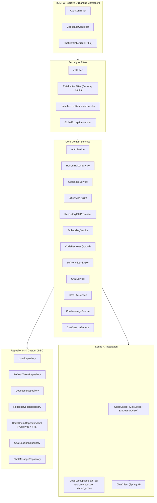
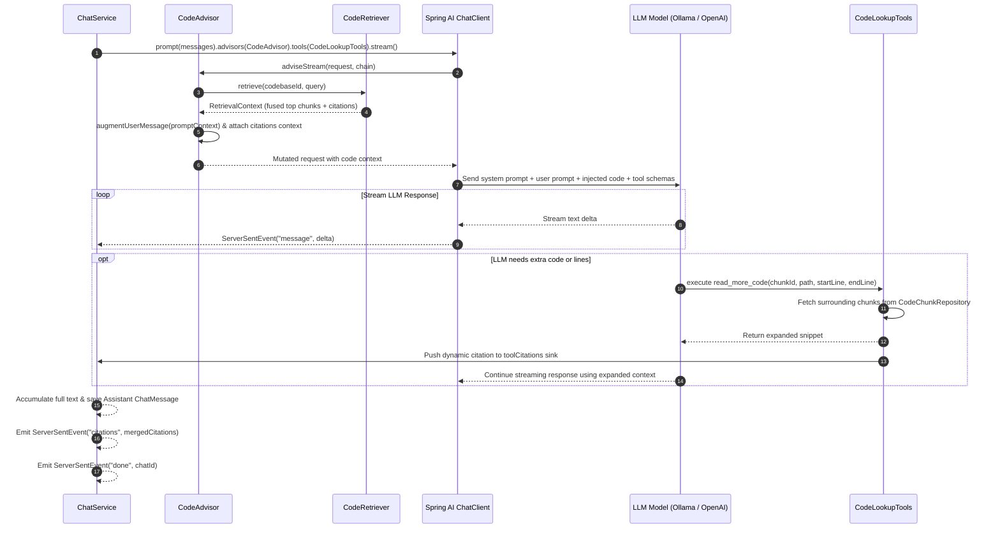

# 🐘 CodeCompass Backend Server

> **Production-grade Spring Boot 4.1.0 (Java 25) AI Backend Engine featuring Tree-sitter AST Semantic Parsing, pgvector 1024-dim Vector Search, Reciprocal Rank Fusion, Spring AI Agentic Tool Calling, and Reactive SSE Streaming.**

[](https://openjdk.org/)
[](https://spring.io/projects/spring-boot)
[](https://spring.io/projects/spring-ai)
[](https://github.com/pgvector/pgvector)
[](https://tree-sitter.github.io/)
[](https://redis.io/)

---

## 📖 Table of Contents

- [Overview](#-overview)
- [Architecture & Design Patterns](#-architecture--design-patterns)
  - [Layered System Architecture](#layered-system-architecture)
  - [Spring AI Advisor & Tool Calling Architecture](#spring-ai-advisor--tool-calling-architecture)
  - [Concurrency & Parallel Signal Retrieval](#concurrency--parallel-signal-retrieval)
- [Detailed Package & Function Reference](#-detailed-package--function-reference)
  - [1. Authentication Module (`feature.auth`)](#1-authentication-module-featureauth)
  - [2. Codebase & Git Ingestion Module (`feature.codebase`)](#2-codebase--git-ingestion-module-featurecodebase)
  - [3. Indexing & AST Parsing Engine (`feature.indexing`)](#3-indexing--ast-parsing-engine-featureindexing)
  - [4. Vector Storage & Code Chunks (`feature.codechunk` & `embedding`)](#4-vector-storage--code-chunks-featurecodechunk--embedding)
  - [5. Hybrid Retrieval & RRF Reranking (`feature.retriver`)](#5-hybrid-retrieval--rrf-reranking-featureretriver)
  - [6. Conversational AI Engine & Advisors (`feature.chat` & `advisor`)](#6-conversational-ai-engine--advisors-featurechat--advisor)
  - [7. Common Infrastructure & Security (`common`)](#7-common-infrastructure--security-common)
- [HTTP API Reference](#-http-api-reference)
  - [Auth Endpoints](#auth-endpoints)
  - [Codebase Endpoints](#codebase-endpoints)
  - [Chat Endpoints & SSE Streaming](#chat-endpoints--sse-streaming)
- [Database Schema & Migrations](#-database-schema--migrations)
- [Configuration & Environment Variables](#-configuration--environment-variables)
- [Building, Testing & Docker Deployment](#-building-testing--docker-deployment)

---

## 🌟 Overview

The **CodeCompass Server** is a reactive, AI-native backend responsible for repository cloning, AST-aware code chunking, vector embedding generation, hybrid search orchestration, and streaming interactive chat.

It leverages:
- **Java 25** language features and virtual threads for high concurrency.
- **Spring AI 2.0.0** for seamless orchestration of chat clients, custom advisors, and dynamic LLM tool calling.
- **Tree-sitter native bindings** to parse code into rich Abstract Syntax Trees across 16+ languages.
- **PostgreSQL with pgvector (`halfvec(1024)`)** and native GIN full-text search indexes.
- **Project Reactor & WebFlux** for non-blocking Server-Sent Events (SSE) streaming.
- **Bucket4j + Redis** for distributed token-bucket rate limiting.

---

## 🏛 Architecture & Design Patterns

### Layered System Architecture



---

### Spring AI Advisor & Tool Calling Architecture



---

### Concurrency & Parallel Signal Retrieval

When querying code for context, `CodeRetriever` executes two independent database queries concurrently using `CompletableFuture`:
1. **Vector Cosine Similarity Search**: Generates embedding via `EmbeddingModel.embed(query)` and runs `<=>` cosine distance against `code_chunks` vector index.
2. **PostgreSQL Full-Text Search**: Builds `to_tsquery('simple', :query)` and runs against GIN-indexed `to_tsvector('simple', content)`.

Results from both signals are collected and fused using the **Reciprocal Rank Fusion (RRF)** formula:
$$RRF\_Score(d) = \sum_{m \in M} \frac{1}{k + r_m(d)}$$
where $k = 60$ and $r_m(d)$ is the 0-based rank in result set $m$.

---

## 🔍 Detailed Package & Function Reference

### 1. Authentication Module (`feature.auth`)

| Class / Interface | Responsibility & Key Methods |
|---|---|
| [`AuthController`](file:///e:/Works/temp/CodeCompass/server/src/main/java/com/meet/server/feature/auth/AuthController.java) | REST controller for public auth endpoints (`/api/auth/register`, `/api/auth/login`, `/api/auth/refresh`, `/api/auth/logout`) and authenticated profile endpoint (`/api/auth/me`). Manages HTTP-only `refresh_token` cookies. |
| [`AuthService`](file:///e:/Works/temp/CodeCompass/server/src/main/java/com/meet/server/feature/auth/AuthService.java) | Core authentication business logic. Validates unique email/username, hashes passwords with BCrypt, coordinates token creation, and links OAuth2 profiles. |
| [`RefreshTokenService`](file:///e:/Works/temp/CodeCompass/server/src/main/java/com/meet/server/feature/auth/RefreshTokenService.java) | Secure refresh token lifecycle management. Generates cryptographically secure random tokens (SHA-256 hashed at rest), enforces 7-day TTL, detects token reuse attacks (invalidates all user sessions upon duplicate token usage), and handles token rotation. |
| [`RefreshTokenCleanupScheduler`](file:///e:/Works/temp/CodeCompass/server/src/main/java/com/meet/server/feature/auth/RefreshTokenCleanupScheduler.java) | `@Scheduled` cron task executing `refreshTokenRepository.deleteByExpiresAtBeforeOrRevokedTrue(now)` to purge expired or revoked refresh tokens. |
| [`JwtService`](file:///e:/Works/temp/CodeCompass/server/src/main/java/com/meet/server/common/security/jwt/JwtService.java) | Issues and validates HMAC-SHA signed JWT access tokens containing user UUID, email, and roles with a 15-minute expiration window. |
| [`JwtFilter`](file:///e:/Works/temp/CodeCompass/server/src/main/java/com/meet/server/common/security/filter/JwtFilter.java) | `OncePerRequestFilter` extracting Bearer tokens from `Authorization` header, validating signatures, and populating `SecurityContextHolder`. |
| [`OAuth2UserService`](file:///e:/Works/temp/CodeCompass/server/src/main/java/com/meet/server/common/security/oauth2/OAuth2UserService.java) | Custom OAuth2 user service processing Google and GitHub user attributes, creating or updating user records upon OAuth login. |
| [`OAuth2AuthenticationSuccessHandler`](file:///e:/Works/temp/CodeCompass/server/src/main/java/com/meet/server/common/security/oauth2/OAuth2AuthenticationSuccessHandler.java) | Redirects authenticated OAuth2 users to `app.oauth2.success-redirect-uri` with a generated JWT access token while setting the HTTP-only refresh token cookie. |

---

### 2. Codebase & Git Ingestion Module (`feature.codebase`)

| Class / Interface | Responsibility & Key Methods |
|---|---|
| [`CodebaseController`](file:///e:/Works/temp/CodeCompass/server/src/main/java/com/meet/server/feature/codebase/CodebaseController.java) | REST endpoints for codebase CRUD (`POST /api/codebases`, `GET /api/codebases`, `PATCH /api/codebases/{id}`, `DELETE /api/codebases/{id}`, `POST /api/codebases/{id}/reindex`). |
| [`CodebaseService`](file:///e:/Works/temp/CodeCompass/server/src/main/java/com/meet/server/feature/codebase/CodebaseService.java) | Coordinates repository registration, quota enforcement (pessimistic lock allowing maximum 5 codebases per user), deletion cascading, metadata updates, and async indexing queue dispatch. |
| [`GitService`](file:///e:/Works/temp/CodeCompass/server/src/main/java/com/meet/server/feature/codebase/GitService.java) | Uses **Eclipse JGit** to perform shallow clones (`Git.cloneRepository().setURI(url).setBranch(branch).setDepth(1)`) into temporary isolated workspace directories, extracts HEAD commit SHA, and handles disk cleanup. |
| [`CodebaseStatusService`](file:///e:/Works/temp/CodeCompass/server/src/main/java/com/meet/server/feature/codebase/CodebaseStatusService.java) | Manages codebase state machine transitions: `QUEUED` ➔ `PROCESSING` ➔ `INDEXED` or `FAILED`. Updates `indexedAt` timestamps and error logs. |

---

### 3. Indexing & AST Parsing Engine (`feature.indexing`)

| Class / Interface | Responsibility & Key Methods |
|---|---|
| [`RepositoryFileProcessor`](file:///e:/Works/temp/CodeCompass/server/src/main/java/com/meet/server/feature/repositoryfile/RepositoryFileProcessor.java) | Traverses cloned repository files, excludes images/videos/binaries, computes checksums, creates `RepositoryFile` records, resolves language parser, extracts chunks, and triggers batch embeddings. |
| [`Language`](file:///e:/Works/temp/CodeCompass/server/src/main/java/com/meet/server/feature/indexing/language/Language.java) | Central enum configuring 24 languages with parser kind (`TREE_SITTER`, `JSON`, `MARKDOWN`, `TEXT`), file extension aliases, grammar class mappings, and AST node definitions (`isTypeDeclaration`, `isMemberDeclaration`, `isFieldDeclaration`, `isIgnoredNode`). |
| [`Parser`](file:///e:/Works/temp/CodeCompass/server/src/main/java/com/meet/server/feature/indexing/parser/Parser.java) | Strategy interface for file parsing: `boolean supports(Language language)` and `ParsedFile parse(RepositoryFile file, String content)`. |
| [`TreeSitterParser`](file:///e:/Works/temp/CodeCompass/server/src/main/java/com/meet/server/feature/indexing/parser/TreeSitterParser.java) | Native Tree-sitter parser implementation dynamically initializing grammar trees for Java, Kotlin, Python, JS, TS, TSX, Go, Rust, C, C++, C#, PHP, Ruby, Swift, HTML, and CSS. Returns `ParsedFile` containing root `TSNode`. |
| [`MarkdownParser`](file:///e:/Works/temp/CodeCompass/server/src/main/java/com/meet/server/feature/indexing/parser/MarkdownParser.java) / [`JsonParser`](file:///e:/Works/temp/CodeCompass/server/src/main/java/com/meet/server/feature/indexing/parser/JsonParser.java) / [`TextParser`](file:///e:/Works/temp/CodeCompass/server/src/main/java/com/meet/server/feature/indexing/parser/TextParser.java) | Specialized parsers for non-code structured text documents. |
| [`ChunkExtractor`](file:///e:/Works/temp/CodeCompass/server/src/main/java/com/meet/server/feature/indexing/extractor/ChunkExtractor.java) | Strategy interface for chunk extraction: `List<CodeChunk> extract(ParsedFile parsed)`. |
| [`TreeSitterExtractor`](file:///e:/Works/temp/CodeCompass/server/src/main/java/com/meet/server/feature/indexing/extractor/TreeSitterExtractor.java) | AST-aware semantic chunker. Extracts top-level declarations, classes, interfaces, records, methods, and functions. If a class exceeds 4,000 characters, it extracts members individually while attaching class context and field signatures (up to 1,200 chars). Fallbacks to line chunking if a single member exceeds limits. |
| [`CssExtractor`](file:///e:/Works/temp/CodeCompass/server/src/main/java/com/meet/server/feature/indexing/extractor/CssExtractor.java) / [`HtmlExtractor`](file:///e:/Works/temp/CodeCompass/server/src/main/java/com/meet/server/feature/indexing/extractor/HtmlExtractor.java) / [`MarkdownExtractor`](file:///e:/Works/temp/CodeCompass/server/src/main/java/com/meet/server/feature/indexing/extractor/MarkdownExtractor.java) / [`JsonExtractor`](file:///e:/Works/temp/CodeCompass/server/src/main/java/com/meet/server/feature/indexing/extractor/JsonExtractor.java) / [`TextExtractor`](file:///e:/Works/temp/CodeCompass/server/src/main/java/com/meet/server/feature/indexing/extractor/TextExtractor.java) | Format-specific chunk extractors respecting logical boundaries (sections, headings, selectors, keys). |

---

### 4. Vector Storage & Code Chunks (`feature.codechunk` & `embedding`)

| Class / Interface | Responsibility & Key Methods |
|---|---|
| [`CodeChunk`](file:///e:/Works/temp/CodeCompass/server/src/main/java/com/meet/server/feature/codechunk/CodeChunk.java) | JPA entity mapping to `code_chunks` table, containing content, `halfvec` embedding, line ranges (`startLine`, `endLine`), `symbolName`, `symbolQualifiedName`, `chunkType` (`CLASS`, `METHOD`, `FUNCTION`, `INTERFACE`, `ENUM`, `FIELD`), `parentSymbol`, and `commitSha`. |
| [`CodeChunkRepositoryImpl`](file:///e:/Works/temp/CodeCompass/server/src/main/java/com/meet/server/feature/codechunk/CodeChunkRepositoryImpl.java) | High-performance JDBC repository using `JdbcClient` and `JdbcTemplate`. Implements: <br>• `batchInsert(List<CodeChunk>)`: Batch upsert with `ON CONFLICT (file_id, chunk_index) DO UPDATE`. <br>• `similaritySearch(SimilaritySearchRequest)`: Vector cosine distance query using `<=>` on `PGhalfvec`. <br>• `fullTextSearch(codebaseId, query, maxResults)`: PostgreSQL `to_tsvector` and `ts_rank_cd` search. <br>• `findAroundChunk(codebaseId, chunkId, radius)`: Expands chunks around a target chunk within a specified radius. <br>• `findByCodebaseIdAndPath(codebaseId, path, startLine, endLine)`: Line range queries. |
| [`EmbeddingService`](file:///e:/Works/temp/CodeCompass/server/src/main/java/com/meet/server/feature/embedding/EmbeddingService.java) | Batches chunk content and uses Spring AI's `EmbeddingModel` to generate 1024-dimensional float embeddings, then updates `code_chunks`. |

---

### 5. Hybrid Retrieval & RRF Reranking (`feature.retriver`)

| Class / Interface | Responsibility & Key Methods |
|---|---|
| [`CodeRetriever`](file:///e:/Works/temp/CodeCompass/server/src/main/java/com/meet/server/feature/retriver/CodeRetriever.java) | Coordinates parallel retrieval: launches `CompletableFuture` for vector similarity (top 30) and full-text search (top 30), calls `RrfReranker.fuse()`, limits to top 15 results, formats prompt context within a 16,000 character budget, and builds `CodeCitation` list. |
| [`RrfReranker`](file:///e:/Works/temp/CodeCompass/server/src/main/java/com/meet/server/feature/retriver/RrfReranker.java) | Thread-safe utility implementing Reciprocal Rank Fusion ($k=60.0$) across multiple ranked chunk lists. Produces deduplicated, normalized relevance scores. |

---

### 6. Conversational AI Engine & Advisors (`feature.chat` & `advisor`)

| Class / Interface | Responsibility & Key Methods |
|---|---|
| [`ChatController`](file:///e:/Works/temp/CodeCompass/server/src/main/java/com/meet/server/feature/chat/ChatController.java) | Endpoints for session listing, session title updates, cursor-based message history retrieval, session deletion, and SSE chat streaming (`POST /{codebaseId}/chat/stream`). |
| [`ChatService`](file:///e:/Works/temp/CodeCompass/server/src/main/java/com/meet/server/feature/chat/ChatService.java) | Core streaming orchestrator. Resolves/creates sessions (`untitled-N`), loads 20 recent messages as prompt history, loads `prompt.md` system prompt, invokes `ChatClient.stream()`, merges advisor and tool citations, triggers title generation, and persists messages. Emits SSE events: `message`, `citations`, `title`, `done`, `error`. |
| [`CodeAdvisor`](file:///e:/Works/temp/CodeCompass/server/src/main/java/com/meet/server/feature/advisor/CodeAdvisor.java) | Implements Spring AI `CallAdvisor` and `StreamAdvisor`. Intercepts incoming user prompts, calls `CodeRetriever.retrieve()`, injects code snippets into prompt context, and attaches citations to response context. Intelligently skips re-retrieval on tool-response turns. |
| [`CodeLookupTools`](file:///e:/Works/temp/CodeCompass/server/src/main/java/com/meet/server/feature/chat/tool/CodeLookupTools.java) | Agentic tools provided to LLM: <br>• `@Tool read_more_code`: Expands surrounding code by chunk ID radius (default $\pm 2$ chunks) or file path line ranges. <br>• `@Tool search_code`: Re-runs a specific code search when initial snippets are insufficient. Automatically sinks citations into `toolCitations`. |
| [`ChatTitleService`](file:///e:/Works/temp/CodeCompass/server/src/main/java/com/meet/server/feature/chat/ChatTitleService.java) | Prompts the LLM on the first assistant response to generate a concise 3-5 word session title, cleans newlines/quotes, limits to 255 characters, and saves to `chat_sessions`. |
| [`ChatMessageService`](file:///e:/Works/temp/CodeCompass/server/src/main/java/com/meet/server/feature/chat/message/ChatMessageService.java) | Manages message persistence and cursor-based pagination using Base64-encoded `createdAt|id` cursor (`Instant|UUID`) with custom limits. |
| [`ChatSessionService`](file:///e:/Works/temp/CodeCompass/server/src/main/java/com/meet/server/feature/chat/session/ChatSessionService.java) | Session CRUD operations, ownership verification, and generation of `untitled-N` session titles. |

---

### 7. Common Infrastructure & Security (`common`)

| Class / Interface | Responsibility & Key Methods |
|---|---|
| [`RateLimiterFilter`](file:///e:/Works/temp/CodeCompass/server/src/main/java/com/meet/server/common/ratelimit/filter/RateLimiterFilter.java) / [`RateLimitService`](file:///e:/Works/temp/CodeCompass/server/src/main/java/com/meet/server/common/ratelimit/service/RateLimitService.java) | Redis-backed **Bucket4j** token-bucket rate limiter. Rejects excessive requests with HTTP `429 Too Many Requests` and sets `X-Rate-Limit-Retry-After-Seconds`. |
| [`SecurityConfig`](file:///e:/Works/temp/CodeCompass/server/src/main/java/com/meet/server/common/security/config/SecurityConfig.java) | Spring Security configuration. Configures stateless session management, CORS policies, permit-all routes (`/api/auth/**`, `/oauth2/**`, `/login/**`), and OAuth2 client flows. |
| [`GlobalExceptionHandler`](file:///e:/Works/temp/CodeCompass/server/src/main/java/com/meet/server/common/exception/GlobalExceptionHandler.java) | Central `@RestControllerAdvice` mapping validation errors (`400`), domain `CodebaseException` (`403`, `404`, `409`), and unexpected errors (`500`) into standardized `ApiResponse<T>`. |
| [`ApiResponse<T>`](file:///e:/Works/temp/CodeCompass/server/src/main/java/com/meet/server/common/api/ApiResponse.java) | Standardized JSON response record with `boolean success`, `String message`, and `Optional<T> data`. |

---

## 📡 HTTP API Reference

### Auth Endpoints

| Method | Path | Auth | Description | Status |
|---|---|---|---|---|
| `POST` | `/api/auth/register` | Public | Register local user; returns access token & sets refresh cookie | `200 OK`, `400`, `409` |
| `POST` | `/api/auth/login` | Public | Authenticate user; returns access token & sets refresh cookie | `200 OK`, `401` |
| `POST` | `/api/auth/refresh` | Public | Validate & rotate refresh token cookie; returns new access token | `200 OK`, `401` |
| `POST` | `/api/auth/logout` | Public | Revokes refresh tokens and clears cookie | `200 OK` |
| `GET` | `/api/auth/me` | Bearer | Get current user's profile | `200 OK`, `401` |
| `GET` | `/oauth2/authorization/{provider}` | Public | Initiate OAuth2 authorization flow (`google`, `github`) | `302 Found` |

---

### Codebase Endpoints

| Method | Path | Auth | Description | Status |
|---|---|---|---|---|
| `POST` | `/api/codebases` | Bearer | Import public HTTPS repo; queues background indexing | `202 Accepted` |
| `GET` | `/api/codebases` | Bearer | List owned codebases with file counts (ordered by `createdAt` desc) | `200 OK` |
| `PATCH` | `/api/codebases/{codebaseId}` | Bearer | Update codebase display name or default branch | `200 OK`, `403`, `404` |
| `DELETE` | `/api/codebases/{codebaseId}` | Bearer | Delete codebase and cascade all files, chunks, and sessions | `204 No Content`, `409` |
| `POST` | `/api/codebases/{codebaseId}/reindex` | Bearer | Clears existing chunks and re-clones/indexes repository | `202 Accepted` |

---

### Chat Endpoints & SSE Streaming

| Method | Path | Auth | Description | Status |
|---|---|---|---|---|
| `GET` | `/api/codebases/{id}/chat/sessions` | Bearer | List all chat sessions for codebase | `200 OK` |
| `PATCH` | `/api/codebases/{id}/chat/sessions/{sid}`| Bearer | Update chat session title | `200 OK` |
| `DELETE`| `/api/codebases/{id}/chat/sessions/{sid}`| Bearer | Delete chat session (cascades messages) | `204 No Content` |
| `GET` | `/api/codebases/{id}/chat/sessions/{sid}/messages` | Bearer | Cursor-paginated message history (`limit`, `before`) | `200 OK` |
| `POST` | `/api/codebases/{id}/chat/stream` | Bearer | Reactive SSE code chat stream | `200 OK` (`text/event-stream`) |

#### Server-Sent Events (SSE) Protocol

When calling `POST /api/codebases/{id}/chat/stream`, events are emitted in the following sequence:

```text
event: message
data: "The authentication mechanism uses JwtFilter..."

event: citations
data: [{"chunkId":"33333333-3333-3333-3333-333333333333","path":"src/.../JwtFilter.java","startLine":20,"endLine":45,"language":"java","score":0.0328}]

event: title
data: "JWT Authentication Architecture"

event: done
data: "11111111-1111-1111-1111-111111111111"
```

| Event Type | Payload Format | Description |
|---|---|---|
| `message` | `JSON string` | Streamed text token delta from the assistant |
| `citations` | `JSON array of CodeCitation` | Retrieved source citations with paths, line numbers, and RRF scores |
| `title` | `JSON string` | LLM-generated conversation title (emitted on first response) |
| `done` | `JSON string (UUID)` | Stream completion marker containing resolved `chatId` |
| `error` | `JSON object {"message": "..."}` | Emitted if streaming fails unexpectedly |

---

## 🗄 Database Schema & Migrations

All migrations reside in `src/main/resources/db/migration/`:

```text
db/migration/
├── V1__initial_schema.sql                           # users & refresh_tokens tables
├── V2__add_schema_for_codebase_and_user_schema_fix.sql # codebases table & user FK
├── V3__create_repository_files_and_code_chunks.sql  # repository_files & code_chunks
├── V4__add_code_chunk_vector_index.sql              # halfvec(1024) HNSW vector index
├── V5__add_schema_for_chat_support.sql              # chat_sessions & chat_messages tables
├── V6__cascade_chat_messages_on_session_delete.sql  # CASCADE constraints on chat_messages
├── V7__add_symbol_fields_to_code_chunks.sql         # symbol_name, chunk_type, parent_symbol
├── V8__add_full_text_search_index.sql               # PostgreSQL GIN index on to_tsvector
└── V9__add_citations_to_chat_messages.sql          # JSONB citations column in chat_messages
```

---

## ⚙️ Configuration & Environment Variables

Key configuration properties in `src/main/resources/application.yaml`:

```yaml
spring:
  application:
    name: server
  ai:
    ollama:
      chat:
        model: ${CHAT_MODEL:qwen2.5:3b}
      embedding:
        model: ${EMBEDDING_MODEL:qwen3-embedding:0.6b}
  datasource:
    url: ${POSTGRES_URL}
    username: ${POSTGRES_USER}
    password: ${POSTGRES_PASSWORD}
  data:
    redis:
      host: ${REDIS_HOST}
      port: ${REDIS_PORT}
      password: ${REDIS_PASSWORD}
```

---

## 🛠 Building, Testing & Docker Deployment

### Building Locally

```bash
# Compile and build jar without tests
./gradlew bootJar -x test

# Run tests with Testcontainers
./gradlew test
```

### Docker Container Build

The backend includes an optimized multi-stage `Dockerfile`:

```bash
# Build Docker image
docker build -t codecompass-server:latest .

# Run Docker container
docker run -p 8080:8080 --env-file .env codecompass-server:latest
```
